# AI 业务表结构

> agent-java 涉及 AI 的全部数据库表说明(MySQL + PostgreSQL 双库),按业务模块组织。
> 字段信息综合自: `sql/*.sql`(建表 DDL + 注释)、`ruoyi-system/src/main/resources/mapper/system/*Mapper.xml`(resultMap)、`ruoyi-system/src/main/java/com/ruoyi/system/domain/*.java`(domain 字段)。
> 不含 RuoYi 原生表(`sys_*` / `gen_*` / `qrtz_*`)。

---

## 1. 数据库分布

| 数据库 | 引擎 | 用途 | 表数量 |
|--------|------|------|--------|
| `agent-java`(MySQL 8) | InnoDB | 业务数据 + AI 业务表 + RuoYi 原生表 | 24 张 `ai_*`(含关联表与 `run_step` / `special_event` / `upstream_model` / `ai_memory` / `ai_memory_extract_progress`) |
| `agent_kb`(PostgreSQL 14+ pgvector) | pgvector | 知识库 + 向量 + 图谱 + 长期记忆向量 | 26 张 kb_*(含 4 份知识库向量分表 + 4 份社区向量分表)+ 4 张 `mem_vector_*`(记忆向量分表)|

> 配置见 `ruoyi-admin/src/main/resources/application-druid.yml`(MySQL + PG 双数据源)。

---

## 2. 表清单速查

### 2.1 MySQL: AI 业务表(`ai_*`)

| # | 表名 | 业务模块 | 存储内容 | 关键索引 |
|---|------|----------|----------|----------|
| 1 | `ai_agent` | 智能体 | 智能体配置 + 提示词 + 外观/媒体模型编码 | uk(agent_code) |
| — | `ai_agent_skill` / `ai_agent_tool` / `ai_agent_child` | 智能体 | 技能/工具/子智能体绑定(不是 `ai_agent_kb`,那张表已 drop) | 联合主键 |
| 2 | `ai_channel` | 模型渠道 | 上游 LLM 渠道 + 健康状态 | uk(channel_code) |
| 3 | `ai_model` | 模型 | 模型元数据 + `input_modalities` / `reasoning_enabled` | uk(model_code) |
| 4 | `ai_model_channel` | 模型渠道 | 模型↔渠道多对多 + 权重 + 重试(服务层曾叫 supply,**表名仍是这张**) | uk(model_id, channel_id, model_name) |
| — | `ai_upstream_model` | 模型渠道 | 按渠道缓存的上游可用模型清单 | uk(channel, upstream_id) |
| 5 | `ai_chat_session` | 聊天 | 会话聚合 | pk(session_id) |
| 6 | `ai_chat_session_agent` | 聊天 | 会话↔智能体关联 + token 归因 | uk(session_id, agent_id) |
| 7 | `ai_chat_session_kb` | 聊天 | 会话↔知识库关联(会话级多选) | pk(session_id, kb_id) |
| 8 | `ai_chat_message` | 聊天 | 消息(LLM 上下文 + 前端时间线) | uk(conv, summary_to) |
| 9 | `ai_chat_run` | Run 引擎 | 对话运行实例 + 状态机 | uk(active_key), uk(user, client_req) |
| — | `ai_chat_run_step` | Run 引擎 | UI 可恢复步骤投影;大字段可外置 | uk(run_id, step_id) |
| — | `ai_chat_special_event` | 流式/UI | 只给前端的产物,生命周期跟会话 | uk(session_id, event_id) |
| 10 | `ai_tool` | 工具生态 | 工具元数据(内置/MCP)+ 策略 | uk(tool_code) |
| 11 | `ai_mcp_server` | 工具生态 | MCP Server 连接配置 | uk(server_code) |
| 12 | `ai_skill` | 工具生态 | 技能提示词模板 | uk(skill_code) |
| 13 | `ai_job` | 定时任务 | 用户态任务定义 + 运行态快照 | idx(owner, status) |
| 14 | `ai_job_log` | 定时任务 | 触发日志(调度视角) | idx(job, fire_time) |
| 15 | `ai_llm_call` | 计量统计 | LLM 调用明细 + token 差值 | idx(session, call_id) |
| 16 | `ai_trace_span` | 链路追踪 | Run 内调用树(turn/llm/tool_batch/tool/subagent) | idx(run_id), idx(session, started_at) |
| 17 | `ai_memory` | 长期记忆 | 跨会话记忆台账(事实/偏好/事件/目标/规则) | idx(user, agent, status, del_flag), idx(user, agent, content_hash) |
| — | `ai_memory_extract_progress` | 长期记忆 | 空闲兜底提炼位点(每会话一行) | pk(session_id) |

### 2.2 PostgreSQL: 知识库表(`kb_*`)

| # | 表名 | 业务模块 | 存储内容 | 关键索引 |
|---|------|----------|----------|----------|
| 1 | `kb_knowledge` | 知识库 | 知识库元数据 + 策略版本指针 | idx(dept, owner, visibility) |
| 2 | `kb_document` | 知识库 | 文档 + 摄入状态 | idx(kb, content_hash) |
| 3 | `kb_chunk` | 知识库 | 分块(无向量,向量在外) | idx(doc, kb, parent) |
| 4 | `kb_vector_768` | 知识库 | 768 维向量(OpenAI small/BGE) | HNSW + idx(kb) |
| 5 | `kb_vector_1024` | 知识库 | 1024 维向量(BGE-large) | HNSW + idx(kb) |
| 6 | `kb_vector_1536` | 知识库 | 1536 维向量(OpenAI ada/text-embedding-3) | HNSW + idx(kb) |
| 7 | `kb_vector_3072` | 知识库 | 3072 维向量(超 HNSW 上限,只能全表扫) | idx(kb) |
| 8 | `kb_acl_member` | 知识库 | 成员 ACL(VIEWER/EDITOR/...) | uk(kb, user) |
| 9 | `kb_index_policy_version` | 知识库 | 索引策略版本(不可变) | uk(version_no) |
| 10 | `kb_index_policy` | 知识库 | 平台当前策略指针(单行) | pk(id=1) |
| 11 | `kb_index_job` | 知识库 | 索引/升级任务 | idx(kb, status) |
| 12 | `kb_doc_graph` | 知识库 | 文档图谱状态 | idx(kb, status) |
| 13 | `kb_graph_run` | 知识库 | 图谱抽取运行 | idx(doc, gen desc) |
| 14 | `kb_graph_text_unit` | 知识库 | 图谱 TextUnit(与检索 LEAF 解耦) | idx(doc, ordinal) |
| 15 | `kb_graph_text_unit_chunk` | 知识库 | TextUnit↔Chunk 多对多 | pk(tu, chunk) |
| 16 | `kb_graph_index` | 知识库 | 图索引/社区任务状态 | pk(kb_id) |
| 17 | `kb_graph_community` | 知识库 | 层级社区节点(Leiden) | pk(kb, ver, level, comm) |
| 18 | `kb_graph_entity_community` | 知识库 | 实体→社区映射 | pk(kb, ver, level, entity_key) |
| 19 | `kb_graph_community_report` | 知识库 | 社区报告(KB-GR-09) | idx(kb, ver, level, comm) |
| 20 | `kb_graph_community_report_source` | 知识库 | 报告↔证据 Chunk | pk(report, chunk) |
| 21 | `kb_community_vector_768/1024/1536/3072` | 知识库 | 社区报告向量(4 张,同 chunk 维度) | HNSW(≤1536) / idx(kb) |
| 22 | `kb_llm_cache` | 知识库 | LLM 响应缓存 | pk(cache_key) |
| — | `mem_vector_768/1024/1536/3072` | 长期记忆 | 记忆向量分表(按维度,同 KB 范式) | HNSW(≤1536) + idx(user, agent);3072 无 HNSW |

---

## 3. ER 总览图

```mermaid
erDiagram
  AI_AGENT ||--o{ AI_AGENT_SKILL : "binds"
  AI_AGENT ||--o{ AI_AGENT_TOOL : "binds"
  AI_AGENT ||--o{ AI_AGENT_CHILD : "delegates"
  AI_AGENT ||--o{ AI_CHAT_SESSION_AGENT : "appears in"
  AI_AGENT ||--o{ AI_CHAT_MESSAGE : "produces"
  AI_AGENT ||--o{ AI_JOB : "executes"
  AI_AGENT ||--o{ AI_LLM_CALL : "originates"

  AI_MODEL ||--o{ AI_MODEL_CHANNEL : "routes via"
  AI_CHANNEL ||--o{ AI_MODEL_CHANNEL : "serves"
  AI_CHANNEL ||--o{ AI_UPSTREAM_MODEL : "catalog"
  AI_MODEL ||--o{ AI_LLM_CALL : "consumes"

  AI_CHAT_SESSION ||--o{ AI_CHAT_SESSION_AGENT : "uses"
  AI_CHAT_SESSION ||--o{ AI_CHAT_SESSION_KB : "selects"
  AI_CHAT_SESSION ||--o{ AI_CHAT_MESSAGE : "contains"
  AI_CHAT_SESSION ||--o{ AI_CHAT_RUN : "spawns"
  AI_CHAT_SESSION ||--o{ AI_CHAT_SPECIAL_EVENT : "ui artifacts"
  AI_CHAT_RUN ||--o{ AI_CHAT_MESSAGE : "produces"
  AI_CHAT_RUN ||--o{ AI_CHAT_RUN_STEP : "projects"
  AI_CHAT_RUN ||--o{ AI_TRACE_SPAN : "trace tree"
  AI_CHAT_MESSAGE ||--|| AI_CHAT_MESSAGE : "summary_to_id (SUMMARY→覆盖)"

  AI_MCP_SERVER ||--o{ AI_TOOL : "exposes"

  AI_JOB ||--o{ AI_JOB_LOG : "triggers"
  AI_JOB_LOG ||--o| AI_CHAT_RUN : "creates"

  KB_KNOWLEDGE ||--o{ KB_DOCUMENT : "contains"
  KB_KNOWLEDGE ||--o{ KB_ACL_MEMBER : "ACL"
  KB_KNOWLEDGE ||--o{ KB_INDEX_JOB : "upgrades"
  KB_KNOWLEDGE ||--|| KB_GRAPH_INDEX : "has graph"
  KB_INDEX_POLICY_VERSION ||--o{ KB_KNOWLEDGE : "active_policy_version_id"

  KB_DOCUMENT ||--o{ KB_CHUNK : "splits to"
  KB_CHUNK ||--|| KB_VECTOR_768 : "embedding"
  KB_CHUNK ||--|| KB_VECTOR_1024 : "embedding"
  KB_CHUNK ||--|| KB_VECTOR_1536 : "embedding"
  KB_CHUNK ||--|| KB_VECTOR_3072 : "embedding"

  KB_DOCUMENT ||--|| KB_DOC_GRAPH : "graph status"
  KB_GRAPH_RUN ||--o{ KB_GRAPH_TEXT_UNIT : "produces"
  KB_GRAPH_TEXT_UNIT ||--o{ KB_GRAPH_TEXT_UNIT_CHUNK : "links"
  KB_GRAPH_TEXT_UNIT_CHUNK }o--|| KB_CHUNK : "to"

  KB_GRAPH_COMMUNITY ||--o{ KB_GRAPH_ENTITY_COMMUNITY : "contains"
  KB_GRAPH_COMMUNITY ||--o| KB_GRAPH_COMMUNITY_REPORT : "summarized as"
  KB_GRAPH_COMMUNITY_REPORT ||--o{ KB_GRAPH_COMMUNITY_REPORT_SOURCE : "cites"
  KB_GRAPH_COMMUNITY_REPORT_SOURCE }o--|| KB_CHUNK : "evidence"
  KB_GRAPH_COMMUNITY_REPORT ||--|| KB_COMMUNITY_VECTOR_768 : "embedded"
  KB_GRAPH_COMMUNITY_REPORT ||--|| KB_COMMUNITY_VECTOR_1024 : "embedded"
  KB_GRAPH_COMMUNITY_REPORT ||--|| KB_COMMUNITY_VECTOR_1536 : "embedded"
  KB_GRAPH_COMMUNITY_REPORT ||--|| KB_COMMUNITY_VECTOR_3072 : "embedded"

  AI_MEMORY ||--o{ AI_MEMORY_EXTRACT_PROGRESS : "bit by session"
  AI_MEMORY ||--|| MEM_VECTOR_768 : "embedded"
  AI_MEMORY ||--|| MEM_VECTOR_1024 : "embedded"
  AI_MEMORY ||--|| MEM_VECTOR_1536 : "embedded"
  AI_MEMORY ||--|| MEM_VECTOR_3072 : "embedded"
  AI_MEMORY ||--o| AI_MEMORY : "superseded_by"
```

---

## 4. 智能体域(`ai_agent`)

### 4.1 `ai_agent` — 智能体配置

> 存储位置: MySQL
> 源文件: `ruoyi-system/src/main/resources/mapper/system/AiAgentMapper.xml` + domain `AiAgent.java` + `sql/ai_agent_appearance.sql` + `sql/ai_agent_image_model.sql` + `sql/ai_agent_video_model.sql`(补列)

| 列名 | 类型 | 约束 | 说明 |
|------|------|------|------|
| `agent_id` | bigint(20) | PK, auto_increment | 智能体 ID |
| `agent_code` | varchar(100) | NOT NULL, UK | 智能体编码(系统引用,唯一) |
| `agent_name` | varchar(100) | NOT NULL | 智能体名称 |
| `agent_desc` | varchar(500) | NULL | 智能体描述 |
| `agent_role` | longtext | NULL | 智能体角色/系统提示词 |
| `icon` | varchar(64) | NULL | 图标(emoji)—— 见 `sql/ai_agent_appearance.sql` |
| `theme` | varchar(8) | NULL | 主题色索引(0-7) |
| `load_local_doc` | char(1) | default '0' | 是否加载本地 `agents.md` |
| `model_code` | varchar(100) | NULL | 绑定对话模型(关联 `ai_model.model_code`) |
| `image_model_code` | varchar(100) | NULL | 绑定生图模型(`model_type=IMAGE`),见 `sql/ai_agent_image_model.sql` |
| `video_model_code` | varchar(100) | NULL | 绑定视频模型(`model_type=VIDEO`),见 `sql/ai_agent_video_model.sql` |
| `tts_model_code` | varchar(100) | NULL | 绑定语音合成模型(`model_type=TTS`) |
| `sort` | int(4) | default 0 | 显示顺序 |
| `status` | char(1) | default '0' | 状态(0 正常 / 1 停用) |
| `del_flag` | char(1) | default '0' | 删除标志(0 存在 / 2 删除) |
| `create_by` | varchar(64) | default '' | 创建者 |
| `create_time` | datetime | NULL | 创建时间 |
| `update_by` | varchar(64) | default '' | 更新者 |
| `update_time` | datetime | NULL | 更新时间 |
| `remark` | varchar(500) | NULL | 备注 |

**虚拟字段**(非表列,仅用于展示和编辑表单,见 `AiAgent.java:53-102`):
- `skill_ids` / `tool_ids` — 关联 ID 数组,提交时拆写到 `ai_agent_*` 关联表
- `child_agents` — 子智能体配置
- `model_display_name` / `skill_count` / `tool_count` / `child_count` — 列表页 JOIN 展示

---

## 5. 模型渠道域

### 5.1 `ai_channel` — 渠道

> 源文件: `ruoyi-system/src/main/resources/mapper/system/AiChannelMapper.xml`

| 列名 | 类型 | 约束 | 说明 |
|------|------|------|------|
| `channel_id` | bigint(20) | PK, auto_increment | 渠道 ID |
| `channel_name` | varchar(100) | NOT NULL | 渠道名称 |
| `channel_code` | varchar(50) | NOT NULL, UK | 渠道编码(系统引用,唯一) |
| `channel_type` | varchar(20) | NOT NULL | 渠道类型(OPENAI / DASHSCOPE / ANTHROPIC / CUSTOM) |
| `base_url` | varchar(500) | NULL | 上游 base URL |
| `api_key` | varchar(500) | NULL | 上游 API Key(加密存储) |
| `health_check_uri` | varchar(255) | NULL | 健康检查端点 |
| `health_status` | char(1) | default '0' | 健康状态(0 未知 / 1 正常 / 2 异常) |
| `health_check_time` | datetime | NULL | 最近健康检查时间 |
| `health_fail_count` | int(11) | default 0 | 连续失败次数 |
| `status` | char(1) | default '0' | 状态(0 正常 / 1 停用) |
| `del_flag` | char(1) | default '0' | 删除标志 |
| `create_by` / `create_time` / `update_by` / `update_time` / `remark` | — | — | RuoYi 通用审计字段 |

### 5.2 `ai_model` — 模型元数据

> 源文件: `AiModelMapper.xml` + `sql/ai_chat_attachment.sql`(补 `vision_enabled` 列,已过时)
> + `sql/ai_model_input_modalities.sql`(补 `input_modalities` 列,**当前判定依据**)

| 列名 | 类型 | 约束 | 说明 |
|------|------|------|------|
| `model_id` | bigint(20) | PK | 模型 ID |
| `model_code` | varchar(100) | NOT NULL, UK | 模型编码(如 `gpt-4o` / `deepseek-v3`) |
| `display_name` | varchar(100) | NULL | 模型展示名 |
| `model_type` | varchar(20) | NOT NULL | 类型(CHAT / EMBEDDING / IMAGE / VIDEO / …) |
| `context_window` | int(11) | default 0 | 上下文窗口 token 数 |
| `max_output_tokens` | int(11) | default 0 | 最大输出 token |
| `reasoning_enabled` | char(1) | default '0' | 是否开启推理/思考(0 关闭 / 1 开启)；运行时控制请求参数及 reasoning 的记录与展示 |
| `input_modalities` | varchar(64) | default '' | **模型能接收哪些输入模态**,逗号分隔:`image` / `file` / `video` / `audio`,空串=纯文本。判定统一走 `ModelInputModalities`,`sql/ai_model_input_modalities.sql` 补列 |
| `vision_enabled` | char(1) | default '0' | **已废弃,不要用它做判定**。上一代的布尔开关,现由代码按 `input_modalities` 是否含 `image` 单向同步,仅为存量查询保留 |
| `sort` | int(4) | default 0 | 显示顺序 |
| `status` / `del_flag` / `audit` | — | — | 标准字段 |

> **关键设计一**:输入模态与 `model_type=IMAGE` 是两回事 —— 后者是"文生图"(模型**产出**图片),前者是"能看图的对话模型"(模型**接收**图片)。
>
> **关键设计二**:四种模态互相独立,既不是等级也不能互相推导。实测 OpenRouter 417 个模型跑出 12 种组合 —— `gpt-audio` 有音频没图片,`o3-mini` 有文档没图片,`kimi-k3` 有视频没文档。所以它是一个集合,不是一个布尔,更不是"视觉能力"这一个维度。这是 `vision_enabled` 被取代的原因。
>
> **关键设计三**:传输层比模型能力窄,判定因此分两层(见 `ModelInputModalities`)——`supports()` 答"模型声称支持吗",`accepts()` 还要问"这个 MIME 送得出去吗"。Spring AI 1.1.5 的 `mapToMediaContent` 只认 `audio/mp3`、`audio/wav`、`application/pdf`,其余一律兜底成 `image_url`,所以视频即使模型支持也恒拒(送进去会被当成图片发出,不报错但结果错乱)。上游支持后把 VIDEO 加进白名单即可,其余代码不动。

### 5.3 `ai_model_channel` — 模型×渠道多对多

> 源文件: `AiModelChannelMapper.xml` + `sql/ai_model_supply_refactor.sql`(补 `retry_count` 列)

| 列名 | 类型 | 约束 | 说明 |
|------|------|------|------|
| `id` | bigint(20) | PK | 主键 |
| `model_id` | bigint(20) | NOT NULL | 模型 ID |
| `channel_id` | bigint(20) | NOT NULL | 渠道 ID |
| `model_name` | varchar(100) | NOT NULL | 上游实际模型名(可能与 `model_code` 不同) |
| `input_price` | decimal(18,6) | NULL | 输入单价(元/1K token) |
| `output_price` | decimal(18,6) | NULL | 输出单价 |
| `weight` | int(11) | default 100 | 权重(用于多渠道负载均衡) |
| `retry_count` | int(11) | default 0 | 失败重试次数(0=不重试),`sql/ai_model_supply_refactor.sql:3` 补列 |
| `status` | char(1) | default '0' | 启用/停用 |
| 审计 | create_by / create_time / update_* / remark | — | **无 `del_flag`**:供应绑定走物理删除(`sql/ai_model_channel_drop_del_flag.sql`)。软删会占着 UK,还逼出复活逻辑 |

**复合唯一键**: `(model_id, channel_id, model_name)` —— 同一模型经同一渠道的不同上游模型名是允许的(如 OpenAI 转发多种下游)。

### 5.4 `ai_upstream_model` — 渠道可用模型清单

> 源文件:`sql/init/02_ai_model_channel.sql`、`sql/ai_upstream_model.sql`

按渠道缓存上游 `/models` 结果。导入与供应候选都查这张表,不实时打上游。非自定义渠道「同步」是先拉成功再删旧数据,空列表拒绝覆盖;自定义渠道手动维护。同步**只动本表**,不碰 `ai_model` / `ai_model_channel`。

| 列名 | 说明 |
|------|------|
| `channel_id` + `upstream_model_id` | UK;后者是调上游时传的 model 参数 |
| `display_name` / `owned_by` | 展示 |
| `source` | `0` 手动 / `1` 上游同步 |

---

## 6. 聊天域

### 6.1 `ai_chat_session` — 会话

> 源文件: `sql/ai_chat_session.sql:11-27` + `sql/ai_chat_context.sql:87-88`(补 `message_count`) + `sql/ai_job.sql:18-21`(补 `session_type` + `source_job_id` + 索引) + `sql/ai_llm_call.sql:55-58`(补 `prompt/completion_tokens` + `llm_call_count`)

| 列名 | 类型 | 约束 | 说明 |
|------|------|------|------|
| `session_id` | varchar(64) | PK | 会话 ID(UUID 业务生成) |
| `title` | varchar(200) | default '' | 会话标题(可由首条消息摘要生成) |
| `session_type` | varchar(20) | default 'chat' | 会话类型(chat / job),`sql/ai_job.sql:19` |
| `source_job_id` | bigint(20) | NULL | 来源 Job(`session_type=job` 时回指 `ai_job.job_id`) |
| `user_id` | bigint(20) | NULL | 发起用户 ID(关联 `sys_user`) |
| `status` | char(1) | default '0' | 状态(0 活跃 / 1 已结束) |
| `total_tokens` | bigint(20) | default 0 | 累计 token(全部 agent 合计) |
| `prompt_tokens` | bigint(20) | default 0 | 累计输入 token |
| `completion_tokens` | bigint(20) | default 0 | 累计输出 token |
| `llm_call_count` | int(11) | default 0 | 累计 LLM 调用次数 |
| `context_length` | bigint(20) | default 0 | 当前总上下文长度(字符) |
| `message_count` | int(11) | default 0 | 会话累计消息条数(`ai_chat_message` 落表行数,含 THINKING / TOOL)。曾长期恒为 0(建表时加上却从未进 ORM 层),2026-08-26 起由 `ChatMessageRecorder.persist()` 在落库出口原子累加,存量已回填 |
| `create_by` / `create_time` / `update_by` / `update_time` / `remark` / `del_flag` | — | — | RuoYi 通用字段 |

**索引**: `idx_user_id(user_id)` / `idx_create_time(create_time)` / `idx_type_user(session_type, user_id, create_time)` —— 列表页按类型+用户过滤。

### 6.2 `ai_chat_session_agent` — 会话-智能体关联

> 源文件: `sql/ai_chat_session.sql:35-48` + `sql/ai_llm_call.sql:63-66`(补 `prompt/completion_tokens` + `llm_call_count`)
>
> `tool_call_count` 曾由 `sql/ai_chat_context.sql:94-95` 补列,因全代码零引用、恒为 0,已于 2026-08-26 删除(`sql/drop_unused_ai_plan_and_columns.sql`)。工具调用次数需要时从 `ai_chat_message` 按 `tool_name` 非空统计。

| 列名 | 类型 | 约束 | 说明 |
|------|------|------|------|
| `id` | bigint(20) | PK, auto_increment | 主键 |
| `session_id` | varchar(64) | NOT NULL | 会话 ID |
| `agent_id` | bigint(20) | NOT NULL | 智能体 ID |
| `role` | varchar(20) | default 'worker' | 角色(supervisor / worker),便于成本归因 |
| `tokens_used` | bigint(20) | default 0 | 该智能体在本会话消耗的 token |
| `prompt_tokens` | bigint(20) | default 0 | 累计输入 token |
| `completion_tokens` | bigint(20) | default 0 | 累计输出 token |
| `llm_call_count` | int(11) | default 0 | 累计 LLM 调用次数 |
| `turn_count` | int(8) | default 0 | 该智能体被调用轮数 |
| `first_active_time` / `last_active_time` / `create_time` | datetime | NULL | 时间戳 |

**唯一键**: `uk_session_agent(session_id, agent_id)` —— 同一会话同一智能体只一行,token 累加。

### 6.3 `ai_chat_session_kb` — 会话-知识库关联

> 源文件: `sql/init/03_ai_chat.sql`(会话域建表)+ `sql/ai_chat_session_kb.sql`(已有环境增量脚本)
> 语义: 知识库选择**归属会话**,替代已废弃的 `ai_agent_kb` 智能体级绑定。新对话在首条消息时由 `ChatRunService.create` 随会话落库,整个会话生效、可中途修改;装配期 `AgentContextFactory#resolveKnowledgeTool` 按 sessionId 查此表生成 `searchKnowledge` 工具。写库时对每个 kbId 做 `requireKb(USE)` 校验(可选用户自己可访问的库)。

| 列名 | 类型 | 约束 | 说明 |
|------|------|------|------|
| `session_id` | varchar(64) | PK(联合) | 会话 ID |
| `kb_id` | bigint(20) | PK(联合) | 知识库 ID |
| `sort` | int(11) | default 0 | 顺序(用户选择顺序) |
| `create_time` | datetime | NULL | 创建时间 |

**索引**: `idx_kb_id(kb_id)` —— 删除知识库时按 kb_id 反向清理会话引用。

### 6.4 `ai_chat_message` — 消息(LLM 上下文 + 前端时间线)

> 源文件: `sql/ai_chat_context.sql:44-80` + `sql/ai_llm_call.sql:71-74`(补 token 列)

| 列名 | 类型 | 约束 | 说明 |
|------|------|------|------|
| `message_id` | bigint(20) | PK, auto_increment | 消息 ID(同时作会话内顺序) |
| `session_id` | varchar(64) | NOT NULL | 会话 ID |
| `agent_id` | bigint(20) | NULL | 产生该消息的智能体 |
| `conversation_id` | varchar(128) | NOT NULL | LLM 记忆键 = `sessionId:agentId` |
| `sub_agent_id` | bigint(20) | NULL | 被调用的子智能体 ID(`agent-as-tool` 时) |
| `message_type` | varchar(20) | NOT NULL | `USER` / `ASSISTANT` / `SYSTEM` / `TOOL` / `THINKING` / `SUMMARY` |
| `content` | longtext | NULL | 消息正文(SUMMARY 行存摘要) |
| `visible_to_llm` | char(1) | default '0' | **是否参与 LLM 上下文**(0 是 / 1 否),本质属性,写入即定 |
| `summary_to_id` | bigint(20) | NULL | SUMMARY 行专用:本摘要覆盖了 `<= 此值` 的消息 |
| `attachments` | json | NULL | 富媒体附件 `[{type,url,name,size}]` |
| `tool_call_id` | varchar(64) | NULL | TOOL 消息回指的调用 ID |
| `tool_name` | varchar(100) | NULL | 工具名(子智能体时为 `agentCode`) |
| `tool_args` | longtext | NULL | 工具入参 |
| `tool_result` | longtext | NULL | 工具返回(超过 `inline-limit` 时截断) |
| `tool_result_path` | varchar(255) | NULL | 大字段溢出文件路径，相对 `ai.chat.context-path` 存(全文经 `ContextFileStore.loadExternal` 读) |
| `tool_source` | varchar(20) | NULL | `builtin` / `mcp` / `agent` |
| `tool_duration_ms` | bigint(20) | NULL | 工具执行耗时 |
| `tool_success` | char(1) | NULL | 0 成功 / 1 失败 |
| `tokens` | int(11) | default 0 | 该消息的 token 数(真实或估算) |
| `prompt_tokens` | int(11) | default 0 | ASSISTANT 的输入 token |
| `completion_tokens` | int(11) | default 0 | ASSISTANT 的输出 token |
| `model_name` | varchar(100) | NULL | 产生该消息的模型 |
| `usage_source` | char(1) | default '1' | token 来源(0 上游真实 / 1 本地估算) |
| `create_time` | datetime | NULL | 创建时间 |

**关键索引**:
- `uk_conv_summary_to(conversation_id, summary_to_id)` —— 同一覆盖范围只允许一条 SUMMARY,压缩天然幂等
- `idx_session_msg(session_id, message_id)` —— 前端时间线分页
- `idx_conv_llm(conversation_id, visible_to_llm, message_id)` —— LLM 上下文查询
- `idx_session_agent(session_id, agent_id)` / `idx_tool_name(tool_name)` / `idx_sub_agent(sub_agent_id)`

> **关键设计**: `visible_to_llm` 是写入即定的"本质属性",不随压缩策略变化;`summary_to_id` 是正交的"是否被压缩替代"维度,运行时动态界定。详见 `sql/ai_chat_context.sql:33-41` 和 `docs/上下文与记忆模块.md`。

### 6.5 `ai_chat_run` — 对话运行实例

> 源文件: `sql/ai_chat_run.sql`

| 列名 | 类型 | 约束 | 说明 |
|------|------|------|------|
| `run_id` | varchar(64) | PK | 运行 ID(UUID) |
| `session_id` | varchar(64) | NOT NULL | 会话 ID |
| `agent_id` | bigint(20) | NOT NULL | 主智能体 ID |
| `user_id` | bigint(20) | NOT NULL | 发起用户 ID |
| `client_request_id` | varchar(64) | NOT NULL | 客户端幂等请求 ID |
| `active_key` | varchar(64) | NULL | **活动态=session_id,终态=NULL**(唯一索引守门) |
| `status` | varchar(20) | NOT NULL | `QUEUED` / `RUNNING` / `FINALIZING` / `SUCCEEDED` / `FAILED` / `CANCELLED` / `INTERRUPTED` |
| `input_text` | longtext | NOT NULL | 本轮用户输入 |
| `attachments` | longtext | NULL | 附件元数据 JSON |
| `request_message_id` | bigint(20) | NULL | 对应 USER 消息 ID |
| `response_message_id` | bigint(20) | NULL | 对应最终 ASSISTANT 消息 ID |
| `last_event_seq` | bigint(20) | default 0 | 最后发布事件序号(客户端恢复高水位) |
| `snapshot_seq` | bigint(20) | default 0 | 步骤快照已覆盖到的事件序号;客户端只订 `seq > snapshotSeq` |
| `cancel_requested` | char(1) | default '0' | 是否请求取消 |
| `worker_id` | varchar(100) | NULL | 执行实例 ID(多节点时定位) |
| `error_code` | varchar(64) | NULL | 终态错误码 |
| `error_message` | text | NULL | 终态错误摘要 |
| `started_time` / `heartbeat_time` / `finished_time` | datetime | NULL | 时间戳 |
| `create_time` / `update_time` | datetime | NOT NULL | 时间戳 |

**关键索引**:
- `uk_ai_chat_run_active(active_key)` —— 同一会话只有一个活动 Run(CAS 守门)
- `uk_ai_chat_run_request(user_id, client_request_id)` —— 客户端重试幂等
- `idx_ai_chat_run_session_time(session_id, create_time)` / `idx_ai_chat_run_user_time(user_id, create_time)` / `idx_ai_chat_run_status_heartbeat(status, heartbeat_time)`

> 设计约束见 `sql/ai_chat_run.sql:5-8`,Run 是"运行事实源",上下文文件仅是可重建投影。

### 6.6 `ai_chat_attachment` — 附件(无独立表!)

> 源文件: `sql/ai_chat_attachment.sql:42-46`

**没有独立表**。附件存于:
- **文件本体**: 工作区 `{workspaceRoot}/{sessionId}/uploads/`,复用 `WorkspaceSandbox` 路径穿越防护
- **元数据**: 写在 `ai_chat_message.attachments` JSON,格式 `[{name, path, mime, size}]`

> 命名误导 —— `ai_chat_attachment.sql` 实际是给 `ai_model` 加 `vision_enabled` 列 + 视觉模型预置。

### 6.7 `ai_chat_run_step` — 可恢复步骤投影

> 源文件:`sql/init/03_ai_chat.sql` + `sql/ai_chat_run_step_output_data_path.sql` + `sql/ai_chat_run_step_message_id.sql`

`ai_chat_message` 是对话事实;`ai_chat_run_step` 是 UI 执行链投影,按 `(run_id, step_id)` 唯一。文本/推理 chunk 内存聚合后按检查点刷入。

| 列名 | 说明 |
|------|------|
| `step_id` / `parent_step_id` | 稳定 ID;嵌套子智能体用 `parent` |
| `step_type` | `content` / `reasoning` / `tool` / `agent` / `context`(历史值曾含 `ui`,现已不再写入) |
| `output_data` / `output_data_path` | 工具步骤超 `inline-limit` 时全文外置,恢复只用预览 |
| `message_id` | 对应 TOOL 行,运行中刷新后「查看完整结果」靠它 |

`type=ui` **不**投影到本表。

### 6.8 `ai_chat_special_event` — 会话级 UI 产物

> 源文件:`sql/init/03_ai_chat.sql` + `sql/ai_chat_special_event_version.sql`

生命周期跟会话,不跟 Run。删会话时一并清。

| 列名 | 说明 |
|------|------|
| `name` | 登记名:`kb.references` / `run.tokenUsage`(后者 `Persistence.NONE` 不落本表) |
| `event_id` | 幂等键;引用归并后为 `messageId + ":" + name` |
| `payload` | JSON;引用为 schema v2(含 `fileCount` / `queries` / 按文件聚合的 `files`) |
| `version` | 乐观锁,并行 `searchKnowledge` 合并时 `updateIfVersion` |
| `message_id` | 回合锚点,前端按它把引用挂到回答下方 |

### 6.9 长期记忆域

跨会话长期记忆(系统侧全自动,agent 无任何记忆工具)。台账在 MySQL 主库,向量在 PostgreSQL。读侧注入/写侧提炼细节见 `上下文与记忆模块.md §7`。

#### `ai_memory` — 记忆台账(MySQL 主库)

> 源文件: `sql/init/10_ai_memory.sql`

唯一事实源,向量表从它派生。`user_id` 永远强制(跨用户隔离红线);`agent_id=0` 表示用户层(该用户所有 agent 共享),`>0` 表示用户×agent 专属层。

| 列名 | 类型 | 说明 |
|------|------|------|
| `memory_id` | bigint(20) | PK,auto_increment=1000 |
| `user_id` | bigint(20) | 隔离维度,永远强制 |
| `agent_id` | bigint(20) | 0=用户层;>0=agent 专属层 |
| `type` | varchar(20) | fact / preference / event / goal / rule |
| `content` | text | 记忆正文 |
| `status` | varchar(20) | active / superseded |
| `superseded_by` | bigint(20) | 被哪条覆盖 |
| `source` | varchar(20) | 提炼来源(当前恒为 auto) |
| `source_session_id` | varchar(64) | 来源会话(可溯源) |
| `source_message_id` | bigint(20) | 提炼覆盖到的消息位点 |
| `content_hash` | varchar(64) | 正文归一化后 SHA-256,精确去重 |
| `embedding_dim` | int(11) | 落在哪张向量表(当前为死列,见 §13) |
| `embedding_model` | varchar(100) | 用了哪个模型(当前为死列) |
| `hit_count` / `last_hit_time` | int / datetime | 被检索命中次数与时间(可观测性地基) |
| `create_time` / `update_time` | datetime | 时间线语义基准 |
| `del_flag` | char(1) | 0 存在 / 2 删除(合规清理用) |

索引:`idx_mem_tenant(user_id, agent_id, status, del_flag)`、`idx_mem_hash(user_id, agent_id, content_hash)`、`idx_mem_superseded(superseded_by)`。

#### `mem_vector_{768,1024,1536,3072}` — 记忆向量(PostgreSQL,pgvector)

> 源文件: `sql/init/11_mem_pg.sql`

照抄 `kb_vector_*` 分表范式,绕开 pgvector HNSW 2000 维上限。列 `(memory_id PK, user_id, agent_id, embedding vector(dim))`;768/1024/1536 建 `hnsw (embedding vector_cosine_ops)` + `(user_id, agent_id)` 普通索引,3072 无 HNSW 只有 tenant 索引。**无 status 列**:supersede 直接删向量行,检索天然只见 active。维度不配置,运行时从 `embedding.length` 取再路由(`PgMemoryVectorStore.requireDim`)。

#### `ai_memory_extract_progress` — 提炼位点(MySQL 主库)

> 源文件: `sql/init/12_ai_memory_extract_progress.sql` + 增量 `sql/ai_memory_extract_progress.sql`

空闲会话兜底提炼(IdleSessionExtractScheduler)的扫描位点。压缩走 SUMMARY 行的 `summary_to_id` 当边界;兜底扫描没有压缩,需要一个独立位点记录「该会话提炼到哪条 message_id」,避免重复提炼同一段历史。**含失败退避**:连续失败的会话按 `base×2^(n-1)` 分钟退避、超过 `max-failures` 不再进候选,防止稳定失败的会话霸占候选名额(队头阻塞)。

| 列名 | 类型 | 说明 |
|------|------|------|
| `session_id` | varchar(64) | PK,主键即会话 ID |
| `agent_id` | bigint(20) | 主智能体 ID(提炼一律记到主 agent 名下) |
| `user_id` | bigint(20) | 发起用户 ID(隔离维度,永远强制) |
| `extract_to_message_id` | bigint(20) | 已提炼到哪条 message_id(下次从它之后开始) |
| `fail_count` | int(11) | 连续提炼失败次数(成功即清零;达上限后不再进候选) |
| `next_retry_time` | datetime | 下次可重试时间(指数退避;为空表示随时可试) |
| `update_time` | datetime | 最近一次提炼时间 |

索引:`idx_mem_extract_retry(next_retry_time, fail_count)`。

---

## 7. 工具生态域

### 7.1 `ai_tool` — 工具(内置 + MCP 统一表)

> 源文件: `sql/ai_mcp_tool.sql:33-59` + `sql/ai_tool_policy.sql:4-15`(补 `max_calls_per_run` + `require_confirm`) + `sql/ai_remark.sql`(补 `remark`)

| 列名 | 类型 | 约束 | 说明 |
|------|------|------|------|
| `tool_id` | bigint(20) | PK | 工具 ID |
| `tool_code` | varchar(100) | NOT NULL, UK | 工具编码(系统引用,唯一) |
| `tool_name` | varchar(100) | NOT NULL | 工具名称 |
| `description` | text | NULL | 工具描述(给 LLM 看的功能说明) |
| `tool_type` | char(1) | NOT NULL | 1 内置 / 2 MCP |
| `category` | varchar(50) | default '' | 工具分类(搜索 / 计算 / 数据库) |
| `bean_name` | varchar(100) | NULL | Spring Bean 名(`tool_type=1`) |
| `method_name` | varchar(100) | NULL | 方法名(`tool_type=1`) |
| `mcp_server_id` | bigint(20) | NULL | 所属 MCP Server(`tool_type=2`) |
| `remote_tool_name` | varchar(100) | NULL | MCP 远端工具名(`tool_type=2`) |
| `input_schema` | text | NULL | JSON Schema,工具入参 |
| `return_desc` | text | NULL | 返回值说明 |
| `sort` | int(4) | default 0 | 显示顺序 |
| **`max_calls_per_run`** | int(11) | NULL | **单次运行该工具最多调用次数**(空=不限制),`sql/ai_tool_policy.sql:4` |
| **`require_confirm`** | char(1) | default '0' | **危险操作需人工确认**,`sql/ai_tool_policy.sql:5` |
| `status` / `del_flag` / `audit` | — | — | 标准字段 |
| `remark` | varchar(500) | NULL | 备注,`sql/ai_remark.sql:1` |

**预置数据**:存量库 `sql/ai_tool_pi_workspace.sql` 把 `bash` 的 `require_confirm` 置 1(工具名已从 `runShell`/`deleteFile` 迁走)。新库 init 只建列,具体哪些工具要确认看同步后的 `ai_tool` 行。

### 7.2 `ai_mcp_server` — MCP Server 连接

> 源文件: `sql/ai_mcp_tool.sql:6-26` + `sql/ai_mcp_demo.sql`(补 `endpoint NOT NULL`) + `sql/ai_mcp_server_refactor.sql`

| 列名 | 类型 | 约束 | 说明 |
|------|------|------|------|
| `mcp_server_id` | bigint(20) | PK | MCP 服务 ID |
| `server_name` | varchar(100) | NOT NULL | MCP 服务名 |
| `server_code` | varchar(50) | NOT NULL, UK | MCP 服务编码(唯一) |
| `transport` | varchar(20) | NOT NULL | STDIO / SSE / HTTP |
| `command` | varchar(200) | NULL | 启动命令(STDIO,如 `node` / `uv` / `python`) |
| `args` | text | NULL | 命令参数 JSON 数组 |
| `endpoint` | varchar(500) | NOT NULL | 连接端点 URL(SSE/HTTP) |
| `env` | text | NULL | 环境变量 JSON 对象(**加密存储**,密钥/token 放这里) |
| `health_status` | char(1) | default '0' | 健康状态 |
| `health_check_time` | datetime | NULL | 最近健康检查时间 |
| `status` / `del_flag` / `audit` | — | — | 标准字段 |

### 7.3 `ai_skill` — 技能提示词模板

> 源文件: `sql/ai_skill.sql:6-23`

| 列名 | 类型 | 约束 | 说明 |
|------|------|------|------|
| `skill_id` | bigint(20) | PK | 技能 ID |
| `skill_code` | varchar(100) | NOT NULL, UK | 技能编码(唯一) |
| `skill_name` | varchar(100) | NOT NULL | 技能名称 |
| `category` | varchar(50) | default '' | 分类(写作 / 编程 / 分析) |
| `description` | varchar(500) | NULL | 技能描述 |
| `prompt_template` | text | NOT NULL | 提示词模板(支持 `{var}` 占位符) |
| `sort` / `status` / `del_flag` / `audit` | — | — | 标准字段 |

> Skill 通过 `ai_agent_skill`(命名推测,Mapper 中为 `skillIds` 数组)关联到智能体,装配期由 `SkillLoadToolCallback` 暴露为工具,见 `docs/工具生态模块.md`。

---

## 8. 定时任务域

### 8.1 `ai_job` — 智能体定时任务

> 源文件: `sql/ai_job.sql:46-95`

| 列名 | 类型 | 约束 | 说明 |
|------|------|------|------|
| `job_id` | bigint(20) | PK, auto_increment | 任务 ID |
| `job_name` | varchar(100) | NOT NULL | 任务名称 |
| `agent_id` | bigint(20) | NOT NULL | 执行智能体 ID |
| `prompt` | longtext | NOT NULL | 触发时投喂的指令 |
| `attachments` | json | NULL | 固定附件元数据 |
| `trigger_type` | varchar(20) | default 'cron' | cron 周期 / once 一次性 |
| `cron_expression` | varchar(255) | NULL | cron 表达式(`trigger_type=cron` 必填) |
| `fire_time` | datetime | NULL | 执行时刻(`trigger_type=once` 必填) |
| `timezone` | varchar(64) | default 'Asia/Shanghai' | 时区(不存时区会跨时区漂移) |
| `misfire_policy` | char(1) | default '3' | 错过策略(2 补跑一次 / **3 放弃**);**禁用 1**(会补跑全部错过的触发,烧穿 token) |
| `session_mode` | varchar(20) | default 'new' | new 每次新建 / fixed 固定追加 |
| `session_id` | varchar(64) | NULL | fixed 模式绑定的会话 ID |
| `timeout_seconds` | int(11) | default 600 | 单次运行超时(秒) |
| `max_retry` | int(4) | default 0 | 失败重试次数 |
| `max_runs` | int(11) | NULL | 累计执行上限(null 不限) |
| `expire_time` | datetime | NULL | 过期时间,到期自动转已完成 |
| `source` | varchar(20) | default 'user' | user 后台手建 / agent 智能体自建 |
| `source_run_id` | varchar(64) | NULL | 智能体自建时的来源 Run ID |
| `owner_user_id` | bigint(20) | NOT NULL | 归属用户(执行时以其身份鉴权) |
| `status` | char(1) | default '0' | 0 正常 / 1 暂停 / **2 已完成** |
| `prev_fire_time` / `next_fire_time` | datetime | NULL | 时间戳 |
| `run_count` / `fail_count` | int(11) | default 0 | 累计计数 |
| `last_run_id` | varchar(64) | NULL | 最近一次运行 ID |
| `last_status` | varchar(20) | NULL | 最近一次结果 |
| `audit` / `del_flag` | — | — | 标准字段 |

**关键设计**:
- **不与 `sys_job` 共享表**:`sys_job.invoke_target` 是 Spring bean 反射白名单;本表载荷是自然语言 prompt,创建者是业务用户
- **status 第三态 2 已完成**:once 执行完 / max_runs 到顶 / expire_time 过期都进入此态
- 没有 `concurrent` 字段:fixed 模式并发由 `uk_ai_chat_run_active` 天然阻断,留字段只会误导

### 8.2 `ai_job_log` — 触发日志(调度视角)

> 源文件: `sql/ai_job.sql:111-132`

| 列名 | 类型 | 约束 | 说明 |
|------|------|------|------|
| `log_id` | bigint(20) | PK, auto_increment | 日志 ID |
| `job_id` | bigint(20) | NOT NULL | 任务 ID |
| `job_name` | varchar(100) | default '' | 任务名快照(任务改名后历史仍可读) |
| `agent_id` | bigint(20) | NULL | 智能体 ID 快照 |
| `scheduled_time` | datetime | NULL | 计划触发时刻 |
| `fire_time` | datetime | NOT NULL | 实际触发时刻(`scheduled_time - fire_time` 即调度延迟) |
| `run_id` | varchar(64) | NULL | 产生的运行 ID(未创建成功则为空) |
| `session_id` | varchar(64) | NULL | 会话 ID |
| `status` | varchar(20) | NOT NULL | SKIPPED / DISPATCHED / SUCCEEDED / FAILED / CANCELLED / TIMEOUT |
| `skip_reason` | varchar(200) | NULL | 跳过原因 |
| `retry_no` | int(4) | default 0 | 第几次重试(0 为首次) |
| `duration_ms` | bigint(20) | NULL | 端到端耗时 |
| `tokens_used` | bigint(20) | default 0 | 本次 token 消耗 |
| `result_summary` | text | NULL | 结果摘要 |
| `error_message` | text | NULL | 失败原因 |
| `create_time` | datetime | NULL | 创建时间 |

**为什么不能被 `ai_chat_run` 替代**(`sql/ai_job.sql:100-108`):
1. 触发了但没能创建出 run 的情况(上一轮未结束、智能体被停用、misfire 放弃),run 表里没行
2. run 是执行视角,本表是调度视角
3. 开启重试后一次触发对应多个 run,需要父级串联

---

## 9. 计量统计域

### 9.1 `ai_llm_call` — LLM 调用明细

> 源文件: `sql/ai_llm_call.sql:22-50` + `sql/ai_llm_call_cache_tokens.sql`(补 `cache_hit_tokens` / `cache_miss_tokens`)

| 列名 | 类型 | 约束 | 说明 |
|------|------|------|------|
| `call_id` | bigint(20) | PK, auto_increment | 主键 |
| `session_id` | varchar(64) | NOT NULL | 会话 ID |
| `agent_id` | bigint(20) | NULL | 发起调用的智能体 |
| `conversation_id` | varchar(128) | NULL | LLM 记忆键(子智能体无状态时为空) |
| `message_id` | bigint(20) | NULL | 归属的最终 ASSISTANT 消息 ID(工具中间轮为空) |
| `model_id` | bigint(20) | NULL | 配置表模型 ID(`ai_model`) |
| `model_name` | varchar(100) | NULL | 上游实际返回的模型名(可能与配置不同) |
| `call_seq` | int(8) | default 1 | 本轮对话内的第几次调用(1=首次,>1=工具续轮) |
| `depth` | int(4) | default 0 | 智能体嵌套深度(0=顶层,1+=子智能体) |
| `finish_reason` | varchar(32) | NULL | stop / tool_calls / length |
| `prompt_tokens` | int(11) | default 0 | 输入 token(差值记账后 = 本轮增量) |
| `completion_tokens` | int(11) | default 0 | 输出 token |
| `total_tokens` | int(11) | default 0 | 合计 token |
| `cache_hit_tokens` | int(11) | default 0 | **输入中命中上游缓存的 token 数** |
| `cache_miss_tokens` | int(11) | default 0 | **输入中未命中上游缓存的 token 数** |
| `usage_source` | char(1) | default '0' | token 来源(0 上游真实 / 1 本地估算) |
| `duration_ms` | bigint(20) | NULL | 本次调用耗时(毫秒) |
| `response_id` | varchar(64) | NULL | 上游响应 ID(排障用) |
| `create_time` | datetime | NULL | 创建时间 |

**关键索引**:
- `idx_session(session_id, call_id)` —— 会话级查询
- `idx_agent_time(agent_id, create_time)` / `idx_model_time(model_id, create_time)` / `idx_create_time(create_time)`

> **关键设计**: `prompt_tokens` 用**差值记账**(`LlmCallCollector.flushPending`),直接 `sum(prompt_tokens)` 不会虚高。详见 `docs/计量统计模块.md`。

### 9.2 `ai_llm_call_cache_tokens` — 缓存命中明细(无独立表!)

> 源文件: `sql/ai_llm_call_cache_tokens.sql`

**没有独立表**。文件命名误导 —— 实际是给 `ai_llm_call` 加了 `cache_hit_tokens` / `cache_miss_tokens` 两列。

---

## 10. 知识库域(全部在 PostgreSQL)

### 10.1 `kb_knowledge` — 知识库

> 源文件: `sql/kb_pg.sql:11-30` + `sql/kb_acl_v2.sql`(补 `owner_user_id` / `visibility` + 索引) + `sql/kb_phase1.sql:51-55`(补 embedding/chunk 配置) + `sql/kb_index_policy_v1.sql:38-48`(补三指针 + `index_state`)

| 列名 | 类型 | 约束 | 说明 |
|------|------|------|------|
| `kb_id` | bigserial | PK | 知识库 ID |
| `kb_name` | varchar(100) | NOT NULL | 知识库名称 |
| `description` | varchar(500) | NULL | 描述 |
| `embedding_model_code` | varchar(100) | NULL | 嵌入模型(换模型需重建全部向量) |
| `graph_enabled` | char(1) | default '0' | 是否启用图谱 |
| `extract_model_code` | varchar(100) | NULL | 图谱抽取模型 |
| `chunk_strategy` | varchar(20) | default 'P' | 分块策略(F 固定 / P 按段) |
| `chunk_size` | int | default 800 | 分块目标 token 数 |
| `chunk_overlap` | int | default 100 | 重叠 token 数 |
| **`owner_user_id`** | bigint | NULL | **负责人用户 ID**(可转移),`sql/kb_acl_v2.sql:6` |
| **`visibility`** | varchar(20) | NULL | **可见范围** PRIVATE / MEMBERS / DEPT / ORG |
| **`active_policy_version_id`** | bigint | NULL | **当前生效策略版本** |
| **`desired_policy_version_id`** | bigint | NULL | 目标策略版本(升级中) |
| **`previous_policy_version_id`** | bigint | NULL | 上一成功版本(回滚点) |
| **`index_state`** | varchar(20) | default 'READY' | READY / UPGRADING / FAILED / STALE |
| `status` / `del_flag` / `create_user_id` / `dept_id` / `audit` | — | — | 标准字段 |

**索引**: `idx_kb_dept(dept_id)` / `idx_kb_creator(create_user_id)` / `idx_kb_owner(owner_user_id)` / `idx_kb_visibility(visibility)` / `idx_kb_active_policy(active_policy_version_id)` / `idx_kb_index_state(index_state)`。

### 10.2 `kb_document` — 文档

> 源文件: `sql/kb_pg.sql:38-62` + `sql/kb_phase1.sql:7-21`(补摄入状态列 + 索引)

| 列名 | 类型 | 约束 | 说明 |
|------|------|------|------|
| `doc_id` | bigserial | PK | 文档 ID |
| `kb_id` | bigint | NOT NULL | 所属知识库 |
| `doc_name` | varchar(255) | NOT NULL | 文档名 |
| `file_path` | varchar(500) | NOT NULL | 物理文件路径 |
| `file_size` | bigint | default 0 | 文件字节数 |
| `file_type` | varchar(32) | default '' | 文件类型扩展名 |
| `content_hash` | varchar(64) | NULL | 文件内容 hash(库内判重用) |
| `ir_path` | varchar(255) | NULL | 解析产物(IR)文件路径 |
| `parse_status` | varchar(20) | default 'PENDING' | 摄入状态(见 `KbDocStatus`) |
| `parse_step` | varchar(40) | NULL | 当前步骤(细粒度) |
| `progress` | int | default 0 | 整体进度百分比 |
| `chunk_count` | int | default 0 | 分块数 |
| `error_type` | varchar(50) | NULL | 失败分类 |
| `error_stage` | varchar(20) | NULL | 失败阶段(parse / chunk / embed) |
| `error_msg` | text | NULL | 失败全文,不截断 |
| `parser_version` | varchar(20) | NULL | 解析器版本(重建时判定) |
| `status` / `del_flag` / `audit` | — | — | 标准字段 |

**索引**: `idx_kd_kb(kb_id)` / `idx_kd_kb_hash(kb_id, content_hash)` —— 重复上传判重。

### 10.3 `kb_chunk` — 分块(无向量)

> 源文件: `sql/kb_pg.sql:70-89` + `sql/kb_phase1.sql:24-48`(初版,后被 PG 版覆盖)

| 列名 | 类型 | 约束 | 说明 |
|------|------|------|------|
| `chunk_id` | bigserial | PK | 分块 ID |
| `kb_id` | bigint | NOT NULL | 知识库 ID |
| `doc_id` | bigint | NOT NULL | 文档 ID |
| `chunk_index` | int | NOT NULL | 文档内序号(用于还原顺序) |
| `content` | text | NOT NULL | 分块原文 |
| `heading_path` | varchar(500) | NULL | 章节面包屑(用 → 分隔) |
| `block_type` | varchar(20) | NULL | 来源块类型(paragraph / heading / table) |
| `token_count` | int | default 0 | 估算 token 数 |
| `embedding_dim` | int | default 0 | 向量维度 |
| `chunker_strategy` | varchar(20) | NULL | 分块策略(F / P) |
| `chunk_params_hash` | varchar(64) | NULL | 分块参数指纹 |
| `embedding_model` | varchar(100) | NULL | 嵌入模型 code |
| `source_page_from` / `source_page_to` | int | NULL | 来源起止页(1-based) |
| `source_label` | varchar(500) | NULL | 工作表/幻灯片等来源标签 |
| `chunk_level` | varchar(20) | default 'LEAF' | 层级分块类型(LEAF / PARENT) |
| `parent_chunk_id` | bigint | NULL | 父分块 ID |
| `create_time` | timestamp | NULL | — |

**索引**: `idx_chunk_doc(doc_id)` / `idx_chunk_kb(kb_id)` / `idx_chunk_parent(parent_chunk_id)`。

> **设计**:`kb_chunk` 只存文本,**不存向量**;向量在 `kb_vector_{dim}`,由 `chunk_id` 关联。PARENT 块不入向量表(只 LEAF 入)。

### 10.4 `kb_vector_{768,1024,1536,3072}` — 向量(按维度分表)

> 源文件: `sql/kb_pg.sql:98-128`

| 列名 | 类型 | 约束 | 说明 |
|------|------|------|------|
| `chunk_id` | bigint | PK | 关联 `kb_chunk` |
| `kb_id` | bigint | NOT NULL | 冗余存,便于过滤 |
| `embedding` | vector(N) | NOT NULL | N 维向量 |

**索引**:
- 768 / 1024 / 1536:`HNSW(embedding vector_cosine_ops)` + `idx(kb_id)`
- **3072:无 HNSW 索引**(pgvector HNSW 上限 2000 维,只能全表扫,带 `kb_id` 过滤仍可用)

> **关键设计**:分维度建表避开 pgvector HNSW 2000 维上限;`dim` 来自白名单路由(非用户输入),用 `${dim}` 拼表名,见 `KbVectorMapper.xml`。

### 10.5 `kb_acl_member` — 成员 ACL

> 源文件: `sql/kb_acl_v2.sql:30-40`

| 列名 | 类型 | 约束 | 说明 |
|------|------|------|------|
| `id` | bigserial | PK | 主键 |
| `kb_id` | bigint | NOT NULL | 知识库 ID |
| `user_id` | bigint | NOT NULL | 用户 ID |
| `role` | varchar(20) | default 'VIEWER' | VIEWER / EDITOR / QUALITY / OWNER |
| `create_by` / `create_time` | — | — | 标准字段 |

**唯一键**: `uk_kb_acl_member(kb_id, user_id)`。

### 10.6 `kb_index_policy_version` / `kb_index_policy` / `kb_index_job` — 索引策略版本化

> 源文件: `sql/kb_index_policy_v1.sql`

#### 10.6.1 `kb_index_policy_version` — 策略版本(不可变)

| 列名 | 类型 | 约束 | 说明 |
|------|------|------|------|
| `version_id` | bigserial | PK | — |
| `version_no` | int | NOT NULL, UK | 版本号 |
| `version_label` | varchar(64) | NULL | 版本标签 |
| `status` | varchar(20) | default 'DRAFT' | DRAFT / PUBLISHED / ARCHIVED |
| `payload_json` | text | NOT NULL | embeddingModel / extractModel / chunkStrategy / ... |
| `fingerprint` | varchar(128) | NULL | 内容指纹(用于去重) |
| `check_report` | text | NULL | 校验报告 |
| `published_by` / `published_at` | — | — | — |
| `audit` | — | — | — |

#### 10.6.2 `kb_index_policy` — 平台当前指针(单行)

| 列名 | 类型 | 约束 | 说明 |
|------|------|------|------|
| `id` | smallint | PK, check(id=1) | 永远 = 1 |
| `draft_payload_json` | text | NULL | 草稿(未发布的) |
| `published_version_id` | bigint | NULL | 当前发布版本 |
| `max_concurrent_jobs` | int | default 2 | 平台最大并发升级任务 |
| `update_by` / `update_time` | — | — | — |

#### 10.6.3 `kb_index_job` — 升级任务

| 列名 | 类型 | 约束 | 说明 |
|------|------|------|------|
| `job_id` | bigserial | PK | — |
| `kb_id` | bigint | NOT NULL | 知识库 ID |
| `job_type` | varchar(20) | NOT NULL | INITIAL / UPGRADE / REBUILD / ROLLBACK |
| `from_version_id` / `to_version_id` | bigint | NULL | 升级起止版本 |
| `status` | varchar(20) | default 'PENDING' | PENDING / RUNNING / SUCCEEDED / FAILED / CANCELLED |
| `progress` | int | default 0 | 进度百分比 |
| `doc_total` / `doc_done` | int | default 0 | 文档计数 |
| `error_msg` / `impact_json` | text | NULL | 错误 + 影响评估 |
| `started_at` / `finished_at` | timestamp | NULL | — |

> **关键设计**:改 embedding 模型不会静默触发全量重建 —— 走 `desired → active` 的两阶段升级,失败可回滚到 `previous`。详见 `docs/知识库模块.md`。

### 10.7 图谱域(`kb_doc_graph` / `kb_graph_run` / `kb_graph_text_unit` / `kb_graph_index` / `kb_graph_community*` / `kb_graph_community_report*` / `kb_community_vector_*`)

#### 10.7.1 `kb_doc_graph` — 文档图谱状态

> 源文件: `sql/kb_pg.sql:133-153`

| 列名 | 类型 | 说明 |
|------|------|------|
| `doc_id` | bigint, PK | 文档 ID |
| `kb_id` | bigint, NOT NULL | — |
| `graph_status` | varchar(20) | PENDING / RUNNING / SUCCEEDED / FAILED |
| `graph_step` | varchar(40) | 当前步骤 |
| `progress` / `chunk_total` / `chunk_done` | int | 进度 |
| `entity_count` / `relation_count` | int | 实体/关系数 |
| `extract_model` | varchar(100) | 抽取模型 |
| `error_type` / `error_msg` | text | 错误 |
| `started_at` / `finished_at` | timestamp | — |
| `active_run_id` | bigint | 当前活跃运行 |
| `generation` | bigint, default 0 | 重抽代数 |
| `graph_version` | varchar(64) | 图版本 |

#### 10.7.2 `kb_graph_run` — 图谱抽取运行

> 源文件: `sql/kb_pg.sql:156-181`

字段: `run_id` / `kb_id` / `doc_id` / `generation` / `source_content_hash` / `parser_version` / `chunk_params_hash` / `extractor_version` / `prompt_version` / `model_code` / `status` / `step` / `error_type` / `error_msg` / `entity_count` / `relation_count` / `evidence_count` / `extract_outcome` / `started_at` / `finished_at` / `create_time`。

#### 10.7.3 `kb_graph_text_unit` — 图谱 TextUnit(与检索 LEAF 解耦)

> 源文件: `sql/kb_pg.sql:184-206`

字段: `text_unit_id` / `kb_id` / `doc_id` / `ordinal` / `content` / `heading_path` / `block_type` / `source_page_from/to` / `source_label` / `token_count` / `content_hash` / `parser_version` / `graph_unit_version` / `unit_params_hash` / `generation` / `run_id` / `create_time`。

#### 10.7.4 `kb_graph_text_unit_chunk` — TextUnit↔Chunk 桥

> 源文件: `sql/kb_pg.sql:208-213`

| 列名 | 类型 | 约束 |
|------|------|------|
| `text_unit_id` | bigint | PK(联合) |
| `chunk_id` | bigint | PK(联合) |

#### 10.7.5 `kb_graph_index` — 图索引/社区任务状态

> 源文件: `sql/kb_pg.sql:229-249`

字段: `kb_id`(PK) / `graph_version` / `previous_graph_version` / `status`(IDLE / RUNNING / ...) / `step` / `entity_count` / `relation_count` / `community_count` / `level_count` / `extractor_version` / `community_version` / `report_version` / `gds_available` / `gds_version` / `dirty_at` / `started_at` / `finished_at` / `error_type` / `error_msg`。

#### 10.7.6 `kb_graph_community` — 层级社区节点(Leiden)

> 源文件: `sql/kb_pg.sql:252-268`

| 列名 | 类型 | 约束 | 说明 |
|------|------|------|------|
| `kb_id` | bigint | PK(联合) | — |
| `graph_version` | varchar(64) | PK(联合) | — |
| `level` | int | PK(联合) | 层级(0=最细) |
| `community_id` | bigint | PK(联合) | 社区 ID |
| `parent_community_id` | bigint | NULL | 父社区(上一层) |
| `rank` / `entity_count` / `relation_count` / `source_chunk_count` | int | NULL | — |
| `content_hash` | varchar(64) | NULL | 内容指纹(增量) |

#### 10.7.7 `kb_graph_entity_community` — 实体→社区映射

> 源文件: `sql/kb_pg.sql:270-281`

| 列名 | 类型 | 约束 |
|------|------|------|
| `kb_id` / `graph_version` / `level` | — | PK(联合) |
| `entity_key` | varchar(500) | PK(联合) |
| `community_id` | bigint | NOT NULL |
| `entity_name` | varchar(500) | NULL |

#### 10.7.8 `kb_graph_community_report` / `kb_graph_community_report_source` — 社区报告

> 源文件: `sql/kb_pg.sql:284-310`

`kb_graph_community_report` 字段: `report_id` / `kb_id` / `graph_version` / `level` / `community_id` / `title` / `summary` / `full_content` / `findings_json` / `source_count` / `token_count` / `model_code` / `prompt_version` / `content_hash` / `status` / `create_time`。

`kb_graph_community_report_source`:`report_id` + `chunk_id` + `evidence_rank`(联合主键,记录报告引用的证据 chunk)。

#### 10.7.9 `kb_community_vector_{768,1024,1536,3072}` — 社区报告向量

> 源文件: `sql/kb_pg.sql:313-345`

| 列名 | 类型 | 说明 |
|------|------|------|
| `report_id` | bigint, PK | 关联 `kb_graph_community_report` |
| `kb_id` | bigint, NOT NULL | — |
| `embedding` | vector(N) | N 维向量 |

**索引**:768/1024/1536 有 HNSW,3072 无。

### 10.8 `kb_llm_cache` — LLM 响应缓存

> 源文件: `sql/kb_pg.sql:215-222`

| 列名 | 类型 | 说明 |
|------|------|------|
| `cache_key` | varchar(64), PK | 缓存键 |
| `cache_type` | varchar(20) | 缓存类型 |
| `response` | text | 响应内容 |
| `model_code` | varchar(100) | 模型编码 |
| `hit_count` | int, default 0 | 命中次数 |
| `create_time` | timestamp | — |

---

## 11. 跨表关键关系速查

| 关系 | 外键 |
|------|------|
| 智能体配置 | `ai_agent.model_code` → `ai_model.model_code` |
| 模型路由 | `ai_model_channel.model_id` → `ai_model.model_id` + `channel_id` → `ai_channel.channel_id` |
| 上游清单 | `ai_upstream_model.channel_id` → `ai_channel.channel_id` |
| 智能体绑定 | `ai_agent_skill` / `ai_agent_tool` / `ai_agent_child` |
| Run 步骤投影 | `ai_chat_run_step.run_id` → `ai_chat_run.run_id`;工具步骤 `message_id` → `ai_chat_message` |
| UI 特殊事件 | `ai_chat_special_event.session_id` → `ai_chat_session`;`message_id` 可选锚点 |
| 会话↔知识库 | `ai_chat_session_kb(session_id, kb_id)`(会话级多选) |
| 会话↔智能体 | `ai_chat_session_agent(session_id, agent_id)` |
| 消息归属会话 | `ai_chat_message.session_id` → `ai_chat_session.session_id` |
| 消息归属智能体 | `ai_chat_message.agent_id` + `conversation_id`(=sessionId:agentId) |
| 消息 SUMMARY 链 | `ai_chat_message.summary_to_id` → 自身 `message_id`(同 conversation 内) |
| Run 归属会话 | `ai_chat_run.session_id` + `active_key`=session_id(活动态唯一) |
| Run 客户端幂等 | `ai_chat_run(user_id, client_request_id)` UK |
| Job↔会话 | `ai_chat_session.source_job_id` → `ai_job.job_id` |
| Job↔Log | `ai_job_log.job_id` → `ai_job.job_id` |
| Job↔Run | `ai_job_log.run_id` → `ai_chat_run.run_id` |
| Tool↔MCP | `ai_tool.mcp_server_id` → `ai_mcp_server.mcp_server_id` |
| LLM 调用↔Run | `ai_llm_call.session_id` + `message_id` 间接链 |
| 知识库↔文档 | `kb_document.kb_id` → `kb_knowledge.kb_id` |
| 知识库↔分块 | `kb_chunk.kb_id` + `doc_id` |
| 分块↔向量 | `kb_vector_*.chunk_id` → `kb_chunk.chunk_id` |
| 知识库↔策略 | `kb_knowledge.active_policy_version_id` → `kb_index_policy_version.version_id` |
| 知识库↔图谱 | `kb_graph_index.kb_id` → `kb_knowledge.kb_id` |
| 文档↔图谱 | `kb_doc_graph.doc_id` → `kb_document.doc_id` |
| 社区↔实体 | `kb_graph_entity_community(kb, ver, level, entity_key)` |
| 报告↔社区 | `kb_graph_community_report(kb, ver, level, community_id)` |
| 报告↔证据 | `kb_graph_community_report_source(report_id, chunk_id)` |
| 报告↔向量 | `kb_community_vector_*.report_id` → `kb_graph_community_report.report_id` |
| 记忆台账↔向量 | `mem_vector_*.memory_id` → `ai_memory.memory_id`(按维度分表,运行时路由) |
| 记忆覆盖链 | `ai_memory.superseded_by` → 自身 `memory_id`(同 `user_id`+`agent_id` 层内) |
| 提炼位点↔会话 | `ai_memory_extract_progress.session_id` → `ai_chat_session.session_id`(主键即会话) |
| 提炼位点↔消息 | `ai_memory_extract_progress.extract_to_message_id` → `ai_chat_message.message_id` |

---

## 12. 命名/规范总结

| 规范 | 例子 |
|------|------|
| 表前缀 | `ai_*`(MySQL 业务) / `kb_*`(PostgreSQL 知识库) |
| 主键命名 | `<表名单数>_id` (如 `agent_id`, `session_id`, `kb_id`) |
| 时间字段 | `create_time` / `update_time` / `*_time` |
| 审计字段 | `create_by` / `update_by` / `remark`(RuoYi 风格) |
| 软删 | `del_flag char(1)` (0=存在 / 2=删除,RuoYi 风格);**例外**:`ai_model_channel` 物理删除,无此列 |
| 启用 | `status char(1)` (0=正常 / 1=停用) |
| 唯一性 | `*_code` + `UK` 命名(如 `agent_code`, `channel_code`, `tool_code`) |
| 复合主键 | 关联表用 `(a_id, b_id)` 联合主键(如 `ai_chat_session_kb`, `kb_graph_community`) |
| 向量分维度 | `kb_vector_{dim}` / `kb_community_vector_{dim}` / `mem_vector_{dim}`,dim ∈ {768, 1024, 1536, 3072} |
| 状态字段 | `status varchar(20)`(枚举字符串,不用 int) |
| JSON 字段 | `json` 或 `longtext` + 列注释里写明 JSON 结构 |
| 时区 | `ai_job.timezone` 显式存,默认 `Asia/Shanghai` |

---

## 13. 重要命名陷阱

> sql 目录里**有些文件名是误导**的,实际内容是 `ALTER TABLE` 不是 `CREATE TABLE`:

| 文件名 | 实际内容 | 真实表 |
|--------|----------|--------|
| `ai_chat_attachment.sql` | `ALTER ai_model ADD vision_enabled` + 视觉模型预置 | **没有** `ai_chat_attachment` 表,附件在 `ai_chat_message.attachments` JSON |
| `ai_tool_policy.sql` | `ALTER ai_tool ADD max_calls_per_run + require_confirm` + 预置 | **没有** `ai_tool_policy` 表,策略在 `ai_tool` 字段 |
| `ai_agent_appearance.sql` | `ALTER ai_agent ADD icon + theme` + 默认图标 | **没有** `ai_agent_appearance` 表,外观在 `ai_agent` 字段 |
| `ai_llm_call_cache_tokens.sql` | `ALTER ai_llm_call ADD cache_hit_tokens + cache_miss_tokens` | **没有** `ai_llm_call_cache_tokens` 表,缓存列在 `ai_llm_call` |
| `ai_chat_run_step_message_id.sql` 等 | 给 `ai_chat_run_step` 加列 | 表在 `sql/init/03_ai_chat.sql`,这些是存量 ALTER |

---

## 14. 初始化顺序建议

> **全新环境**只跑 `sql/init/README.md` 的编号脚本(MySQL 01–08 + 10 + 12 + PG 09 + 11)。`sql/` 根目录散落的是已有库 ALTER 增量,不要拿去建新库。
>
> 已有环境按增量脚本打补丁;增量文件名不等于表名(见上一节陷阱)。

1. **RuoYi 原生表**:`ry_20260417.sql` + `quartz.sql`
2. **AI 业务表**:`sql/init/01_ai_agent.sql` → `02_ai_model_channel.sql` → `03_ai_chat.sql` → `04_ai_llm_call.sql` → `05_ai_tool_skill.sql` → `06_ai_job.sql` → `07_ai_menu.sql` → `08_ai_config_dict.sql`
3. **知识库(PG)**:`sql/init/09_kb_pg.sql`(先 `CREATE EXTENSION vector`,需 pgvector)
4. **长期记忆**:`sql/init/10_ai_memory.sql`(MySQL 台账)→ `sql/init/11_mem_pg.sql`(PG 记忆向量)→ `sql/init/12_ai_memory_extract_progress.sql`(MySQL 提炼位点)
5. **菜单与配置**(已并入 07/08,无需另跑);链路追踪 `ai_trace_span` 在 03 已建
6. **运维清理**(按需):`sql/cleanup_orphan_stat.sql`、`sql/clean_kb_references_v1.sql` 等仍在 `sql/` 根目录;记忆提炼位点表若存量库在建表后才补失败退避列,需执行对应 ALTER(全新库 init 12 已含,无需另跑)

> ⚠️ 多份 sql 头部都有"本脚本只能执行一次"的提示,生产升级前用 `information_schema.columns` 查一下再跑。
> 💡 基表 `ai_agent` / `ai_channel` / `ai_model` / `ai_model_channel` 的 CREATE TABLE 不在 `sql/` 目录下,只有 `ai_model_supply_refactor.sql` 等 ALTER 增量;请在首次部署时让应用启动一次触发 MyBatis schema 同步。
