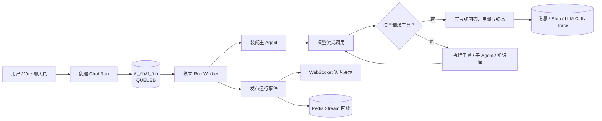
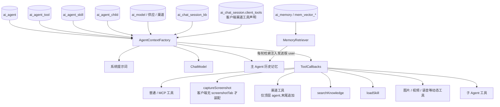

# Agent 架构阅读地图

> 目的：为首次接触项目的人提供一条从“系统全貌”到“单次 Agent 运行”的中文阅读路径。
>
> 本文不重复模块实现细节；它以现有模块文档和源码为准，回答三个问题：系统如何组装、一次对话如何运行、异常时去哪里排查。

---

## 1. 一句话理解

这是一个以 **持久化 Run** 为执行单元的多 Agent 平台：用户发起消息后，后端先创建并持久化一条 Run，再由独立线程池驱动模型、工具、知识库与子 Agent 的循环执行；浏览器只订阅过程事件，不拥有执行生命周期。



**最重要的边界**：

- `ChatRun` 是一次用户请求的后端事实与状态机；
- `ChatTurnRunner` 负责一轮 Agent 推理与工具循环；
- `AgentContextFactory` 把数据库中的 Agent 配置装配成可运行上下文；
- `ChatRunEventBroker` 负责实时投递、跨实例广播和断线回放；
- WebSocket 只是观察者，断开不应停止 Run。

---

## 2. 推荐阅读顺序

| 顺序 | 文档 | 解决的问题 | 适合谁 |
| --- | --- | --- | --- |
| 1 | [整体架构总览](整体架构总览.md) | 系统模块、基础设施、数据流如何拼合 | 新成员、架构评审 |
| 2 | [聊天执行引擎](聊天执行引擎.md) | Run 怎样创建、执行、收尾、恢复 | 后端开发、故障排查 |
| 3 | [智能体核心模块](智能体核心模块.md) | Agent、模型、技能、子 Agent 如何装配 | Agent 能力开发 |
| 4 | [工具生态模块](工具生态模块.md) | 内置工具、Shell、MCP、策略与审计 | 工具/MCP 开发、安全评审 |
| 5 | [渠道工具与浏览器插件](渠道工具与浏览器插件.md) | 执行体在客户端的工具:声明、挂起转交、补发 | 插件开发、安全评审 |
| 6 | [上下文与记忆模块](上下文与记忆模块.md) | 历史消息、工具结果、压缩与 token 控制 | 模型效果、成本治理 |
| 7 | [流式与事件模块](流式与事件模块.md) | 事件协议、Redis、WebSocket、断线恢复 | 前后端联调、分布式排障 |
| 8 | [AI业务表结构](AI业务表结构.md) | `ai_*` 表的事实、投影和计量关系 | 数据分析、运维 |
| 9 | [会话身份与访问控制](会话身份与访问控制.md) | 会话归属、订阅与工作区访问边界 | 安全评审 |

### 按任务反查

| 我正在做什么 | 优先阅读 |
| --- | --- |
| 新增或修改一个 Agent | `智能体核心模块` → `模型与渠道模块` → `工具生态模块` |
| 新增工具 / 接入 MCP | `工具生态模块` → `流式与事件模块` → `上下文与记忆模块` |
| 给浏览器插件加工具 / 排查插件工具不回传 | `渠道工具与浏览器插件` → `工具生态模块` → `流式与事件模块` |
| 排查“页面断线后回答消失” | `聊天执行引擎` → `流式与事件模块` |
| 排查“Run 卡在执行中” | `聊天执行引擎` → `AI业务表结构` |
| 排查上下文膨胀 / token 偏高 | `上下文与记忆模块` → `聊天执行引擎` |
| 排查子 Agent 串卡、循环或预算异常 | `智能体核心模块` → `工具生态模块` → `流式与事件模块` |

---

## 3. 单次 Agent 运行：从输入到结果

```mermaid
sequenceDiagram
    autonumber
    participant UI as 前端
    participant RS as ChatRunService
    participant DB as MySQL
    participant EX as ChatRunExecutor
    participant TR as ChatTurnRunner
    participant LOOP as AgentToolLoop
    participant AF as AgentContextFactory
    participant LLM as 上游模型
    participant TB as 工具包装器
    participant EXT as 浏览器插件
    participant EB as EventBroker

    UI->>RS: 创建 Run（会话、Agent、消息、附件、知识库）
    RS->>DB: 写 ai_chat_run = QUEUED
    RS-->>UI: 立即返回 runId
    RS->>EX: 事务提交后投递独立线程池
    EX->>DB: 抢占并标记 RUNNING
    EX->>TR: 执行本轮
    TR->>AF: 装配模型、系统提示词、记忆、工具
    AF-->>TR: AgentContext
    TR->>TR: MemoryRetriever 检索跨会话记忆<br/>(mem_vector_* + ai_memory, 注入发送版 user)
    TR->>LOOP: run(spec)
    LOOP->>LLM: 流式调用
    LLM-->>EB: 文本 / 思考事件
    alt 模型返回 tool_calls
        LOOP->>TB: 工具调用请求
        TB->>TB: 预算、策略、确认、脱敏、审计
        alt 渠道工具(执行体在浏览器插件)
            TB->>EXT: tool_call_request 事件,服务端挂起
            EXT-->>TB: chat.tool.result 回传;断线重连后同 callId 补发
        else 内置 / MCP / 子 Agent 工具
            TB->>TB: 本地执行
        end
        TB-->>LOOP: ToolResponse
        LOOP->>LLM: 带着工具结果再请求
    end
    LOOP-->>TR: 最终回答
    TR->>DB: 写消息、LLM 调用、Trace、会话统计
    EX->>DB: 写 SUCCEEDED / FAILED / CANCELLED 等终态
    EX->>EB: 发布终态事件
    EB-->>UI: WebSocket 实时事件或断线回放
```

### 关键状态机

```text
QUEUED → RUNNING → FINALIZING → SUCCEEDED
                           ├→ FAILED
                           ├→ CANCELLED
                           └→ INTERRUPTED
```

状态事实源是 `ai_chat_run`；执行步骤的可恢复投影在 `ai_chat_run_step`；完整消息事实在 `ai_chat_message`。Redis Stream 只承担短期事件回放，不替代数据库事实。

---

## 4. Agent 运行时装配图



其中“子 Agent 工具”不是异步旁路：父 Agent 调用它时，子 Agent 在工具调用线程中完成自己的模型—工具循环，再把最终文本作为 `ToolResponse` 交回父 Agent。子 Agent 默认无长期会话记忆，但继承操作者身份、会话工作区、预算和事件出口。**子 Agent 不装配渠道工具**(跑在后台够不到客户端)，也因此保留服务端版截图。渠道工具的声明链路、挂起转交与断线补发见 `渠道工具与浏览器插件.md`。

跨会话长期记忆的读侧注入不经过装配层：`ChatTurnRunner.buildInitialMessagesForRun` 在拼装本轮 user 前调 `MemoryRetriever`(查询 `ai_memory` + `mem_vector_*`),注入**发送版**消息(落库存原话);写侧由 `ContextCompactor` 压缩搭车 + `IdleSessionExtractScheduler` 空闲兜底提炼。详见 `上下文与记忆模块.md §7`。

---

## 5. 数据与观测：该看什么

| 关注对象 | 事实表 / 设施 | 用途 |
| --- | --- | --- |
| 一次请求是否结束 | `ai_chat_run` | 状态、错误码、心跳、执行实例、请求/回答消息 ID |
| 页面步骤为何丢失 | `ai_chat_run_step` | 文本、推理、工具、子 Agent 的可恢复投影 |
| 模型实际看到的历史 | `ai_chat_message` | 用户、助手、工具、思考、摘要消息 |
| Token 与模型耗时 | `ai_llm_call` | 单次 LLM 调用与用量归因 |
| 父子调用关系 | `ai_trace_span` | Turn / LLM / 工具批次 / 工具 / 子 Agent 树 |
| 断线期间事件 | Redis Stream | 按 `runId + seq` 增量回放 |
| 知识库引用 / 实时 token | `ai_chat_special_event` + `type=ui` | 只给前端,不进 LLM、不进 `run_step` |
| 文件和超长工具结果 | 会话工作区与 context-path | 大内容外置，数据库仅存预览或路径 |
| 跨会话长期记忆 | `ai_memory` / `mem_vector_*` / `ai_memory_extract_progress` | 记忆台账(MySQL) + 向量(PG) + 空闲提炼位点;读侧注入发送版,写侧压缩搭车+兜底 |

---

## 6. 排障最短路径

### Run 一直停在 `QUEUED`

1. 查 `ai_chat_run` 是否已创建；
2. 查 Run 线程池队列是否拒绝或实例是否正常；
3. 查看 `ChatRunService` 的事务提交后投递是否发生；
4. 对照 `聊天执行引擎` 中的 `create` 和 `ChatRunExecutor.start`。

### Run 停在 `RUNNING`

1. 查 `heartbeat_time` 与 `worker_id`；
2. 判断是模型流、工具、MCP 还是子 Agent 阻塞；
3. 查 `ai_trace_span` 的最后一个未完成 span；
4. 对照 Run 最大时长、LLM 空闲超时、工具批次超时和 stale watchdog。

### 前端没有实时输出或重连后缺步骤

1. 用 `GET /ai/chat/run/{runId}/state` 验证数据库快照；
2. 查 `snapshot_seq`、`last_event_seq` 与 Redis Stream 是否存在对应增量；
3. 再检查 WebSocket ticket、会话订阅、Run 订阅与事件序号；
4. 对照 `流式与事件模块` 的恢复协议。

### 工具未执行或被拒绝

1. 查 Agent 是否关联了该工具、工具/MCP 是否启用且健康；
2. 查 `RecordingToolCallback` 的预算、策略和人工确认分支；
3. 查会话工作区与操作者权限；
4. 查工具步骤与对应 Trace Span 的输入、输出和错误。

### 插件收不到工具请求 / 渠道工具超时

1. 查 `ai.chat.tool.channel.enabled` 与 `allow-user-ids`(白名单外 userId 静默不装配);
2. 查 `ai_chat_session.client_tools` 是否有声明(新会话首轮走 run.create 捎带,老会话走 `chat.session.client.declare`);
3. 插件重连后服务端在 `chat.run.subscribe` 的 replay 之后**同 callId 补发**挂起请求,`redelivered` 字段即补发条数——补发依赖 callId 幂等,客户端不得重跑写操作;
4. 断线超过 `disconnect-grace-seconds` 会快速失败(文案含"侧边栏"),与总超时(文案含"超时")区分;注意多 tool_call 轮会被 `tool-execution-timeout-ms` 先截断;
5. 对照 `渠道工具与浏览器插件` §3.3-3.4。

---

## 7. 文档维护约定

- **结构、状态机、协议变更优先更新模块设计文档**，不要只改实现注释；功能合入代码后同步更新对应模块文档，避免文档与实现脱节；
- 新增事件类型时，同时更新 `流式与事件模块` 的事件字段表和前端消费说明；
- 新增工具类型时，同时更新 `工具生态模块`、安全边界和本地图中的装配图；
- 修改 Run 状态、恢复逻辑或表字段时，同时更新 `聊天执行引擎`、`AI业务表结构`；
- 代码注释解释“为什么”，架构文档解释“整体如何协作”，避免两边复制粘贴实现细节。

---

## 8. 源码入口速查

| 角色 | 入口 |
| --- | --- |
| 创建/查询/取消 Run | `AiChatRunController`、`ChatRunService` |
| 线程池执行与终态收敛 | `ChatRunExecutor` |
| Prompt、记忆、计量与收尾 | `ChatTurnRunner` |
| Agent、模型、工具装配 | `AgentContextFactory` |
| 模型—工具循环 | `AgentToolLoop` |
| 工具审计/预算/策略 | `RecordingToolCallback` |
| 渠道工具挂起/补发 | `ChannelToolBroker`、`RunSubscriberPresence`;前端 `extension/src/chat/clientTools.js` |
| 子 Agent 调用 | `SubAgentToolCallback` |
| 跨会话长期记忆(读侧/写侧) | `MemoryRetriever`(注入)、`MemoryExtractor` / `IdleSessionExtractScheduler`(提炼)、`MemoryServiceImpl` / `PgMemoryVectorStore`(存储) |
| 事件发布与回放 | `ChatRunEventBroker` |
| WebSocket JSON-RPC | `ChatJsonRpcWebSocketHandler` |
| 前端 Run 生命周期 | `ruoyi-ui/src/views/ai/chat/composables/useChatRun.js` |

