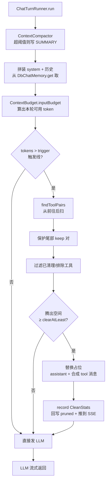
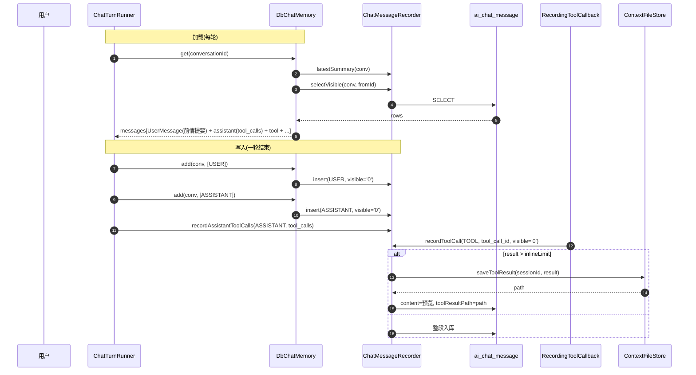
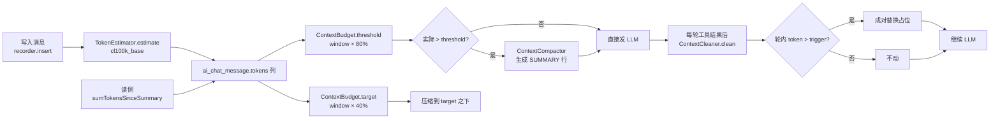

# Context / Memory 上下文与记忆模块设计文档

> 范围:`ruoyi-system/.../ai/AiChatMemoryConfig.java`、`ruoyi-system/.../ai/ContextFileStore.java`、`ruoyi-system/.../ai/memory/`(`DbChatMemory`、`ChatMessageRecorder`、`ContextBudget`、`ConversationIds`、`ConversationVisionGate`、`TokenEstimator`、`ChatMessageKind`)、`ruoyi-system/.../ai/context/` 全部 3 个类,以及 `ruoyi-admin/.../controller/ai/AiChatSessionController.java` 的 `/timeline` 端点。
> 跨会话长期记忆(`ruoyi-system/.../ai/memory/longterm/` 包 + `ChatTurnRunner` 读侧注入 + `ContextCompactor` 写侧搭车 + `sql/init/10-12`)见本文档 §7「跨会话长期记忆」,设计原稿在 `docs/superpowers/specs/2026-08-29-ai-memory-design.md`。
> 旁路:`ChatTurnRunner` 是这些组件的最大消费者,在「依赖关系」一节中点出。自建 `AgentToolLoop` 之后**不再**使用 `MessageChatMemoryAdvisor`。
> 事实源:`ai_chat_message` 是 LLM 可见消息与前端时间线的唯一事实源(会话内);`ai_memory` 是跨会话长期记忆的台账事实源;`ai_chat_run` 是会话内运行实例的事实源;`{contextPath}/{sessionId}/{tools|thinking}/*.txt` 是大字段的不可变外置正文,由 `tool_result_path` 引用。(曾经的 `{agentId}.md` 人读快照已删除,理由见 §2.7。)

---

## 1. 模块概述

在 LLM 长对话里有三条本质不同的「上下文」,本项目刻意把它们拆成三层组件(第三层即跨会话长期记忆,详见 §7):

- **Memory(会话内记忆)**:跨轮**持久化**的消息流,落地 `ai_chat_message` 单表。`DbChatMemory` 直接实现 Spring AI 的 `ChatMemory` 接口,为「会话来人,模型没看到的那部分历史」提供加载与回灌能力。Memory 的写入是**追加语义**,这是与 `MessageWindowChatMemory` 覆盖式 `saveAll` 最大的区别 —— 一旦选择覆盖式,审计和前端时间线就物理消失,必须再拆出第二张表。工具往返也以真实的 `assistant(tool_calls) + tool` 消息跨轮保留。
- **Context(上下文)**:本轮**即将发给模型**的消息快照,运行期在内存里。它从 Memory 加载后先经过 `ContextCompactor` 的跨轮摘要压缩,工具循环中再由 `ContextCleaner` 成对清理过期工具往返;并由 `ContextUsageAnalyzer` 拆分计量,为前端刻度条提供 `messages / toolCalls / systemPrompt / skills / toolsBuiltin / toolsMcp / subAgents` 等占比。
- **长期记忆(Long-term Memory)**:跨会话的**事实与偏好**沉淀,落地 `ai_memory` 台账 + PostgreSQL `mem_vector_{768,1024,1536,3072}` 向量表。系统侧全自动:写侧由 `ContextCompactor` 压缩搭车 + `IdleSessionExtractScheduler` 空闲兜底提炼,读侧由 `MemoryRetriever` 每轮按本轮 query 检索并注入发送版消息。**对 agent 完全不可见** —— 没有任何记忆工具,注入只是一段像 system prompt 的背景文字。

为什么分开?

1. **存储与裁剪是两种语义**:Memory 必须「**真追加**」,不能物理删改;Context 必须「**可裁可压缩**」。清理只把 `pruned` 标记回写,原文仍留作审计和前端时间线。
2. **条数窗口是错的抽象**:Spring AI 默认 `MessageWindowChatMemory` 按条数滑窗 + 覆盖语义,而 OpenAI 协议要求 `assistant(tool_calls)` 后必须紧跟对应 `tool_call_id` 的 tool 消息(`ChatMessageRecorder.java:144-147`),按条数裁会切坏配对 → 400。改用按 token 预算裁 + 工具往返成对压缩(`ContextCleaner.java:170-191`)。
3. **大字段溢出只对 Memory 有效**:工具结果(几十 KB)、思考链(几百 KB)不能让 LLM 真吃,但又不能丢审计,所以落 `tools/*.txt` / `thinking/*.txt`,表内只留预览与路径(`ContextFileStore.java:275-320`、`ChatMessageRecorder.java:120-138, 200-219`)。
4. **预算口径必须统一**:`ai_chat_message.tokens` 列在写入时用 `TokenEstimator` 估算(`ChatMessageRecorder.java:79, 115, 197`),预算检查退化成一条 `SUM(tokens)` SQL(`ChatMessageRecorder.java:242-251`),不必每轮对全部历史重跑 tokenizer。
5. **长期记忆必须与对话历史分开存**:事实与偏好是跨会话资产,若只活在 `ai_chat_message` 里,会话一删就没了,换会话也读不到。而且它不能落库到 `ai_chat_message` —— 那会污染审计流与时间线,注入内容也会永久沉进历史、轮轮累积(§7.1)。

---

## 2. 关键类与职责

### 2.1 `AiChatMemoryConfig` — 记忆 Bean 注册

`ruoyi-system/.../ai/AiChatMemoryConfig.java`,仅 32 行。

只做一件事:把 `DbChatMemory` 注册成 `org.springframework.ai.chat.memory.ChatMemory` 类型的 Bean(`AiChatMemoryConfig.java:27-31`)。`ChatTurnRunner` 在每轮开始时**显式**调 `DbChatMemory.get`,拼 `[system] + [记忆] + [本轮 user]`。自建工具循环后不能再用 `MessageChatMemoryAdvisor` —— 它每次模型调用都会重新注入记忆并写入用户消息,循环里会重复 N 次。

为什么不实现 `ChatMemoryRepository`?类注释给出完整理由(`AiChatMemoryConfig.java:11-15`):Spring AI 的 `MessageWindowChatMemory.add()` 实现是「查 → 合并截断 → 整批 `saveAll`」,`saveAll` 是**覆盖语义**。一旦走 Repository,超出窗口的旧消息会被物理删掉,审计和前端时间线归零。直接实现 `ChatMemory`,`add` 就是真追加,一张 `ai_chat_message` 表够用。

### 2.2 `DbChatMemory` — 数据库版 ChatMemory

`ruoyi-system/.../ai/memory/DbChatMemory.java`。Spring AI `ChatMemory` 接口的**完整实现**,读写 `ai_chat_message` 表。

- **`add(conversationId, messages)`**:只写 USER / 最终 ASSISTANT / SYSTEM;工具结果由专门写入链路记录,避免重复落库。`conversationId` 形如 `sessionId:agentId`,在 `add` 里拆出 `sessionId` / `agentId` 落表。
- **`get(conversationId)`**:取最新一条 `SUMMARY` 作为压缩边界,把摘要作为 `UserMessage` 放在历史前面,再取边界之后的可见消息。带 `tool_calls` 的 ASSISTANT 行与紧随其后的 TOOL 行会重建为协议配对消息;按 `tool_call_id` 配对,缺失结果合成占位,孤儿 TOOL 行丢弃,从而保证不向上游发送不合法的 tool 消息。`HARD_LIMIT` 只是 token 估算失效时的防御性兜底。
- **`toUserMessage` 还原附件**:从 `attachments` JSON 中取图片 mime + 路径,在工作区里重新挂 `FileSystemResource`。是否真的把媒体塞进请求,由 `ConversationVisionGate` 按该 conversation 绑定模型的 `input_modalities` **逐份**判定(经 `ModelInputModalities`,不是一刀切):模型可能收图片却收不了文档。送不出去的转成一段说明,不静默丢弃 —— 否则模型会以为自己看过。避免历史带图后每轮 400。文件被工作区清空时静默跳过。
- **`mapType`**(`DbChatMemory.java:152-167`):Spring AI 的 `MessageType` 枚举映射到数据库 6 种 `messageType` 字符串(`USER/ASSISTANT/SYSTEM/TOOL/...`)。

前情提要必须是 `UserMessage`,不能用 `SystemMessage`:否则会插进固定 system 前缀后面、把 KV-cache 打穿。`ChatTurnRunner` 手工把摘要历史拼在 system 之后、本轮 user 之前。

### 2.3 `ChatMessageRecorder` — 写入门面

`ruoyi-system/.../ai/memory/ChatMessageRecorder.java`。`DbChatMemory` 与 `RecordingToolCallback` 共同的写入口,「写一条 `ai_chat_message`」收口在此,避免散落多处。

- **`insert(...)`**(`ChatMessageRecorder.java:67-87`):通用 `USER/ASSISTANT/SYSTEM/THINKING/SUMMARY` 插入。`tokens` 列**永远**走 `TokenEstimator` 估算(`ChatMessageRecorder.java:79`),口径全局一致,供环图占比/预算;真实用量写 `ai_llm_call` 与 `ai_chat_session.total_tokens`,不回填本列。
- **`recordThinking(...)`**(`ChatMessageRecorder.java:102-140`):`visible_to_llm='1'` —— **绝不进 LLM 上下文**。思考是模型自己的草稿,回灌下一轮会污染推理,且体量常大于正文。`selectVisible` 与 `sumTokensSinceSummary` 只取 `visible='0'`,THINKING 天然被排除在上下文与预算之外,只喂前端时间线。超长正文溢出到 `thinking/*.txt`,写文件失败时**退化为整段入库**,不能因审计投影写不了就丢记录(`ChatMessageRecorder.java:128-132`)。
- **`recordToolCall(...)`**:TOOL 行会记录 `tool_call_id`,与中间 ASSISTANT 行的 `tool_calls` JSON 配对;灰度开关开启后写为 `visible_to_llm='0'`,tokens 按真正重建给模型的结果文本估算。附件(生图工具产出的图片等)写入 `attachments` 列,JSON 格式与用户上传附件统一。
- **`recordAssistantToolCalls(...)`**:在工具执行前写入模型当轮的 ASSISTANT 行,保存原始 `tool_calls` JSON 和调工具前的文本,确保时间线与跨轮重建顺序一致。
- **`recordSummary(...)` / `markPruned(...)`**:前者写入压缩边界 SUMMARY;后者仅回写 `pruned` 和占位 token 数,不覆盖工具原文。
- **`latestSummary / selectVisible / sumTokensSinceSummary / sumToolTokensSinceSummary`**:压缩相关查询;`sumToolTokensSinceSummary` 让 `ContextUsageAnalyzer` 从 messages 扣除工具往返,归到 `toolCalls`。
- **`updateAttribution(...)`**(`ChatMessageRecorder.java:270-274`):流式结束后回填 ASSISTANT 行的 `promptTokens/completionTokens/modelName/usageSource` —— 描述的是归因展示字段,**不**改 `tokens` 列(`ChatMessageRecorder.java:260-264`)。

### 2.4 `ConversationIds` — 记忆键拼装

`ruoyi-system/.../ai/memory/ConversationIds.java`,24 行。`ChatMemory` 的 key 颗粒度。

```
agentId == null ? sessionId : sessionId + ":" + agentId
```

`ConversationIds.java:15-23`。复合 key 让同一会话里不同 agent 的上下文彼此隔离(主 supervisor / 子 worker 各有独立 Memory);旧会话裸 `sessionId` 也兼容(`ConversationIds.java:18-21`)。

`DbChatMemory.add` 拿到这个 key 后反向拆出 `sessionId` 与 `agentId` 用于落表(`DbChatMemory.java:71-91`)。

### 2.5 `TokenEstimator` — token 估算

`ruoyi-system/.../ai/memory/TokenEstimator.java`,27 行。包装 Spring AI 的 `JTokkitTokenCountEstimator`(cl100k_base)。

类注释明确给出选型理由(`TokenEstimator.java:8-13`):cl100k_base 对通义 / DeepSeek **不是精确值**,但中文在该 tokenizer 下 token 数**偏多**,估算偏保守 —— 这个方向的误差是安全的,比「字符数/3」准得多。目的是写入消息时就算好 token,让预算检查退化成 `SUM(tokens)` SQL,不必每轮对全部历史重跑 tokenizer。

### 2.6 `ContextBudget` — 上下文预算

`ruoyi-system/.../ai/memory/ContextBudget.java`,87 行。按 `ai_model.context_window` / `max_output_tokens` 算三类数值。

- **`inputBudget(window, maxOutput)`**(`ContextBudget.java:40-44, 64-68`):**输入可用 = 总窗口 − 输出预留**,结果再与「窗口的一半」取大(`Math.max(w - reserved, w / 2)`)。注释给出反例:128K 窗口 + maxOutput=32K,直接对 128K 取 80% = 102.4K,再加 32K 输出 = 134K,**溢出**;先扣输出:(128K − 32K) × 0.8 = 76.8K 才安全(`ContextBudget.java:11-15`)。
- **`threshold(...)` / `target(...)`**(`ContextBudget.java:47-58, 70-76`):超过 threshold 触发压缩;`ContextCompactor.findBoundary` 用 target 选择边界，使压缩后剩余历史收敛到目标以下，避免每轮重复触发。比例从 `sys_config` 读 `ai.context.compactThreshold`(默认 80)与 `ai.context.compactTarget`(默认 40)，走 RuoYi Redis 缓存，不会每轮打库(`ContextBudget.java:17-19`)。
- **静态方法做纯计算**(`ContextBudget.java:64-76`),便于单测;`@Component` 实例方法包装从配置读比例,便于上线后调(`ContextBudget.java:17-19`,`§4.10`)。
- **`clamp`**(`ContextBudget.java:79-81`):参数越界兜回默认 80 —— 0/100/负数都会让压缩失效或频繁触发,不能让配置错误把对话搞崩。
- **触发压缩**:由 `ContextCompactor` 在每轮历史装配前调用 `threshold(...)`;超阈值时调 LLM 生成 SUMMARY,失败安静降级。

### 2.7 `ContextFileStore` — 大字段外置

`ruoyi-system/.../ai/ContextFileStore.java`,约 240 行。**只做一件事**:把超大的工具结果 / 思考正文
落 `{contextPath}/{sessionId}/{tools|thinking}/{uuid}.txt`,数据库只留预览与引用。

> **曾经还有一份 `{agentId}.md` 人读快照**(frontmatter + `## System/History/ToolCalls/Current` 分段),
> 每轮追加两次。它没有任何消费方:唯一的读取点只拿它判空来决定要不要初始化,内容从没进过 prompt;
> `appendTurn` / `writeCurrent` / `clearCurrent` / `appendToolCall` / `loadToolCalls` 更是零调用。
> 内容与 `ai_chat_message` 完全重复,当审计也是冗余。**整套连同解析/重建机制已删除**,
> 类从 721 行降到 240 行,`ai.chat.max-context-chars` 配置项一并移除。
> 会话表的 `context_length` 原先取自 `appendHistory` 的返回值,现在由 `ChatTurnRunner` 直接按
> 问 + 答字符数算(与子智能体侧同口径)。

#### 路径

- 引用存**相对根目录**的那一段(`{sessionId}/tools/{uuid}.txt`),不是绝对路径 ——
  详见本文档「工具结果溢出」一节。`contextRoot` 在构造时 `toAbsolutePath().normalize()`。
- `sessionDir` 做纵深防御:`SessionIds.isWellFormed` 字符集白名单 + normalize 后复核未逃出 `contextRoot`。

#### 并发

- **固定 64 条分段锁**(`lockFor(Path)`):按 `Path.normalize().hashCode()` 取模。
  原先是 `ConcurrentHashMap<Path, Object>` 按路径建锁,条目只增不减 —— 每个溢出文件留一个条目、
  会话删了也不回收,长跑进程里是无界增长。分段锁把内存钉死成常量,代价只是不同文件偶尔共用一把锁。

#### 读写

- **`saveToolResult` / `saveThinking`**:超 `ai.chat.inline-limit`(默认 2048)时落文件,
  表内留预览 + 路径;写失败退化为整段入库,不丢审计。
- **`loadExternal`**:读外置大字段的**唯一入口**,跨轮重建上下文与前端「查看完整结果」共用。
  越界校验、存在性判断、失败返 `null` 都收在这里一处。
- **`deleteSession(sessionId)`**:删整个会话目录。被 `AiChatController.DELETE /session/{sessionId}/memory`
  与 `AiChatSessionServiceImpl` 的会话删除调用。
  **注意**:回滚最后一轮不删对应的溢出文件,那批文件要等整个会话被删时才清掉。

**生产部署约束**:`{contextPath}` 必须放在**共享、持久化、有备份**的存储上,多实例之间共享。

### 2.8 `ContextSegment` / `ContextUsageAnalyzer` — 占比计量

`ContextSegment`(`ruoyi-system/.../ai/context/ContextSegment.java`,17 行)是一个 4 字段 record:`(key, label, tokens, compactable)`。通用 record 而非给每个分类开字段(`ContextSegment.java:6-9`):前端按数组顺序渲染、按下标取色,不识别具体 key;将来新增分类(如「前情提要」「附件」)只需在 `analyze` 里多 `add` 一条,前端零改动。

`ContextUsageAnalyzer`(`ruoyi-system/.../ai/context/ContextUsageAnalyzer.java`,253 行)产出按 `tokens` 降序的 `List<ContextSegment>`:

- **消息类**:`messages = sumTokensSinceSummary(...) - sumToolTokensSinceSummary(...)`;ASSISTANT 的 `tool_calls` 与 TOOL 结果单独归到 `toolCalls`,避免重复计量。两段都可压缩。
- **装配期分段**:`systemPrompt / skills` 通过 `AgentContextFactory` 的 `buildRoleSection / buildCollabSection / buildSkillSection` 估算,与运行时用的同一套文本保持一致。
- **工具类**(`ContextUsageAnalyzer.java:112-163`):`toolsBuiltin / toolsMcp` 按 `ai_tool.tool_type` 拆分(1=内置、2=MCP);遍历 `agent.getToolIds()` 走 `ToolCallbackRegistry.get(...)` 直接取 `ToolDefinition`,**不走 `build()`**(有副作用/可能 refresh,`ContextUsageAnalyzer.java:124-125`)。`toolTokenCache`(`ContextUsageAnalyzer.java:57, 215-225`)在 `ToolRegistryRefreshedEvent` 时清空(`ContextUsageAnalyzer.java:203-207`)。
- **装配期自动工具补漏**(`ContextUsageAnalyzer.java:146-160`):挂了技能 → 必有 `loadSkill`;绑了生图模型 → 必有 `drawImage`;绑了视频模型 → 必有 `drawVideo`;这些不进 `ai_tool` 表,第一轮遍历取不到,必须**单独 measure** 否则「内置工具」这项系统性偏低。
- **子智能体**(`ContextUsageAnalyzer.java:165-178`):遍历 `agent.getChildAgents()`,调 `SubAgentToolCallback.buildDefinition(child)` 累计 token。
- **降级**(`ContextUsageAnalyzer.java:180-198`):任何异常吞掉,退化为「仅 messages」,不能让上下文面板拖挂整个聊天页。

### 2.9 `ContextCleaner` — 轮内上下文清理

`ruoyi-system/.../ai/context/ContextCleaner.java`。**纯函数**(无会话状态),由 **`AgentToolLoop`** 在每轮工具结果后调用一次(`applyContextClean`),以「`assistant(tool_calls)` + 全部 `tool` 结果」为最小清理单位,绝不能从中间切断配对(OpenAI 协议 400)。设计对标 Anthropic `clear_tool_uses_20250919`。

#### 配置(`ContextCleaner.java:38-57`)

| 配置 | 默认 | 作用 |
|---|---|---|
| `ai.chat.context.clean.trigger-ratio` | 0.6 | 超过预算×此比例才清 |
| `ai.chat.context.clean.trigger-max-tokens` | 60000 | 触发线的**绝对上限**,与比例线取小;0=只按比例 |
| `ai.chat.context.clean.keep` | 3 | 保留最近几对工具往返 |
| `ai.chat.context.clean.clear-at-least-ratio` | 0.1 | 清不到**当前上下文**×此比例就不清(不值得打破缓存前缀) |
| `ai.chat.context.clean.clear-tool-inputs` | true | **同时清工具入参**(本项目 `writeFile` 入参是大头,与 Anthropic 默认相反) |
| `ai.chat.context.clean.exclude-tools` | `loadSkill` | 永不清理的工具名(逗号分隔)。技能输出是模型后续执行所需的操作指令，清成占位会造成行为损坏；其它可重新获取的数据仍可按需清理。 |

> **两条闸门的基准为什么不同**(2026-09-01 修正):
> `trigger` 取「比例线」与「绝对上限」的**较小值**;`clearAtLeast` 的基准是**当前上下文**,不是 `inputBudget`。
>
> 纯比例制在长窗口模型上等于不设防:`context_window = 1000000` 时 `inputBudget = 991,808`,
> 比例线是 **59.5 万**、`clearAtLeast` 是 **9.9 万**。而线上一次浏览器自动化任务的上下文峰值只有
> **9.6 万**(工具往返占 75%)—— 触发线够不着,且 `clearAtLeast` 比整个上下文还高,
> **把所有可清的往返清光也过不去**,两道闸门同时焊死。结果 51 轮工具往返原样堆着被完整重发 51 遍,
> 单轮累计 prompt 339 万。
>
> 窗口是「能装多少」不是「该装多少」:计费按每次调用的 prompt 走,与窗口无关。
> `clearAtLeast` 问的是「这次清理值不值得打破缓存前缀」,这与窗口多大无关,只与当前上下文有关。

#### 算法(`ContextCleaner.java:78-163`)

1. 估算当前 token,若 ≤ 触发线直接返回。
2. 调 `findToolPairs`(`ContextCleaner.java:170-191`)从前往后扫描:每个带 `tool_calls` 的 assistant,吞掉紧随其后的连续 `ToolResponseMessage`,得到 `List<ToolPair>`。
3. 保护尾部:保留最近 `keep` 对不动(`ContextCleaner.java:107-115`)。
4. **跳过已清过的对**(`ContextCleaner.java:111, 210-230`):占位后的 assistant 仍带 `tool_calls`,会被 `findToolPairs` 再次认成一对。重清它**腾不出任何空间**却会重写占位文本 —— 缓存前缀断点被推回最早的那一对,其后全部历史一起失配(本该只失配最新清理的那对之后);还会让 `wouldFree` 把这些「清了也是零」的对算进去,架空 `clearAtLeast` 闸门。`isAlreadyCleared` 通过检查所有 tool 结果是否都以前缀 `[已精简] ` 开头判定。
5. 预估清掉 `candidates` 能腾出多少(`estimatePairTokens`,`ContextCleaner.java:460-468`),不足 `clearAtLeast` 放弃(不值得打破缓存前缀)。
6. 构建新列表:被清的对换成占位,只保留 `assistant + 一条合成 tool 消息`,跳过原 tool 行;Runner 会把 `CleanStats.clearedToolCallIds` 回写为 `pruned='1'`,使清理单向累积、下一轮重建出相同占位。

#### 占位构造(`ToolPlaceholders`)

- **`toPlaceholderAssistant`**(`ContextCleaner.java:268-286`):`clearToolInputs=true` 时,入参 → 摘要 `{path: "...", _cleared: true}` 或 `{_cleared: true, preview: "..."}`;保留 `tool_call.id/type/name`。
- **`buildPlaceholder(toolName, args, originalResult)`**(`ContextCleaner.java:348-368`):**可恢复占位**——「做过 + 如何拿回」,不是只写「已清理」。形如 `[已精简] readFile(path=/data/x.csv) → 已读 1024 行;完整内容见工作区文件本身,需要时用 readFile 重新读取`。**幂等**:已经是占位文本就原样返回,防止层层嵌套(`ContextCleaner.java:351-356`)。
- **`extractPathHint`**(`ContextCleaner.java:395-427`):粗匹配 `"path":"..."` / `"filePath":"..."`,在 `writeFile/readFile` 这类按路径取结果的工具上,占位里仍保留路径 —— 模型看到就知道去哪儿 `readFile` 拿回。

#### 观测

- **`lastStats`**(`ContextCleaner.java:66-71, 161`):`ThreadLocal<CleanStats>`,本次 clean 的 `tokensBefore/After/pairsCleared/estimatedFreed`;`ChatTurnRunner` 取到后写进 SSE 事件流,前端能看到「本轮清了 3 对工具往返、腾出 1200 token」。
- **`estimateMessage`**(`ContextCleaner.java:470-507`):按 `Message` 类型分别累加 `text + tool_calls(name/args) + tool responses.data`。

#### 两条反复推敲过的「不变量」

1. 缓存前缀断点(注释 `ContextCleaner.java:101-105`):重清会推回最早一对,失配面铺大。靠 `isAlreadyCleared` + `clearAtLeast` 双重闸门锁死。
2. 配对不可切断(注释 `ContextCleaner.java:21-23`):OpenAI 协议要求 assistant 后必须紧跟 tool,按对清理是唯一安全粒度。

---

### 2.10 `ContextCompactor` — 跨轮 LLM 摘要压缩

`ContextCompactor` 在每轮历史装配之前检查 `sumTokensSinceSummary` 是否超过 `ContextBudget.threshold`。超过时，以 USER 消息为轮次边界，把更早的 USER / ASSISTANT / 工具结果渲染给 LLM 生成摘要，并写入带 `summary_to_id` 的 SUMMARY 行。边界从 `keep-recent-turns` 开始逐步减少保留轮数，直到剩余历史加摘要预留不超过 `ContextBudget.target`；若一轮都超 target，仍压到只剩最后一轮，再由最终兜底处理。用户消息中的附件会转成类似 `[附件 image/png: 报表.png]` 的文本占位，避免图片本体不能进入摘要后连其存在都丢失。`DbChatMemory.get` 从 SUMMARY 行自身的 message_id 之后加载，因此摘要和最近历史组成新的上下文。

压缩本身也是真实的 LLM 调用：成功写 SUMMARY 后，同时写入一条 `ai_llm_call`，`finish_reason='compact'`，模型归因与常规轮次一致；上游未返回 usage 时用 `TokenEstimator` 估算并标记 `usage_source='1'`。压缩失败、空摘要、唯一键冲突或计量写入失败都会安静降级，不影响当前对话；其中计量失败不回滚已经写出的 SUMMARY。

**记忆写侧搭车**(开关 `ai.memory.extract.piggyback-compaction`,默认开):压缩的同一轮 LLM 调用还**顺带**提炼跨会话长期记忆。开启时走双段 PROMPT,同时要求 `<summary>` 摘要段与 `<facts>` JSON 事实数组;`parseSummary()` 优先解析(兼容旧纯文本摘要,剥掉 facts 段),`parseFacts()` 只取 `<facts>` 段,畸形 JSON 返回空列表**绝不抛异常** —— 摘要照常落库,记忆是搭车的,搭车的不能掀翻车。解析出的事实由 `persistPiggybackFacts()` 统一走 `MemoryExtractor.persistFacts` 落库(与空闲兜底提炼**共用同一套落库语义**:hash 去重、相似度去重、supersede 判定、回填 content_hash、补向量 —— 避免两套落库逻辑分叉,也避免没有向量的台账行在纯向量检索下永远查不到)。层级**一律 agent 层**(`scope` 传 null,保守方向,不判「换 agent 也成立」),位点复用压缩 `boundaryId` 作 `source_message_id` 并**同步推进空闲扫描位点**(避免兜底扫描重提炼同一段历史),userId 从会话主行解析。搭车路径不判「升用户层」,与兜底提炼的完整流程不同(见 §7.4)。

### 2.11 `ContextOverflowGuard` — 发送前最后防线

`ContextOverflowGuard` 在初始消息装配完成及每次工具执行后、真正调用上游前执行。它只在仍超输入预算时工作：以 USER 为轮起点逐轮丢弃最旧历史，保留 system prompt 和本轮用户输入，因此不会切断 `assistant(tool_calls) + tool` 协议配对。它与前两层分工明确：`ContextCleaner` 轮内清理可恢复的工具往返、不花钱；`ContextCompactor` 跨轮用 LLM 压缩正文、保留关键要点；Guard 不花钱但会真实丢失历史，是压缩失败、压不动或单轮巨大时为了保证请求仍可发出的最后选择。发生时通过 SSE `context_overflow_trimmed` 明确告知前端。

---

## 3. 核心流程

### 3.1 长对话时 Context 清理 / 裁剪 / 分段



要点:`ContextCleaner.clean` 必须在**每轮工具结果之后**由 `AgentToolLoop` 调用一次,而不是会话开始时算一次 —— 工具循环里消息数会增长,触发条件随轮次漂移。

### 3.2 ChatMemory 读写链路



要点:`add` 只写 USER / 最终 ASSISTANT;TOOL / 中间 ASSISTANT 走 `recorder` 的专门方法，随后由 `DbChatMemory.get` 成对重建，保证协议完整。

`selectVisible` 故意不带消息条数 `LIMIT`：容量上限只由 token 预算、`ContextCleaner`、`ContextCompactor` 和溢出保护决定。工具密集会话可能在远低于 token 阈值时就超过 200 行，按行限制会因升序查询而永久丢掉最新历史；压缩器同样必须观察全部未压缩消息才能选准边界。

### 3.3 Token 估算与预算控制



口径一致性:写入时估算 → 预算检查用 `SUM(tokens)`(不重跑 tokenizer)→ 占比面板用 `sumTokensSinceSummary`(`ChatMessageRecorder.java:242-251`)。**真实用量在 `ai_llm_call` 与 `ai_chat_session.total_tokens`,不写回 `tokens` 列**(`ChatMessageRecorder.java:76-79`)。

`tokens` 列是**估算口径**,压缩触发基于它;真实计费与归因走 `prompt_tokens/completion_tokens/usage_source`(`ChatMessageRecorder.java:81-86, 270-274`)。前端“当前上下文”会对账两者：最近真实 prompt 与当前可重建记忆在合理容差内时用真实值校准，显著不一致时使用完整记忆估算并显示 `≈`，避免把“上一次调用”误当成“此刻记忆”。

---

## 4. 对外接口

这层**没有自己独立的 HTTP 接口**。`ContextUsageAnalyzer` 的 `analyze(...)` 是公开方法,由 `ChatTurnRunner.buildContextUsage` 包装,被 `AiChatController.GET /session/{sessionId}/context?agentId=` 调用驱动前端刻度条;`DbChatMemory.get` 由 `ChatTurnRunner` 在装配本轮消息时显式调用。

Memory 相关的端点**间接**落在以下位置:

- `AiChatController.DELETE /ai/chat/session/{sessionId}/memory`(`聊天对话模块.md`):清空整会话的 `ai_chat_message` + `ai_llm_call` 解绑 + 清上下文文件 + 清工具预算。
- `AiChatController.DELETE /ai/chat/session/{sessionId}/last-turn?agentId=`(`聊天对话模块.md`):回滚最后一轮 USER 之后的消息(token 已真实消耗故不解绑明细)。
- `AiChatSessionController.GET /ai/chat/session/{sessionId}/timeline`:从 `ai_chat_message` 读时间线。查询走 `columnsLite`:`tool_result` / `tool_args` 只下发预览(`left(..., 200/500)`)+ `tool_result_length` / `tool_args_length`,展开全文另调 `GET .../message/{messageId}/tool-result`。`selectMessageById` 与 `DbChatMemory` 用的查询**不能**换 lite,否则会悄悄截断模型看到的历史。
- `AiChatSessionController.DELETE /ai/chat/session/{sessionIds}`:批量删会话。事务内 `purgeDb` 清消息/Run/计量/特殊事件;提交后 `cleanupSessionArtifacts` 调 `contextFileStore.deleteSession`、清工作区、清工具预算。**会删磁盘**,不是「软删后文件当审计留下」。

`ContextFileStore` 的 `initContext` / `appendTurn` 是 `ChatTurnRunner` 内部审计链路的一环,`saveToolResult` / `saveThinking` 是 `ChatMessageRecorder` 大字段溢出的内部调用 —— **都不暴露 HTTP**。

---

## 5. 依赖关系

| 本模块类 | 上游消费者 | 下游依赖 |
|---|---|---|
| `AiChatMemoryConfig` | Spring 容器 | `DbChatMemory` |
| `DbChatMemory` | `ChatTurnRunner`(显式 `get` / `add`) | `ChatMessageRecorder`, `TokenEstimator`, `ConversationVisionGate`, `AiToolProperties`, `WorkspaceSandbox`, `AiChatMessageMapper` |
| `ConversationVisionGate` | `DbChatMemory.toUserMessage` | `AgentAssemblyCache`(按 conversation 解出模型,`inputModalities` 口径与 `AgentContext` 相同;类名保留 Vision 是历史原因,职责已扩到四种模态) |
| `ChatMessageRecorder` | `DbChatMemory.add`, `RecordingToolCallback`, 流式过程写 THINKING / 中间 ASSISTANT | `AiChatMessageMapper`, `ContextFileStore`, `TokenEstimator` |
| `ContextFileStore` | `ChatMessageRecorder`(溢出), `ChatTurnRunner` 审计链路 | 文件系统, `ObjectMapper` |
| `ContextCleaner` | `AgentToolLoop`(每轮工具结果后) | `TokenEstimator` |
| `ContextBudget` | `ChatTurnRunner`, `ContextCompactor` | `ISysConfigService`(Redis 缓存) |
| `ContextCompactor` | `ChatTurnRunner.run`(历史装配前) | `ChatMessageRecorder`, `ContextBudget`, `ChatModel` |
| `ContextOverflowGuard` | `ChatTurnRunner.run`(初始装配及每次工具执行后) | `TokenEstimator` |
| `ToolPlaceholders` | `ContextCleaner`, `DbChatMemory`, `ChatMessageRecorder` | 无 |
| `ContextUsageAnalyzer` | `ChatTurnRunner.buildContextUsage` → `AiChatController.GET /context` | `ChatMessageRecorder`, `TokenEstimator`, `AgentContextFactory`, `IAiAgentService`, `IAiToolService`, `IAiSkillService`, `ToolCallbackRegistry`, `SubAgentToolCallback` |
| `TokenEstimator` | 几乎所有 memory / context 类 | `JTokkitTokenCountEstimator`(spring-ai-commons 传递) |
| `ConversationIds` | `ChatTurnRunner`, `AgentContextFactory` | 无 |
| `MemoryRetriever` | `ChatTurnRunner.buildInitialMessagesForRun`(每轮读侧注入) | `MemoryService`, `MemoryQueryVectorizer`, `MemoryInjectionBudget`, `AiMemoryMapper`(空库短路) |
| `MemoryQueryVectorizer` / `EmbeddingMemoryQueryVectorizer` | `MemoryRetriever` | `MemoryEmbeddingModelResolver`, `IAiModelService`, `EmbeddingModelFactory` |
| `MemoryInjectionBudget` | `MemoryRetriever` | `TokenEstimator` |
| `MemoryService` / `MemoryServiceImpl` | `MemoryRetriever.search`, `ContextCompactor`(搭车写), `MemoryExtractor`(兜底写) | `AiMemoryMapper`, `MemoryVectorStore` |
| `MemoryVectorStore` / `PgMemoryVectorStore` | `MemoryServiceImpl` | PG `mem_vector_*`;`InMemoryMemoryVectorStore` 仅单测/兜底 |
| `MemoryGraphStore` / `NoOpMemoryGraphStore` | 装配(`@ConditionalOnMissingBean(name="pgMemoryGraphStore")`) | 第一版无图,`isAvailable()` 恒 false |
| `MemoryTenant` | 所有 longterm store 方法第一参数 | 无 |
| `MemoryEmbeddingModelResolver` | `EmbeddingMemoryQueryVectorizer` | `ISysConfigService`(kb.default.embeddingModel,30s TTL) |
| `MemoryExtractor` | `IdleSessionExtractScheduler`(兜底提炼) | `MemoryService`, `ChatModel`(主 agent 模型), `MemoryVectorStore`(去重检索) |
| `IdleSessionExtractScheduler` | Spring 容器(`@PostConstruct` 自启) | `IdleSessionExtractProgressStore`, `MemoryExtractor`, `ChatMessageRecorder` |
| `IdleSessionExtractProgressStore` | `IdleSessionExtractScheduler` | JdbcTemplate(`ai_memory_extract_progress`,MASTER) |

三层上下文控制:

| 组件 | 时机 | 策略 | 成本 | 信息影响 |
|---|---|---|---|---|
| `ContextCleaner` | 轮内，每次工具结果后 | 只清工具往返 | 不花钱 | 可恢复 |
| `ContextCompactor` | 跨轮，每轮开始前 | LLM 摘要压缩对话正文 | 花钱 | 有损但保留要点 |
| `ContextOverflowGuard` | 发送前，最后一道 | 按整轮丢弃最旧历史 | 不花钱 | 真丢，必须告知用户 |
| `MemoryRetriever`(长期记忆) | 跨会话，每轮装配 user 时 | 向量检索注入发送版 | 1 次 embedding | 旁路增强，失败不阻塞 |

与三层的协作:

- **Chat 层**(`AiChatController` / `AiChatSessionController`):只透传,Memory 真正装配在 ChatTurnRunner 里。
- **Run 层**(`ChatTurnRunner` + `AgentToolLoop`):**最大消费者**。`run` 主循环里:
  1. 需要时先 `ContextCompactor` 压缩(顺带搭车提炼长期记忆)，再拼装 system + 历史(`DbChatMemory.get`)
  2. 拼装本轮 user 前,`MemoryRetriever` 检索长期记忆注入发送版(落库存原话)
  3. `AgentToolLoop` 每轮工具结果后调 `contextCleaner.clean(messages, inputBudget)`
  4. 调 LLM,流式回写(`ChatMessageRecorder` 的 `insert` / `recordThinking` / `recordToolCall`)
- **Agent 层**(`AgentContextFactory`):提供 `buildRoleSection / buildCollabSection / buildSkillSection` 给 `ContextUsageAnalyzer` 做占比计量。子 agent(`SubAgentToolCallback` / `SkillLoadToolCallback` / `ImageGenerationToolCallback`)在 `ContextUsageAnalyzer` 里被直接 `getToolDefinition` 量 token,补漏装配件。

数据流总图:

```
Memory 持久层              Context 装配/裁剪/计量         长期记忆
─────────────────         ─────────────────────         ─────────────
ai_chat_message ◀──recorder──┐                           ai_memory 台账
{contextPath}/...md          │                           mem_vector_*
tools/*.txt / thinking/*.txt │                           ai_memory_extract_progress
                            ▼                                   │
                       DbChatMemory.get                         │ 提炼(搭车/兜底)
                            │                                   ▼
                            ▼                           MemoryExtractor / Compactor
                  ChatTurnRunner 手工拼 [system]+[记忆]+[user]   │
                            │                                   │ 检索注入(发送版)
                            │◀──────────────────────────────────┘
                            ▼
                  AgentToolLoop.run
                            │
            ┌───────────────┼───────────────┐
            ▼               ▼               ▼
    ContextCleaner  ContextCompactor  ContextBudget   ContextUsageAnalyzer
   (成对清理+回写)    (摘要压缩)       (预算/阈值/目标)   (按段占比)
            │               │               │
            └───────┬───────┘               │
                    ▼                       ▼
                发 LLM                  /context 端点
```

---

## 6. 典型使用场景

### 场景 A:长任务循环,工具往返膨胀

研究员 agent 写 30 轮代码,每轮 1 次 `readFile` + 1 次 `writeFile`,工具结果每条平均 5KB,持续约 150KB 历史。触发链路:

1. `ChatTurnRunner.run` 第 31 轮:`DbChatMemory.get` 取出全量可见消息,`messages.size ≈ 90` 条。
2. `contextBudget.inputBudget(window, maxOutput) = (200K − 32K) × 0.8 ≈ 134K`。
3. `tokenEstimator.estimate(messages) ≈ 165K` > `trigger = min(134K × 0.6, 60K) = 60K`,触发。
4. `findToolPairs` 找到 30 对,`protectedTail = 30 − 3 = 27` 对候选。
5. 跳过 `excludeTools`(假设空)与已清过的(首次都未清),27 对全候选。
6. `estimatePairTokens(27对) ≈ 130K` > `clearAtLeast = 165K × 0.1 ≈ 16.5K`(基准是当前上下文),值得清。
7. 替换 24 对为占位(`[已精简] readFile(path=...) → 已读 ...`)+ 保留最近 3 对,清理后 ~35K,继续 LLM。
8. `lastStats` 写入 SSE `{type: "context_clean", pairsCleared: 24, freed: 130000}`,前端刻度条刷新。

### 场景 B:大文件工具结果溢出

生图 agent 调用 `drawImage` 返回 50KB 错误堆栈(JSON 结构化诊断信息)。链路:

1. `RecordingToolCallback` 拿到结果,调 `recorder.recordToolCall(...)`。
2. `result.length() > inlineLimit(2048)`(`ChatMessageRecorder.java:201`),走溢出分支。
3. `contextFileStore.saveToolResult(sessionId, null, result)` 落到 `{contextPath}/{sessionId}/tools/{uuid}.txt`。
4. 表内写前 2KB 预览 + `tool_result_path` 指向那个文件(`ChatMessageRecorder.java:205-207`)。
   **落库的是相对 `contextPath` 的那一段**(`{sessionId}/tools/{uuid}.txt`),不是绝对路径 ——
   引用要跟着存储走而不是跟着机器走,换挂载点 / 换容器路径 / 换启动目录之后老数据才还找得到。
5. 写文件失败 → `catch` 退化为整段入库(`ChatMessageRecorder.java:210-214`),`tool_result_path=null`。审计不能丢。
6. 前端时间线点击「查看完整结果」,按 `tool_result_path` 拉原文。
7. **跨轮重建**:`DbChatMemory.get` 读取完整外置文件后按模型阈值截断，并以 `assistant(tool_calls) + tool` 真实消息回灌；若该对已被 prune，则改出可恢复占位。

> **读外置大字段只有一个入口:`ContextFileStore.loadExternal`。** 上面第 6、7 两条读的是同一批文件,
> 分成两套读法必然一边有越界校验一边没有、路径格式变了也只改得动一边。路径解析(相对根目录 /
> 旧的相对工作目录 / 更早的绝对路径)、归属校验、读失败返回 `null` 全收在这一个方法里。
>
> **降级是静默的,注意这处不对称**:文件读不出来时上下文退化成表内 2KB 预览,而 `tokens` 列仍按
> 全文估算 —— 模型少看了工具输出,刻度条反而偏高。只有 WARN 日志能发现,排查上下文异常时先看它。

### 工具结果的截断口径:`ToolResultText` 是唯一产出点

「一条工具结果进上下文时长什么样」这个量有三个消费方,**必须给出同一段文本**:

| 消费方 | 位置 |
|---|---|
| 本轮交给模型的正文 | `RecordingToolCallback.capForModel` |
| 跨轮重建装配的正文 | `DbChatMemory.resolveToolData` |
| `tokens` 列的估算依据 | `ChatMessageRecorder.recordToolCall` 的 `contextText` 入参 |

规则本身收在 `com.ruoyi.system.ai.context.ToolResultText.cap(raw, maxLines, maxChars)`:
先行数截断(信息密度)再字符截断(上下文成本),两道独立维度,`cap` 幂等。

- **加新截断维度只改这一处**,三个消费方自动跟上 —— 曾经因为行数维度只加在本轮那一份,
  行多字符少的输出(`ls -R` / `find` / 大 CSV)在下一轮会自己长回全量,重建出的不是模型
  当时看到的那条消息,消息前缀也从这里断掉。
- `tokens` **由调用方把裁好的正文传进来**,不在 recorder 里照着原文再推一遍 ——
  后者就是第二份公式,策略一改必然两边打架。
- `result` 落库仍是**全文**(审计 + 大字段溢出),截断只作用于进上下文的那一份。
- agent-as-tool 同一条规则:子智能体的回答交回父级前也按上限截断
  (`SubAgentToolCallback.capForParent`),不再是这条规则的例外。

不变量由 `ToolResultTextTest`(算法)与 `ToolResultCapAlignmentTest`(三处同源,走真库)锁住。

### 场景 C:切换历史会话,前端还原时间线

用户从 A 会话切到 B 会话。链路:

1. 前端调 `GET /ai/chat/session/{sessionId}/timeline?limit=&beforeMessageId=`。
2. 控制器不走 service,直接 `selectTimelinePage`(倒序分页,默认 100、上限 300),必要时 `selectPrevUserBefore` + `selectTimelineRangeFrom` 把页首补成完整 USER 轮,避免半轮。类注释仍写旧的 `selectTimelineBySession`,以方法体为准。
3. 查询走 `columnsLite`:`tool_result`/`tool_args` 只下发预览 + 长度;完整结果走 `GET .../message/{messageId}/tool-result`。
4. 同时挂本页涉及的 `specialEvents` 摘要。前端按 `messageType` 渲染:USER/ASSISTANT 进气泡,TOOL 进可折叠卡片,THINKING 进思考条,SUMMARY 不渲染。
5. 还原 USER 图片附件:前端拿 `attachments` JSON 再调工作区接口;`DbChatMemory.toUserMessage` 重建给模型时另受 `ConversationVisionGate` 约束。

## 7. 跨会话长期记忆

> 设计原稿:`docs/superpowers/specs/2026-08-29-ai-memory-design.md`(v2,含 v1→v2 变更史与取舍)。本节按当前代码实况描述,与 spec 有出入处已标注。

### 7.1 定位与核心设计

让 agent 跨会话记住「关于用户的事实与偏好」,并在后续对话自动可用。三个核心定位:

- **全自动**:写(提炼)与读(检索注入)都由系统在链路上完成,不依赖 agent 自觉。
- **对 agent 完全不可见**:没有任何记忆工具。注入进发送版消息的只是一段背景文字,像 system prompt 的一部分。**记忆不是 agent 的能力,是平台的能力。**
- **两层隔离**:用户层(`agent_id=0`,跨该用户的所有 agent 共享)+ 用户×agent 层(某 agent 专属)。`userId` 永远强制,分层只在 agent 维度上放松 —— **跨用户串号是红线**。

**发送版 vs 落库版必须拆开(实现红线,spec §7.1)**。`ChatTurnRunner.buildInitialMessagesForRun`(`ChatTurnRunner.java:347-370`)把检索到的记忆注入文本拼在**发送给模型的那份** `sendText` 前面(`composeMemoryInjectedText`,`:313-327`);落库 `messageRecorder.insert(...)` 存的是**用户原话**。为什么:

1. **审计流污染** —— 用户翻时间线看到自己没说过的话;
2. **注入内容永久沉进历史** —— 若落库,下轮 `DbChatMemory.get` 会读回注入内容,轮轮累积;记忆被覆盖后,历史里那份过时版本还在跟新版本打架。

顺序不变(`[system] + [历史] + [本轮 user]`),记忆注入拼在本轮 user 文本前,前缀一字节不变,KV-cache 照常命中。

### 7.2 读侧:每轮自动检索注入

**`MemoryRetriever`**(`ai/memory/longterm/MemoryRetriever.java`)是读侧入口,由 `ChatTurnRunner` 在本轮 user 消息装配时调用。五条规则:

| # | 规则 | 实现 |
|---|---|---|
| 1 | **每轮都检索**,不做「注入一次」优化 | 注入不落库,下轮消失;query 跟本轮话题走 |
| 2 | **空库短路**(按 userId) | `HAS_MEMORY_TTL_MS=30s`、`HAS_MEMORY_MAX_ENTRIES=10000`(入缓存前清过期、仍满整体清空)。**按 userId 而非 agent** —— 分层后用户层可能有货而该 agent 层为空。探库直连 `AiMemoryMapper.selectByUser`(active/superseded 都算),失败按「有记忆」放行 |
| 3 | **相似度阈值优先于 top_k** | 低于 `min-score` 宁可返回空,不硬塞噪声 |
| 4 | **短消息不检索** | 低于 `min-query-length` 直接跳过 |
| 5 | **注入有边界与来源标注** | 见下方模板,防止模型当成用户本轮输入 |

注入模板(`MemoryRetriever.java:51-55, 181, 195`):

```
<user_memory>
以下是系统检索到的该用户已知背景,非用户本轮输入:
- [preference] 回复要简洁
- [fact] 用户在北京工作
</user_memory>

{用户原话}
```

注入文本**不标注层级**(用户层还是 agent 层是存储细节,模型不需要知道);层级冲突的遮蔽语义按 spec §6.3 规则 2,但当前代码在检索组装层**尚未落地**遮蔽去重(见 §7.4 差异 3)。

- **分层检索一次 SQL 查两层**:`MemoryServiceImpl.search` → `PgMemoryVectorStore.searchLayered`(`agent_id in (0, ?)`)→ 按 id 回查台账 `ai_memory` → 过滤 `status=active`。
- **注入硬顶**:`MemoryInjectionBudget` 纯计算(`cap(headerTokens, maxTokens, entries)`,用 `TokenEstimator` 估算):头部超预算整体放弃;逐条累加,超预算即 break 截断(条目原子)。默认 `max-inject-tokens=500`。
- **向量化**:`MemoryQueryVectorizer`(函数式接口)+ `EmbeddingMemoryQueryVectorizer`(@Component)调 `MemoryEmbeddingModelResolver` 解析向量模型 → `EmbeddingModelFactory` → embed。失败由 `MemoryRetriever` 统一捕获降级:本轮不注入,对话照常。
- **硬截止 `retrieve.timeout-seconds`(默认 5s)**:旁路语义靠 try/catch 是接不全的 —— catch 只接得住抛出来的异常,接不住一个**迟迟不返回**的调用。检索发生在本轮 user 消息落库**之前**、同步跑在 `chatRunTaskExecutor` 的线程上(core=4),向量渠道半死不活时几轮就能把整个实例的对话能力堵死。超时按「没检索到」处理,照 `ContextCompactor#callWithTimeout` 的口径走 `parallelToolTaskExecutor`;`<=0` 关闭退回内联调用。配套的是 `EmbeddingModelFactory` 那层:Spring AI 三参构造的 `OpenAiEmbeddingModel` 默认挂 `RetryUtils.DEFAULT_RETRY_TEMPLATE`(10 次 + 指数退避 2s×5 封顶 180s)且 `RestClient` 无读超时,单次 embed 能阻塞约 19 分钟,现已换成 `ai.embedding.*` 的有界超时与重试。
- **命中回写**:`MemoryRetriever.hit()` 用 `@PostConstruct` 建的 daemon 线程池「memory-hit-writer」异步调 `memoryService.onHit(id)` 回写 `hit_count`/`last_hit_time`,不阻塞主链路。

**成本**:每轮 1 次 embedding + 1 次向量查询,零 LLM 调用,几十毫秒;空库短路后基本为零。

### 7.3 写侧:自动提炼(两条路)

**主力一:压缩搭车**(见 §2.10 记忆写侧搭车)。`ContextCompactor` 压缩时同一轮 LLM 调用顺带输出 `<facts>` 事实数组,`persistPiggybackFacts()` 经 `MemoryExtractor.persistFacts` 落 `ai_memory` 并**同步推进空闲扫描位点**(否则 30 分钟后兜底扫描看到位点还是旧的,会把同一段历史再提炼一遍)。**时机天然正确**:压缩正是「这段历史即将被摘要替换、原文永久消失」的时刻,是抢救事实的最后窗口。开关 `ai.memory.extract.piggyback-compaction`,压力大时可关,退化为纯兜底扫描。

**主力二:空闲会话兜底扫描**。压缩只在 `used > threshold` 时触发,短会话可能一次都压不到,所以兜底不是补充,是另一半主力。

- **`IdleSessionExtractScheduler`**:`@PostConstruct` + 单线程 `ScheduledExecutorService` + daemon 线程,**不用 `@Scheduled`**(启用 `@EnableScheduling` 是全局开关,且基础设施行为不该出现在若依定时任务界面里)。`scheduleWithFixedDelay(this::sweepSafely)`,`sweepSafely()` 吞所有异常防永久停止。
- **`IdleSessionExtractProgressStore`**:JdbcTemplate 直查(不改共享 mapper),候选 SQL 取 `ai_chat_session`(session_type='chat',status='0',del_flag='0',user_id 非空,update_time 早于 N 分钟前)左连 `ai_memory_extract_progress`,过滤 `latest_id > ifnull(extract_to_message_id,0)` **且未处于失败退避中**(`next_retry_time is null or <= now()`、`fail_count < maxFailures`),全部跑 MASTER;`advance()` 用 `insert ... on duplicate key update` 写位点,**`extract_to_message_id` 用 `greatest()` 只进不退**(压缩搭车与兜底扫描都会推进,直接覆盖会让位点回退导致重复提炼),同时清零失败计数;`markFailure()` 失败计数 +1 并按指数退避计算下次重试时间。
- **`MemoryExtractor`**(两条路共用):类型白名单 `{fact, preference, event, goal, rule}`;`extract(userId, agentId, sourceSessionId, messages, latestMessageId)` 渲染历史 → 解析主 agent 模型 → 调 LLM 出 JSON → 逐条 `persistOne`。返回 `ExtractResult(attempted, persisted)`,**attempted=false(LLM 失败/超时/畸形)时调用方不得推进位点**。

**去重与覆盖**(spec §8.4,兜底与压缩搭车**共用同一套落库语义**,经由 `MemoryExtractor.persistFacts` / `persistOne`):

1. `content_hash` 精确命中已有 → 丢弃(正文归一化去空白标点后 SHA-256);
2. 分层检索该层相关已有记忆(喂给 LLM 判断);
3. 相似度 ≥ `dedup-threshold`(0.92)→ 丢弃;
4. 二次调 LLM `decideSupersede` 判覆盖(失败按新增)→ 若覆盖:`MemoryServiceImpl.supersede` 做归属+同层校验、新增新记忆、`markSuperseded`、**删旧向量行**(向量表无 status 列,检索天然只见 active)。

**层级判定**(spec §8.3,兜底路径):`persistOne` 中只有 LLM 显式 `scope:"user"` 才落用户层,其余一律 agent 层。判据「换个 agent 这条还成立吗?」由 LLM 执行,默认落 agent 层是保守方向。压缩搭车路径**不做层级判定,一律 agent 层**。

**子 agent 归属**:子 agent 触发的提炼一律记到**主 agent** 名下。子 agent 是主 agent 的执行细节,不是独立的记忆主体。

### 7.4 与设计文档的差异(代码实况)

| # | spec 设想 | 代码现状 |
|---|---|---|
| 1 | `MemoryStore` 接口(台账读写) | 已删:台账读写直接由 `AiMemoryMapper` + `MemoryServiceImpl` 承担 |
| 2 | 压缩搭车走 `MemoryExtractor`(含去重/supersede/层级判定) | **已落地**:`ContextCompactor.persistPiggybackFacts` 统一走 `MemoryExtractor.persistFacts`,与兜底共用 hash 去重/相似度去重/supersede/补向量;层级一律 agent 层(`scope` 传 null,不判升用户层) |
| 3 | 冲突时「agent 层遮蔽用户层」(spec §6.3 规则 2) | 检索组装层**未落地**:`MemoryRetriever` 把两层结果全部拼进注入文本,不做同语义去重。`MemoryLayeringTest` 的期望注释仍指「遮蔽发生在 MemoryRetriever」 |
| 4 | 条数上限分层各算,超限按 `last_hit_time` 最旧先失活(spec §10) | `max-per-user-scope`/`max-per-agent-scope` 已配置(300)但**无 @Value 消费方**;`AiMemoryMapper.countActive` 定义了但无调用方 |
| 5 | 写侧 embedding 失败有补偿任务重试(spec §10) | `embedding_dim`/`embedding_model` 是死列(`MemoryServiceImpl.add` 从不写,`persistVector` 失败只记 debug 日志),无补偿任务 |
| 6 | 空库短路缓存「照 AgentAssemblyCache 的 TTL + 事件失效」 | 只有 30s TTL,**无事件失效**(直改库 ≤30s 收敛) |
| 7 | 注入内容「计入 ContextBudget」 | `max-inject-tokens` 是 `MemoryRetriever` 内部硬顶,未见显式计入 `ContextBudget` 的记账逻辑 |
| 8 | 新增类(文档未列) | `EmbeddingMemoryQueryVectorizer`、`MemoryQueryVectorizer`、`MemoryVectorHit`、`MemoryEmbeddingModelResolver`、`IdleSessionExtractProgressStore`、`InMemoryMemoryVectorStore`(单测兜底) |

### 7.5 存储模型

**`ai_memory` 台账(MySQL 主库)** —— 唯一事实源,向量表从它派生。字段:`memory_id`(PK,auto_increment)、`user_id`(隔离维度,永远强制)、`agent_id`(0=用户层)、`type`(fact/preference/event/goal/rule)、`content`、`status`(active/superseded)、`superseded_by`、`source`(当前恒为 auto)、`source_session_id`、`source_message_id`、`content_hash`、`embedding_dim`、`embedding_model`、`hit_count`、`last_hit_time`、`create_time`、`update_time`、`del_flag`。索引 `idx_mem_tenant(user_id, agent_id, status, del_flag)`、`idx_mem_hash(user_id, agent_id, content_hash)`、`idx_mem_superseded(superseded_by)`。

**`mem_vector_{768,1024,1536,3072}`(PostgreSQL pgvector)** —— 照抄 `kb_vector_*` 分表范式:列 `(memory_id PK, user_id, agent_id, embedding vector(dim))`;768/1024/1536 建 `hnsw (vector_cosine_ops)` + `(user_id, agent_id)` 普通索引,3072 无 HNSW(pgvector 上限 2000 维)只带 tenant 索引。**维度不配置**,运行时从 `embedding.length` 取再路由到对应表(`PgMemoryVectorStore.requireDim`,不在 `{768,1024,1536,3072}` 抛 ServiceException,提示扩 `sql/init/11_mem_pg.sql`)。无 `status` 列:supersede 直接删向量行。

**`ai_memory_extract_progress`(MySQL 主库)** —— 空闲兜底扫描位点:`session_id`(PK)、`agent_id`(主 agent)、`user_id`、`extract_to_message_id`、`fail_count`(连续提炼失败次数)、`next_retry_time`(下次可重试时间)、`update_time`。压缩走 SUMMARY 行的 `summary_to_id` 当边界;兜底扫描无压缩,需要独立位点避免重复提炼同一段历史。**失败退避**:LLM 稳定失败的会话若每轮都重试,会靠 `order by update_time asc` 永久霸占候选名额(队头阻塞),故记 `fail_count` + `next_retry_time`,第 n 次失败退避 `base×2^(n-1)` 分钟,超过 `max-failures` 后不再进候选;成功即清零。候选 SQL 条件含 `(p.next_retry_time is null or p.next_retry_time <= now()) and ifnull(p.fail_count,0) < maxFailures`(`IdleSessionExtractProgressStore.java:82-83`)。

**向量模型解析 `MemoryEmbeddingModelResolver`**(spec §12.1):解析顺序 ① `ai.memory.embedding-model-code`(显式覆盖,留空跳过)→ ② sys_config 的 `kb.default.embeddingModel`(平台全局,取值显式切 MASTER —— 记忆读侧可能跑在 PG 数据源上下文里)→ ③ null(读侧不注入、写侧只剩 hash 去重,对话照常)。带 30s TTL 进程内快照。

### 7.6 配置项

`application-ai.yml` 的 `ai.memory.*`(默认值已标):

```yaml
ai:
  memory:
    enabled: true                      # 总开关
    embedding-model-code: ""           # 留空 = 跟随 kb.default.embeddingModel
    retrieve:
      top-k: 5
      min-score: 0.75                  # 阈值优先于 top-k
      min-query-length: 8
      max-inject-tokens: 500           # 注入硬顶
      timeout-seconds: 5               # 单轮检索硬截止,超时按「没检索到」处理;0=关闭
    extract:
      piggyback-compaction: true       # 压缩搭车(主力)
      idle-sweep-minutes: 30           # 空闲多久触发兜底提炼
      sweep-interval-seconds: 300      # 扫描周期
      idle-sweep-enabled: true         # 空闲扫描总开关
      max-facts-per-run: 10            # 单次提炼产出上限
      dedup-threshold: 0.92            # 相似度去重阈值
      max-failures: 5                  # 连续失败达上限后不再进候选
      retry-backoff-minutes: 10        # 失败退避基数,第 n 次退避 base×2^(n-1) 分钟
      max-backoff-minutes: 240         # 退避封顶
    max-per-user-scope: 300            # 已配置但无代码消费(见 §7.4 差异 4)
    max-per-agent-scope: 300           # 同上
```

代码内还有两个**未写进 yml** 的默认值:`extract.timeout-seconds=60`(提炼 LLM 超时,`<=0` 关闭)、`extract.sweep-max-sessions=20`(单轮扫描会话上限)。

### 7.7 降级与错误处理

| 失败点 | 行为 |
|---|---|
| 压缩搭车 facts 解析失败 | 摘要照常落库,本次不提炼(**绝不因此丢摘要**) |
| 提炼 LLM 超时/畸形 | `attempted=false`,安静跳过,位点不推进,下次重试 |
| embedding 失败(读) | 本轮不注入,正常对话继续 —— 记忆是增强,不是必需 |
| 向量检索失败 | 同上,不阻塞 |
| 记忆命中回写失败 | 异步,不阻塞主链路 |

原则:**记忆全链路对主对话是旁路,任何环节失败都不许阻塞或拖死一轮对话。**

