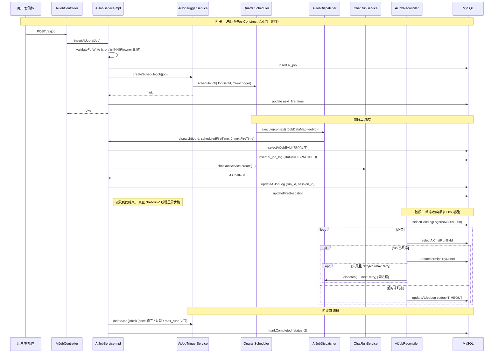

# Job 定时任务模块设计文档

> 源码范围:
> - 后端核心:`ruoyi-system/src/main/java/com/ruoyi/system/ai/job/` 全部 5 个文件
> - HTTP 接口:`ruoyi-admin/src/main/java/com/ruoyi/web/controller/ai/AiJobController.java`、`AiJobLogController.java`
> - 服务层:`ruoyi-system/src/main/java/com/ruoyi/system/service/impl/AiJobServiceImpl.java`
> - 前端:`ruoyi-ui/src/views/ai/job/index.vue`、`log.vue`
> - 旁路对照:`ruoyi-quartz/` 内置 sys_job 调度框架(被复用,被绕过)
> - DDL 注释:`sql/ai_job.sql`(包含与 sys_job 的差异论证)
>
> 文档版本:基于 springboot3 分支(主干)源码梳理

---

## 1. 模块概述

### 1.1 解决什么问题

`ai.job` 包要回答:**"让业务用户、甚至智能体自己,能用自然语言 prompt 注册一条定时任务,让 LLM 在指定时刻自动跑起来。"** 这件事在若依原生 `sys_job` 框架里做不到——`sys_job.invoke_target` 是 Spring bean 反射调用字符串,受 `ScheduleUtils.whiteList` 白名单约束,面向开发者;而本模块的载荷是 prompt,创建者是业务用户或 Agent,执行身份是归属用户本人(`owner_user_id`),权限模型完全错位。

### 1.2 为什么不能复用 `ruoyi-quartz`

`ruoyi-quartz` 提供的是「开发者态」调度能力,而 AI 任务需要的是「用户态」调度能力:

| 维度 | `sys_job`(`ruoyi-quartz`) | `ai_job`(本模块) |
| --- | --- | --- |
| 调度载荷 | `invoke_target` 反射调用 | 自然语言 `prompt` |
| 创建者 | 管理员(超管) | 业务用户、智能体 |
| 鉴权模型 | admin 独占 | `owner_user_id` 归属 |
| 执行内容 | 任意 Java 方法(白名单) | 智能体 + LLM 推理 |
| 失败代价 | 一般 | 烧 token,需 misfire/超时/重试闸口 |
| UI | 若依"定时任务"菜单 | 独立"AI 定时任务"菜单 |

`sql/ai_job.sql` 头部注释给出明确判断:**底层 Quartz Scheduler 复用(阶段零已切 JDBC 集群),但调度对象、权限模型、UI 完全独立**。两个模块在 Scheduler bean 层共享,在 `Job` 实现层分叉——`sys_job` 走 `AbstractQuartzJob` + `QuartzDisallowConcurrentExecution`,`ai_job` 直接实现 `org.quartz.Job`,用自己的 `AiJobDispatcher`。

### 1.3 关键概念

| 概念 | 含义 | 关键类 |
| --- | --- | --- |
| **AiJob** | 一条 AI 定时任务的定义(谁、跑什么、何时跑) | `AiJob`、`AiJobConstants` |
| **AiJobLog** | 一次派发的生命周期记录,初始 `DISPATCHED`,终态由对账器回填 | `AiJobLog`、`AiJobReconciler` |
| **派发(Dispatch)** | Quartz trigger 触发后,Dipatcher 创建 `AiChatRun` 即返回,不等 LLM 跑完 | `AiJobDispatcher` |
| **对账(Reconcile)** | 把长期停留在 `DISPATCHED` 的日志收敛到 `SUCCEEDED/FAILED/TIMEOUT` | `AiJobReconciler` |
| **clientRequestId** | 幂等键 `job-{id}-{ts}-{retry}` 或手动 `manual-{id}-{now}`,防止 cron 重叠触发 | `AiJobDispatcher.buildClientRequestId` |

---

## 2. 关键类与职责

### 2.1 `AiJobConstants` — 常量中心

所有跨类引用的魔法值都集中在这里:`JOB_GROUP="AI_AGENT"`(与 `sys_job` 区分,排查 Quartz 表不混);`JOB_DATA_JOB_ID/JOB_DATA_RETRY_NO` 写进 JobDataMap 的两个键;`STATUS_*`(0 正常 / 1 暂停 / **2 已完成**);`TRIGGER_CRON/TRIGGER_ONCE`;`SESSION_MODE_NEW/FIXED`;`SESSION_TYPE_JOB`(标记会话来自定时任务);`LOG_*` 7 种日志状态:`DISPATCHED/SKIPPED/SUCCEEDED/FAILED/CANCELLED/INTERRUPTED/TIMEOUT`,其中 `DISPATCHED` 是中间态(run 仍在异步执行),其余 6 种为终态;`CONFIG_*` 三个 sys_config 键(单用户上限、cron 最小间隔、日志保留天数)及默认值;`RECONCILE_GRACE_SECONDS=30`(刚派发的先不扫,避免误判超时);`MAX_PROMPT_CHARS=100_000`(与 `ChatRunService.MAX_MESSAGE_CHARS` 对齐)。

### 2.2 `AiJobDispatcher` — Quartz Job 唯一入口

`ruoyi-system/src/main/java/com/ruoyi/system/ai/job/AiJobDispatcher.java:54` 是 Quartz `Job` 接口实现,也是派发的唯一入口。

**三个关键设计决策:**

1. **JobDataMap 只放 `jobId`,不放整个 `AiJob` 实体**(`AiJobDispatcher.java:61-80`)。`ScheduleUtils` 把 `SysJob` 整个塞进 `TASK_PROPERTIES`,导致改了 prompt 不重建 trigger 就会拿旧值执行。本类每次现查一次 `ai_job` 表,代价可接受,语义最直白。

2. **`@DisallowConcurrentExecution` 只防「派发动作」重叠,不防「上一轮还在跑」**(`AiJobDispatcher.java:43-45` 注释明确说明)。本方法只创建 run 就返回,执行在 `ChatRunExecutor` 线程池里异步进行;后者由 `uk_ai_chat_run_active` 唯一索引兜住(fixed 模式)。

3. **Quartz 自己实例化 Job,Spring 依赖通过 `SpringUtils` 拿**(`AiJobDispatcher.java:89`),再 `dispatch()` 回调自身;同时本类注册为 `@Component`,供 Reconciler 重试等同 JVM 内直接调用。

**派发流程**(`AiJobDispatcher.java:107-230`):

1. 查 `AiJob`;非正常态直接 return,不再落日志(用户主动暂停期间 cron 触发的最常见噪声)。
2. 过期检查:任务 `expireTime` 已过 → 写 `SKIPPED` 日志 + `markCompleted` + `triggerService.deleteJob`。
3. 构建幂等键 `clientRequestId`(手动 vs 计划触发不同前缀)。
4. **先写一条 `DISPATCHED` 日志**——这是「派发 = 成功」的强承诺,即便后续 `chatRunService.create` 失败,这条日志也存在,只会由 Reconciler 收敛终态。
5. 智能体不存在/已停用 → `SKIPPED` + 更新 snapshot + 检查完成。
6. 解析会话(fixed 模式校验 owner、新建模式生成 UUID、写 `session_type=job`)。
7. `chatRunService.create(...)` 创建 `AiChatRun`;捕获 `ActiveChatRunException`(上一轮 fixed 会话未结束)→ `SKIPPED`。
8. 把 `runId`/`sessionId` 回写到日志;**仍保持 `DISPATCHED`,终态由 Reconciler 回填**。
9. `updateFireSnapshot` 更新 `prev_fire_time/next_fire_time/last_run_id/last_status/run_count`。
10. `checkCompletion`:once 模式 / 过期 / `max_runs` 达顶 → `markCompleted` + 删 trigger。

### 2.3 `AiJobScheduleSupport` — 调度静态辅助

`AiJobScheduleSupport.java:23` 是一组 `static` 方法,零 Spring 依赖:

- `jobKey/triggerKey`(`:32-43`):按 `AI_JOB_{id}` / `AI_JOB_TRIG_{id}` + `JOB_GROUP` 生成键。
- `isValidCron/nextFireTimes`(`:48-92`):用 Quartz `CronExpression`,支持自定义时区,前端表单预览触发时刻用。
- `validateMinInterval`(`:101-114`):防呆,**强制两次触发间隔 ≥ 配置的 `minIntervalMinutes`**,避免 `* * * * * ?` 这种烧 token 表达式。
- `applyCronMisfirePolicy/applySimpleMisfirePolicy`(`:119-154`):**拒绝 `MISFIRE_IGNORE_MISFIRES`(=1)**,注释直说"避免停机补跑烧 token";只允许 default/do_nothing(放弃执行)与 fire_and_proceed(补跑一次)。
- `resolveTimeZone`(`:159-167`):空时默认 `Asia/Shanghai`。

### 2.4 `AiJobTriggerService` — Quartz trigger 生命周期

`AiJobTriggerService.java:33` 是 `@Service`,持 `org.quartz.Scheduler`:

- `createScheduleJob`(`:45-82`):**幂等"先删后建"**——`checkExists` 后 `deleteJob`,再 `scheduleJob`。注释明确写"避免 JDBC JobStore 下多节点 `ObjectAlreadyExistsException`;绝不调用 `scheduler.clear()`"。建完后若任务是 `STATUS_PAUSE`,立即 `pauseJob`。
- `pauseJob/resumeJob`(`:87-114`):`resumeJob` 在 JobDetail 不存在时会按当前定义重建——应对 JDBC 集群下其他节点 `clear` 后本节点自动恢复。
- `deleteJob`(`:119-126`):用于一次性任务完成 / 过期 / 用户删除。
- `triggerNow`(`:135-148`):手动执行与失败重试共用,**把 `retryNo` 写入 JobDataMap**,让 `clientRequestId` 走 retry 分支。
- `getNextFireTime`(`:153-165`):被 Reconciler 读取。
- `buildCronTrigger/buildOnceTrigger`(`:167-228`):cron 模式额外做"无下次触发时间则不注册"校验(`:189-196`),once 模式拒绝已过期 fireTime(`:215-219`),避免启动重建立刻 misfire 补跑。

### 2.5 `AiJobReconciler` — 终态对账 + 日志清理

`AiJobReconciler.java:41` 是独立基础设施。设计动机写在类注释里:**不在 `ChatRunExecutor.terminalize()` 加分支**——那条链路是所有对话共用的热路径,为定时任务加 `if` 长期背着;**不用 `@Scheduled` 注解**——`@EnableScheduling` 是全局开关,对账是基础设施行为,不该出现在若依定时任务管理界面里让人误停。

启动方式(`AiJobReconciler.java:68-80`):`@PostConstruct` 启 `ScheduledExecutorService` 守护线程,两个 `scheduleWithFixedDelay`:

- `reconcileSafely`:启动 60s 后首次,之后每 60s,扫 `RECONCILE_GRACE_SECONDS=30s` 前的 `DISPATCHED` 日志,逐条收敛终态。
- `cleanLogsSafely`:启动 1h 后首次,之后每 24h,按 `CONFIG_LOG_RETAIN_DAYS`(默认 90)清理过期日志。

**关键纪律**(`:92-94` 注释):`scheduleWithFixedDelay` 里若抛未捕获异常,后续执行会永久停止,对账静默失效,日志永远停在 `DISPATCHED` 没任何报错。所以 `reconcileSafely` / `cleanLogsSafely` 各自 `try-catch` 吞掉一切。

**单条对账**(`reconcileOne`,`:143-220`):

1. `runId` 为空 → 创建 run 时就失败的异常路径,按 `timeout_seconds`(默认 600s)兜底标 `TIMEOUT`。
2. `run` 记录不存在 → 同上超时兜底。
3. `run.status` 未到终态(`ChatRunStatus.isTerminal`)→ 同上超时兜底。
4. 已终态:`updateTerminalByRunId` 写入 `status/errorMessage/durationMs/tokensUsed/result_summary`(摘 500 字)。
5. 回写任务快照:把 `run.status` 写入 `ai_job.last_status`,非空时同步回写 `last_run_id`(`AiJobReconciler.java:186-196`),列表页可直接看到最近一次执行结果。
6. 失败且 `retryNo < max_retry` → **同进程直接调 `aiJobDispatcher.dispatch(...)`,不再走 Quartz trigger**,因为 `once` 模式触发一次后 trigger 已被删除。

### 2.6 `AiJobController` / `AiJobLogController` — HTTP 接口

`AiJobController`(`ruoyi-admin/.../controller/ai/AiJobController.java:35`)类注释明确"AI 模块约定不加 `@PreAuthorize`;owner 隔离在 Service 层落实"。`isAdmin()` 走 `SecurityUtils.isAdmin(getUserId())`,`selectAiJobList` 在 Service 层把 `aiJob.setOwnerUserId(userId)` 强制覆写,非超管只能看自己建的。

`AiJobLogController`(`:28`)结构更轻,只有 list / remove 两个方法(不提供单条详情接口)。`IAiJobLogService` 同样按 owner 隔离。

---

## 3. 核心流程

### 3.1 任务生命周期:从注册到归档



### 3.2 Reconciler 为什么必要

`AiJobDispatcher` 只承诺"创建 run 成功"→ 日志写 `DISPATCHED`,**不等待 LLM 返回**。原因:Quartz worker 线程是宝贵的(默认 30 线程),若同步等模型,几分钟一次的长任务会耗光线程池。所以终态必须异步回填。

**Reconciler 的兜底场景**(`AiJobReconciler.java:143-176`):

| 场景 | 对账动作 |
| --- | --- |
| `run` 已 `SUCCEEDED/FAILED/CANCELLED/INTERRUPTED` | 写入 `run.status/error_message/duration_ms/tokens_used/result_summary`,并回写 `ai_job.last_status/last_run_id`(`:186-196`) |
| `run` 不存在 / `run_id` 为空 / 超过 `timeout_seconds` 未终态 | 标记 `TIMEOUT`(对账兜底) |
| `FAILED` 且 `retryNo < max_retry` | 同进程 `dispatch(... nextRetry)`,trigger 不可依赖(once 已删) |

`@DisallowConcurrentExecution` 只能防"派发动作"重叠,挡不住"上一轮还在跑、这一轮又来了"——后者的 fixed 模式由 `uk_ai_chat_run_active` 唯一索引 + `ActiveChatRunException` 兜住(`AiJobDispatcher.java:217-221`)。

### 3.3 misfire 策略选择(为何禁用 1)

```mermaid
flowchart LR
    A[服务停机/重启<br/>触发堆积] --> B{misfire policy}
    B -- "1 IgnoreMisfires<br/>❌ 拒绝" --> X[补跑所有错过的触发<br/>token 烧穿]
    B -- "2 FireAndProceed<br/>补跑一次" --> Y[按当前时刻补一次<br/>丢弃历史堆积]
    B -- "3 DoNothing<br/>默认/放弃" --> Z[跳过所有堆积<br/>按下一周期继续]
    style X fill:#fee
    style Y fill:#efe
    style Z fill:#efe
```



注释直说:`AiJobScheduleSupport.java:117-119` "拒绝 1(IgnoreMisfires),避免停机补跑烧 token"。Service 层 `validateForWrite` 也再做一次校验(`AiJobServiceImpl.java:336-356`)。

---

## 4. 对外接口

`AiJobController`(`@RequestMapping("/ai/job")`)与 `AiJobLogController`(`@RequestMapping("/ai/jobLog")`),全部走 `BaseController` 鉴权框架:

| 方法 | 路径 | 用途 | 关键参数 |
| --- | --- | --- | --- |
| GET | `/ai/job/list` | 分页列表(非超管仅本人) | `jobName/status/triggerType/source` |
| GET | `/ai/job/{jobId}` | 详情(owner 校验) | — |
| POST | `/ai/job` | 新增并注册调度 | 完整 `AiJob` body |
| PUT | `/ai/job` | 修改并重建调度 | 完整 `AiJob` body(status 在此接口被忽略) |
| PUT | `/ai/job/changeStatus` | 启用/暂停 | `jobId/status` |
| POST | `/ai/job/run/{jobId}` | 立即执行(`scheduledFireTime=null` 走 `manual-` 幂等键) | — |
| DELETE | `/ai/job/{jobIds}` | 批量删除并删 trigger | — |
| GET | `/ai/job/nextFireTimes` | cron 预览(默认 5 次) | `cronExpression/timezone` |
| GET | `/ai/jobLog/list` | 日志分页列表 | `jobId/status` |
| DELETE | `/ai/jobLog/{logIds}` | 删除日志(不改 ai_job) | — |

---

## 5. 依赖关系

```mermaid
flowchart TB
    subgraph ai_job[ai.job 独立体系]
        DSP[AiJobDispatcher]
        TSP[AiJobScheduleSupport]
        TRS[AiJobTriggerService]
        RCN[AiJobReconciler]
        CST[AiJobConstants]
    end

    subgraph svc[Service 层]
        SVC[AiJobServiceImpl<br/>@DependsOn sysJobServiceImpl]
    end

    subgraph ctrl[Controller 层]
        JCT[AiJobController]
        LCT[AiJobLogController]
    end

    subgraph run[ai.run 执行引擎]
        CRS[ChatRunService]
        CRE[ChatRunExecutor<br/>chat-run-* 线程池]
    end

    subgraph quartz[ruoyi-quartz 复用]
        SCH[org.quartz.Scheduler<br/>JDBC JobStore 集群]
        ABS[AbstractQuartzJob<br/>sys_job 专用]
    end

    subgraph db[MySQL]
        TJ[ai_job]
        TL[ai_job_log]
        TR[ai_chat_run]
        TS[ai_chat_session]
    end

    JCT --> SVC
    LCT --> SVC
    SVC --> TRS
    SVC --> DSP
    TRS --> SCH
    SCH --> DSP
    DSP --> CRS
    CRS --> CRE
    DSP --> TL
    RCN --> TL
    RCN --> TR
    RCN --> DSP
    SVC --> TJ
    DSP --> TS
    RCN --> CST
    DSP --> CST
    TRS --> CST
    SVC -.启动顺序.-> ABS
```

**与 `ruoyi-quartz` 的关系**:共享同一个 `Scheduler` bean(JDBC JobStore 集群),但**两套 Job 互不干扰**——`sys_job` 走 `AbstractQuartzJob` 抽象层,`ai_job` 直接实现 `org.quartz.Job` 接口,`JobKey` 用 `AI_JOB_{id}` + group `AI_AGENT` 与 sys_job 隔开。`AiJobServiceImpl` 的 `@DependsOn("sysJobServiceImpl")`(`AiJobServiceImpl.java:39`)保证本类在 sys_job 完成 `scheduler.clear()` 与重建后再全量注册 AI 任务,避免被静默清空。

**与 `ai.run` 的关系**:Dispatcher 是"创建 run 的人",Executor 是"跑 run 的人"。`chatRunService.create(...)` 返回 `AiChatRun`,真正的 LLM 调用在 `chat-run-*` 线程池里跑,事件经 Redis 投递(`ai.run.ChatRunEventBroker`),Dispatcher 早已返回。Reconciler 通过查 `ai_chat_run` 表的回写结果(由 Executor 的心跳/终态机制保证最终一致性)来收敛日志。

---

## 6. 典型使用场景

### 6.1 智能体自建:用户说"每天早上 9 点给我发个早报"

智能体在对话中识别意图后,调用 Job 创建接口(以用户本人 owner):

```json
POST /ai/job
{
  "jobName": "每日早报",
  "agentId": 7,
  "prompt": "汇总昨晚到今早的科技新闻,300 字以内",
  "triggerType": "cron",
  "cronExpression": "0 0 9 * * ?",
  "timezone": "Asia/Shanghai",
  "sessionMode": "new",
  "misfirePolicy": "3",
  "source": "agent",
  "sourceRunId": "cr_20240801_xxx",
  "maxRetry": 1
}
```

`AiJobServiceImpl.validateForWrite` 校验:智能体启用、prompt ≤ 100k 字符、cron 最小间隔 ≥ 5min、owner 配额 < 20。`@PostConstruct init()` 全量重建 trigger 是 Agent 跨进程重启后的自愈路径。

### 6.2 一次性任务:会议室预订提醒

`triggerType=once`,`fireTime=2024-08-02 14:55:00`,`sessionMode=fixed`,`sessionId` 复用既有会议会话。`buildOnceTrigger`(`AiJobTriggerService.java:208-228`)在启动重建时若 `fireTime` 已过则返回 `null` 不注册,**避免立刻 misfire 补跑**。`max_runs=1` + `expire_time=fireTime+1h` 双闸,执行后自动归档为 `STATUS_COMPLETED`。

### 6.3 失败重试:定时巡检 Agent 跑长任务超时

业务配置 `timeout_seconds=300, max_retry=2`。某次 LLM 调用卡住(网络抖动、模型限流),5 分钟后 `ai_chat_run` 仍未到终态。Reconciler(`AiJobReconciler.java:171-176`)走超时分支:

1. 标记当前 `AiJobLog` 为 `TIMEOUT`(`markTimeout`,`:275-294`)。
2. `ai_chat_run` 终态若最终是 `FAILED`,且 `retryNo=0 < max_retry=2` → 同进程直接 `dispatch(jobId, scheduled, 1, next)`(`:199-218`)。
3. 第二条 `DISPATCHED` 日志,`retryNo=1`,`clientRequestId=job-{id}-{ts}-1` 与首次不同,**幂等键不冲突**。
4. 若连续 3 次都失败,不再重试,`ai_job.last_status=FAILED` 留在列表里供用户排查。
