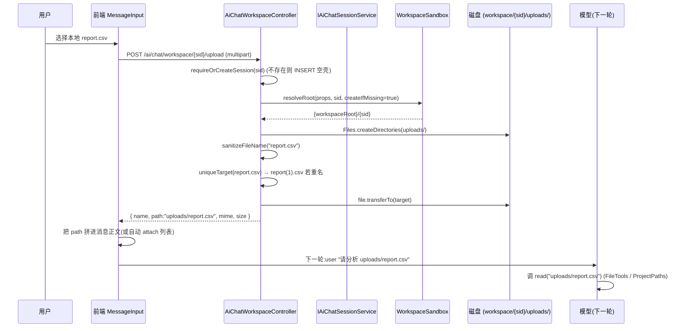
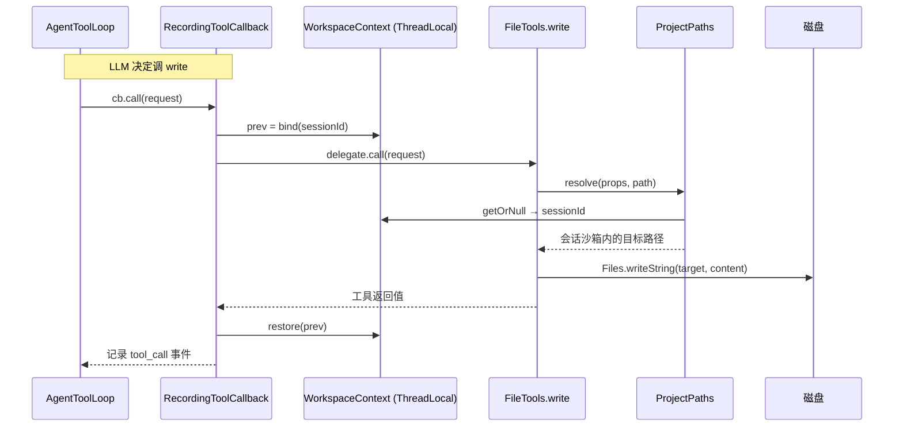

# Workspace 工作空间模块设计文档

> 范围:`AiChatWorkspaceController`(HTTP 沙箱 API)+ `WorkspaceSandbox` / `WorkspaceContext` / `ProjectPaths` / `AiToolProperties`;生命周期在 `AiChatSessionServiceImpl#cleanupSessionArtifacts` 与 `ChatRunExecutor.ensureSessionArtifacts`。前端 `WorkspacePanel.vue` + `useWorkspace.js`。配置 `ruoyi.ai.tool.*`。
> **没有** `AiChatController.ensureSession`。标题补全在 `ChatRunService.ensureOwnedSession`。

---

## 1. 模块概述

Workspace 是平台为普通会话或项目分配的 **私有磁盘沙箱**。项目不是会话标签，而是文件工作空间边界：项目内所有会话共享文件，消息、上下文和运行记录仍按会话隔离。

```
{workspaceRoot}/{workspaceKey}/       # 普通会话=sessionId；项目会话=project-{projectId}
├── uploads/                  ← 用户经 HTTP 上传（界面显示“个人文件上传”）
│   └── input.csv
├── outputs/                  ← AI/渠道工具产出（界面显示“AI 生成文件”）
│   └── report.docx
├── notes.md                  ← write / bash 的相对路径也落到同一工作空间
└── ...
```

两条路径不要混:

| 路径 | 谁在用 | 根目录 |
|------|--------|--------|
| HTTP `/ai/chat/workspace/**` | 用户上传 / 预览 / 打包 / 清空 | 永远 `WorkspaceSandbox.resolveRoot` |
| 模型工具 `read`/`write`/`edit`/`grep`/`find`/`ls`/`bash` | `FileTools` + `ShellTool` | `ProjectPaths`:绑了 `WorkspaceContext` 时进当前项目或普通会话的沙箱(产出才能出现在侧栏);未绑定(单测)才回退 `ruoyi.ai.tool.cwd` 或进程目录。**绝对路径不进沙箱** |

工具名就是这些短名,没有 `readFile` / `runShell` / `listDir` / 一套 shell session 工具。`bash` 实现 `ToolOutcomeAware`,非 0 退出记失败。

1. **用户喂文件**:`MessageInput` → `uploadWorkspaceFile` → `uploads/`,正文带上返回的 `path`。
2. **模型读写**:相对路径经 `ProjectPaths` 落到当前工作空间；同一项目的其他会话可立即看到这些文件。
3. **可视化**:`WorkspacePanel` 拉 `/tree` `/file` `/download-zip`;`useWorkspace.js` 的 `WRITE_TOOLS = ['write','edit','bash']`,面板打开时工具结束后防抖 400ms 刷新。会话删除走 `cleanupSessionArtifacts`。

> 为什么"只读视图 + uploads 写口子":controller 注释(`AiChatWorkspaceController.java:46-49`)说得很清楚——AI 写的文件如果允许用户去改,模型并不知道,下次 `readFile` 读到的就和对话上下文对不上了;只有"用户显式上传 + 必伴随一条把清单告知模型的消息"这个口子能维持一致性。

---

## 2. 关键类与职责

### 2.1 `AiChatWorkspaceController` — HTTP 入口

`ruoyi-admin/.../controller/ai/AiChatWorkspaceController.java`,前缀 `/ai/chat/workspace`,6 个端点;继承 `BaseController` 拿 `getUserId()` / `getUsername()`。

| 关键字段 / 常量 | 位置 | 作用 |
|---|---|---|
| `aiToolProperties` | `:85` | 沙箱根 + 是否按会话隔离(`workspace-per-session`) |
| `aiChatSessionService` / `aiChatSessionMapper` | `:88`、`:93` | 会话校验、读、SELECT FOR UPDATE(clear 用) |
| `aiChatRunMapper` | `:91` | clear 前查 `selectActiveBySession` 防"边跑边删" |
| `MAX_DEPTH` / `MAX_NODES` | `:61-63` | tree 递归硬上限(5 层 / 500 节点),防大目录打爆响应 |
| `MAX_FILE_BYTES` | `:65` | 单文件预览 200KB |
| `MAX_UPLOAD_BYTES` | `:75` | 单文件上传 10MB(**与 `application.yml` 的 `spring.servlet.multipart.max-file-size` 必须同步**,见注释 `:70-73`) |
| `MAX_NAME_LEN` | `:77` | 文件名 80 字符(去重后缀之前) |
| `MAX_ZIP_ENTRIES` / `MAX_ZIP_BYTES` | `:80-82` | 打包下载 2000 条 / 200MB 硬上限 |
| `UPLOAD_DIR = "uploads"` | `:68` | 用户上传专属子目录,与 AI 产出分开放 |
| `Node`(内部类) | `:561-572` | tree 返回结构:`name/path/type/size/mtime/children` |

**三类权限校验私有方法**:
- `requireOwnedSession`(`:471-485`):只读端点(tree / file / download / download-zip)用,会话必须存在 + 归属正确,管理员放行。
- `requireOwnedSessionForUpdate`(`:488-502`):clear 专用,**`SELECT ... FOR UPDATE`**(`:490`)与运行创建的会话主行锁同一条,与 `AiChatRun` 形成互斥,防止"清空时正在启动 Agent"。
- `requireOrCreateSession`(`:442-469`):upload 专用,会话不存在时直接 INSERT 空壳(标题留空、状态 `0`、`totalTokens=0`),等首条消息来时由 `ChatRunService.ensureOwnedSession`(`ai/run/ChatRunService.java:235-...`,以 `truncateTitle(message, 20)` 取前 20 字作标题)补上——**这里必须先过 `WorkspaceSandbox.isValidSessionId`**(`:455`),否则等于让客户端往库里写任意主键。

### 2.2 `WorkspaceSandbox` — 路径解析 + 防穿越

`ruoyi-system/.../tool/WorkspaceSandbox.java`,工具类(`final` + 私有构造)。把"sessionId → 绝对路径"这一步从 controller / 各工具里抽出来,所有读写都走同一条防线。

| 方法 | 位置 | 作用 |
|---|---|---|
| `isValidSessionId` | `:35-38` | 校验 `^[A-Za-z0-9_-]{1,64}$`,落库前必走 |
| `resolveRoot(props, sessionId, createIfMissing)` | `:70-93` | 核心:取 `{base}/{sessionId}`;`workspace-per-session=false` 时直接返回 base;sessionId 非法或越界抛 `SecurityException` |
| `resolveBaseRoot` | `:109-131` | 取 `ruoyi.ai.tool.workspace-root`;空时回退 `{ruoyi.profile}/ai-workspace` |
| `resolveSafe(root, relative)` | `:141-159` | 把前端传的相对路径拼到 root 后 `.normalize()`,若 `!target.startsWith(base)` 抛 `SecurityException`;`^[A-Za-z]:` 形态直接拒(防 Windows 绝对路径);`/` 与 `\` 都视为分隔符 |

> 设计要点:`createIfMissing` 是显式参数(`:67-69` 注释),只读端点(tree / file)必须传 `false`——否则"打开一次面板"就会给从没产生过文件的会话凭空建出空工作区。

### 2.3 `WorkspaceContext` — 分离会话身份与工作空间身份

`ruoyi-system/.../tool/WorkspaceContext.java`,工具类。

```java
public static String bind(String sessionId)                 // 绑定真实会话身份
public static String bindWorkspaceKey(String workspaceKey)  // 绑定文件工作空间身份
public static String getWorkspaceKeyOrSessionId()           // 优先取工作空间身份
```

`WorkspaceScopeService` 根据会话的 `project_id` 产生工作空间 key：项目会话为 `project-{projectId}`，普通会话为原 `sessionId`。`RecordingToolCallback` 在 **同方法同线程** 内同时绑定真实会话身份和工作空间身份，再于 `finally` 恢复。这样调度、审计、消息等仍使用真实 sessionId，而 `FileTools` / `ShellTool` 经 `ProjectPaths` 进入共享项目目录。

> 用 `restore` 而不是 `clear`(`:12-13` 注释):子 agent 的工具可能嵌套在父调用的同一线程上,保存/恢复上一层比直接清空更安全。

### 2.4 `AiToolProperties` — 沙箱配置

`ruoyi-system/.../tool/AiToolProperties.java`,`@ConfigurationProperties(prefix = "ruoyi.ai.tool")`。

| 字段 | 默认 | 作用 |
|---|---|---|
| `workspaceRoot` | `""` | 沙箱根绝对路径;空时回退 `{ruoyi.profile}/ai-workspace` |
| `workspacePerSession` | `true` | `true` 按 workspace key 隔离(普通会话=sessionId，项目会话=projectId);`false` 全局共用 |
| `shellEnabled` | `true` | `bash` 总开关 |
| `cwd` | 空 | 未绑会话时 `ProjectPaths` 的回退工作目录;空=进程 `user.dir` |
| `shellTimeoutMs` | `30000` | 单命令超时 |
| `mcpRequestTimeoutMs` / `mcpInitTimeoutMs` / `mcpKeepaliveSeconds` / `mcpAutoReconnect` | 60s / 30s / 30s / true | MCP 客户端调优(与本文无关,列在表里仅作区分) |

> **`workspaceRoot` 留空是大坑**:`application-ai.yml:43-47` 注释明确写——留空会回退到 `{ruoyi.profile}/ai-workspace`,而 `ruoyi.profile` 被 `SecurityConfig` 的 `/profile/**` 静态映射为 **GET 免鉴权**,AI 写出的文件就成匿名可下载了。生产必须显式配置,且多实例必须用共享持久卷。

### 2.5 `ContextFileStore` — 平行目录,别混

`ruoyi-system/.../ai/ContextFileStore.java`,这是 **另一套** 落盘:`{contextPath}/{sessionId}/{tools|thinking}/*.txt`,存超大工具结果与思考正文的外置全文,由 `ai_chat_message.tool_result_path` 引用。它 **不是** workspace,事实源仍然是 `ai_chat_message` / `ai_chat_run`。(该目录下曾经还有一份 `{agentId}.md` 人读快照,因无任何消费方已删除。)

`ai.chat.context-path: ./agent-java/ai/sessions`(`application-ai.yml:69`)和 `ruoyi.ai.tool.workspace-root: ./agent-java/ai/workspace`(`application-ai.yml:47`)是两个独立根目录,职责切分:

- `workspace/`:项目或普通会话沙箱。HTTP 上传永远在这里；write/bash 相对路径也在当前工作空间。
- `sessions/`:大字段外置(`tools/` `thinking/`),不是模型工作目录,删会话时一并清。

> 大字段溢出(`saveToolResult` / `saveThinking`,`ContextFileStore.java:275-291`)也落 `sessions/{sessionId}/tools/` 与 `thinking/`,与 workspace 无关,容易混淆,这里点出来。

### 2.6 `AgentContextFactory` — 间接消费者

`AgentContextFactory` 本身 **不直接** 读 workspace。`wrapRecording` 把工具包成 `RecordingToolCallback`,在 `record` 里 `WorkspaceContext.bind(sessionId)`。`FileTools`/`ShellTool` 经 `ProjectPaths` 读这个绑定,签名里没有 sessionId。

---

## 3. 核心流程

### 3.1 文件上传:用户把本地文件喂给模型



关键点:
- `requireOrCreateSession` 注释(`AiChatWorkspaceController.java:224-227`):"新开对话 → 先传个文件 → 再提问"是自然用法,不该逼用户先发句话再建会话。
- `sanitizeFileName`(`:264-290`):剥路径成分 + 过滤控制字符 + 拒纯 `..` / 纯点文件名 + 截断到 80 字符保留扩展名。**`getOriginalFilename()` 不可信,可能是 `../../etc/passwd` 或带 NUL 的构造串**(`:262` 注释)。
- `uniqueTarget`(`:293-317`):同名自动加 `(1)`/`(2)` 序号,**永不覆盖**,保证"用户上传过的文件,模型读到的一定是这一版"。

### 3.2 工具读写:AI 自身在沙箱里写报告



要点:`bind` / `restore` 同方法同线程。相对路径绑了会话就进沙箱;绝对路径按 `ProjectPaths` 不进沙箱(与 HTTP 上传那条 `resolveSafe` 防线不是同一条)。

### 3.3 会话生命周期:工作区何时建、何时删

```mermaid
flowchart TD
    A[新会话] -->|ChatRunExecutor.ensureSessionArtifacts| B[WorkspaceSandbox.resolveRoot<br/>幂等建目录]
    A2[新会话通过 /upload] -->|requireOrCreateSession| C[INSERT ai_chat_session 空壳<br/>resolveRoot createIfMissing=true]
    C -->|首条消息来时| B
    B --> D[workspace root = workspaceRoot slash sessionId]
    D --> E{用户主动 clear}
    E -->|DELETE /ai/chat/workspace/{sid}| F[SELECT FOR UPDATE<br/>查无 active run<br/>Files.walk + deleteIfExists<br/>Files.createDirectories 重建]
    D --> G{会话被删除}
    G -->|AiChatSessionServiceImpl#deleteAiChatSessionByIds| H[scheduleArtifactCleanup<br/>事务提交后 afterCommit]
    H --> I[cleanupSessionArtifacts]
    I --> J[deleteWorkspaceDir<br/>仅 workspacePerSession=true 时执行]
    I --> K[contextFileStore.deleteSession<br/>清 sessions 目录]
    I --> L[toolBudgetRegistry.clearSession]
```

关键点(`AiChatSessionServiceImpl.java:160-184` + `:228-258`):
- `scheduleArtifactCleanup` 用 **`TransactionSynchronization.afterCommit`**:DB 回滚后文件已删就糟了,所以必须等事务提交再清磁盘。
- `deleteWorkspaceDir` 在 `workspace-per-session=false` 时直接跳过——全局共用时删了就把别人一起干掉了。
- 清磁盘任一步失败只 `log.warn`(**不**回滚已提交的 DB 删除),会话元数据先保证删干净。

### 3.4 项目内共享、项目间隔离

`WorkspaceScopeService` 是唯一的作用域映射入口：

1. 普通会话 → `{workspaceRoot}/{sessionId}`。
2. 项目会话 → `{workspaceRoot}/project-{projectId}`，同一项目的所有会话共享这棵目录树。
3. 不同项目使用不同 project key；解析时同时校验会话归属、项目归属和当前用户，不能通过伪造 `projectId` 跨项目访问。
4. 删除项目内某一个会话，只清理该会话的消息、上下文和运行数据，不删除共享项目目录；只有删除项目时才在事务提交后清理项目工作区。
5. 清空或删除项目文件前，会检查项目下所有会话是否存在 active run，避免另一个会话正执行工具时文件被移除。
6. 首次访问项目工作区时会无损归并改造前的 `{workspaceRoot}/{sessionId}`：不覆盖同名文件；冲突版本放入 `_legacy/{sessionId}/`；原会话目录仍保留。

---

## 4. 对外接口

`AiChatWorkspaceController` 全 6 端点,前缀 `/ai/chat/workspace`,全部要求登录(Spring Security 默认);`requireOwnedSession*` 在内部再做一次归属校验,管理员放行。

| 方法 | 路径 | 关键行 | 入参 | 返回 | 行为要点 |
|---|---|---|---|---|---|
| `GET` | `/{sessionId}/tree` | `:102-123` | `sessionId` | `{ root, truncated, nodes: Node[] }` | 只读;`createIfMissing=false`;深度 5、节点 500 硬截断;`truncated` 标是否被截 |
| `GET` | `/{sessionId}/file?path=` | `:131-166` | `sessionId`, `path` | `{ path, size, binary, tooLarge, content }` | 文本预览 200KB 上限,二进制前 8KB 含 NUL 即判 binary |
| `GET` | `/{sessionId}/download?path=` | `:342-367` | `sessionId`, `path` | `application/octet-stream` 流 | 原样下载,不限类型不限大小;`FileUtils.setAttachmentResponseHeader` 设中文文件名 |
| `GET` | `/{sessionId}/download-zip?path=` | `:378-426` | `sessionId`, 可选 `path` | `application/zip` 流 | `path` 空 → 整个会话;非空 → 该目录;**跳过 symlink**(防绕过沙箱);2000 条 / 200MB 上限;流式写不积内存 |
| `POST` | `/{sessionId}/upload` (multipart) | `:220-257` | `sessionId`, `file` | `{ name, path, mime, size }` | 只新增不覆盖;10MB 上限;MIME 优先按扩展名探,退化用客户端声明;**会话不存在时 INSERT 空壳** |
| `DELETE` | `/{sessionId}` (`@Transactional`) | `:172-208` | `sessionId` | `AjaxResult.success("工作区已清空")` | `SELECT FOR UPDATE`;有 active run 时 `ServiceException` 拒绝;二次校验 `root.startsWith(base) && !root.equals(base)` 防误伤 base;清完 `createDirectories` 重建空目录(幂等) |

前端 `WorkspacePanel.vue:104` 调用的 `proxy.$download.zip(url, name)`(`:188`、`:195`、`:204`)统一走 axios + `responseType: blob`,好处是能区分"真下载"与"服务端返回的 JSON 错误"(文件流拿不到 token,`window.open` 也无法区分这两种情况,见 `:182-185` 注释)。

---

## 5. 依赖关系

```
                  ┌──────────────────────────────────────────┐
                  │      AiChatWorkspaceController (HTTP)    │
                  │   /tree /file /upload /download /zip     │
                  │   /{sid} (clear)                          │
                  └──────────┬──────────────┬─────────────────┘
                             │              │
              read/write     │              │   归属校验
                             ▼              ▼
            ┌──────────────────────┐  ┌─────────────────────┐
            │   WorkspaceSandbox   │  │ IAiChatSessionService│
            │  路径解析 + 防御     │  │ + AiChatRunMapper    │
            │  isValidSessionId    │  │ (SELECT FOR UPDATE)  │
            └──────────┬───────────┘  └─────────────────────┘
                       │
                       ▼
            ┌──────────────────────┐
            │   AiToolProperties   │  (ruoyi.ai.tool.*)
            │ workspaceRoot        │
            │ workspacePerSession  │
            └──────────────────────┘

         (AI 侧)                             (生命周期)
┌──────────────────────────┐    ┌──────────────────────────────────┐
│ AgentContextFactory      │    │ AiChatSessionServiceImpl         │
│   ↓ wrapRecording        │    │   deleteWorkspaceDir             │
│ RecordingToolCallback    │    │   (afterCommit, 仅 per-session)  │
│   bind(sessionId) ──┐    │    └──────────────┬───────────────────┘
│   delegate.call()   │    │                   │
│   restore(prev)     │    │                   │
└─────────────────────┼────┘                   │
                      ▼                        │
              ┌────────────────────┐           │
              │ WorkspaceContext   │           │
              │ (ThreadLocal)      │           │
              └─────────┬──────────┘           │
                        ▼                      ▼
                ┌────────────────────────┐  ┌──────────────────┐
                │ FileTools / ShellTool  │  │ 磁盘             │
                │  经 ProjectPaths       │  │  workspace/      │
                │  (绑会话→沙箱)         │──▶  sessions/      │
                └────────────────────────┘  │  (平行,不动)     │
                                            └──────────────────┘

(平行的"会话上下文文件")
ContextFileStore  ──→  {contextPath}/{sessionId}/{tools|thinking}/*.txt
                       (大字段外置,由 tool_result_path 引用)
```

要点:
- **不依赖** `ContextFileStore` / `AgentContextFactory` / `ChatTurnRunner`——它们是兄弟模块,通过"同一个 sessionId"形成隐式协作,没有任何 Java 类型耦合。
- **依赖** `WorkspaceSandbox`(路径解析)和 `AiToolProperties`(配置)。
- **被** `AiChatSessionServiceImpl` 间接使用(`deleteWorkspaceDir`),这是唯一反向耦合。
- **被** `ChatRunExecutor.ensureSessionArtifacts`(`ai/run/ChatRunExecutor.java:453`)在首条消息来时幂等建工作区目录,作为兜底(虽然 upload 已经会建,这里再保一道);真正的会话标题补全发生在 `ChatRunService.ensureOwnedSession`。
- 前端 `WorkspacePanel` 切换会话即拉目录;`useWorkspace.js` 在 `write` / `edit` / `bash` 返回后、且面板打开时,防抖 400ms 调 `workspaceRef.refresh()`。

---

## 6. 典型使用场景

### 场景一:数据分析师上传 CSV,让 AI 出报告

1. 用户在新建会话(尚未发任何消息)直接点 `📎` 上传 `Q3-sales.csv`。
2. 前端 `uploadWorkspaceFile(sessionId, file)`(`api/ai/workspace.js:24`)→ `POST /ai/chat/workspace/{sid}/upload`。
3. `requireOrCreateSession` 在 `ai_chat_session` 插一行(标题 `""`、`status=0`、`userId=当前用户`);`WorkspaceSandbox.resolveRoot(..., createIfMissing=true)` 建 `workspace/{sid}/uploads/`;`sanitizeFileName` + `uniqueTarget` 决定落点。
4. 返回 `{ path: "uploads/Q3-sales.csv", size, mime }`,前端把它拼成 `已上传文件:\n- uploads/Q3-sales.csv` 附在消息正文里。
5. 用户发问:"分析 Q3 各区域销售额";LLM 调 `read("uploads/Q3-sales.csv")` → 数据进 context → 调 `write("Q3-report.md", ...)` 把报告落盘(相对路径经 `ProjectPaths` 进同一会话沙箱)。
6. 用户点侧栏 `Q3-report.md` 预览 → `GET /ai/chat/workspace/{sid}/file?path=Q3-report.md` → 命中 `MarkdownContent`(`WorkspacePanel.vue:93`)渲染。
7. 用户点 `↓` 整工作区打包 → `GET /ai/chat/workspace/{sid}/download-zip` → 流式 zip 走响应。

### 场景二:AI 写脚本并执行

1. 同一会话继续,LLM 调 `write` 写 `scripts/clean.py`。绑了会话时 `ProjectPaths` 落到 `workspace/{sid}/`。
2. 接着 `bash` 跑 `python scripts/clean.py`(cwd 同样是会话沙箱,除非传了绝对 workdir)。退出码非 0 时 `ToolOutcomeAware` 把 `ok=false`。
3. 面板打开时 `WRITE_TOOLS` 防抖刷新侧栏。

### 场景三:会话结束清理

1. 用户在会话列表删会话 → `DELETE /ai/chat/session/{sid}` → `AiChatSessionServiceImpl#deleteAiChatSessionById`(`:115-120`)。
2. 事务内 `purgeDb` 删 `ai_chat_message / ai_chat_run / ai_llm_call / ai_chat_agents`;事务提交后 `afterCommit` 触发 `cleanupSessionArtifacts`(`:163-184`)。
3. 依次:① `contextFileStore.deleteSession` 删 `sessions/{sid}/`;② `toolBudgetRegistry.clearSession`;③ `deleteWorkspaceDir`(`:232-258`)删 `workspace/{sid}/`,**但 `workspace-per-session=false` 时跳过**。
4. 任意一步失败仅 `log.warn`,不回滚 DB(已提交,回滚也没意义)——磁盘残留由下次会话清理或人工巡检处理。

---

## 7. 写在最后:几个容易踩的坑

- **改 `MAX_UPLOAD_BYTES` 一定同步 `spring.servlet.multipart.max-file-size`**(`AiChatWorkspaceController.java:70-73` 注释),否则用户看到的是不友好的 `MaxUploadSizeExceededException` 框架异常。
- **`workspace-root` 绝不能留空**(`application-ai.yml:43-47` 注释),否则会落到 `/profile/ai-workspace/` 变成 GET 免鉴权静态资源。
- **多实例生产**必须用共享持久卷(workspace 与 sessions 同理,`application-ai.yml:43`、`:68` 注释)。
- **只读端点必须传 `createIfMissing=false`**(`WorkspaceSandbox.java:67-69`),否则一次 GET tree 就会给空会话建出空目录。
- **clear 之前会话内不能有 active run**(`AiChatWorkspaceController.java:177-181`),所以 `SELECT FOR UPDATE` 锁 + run 状态双重防并发,二者必须配对看才能理解为什么先锁会话主行。
