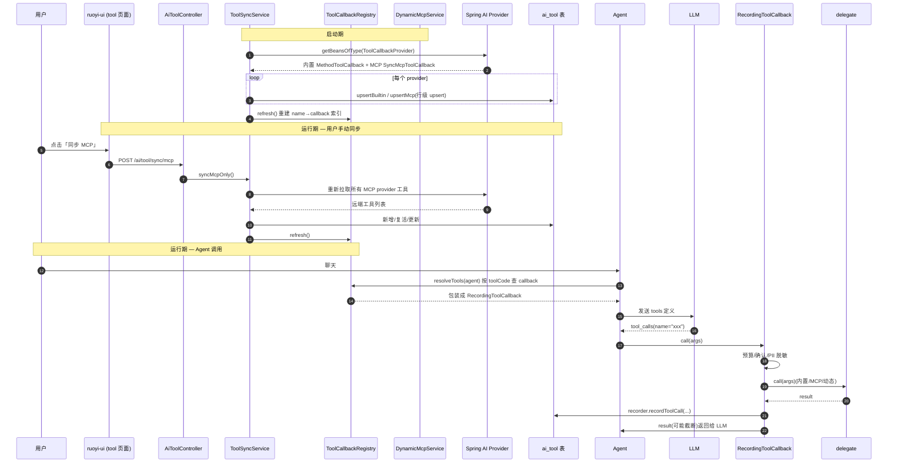
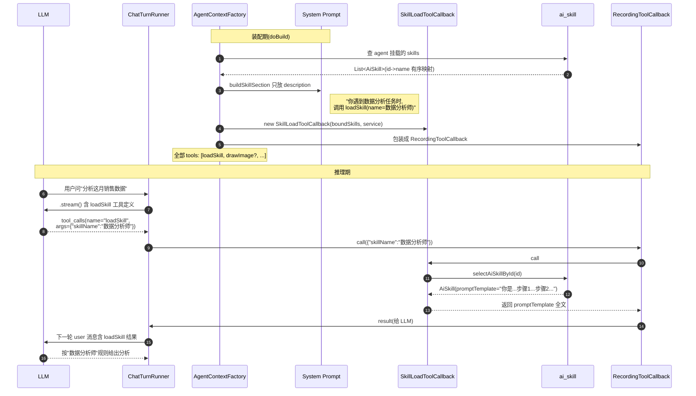
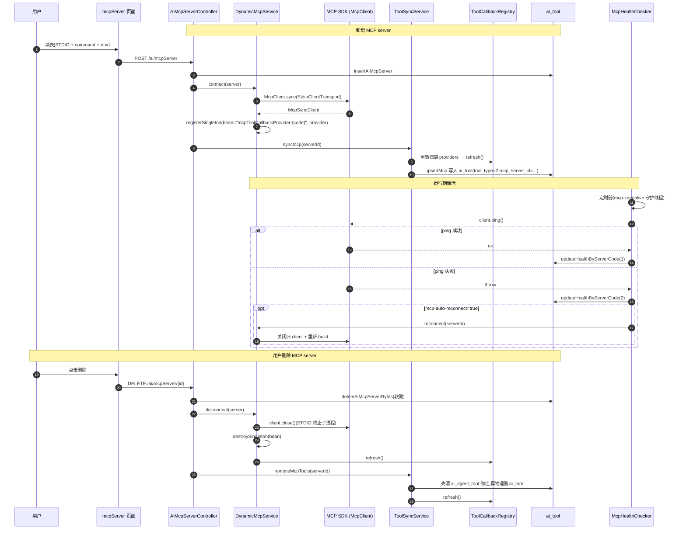

# 工具生态模块 - Tool / MCP / Skill 设计文档

> 源码范围:
> - 后端控制器:`ruoyi-admin/src/main/java/com/ruoyi/web/controller/ai/AiToolController.java`、`AiMcpServerController.java`、`AiSkillController.java`
> - 后端核心:`ruoyi-system/src/main/java/com/ruoyi/system/ai/ToolCall.java` 与 `com/ruoyi/system/ai/agent/{ImageGenerationToolCallback,SkillLoadToolCallback,SubAgentToolCallback}.java`
> - 周边依赖(同模块):`ruoyi-system/src/main/java/com/ruoyi/system/tool/{ToolSyncService,DynamicMcpService,RecordingToolCallback,ToolCallbackRegistry,McpHealthChecker,AiJobTools}.java`、`tool/channel/`(渠道工具,见 `渠道工具与浏览器插件.md`)、`ai/agent/AgentContextFactory.java`
> - 前端:`ruoyi-ui/src/views/ai/{tool,mcpServer,skill}/index.vue`
> 文档版本:基于 springboot3 分支(主干)源码梳理

## 1. 模块概述

`tool` / `mcpServer` / `skill` 三个子概念在系统中是**互相独立但协同工作**的扩展点,共同构成 Agent 的"能力补给"。它们在装配期被 `AgentContextFactory.doBuild()` 收集到 `tools` 列表里(参见 `智能体核心模块.md` §2.2),对模型而言都是统一的 `ToolCallback` 接口——LLM 看到 `tools` 描述、按需发起 `tool_calls`、系统按 `name` 路由到具体实现。

### 1.1 三个概念的定位

| 概念 | 是什么 | 解决的痛点 | 在 Agent 中的角色 |
| --- | --- | --- | --- |
| **Tool(工具)** | 任何实现 `org.springframework.ai.tool.ToolCallback` 的对象 | LLM 只能输出文本,无法实际操作 | Agent 拿到"能做什么"的清单;`tool_calls` 路由到这里执行 |
| **MCP Server(MCP 服务)** | 通过 Model Context Protocol 暴露的远端工具源(STDIO 子进程 / SSE / HTTP 三种传输) | 本地能写的工具有限;社区/外部已有大量 MCP server 可直接接入 | Agent 通过 MCP 协议调用远端能力,本机只做"代理+记账" |
| **Skill(技能)** | 一段写好的提示词模板(`ai_skill.prompt_template`),带 `{var}` 占位符,以及"何时用"的一句话描述 | 角色设定/业务流程要拼进 system prompt,长提示词常驻上下文严重浪费 token | Agent 看到技能列表(只放 `description`),需要时再 `loadSkill` 取全文——**渐进披露** |

### 1.2 三者关系(运行时视角)

```
[系统启动] ToolSyncApplicationRunner
        │
        ├── 1) 扫描 @Tool 注解 → 写入 ai_tool(tool_type=1)
        │
        └── 2) DynamicMcpService.connectAll() → 启用的 MCP 逐个建连
                │
                └── ToolSyncService.syncAll() → 拉取每个 MCP server 的工具列表
                        └── 写入 ai_tool(tool_type=2),反查 serverCode→mcpServerId

[用户请求]  AgentContextFactory.build(agentId, sessionId)
        │
        ├── resolveTools(agent)            ←  从 ai_tool.toolIds 取普通工具
        │      └── 调 MCP 时走 Spring AI 的 SyncMcpToolCallback
        ├── resolveSubAgents(agent)        ←  把每个 child agent 包成 SubAgentToolCallback
        ├── resolveScreenshotTool          ←  客户端已声明 screenshotTab 时不挂 captureScreenshot
        ├── resolveImageTool(agent)        ←  绑了 imageModelCode 就装配 drawImage
        ├── resolveVideoTool(agent)        ←  绑了 videoModelCode 就装配 drawVideo
        ├── resolveSpeechTool(agent)       ←  绑了 ttsModelCode 就装配 speak
        ├── resolveSkillTool(agent)        ←  挂了 skills 就装配 loadSkill
        ├── resolveKnowledgeTool(session)  ←  会话选了知识库才挂 searchKnowledge(`ai_chat_session_kb`)
        └── resolveChannelTools(session)   ←  会话行有 client_tools 且顶层 agent 才挂(末尾追加)
```

> 关键抽象:**对 LLM 而言,普通工具 / MCP 工具 / 子 agent / 动态工具(生图/技能/KB)都是同质的 `ToolCallback`**。区别在于装配来源与执行路径。Spring AI 的 `toolCallbacks` 参数接受 `ToolCallback[]`,Llm 一次 `tool_calls` 只能选一个;系统按 `name` 路由,跨"种类"完全透明。

> **第四形态:渠道工具(执行体在客户端)**。浏览器插件把工具定义声明给服务端,模型发起调用时服务端不执行,而是经事件总线推回浏览器执行、挂起等结果回传。它不进 `ai_tool` 表、不走 `ToolCallbackRegistry`,但同样包 `RecordingToolCallback`(`toolSource="channel"`)。声明/装配/往返/补发/图片回传的完整机制见 [渠道工具与浏览器插件](渠道工具与浏览器插件.md)。

### 1.3 模块边界与"不做什么"

- **Tool 不可手动 CRUD**:`AiToolController` 没有 `add`/`edit`/`remove` 接口(`AiToolController.java:25-28` 注释明示),工具必须由系统自动同步(启动同步内置、连接后同步 MCP)。用户可启停/查看。
- **MCP Server 是"通道"、Tool 是"对外能力"**:MCP server 决定怎么连,Tool 决定能调什么。删除 MCP server 时要顺带清掉它名下的 `ai_tool` 记录(见 `AiMcpServerController.remove` 与 `ToolSyncService.removeMcpTools`)。
- **Skill 不是工具,SkillLoader 才是工具**:`ai_skill` 表里存的是数据;真正让 LLM "按需取"的是 `SkillLoadToolCallback.loadSkill` 这个 tool。Skill 的 CRUD 与 loadSkill 的执行路径完全分离。

---

## 2. 关键类与职责

### 2.1 `ToolCall` — 工具调用审计留痕

**作用**:`com/ruoyi/system/ai/ToolCall.java` 的纯 POJO,封装"一次工具调用 = name + args + result"用于审计、前端展示、调试回放。

**为什么独立于 Spring AI 的 ToolCall 抽象**:`ToolCall.java:3-9` 注释明示 —— "不参与 LLM 拼 prompt(LLM 那边走 Spring AI 的 ToolCall 机制,这里是留痕)"。LLM 上下文里 Spring AI 会自动管理 `assistant.toolCalls` / `tool` 消息,本类只用于**应用层记账与回放**。

**字段**(见 `ToolCall.java:13-26`):

| 字段 | 类型 | 含义 |
| --- | --- | --- |
| `name` | `String` | 工具名(对应 `ToolDefinition.name()`) |
| `args` | `String` | 调用参数 JSON,原样保留 |
| `result` | `String` | 执行结果文本,过长可截断 |
| `timestamp` | `String`(ISO) | 调用时间 |
| `source` | `String` | `builtin`(内置 `@Tool`)/ `mcp`(MCP 工具)/ `agent`(子 agent 工具) |

`source` 的判定逻辑在 `RecordingToolCallback.source()`(`RecordingToolCallback.java:364-371`):`subAgentId != null` → `"agent"`;否则按 `delegate instanceof SyncMcpToolCallback` 判 `"mcp" / "builtin"`。`SubAgentToolCallback` **不走 RecordingToolCallback**,自己写 `toolSource="agent"`(见 `SubAgentToolCallback.java:347`)。

### 2.2 `ImageGenerationToolCallback` — 把生图模型包成 `drawImage` 工具

**作用**:`com/ruoyi/system/ai/agent/ImageGenerationToolCallback.java`,Agent 绑定了 `imageModelCode` 时,装配期 `new` 一个,被 `RecordingToolCallback` 包装后获得记账/事件流/会话绑定。

**关键设计点**:

1. **固定 `TOOL_NAME = "drawImage"`**(`ImageGenerationToolCallback.java:61`):LLM 看到工具定义后通过这个名字发起 `tool_calls`;不在 `ai_tool` 表里(装配期动态生成,见 `AgentContextFactory.java:423-425`),前端工具列表里**不会出现**。
2. **入参 JSON Schema**:`ImageGenerationToolCallback.java:63-68`,`prompt` 必填,`size` 可选(支持 `"1024x1024"` 等,内部把 `×`/`*` 归一化成 `x` 字符串——OpenAI 生图 API 字段约定,见 `ImageGenerationToolCallback.java:194-206`)。
3. **入参容错**:`ImageGenerationToolCallback.java:224-236` 的 `parseInput`,非 JSON 时把整个 `toolInput` 当 `prompt`——LLM 没按 schema 传时降级可用。
4. **出图下载到沙箱**:`ImageGenerationToolCallback.java:141-167`。生图 API 返回的多是临时 URL(有时效,例如 OpenAI DALL-E 链接 1 小时后失效),必须立即下载到 `WorkspaceSandbox.outputs/` 下,生成 `outputs/img-{uuid}.png`。沙箱路径做了双向校验防越界(`startsWith(sandboxRoot)`)。
5. **附件声明**(`AttachmentAware`):`ImageGenerationToolCallback.java:56` 实现 `AttachmentAware.lastAttachments()`,把图片元数据存到 `this.lastAttachments`。外层 `RecordingToolCallback.takeAttachments(...)`(`RecordingToolCallback.java:283-297`)在 `finishOk` 时取走,写进 `tool_end` 事件和 `ai_chat_message.attachments` 列,前端据此**内联渲染**图片(不只看到一段"已生成"文本)。
6. **会话沙箱绑定**:`ImageGenerationToolCallback.java:143` 通过 `WorkspaceContext.getOrNull()` 取 sessionId,`RecordingToolCallback.call()` 在执行前调 `WorkspaceContext.bind(sessionId)` 显式绑到 ThreadLocal,这样 callback 内任何地方都能拿到。

### 2.2b `VideoGenerationToolCallback` — 把视频模型包成 `drawVideo` 工具

**作用**:与 `drawImage` 平行,不改生图工厂与协议。Agent 绑定 `videoModelCode` 时装配,工具名 `drawVideo`,不进 `ai_tool` 表。

- 协议:OpenAI / grok2api 异步视频。`OpenAiCompatibleVideoClient` 先 `POST /v1/videos/generations`,404 再试 `POST /v1/videos`,再轮询 `GET /v1/videos/{id}`,完成后下载到 `outputs/vid-{uuid}.mp4`。
- 请求体只发 grok2api 认的字段:`model` / `prompt` / `duration` / `aspect_ratio` / `resolution` / `image:{url}`。不发 `reference_image_urls`(未知字段会 400)。工作区图经 `VideoImageRef` 压成 JPEG data URL,避免 PNG base64 超长。
- 附件:`ToolAttachment("video", path, …, "video/mp4")`,前端 `ToolVideos` 内联播放。
- 工厂:`VideoModelFactory` 独立缓存,监听同一 `AiChannelChangedEvent`,不碰 `ImageModelFactory`。

**返回给 LLM 的文本结构**(`ImageGenerationToolCallback.java:179-184`):

```json
{"status":"ok","path":"outputs/img-xxx.png","prompt":"...","message":"图片已生成并保存到 outputs/img-xxx.png"}
```

LLM 据此向用户复述"已生成"。

### 2.3 `SkillLoadToolCallback` — 按需取技能完整正文(`loadSkill`)

**作用**:`com/ruoyi/system/ai/agent/SkillLoadToolCallback.java`,Agent 挂了 `skillIds` 时,装配期 `new` 一个,工具名固定 `loadSkill`。

**核心动机**(`SkillLoadToolCallback.java:19-26`):系统提示词里只放技能的 `description`(一句"什么时候用"),不内联 `promptTemplate` 全文——后者动辄 1~2K token,五个技能就是 4.3K,**全程常驻上下文且压缩不掉**。改为按需加载后常驻成本降到 1/10,详细规则在模型判断需要时才取。这是 **progressive disclosure(渐进披露)** 在 prompt 工程里的典型应用。

**关键设计点**:

1. **可选值写进 description**:`SkillLoadToolCallback.java:67-74` 把 agent 实际挂载的技能名拼进 `description`,模型不必猜名字,也省掉一次试错往返。
2. **白名单校验**:`SkillLoadToolCallback.java:107-112`,只能取本 agent 挂载的技能,越权与拼错走同一条路径——**不暴露"存在但没挂给你"这个信息**,防止通过试错枚举全库技能。
3. **状态校验**:取时再查 `ai_skill.status='0'`(`SkillLoadToolCallback.java:117`),停用或删除的技能返回"已停用或不存在"。
4. **入参容错**:`SkillLoadToolCallback.java:136-157` 的 `parseSkillName`,入参可能是 `{"skillName":"x"}` JSON,也可能被 LLM 直接给成裸字符串——都兼容。
5. **失败软返回而非抛异常**:`SkillLoadToolCallback.java:128-132` 用 `return "读取技能失败: ..."` 而不是 `throw`,LLM 拿到提示后可以决定用默认策略继续,不中断整轮对话。
6. **构造期收集有序 `id->name` 映射**:`SkillLoadToolCallback.collectBoundSkills(...)` 静态方法(`SkillLoadToolCallback.java:160-177`),`AgentContextFactory.resolveSkillTool` 调用,与 system prompt 里的"技能指引"列表顺序保持一致。
7. **生图/视频/TTS 技能走 `ai_skill`**:「图片生成」(`image`)、「视频生成」(`video`)、「语音合成」(`tts`)在技能管理里维护详细规则。对应工具定义只留一句「先 loadSkill」。不自动挂,由人在能力配置里勾选。换模型时改正文即可。

**与 ImageGen 的共同模式**(都装配期 new):`SkillLoadToolCallback.java:30-32` 注释强调,这两个 callback 都不进 `ai_tool` 表、不进 `ToolCallbackRegistry` 索引,被 `RecordingToolCallback` 包装后自动获得记账/事件流/会话绑定——**普通工具的副作用零成本享受**。

### 2.4 `SubAgentToolCallback` — 把子 Agent 包成工具

**作用**:`com/ruoyi/system/ai/agent/SubAgentToolCallback.java`,把一个 `AiAgentChild`(子智能体配置)包装成 `ToolCallback`,挂到父 agent 的 `toolCallbacks` 上。父 agent 通过原生 tool calling 决定调谁、传什么,子 agent 的输出作为 `tool result` 回到父上下文。

> **复用视角的区分**:Agent 核心模块讲子 agent 是"配置 + 触发器";本模块讲子 agent 是"**被父 agent 调用的工具**"。同一份 `AiAgentChild` 数据,前者是"它是什么",后者是"父 agent 怎么调它"。完整生命周期见 `智能体核心模块.md` §2。

**关键设计点**:

1. **固定入参 schema**(`SubAgentToolCallback.java:53-56`):只有一个 `query` 字符串——交给子 agent 处理的任务描述,需包含必要背景。子 agent 没有原始用户对话上下文,父 agent 必须把背景编进去。
2. **工具名 = `childAgentCode`**:`SubAgentToolCallback.buildDefinition(...)`(`SubAgentToolCallback.java:108-123`),`childAgentCode` 来自 `left join`,子 agent 被删时为 `null` 兜底 `"agent_" + childAgentId`,避免工具名冲突。
3. **子 agent 无状态**(`SubAgentToolCallback.java:33-35`):不挂记忆顾问、不传 `conversationId`,每次调用都是干净的。它收到的是父 agent 编的 `query` 字符串,不是用户原话,跨轮记忆没有意义。
4. **流式而非同步**:`SubAgentToolCallback.java:140-156` 注释。同步 `.call()` 会阻塞到出完整结果,`agent_start` 与 `agent_end` 之间前端一片空白;改用 `.stream().chatResponse()` 后,子 agent 的推理/回答逐 chunk 推给前端(`owner=本子 agent code`,嵌进对应 agent step 的思考区/回答区),用户实时看到"思考中"。
5. **同步阻塞消费 + `blockLast` 而非 `toStream().forEach`**:`SubAgentToolCallback.java:147-153`、`207-209`。`toStream` 另起线程订阅+队列,子 agent 的 Flux 若在调用线程上 publish 容易死锁;`blockLast` 只用 `CountDownLatch` 等完成信号,`doOnNext` 回调在发布线程跑,不依赖调用线程。
6. **token 归因**:`recordUsage(...)`(`SubAgentToolCallback.java:297-313`),子 agent token 归到自己的 `session_agent` 行(先 `ensureAgentJoined(role=worker)` 再 `recordTokenUsage`);`usage` 拿不到时用字符数/3 粗估,与 `controller.finalizeTurn` 同策略。
7. **思考落库**(`recordThinking(...)`,`SubAgentToolCallback.java:331-341`):`agent_id` 必须写子 agent 自己的 ID,前端 `useTurnBuilder` 按"行的 `agent_id` == agent step 登记的 `sub_agent_id`"嵌套;写成父 ID 会平铺到顶层。**子 agent 无状态**(`AgentContext.conversationId` 为 null),这里 `conversation_id` 只是归属键,不参与 LLM 记忆装配,且 `THINKING` 是 `visible_to_llm='1'` 双重保证不进上下文。
8. **自己记账,不依赖外层 RecordingToolCallback**(`SubAgentToolCallback.java:40-44`):`RecordingToolCallback.source()` 靠 `delegate instanceof SyncMcpToolCallback` 判断,包了本类后会走 default `"builtin"`,丢失 `"agent"` 来源。所以 `toolSource="agent"` 与 `subAgentId` 由本类在 `call()` 里直接保证。

**深度与环路保护**:`AgentCallDepth`(`AgentCallDepth.java:16`),`MAX_DEPTH=3`,`enter(agentId)` 时既检查深度上限又检测 `chain.contains(agentId)` 自调用环路。深度已达上限时 `resolveSubAgents` 直接 `return List.of()`(`AgentContextFactory.java:386-389`),模型看不到就不会调,比抛异常友好;异常仅作兜底。

### 2.5 三个 Controller — 管理面入口

#### 2.5.1 `AiToolController`(`/ai/tool`)

**核心设计**(`AiToolController.java:23-30` 注释):工具不能手动 add/edit/remove,只能由系统自动同步;用户可启停/查看/手动同步 MCP。

| 方法 | 路径 | 作用 | 行号 |
| --- | --- | --- | --- |
| `list(AiTool)` | `GET /ai/tool/list` | 分页查询,PageHelper | `AiToolController.java:42` |
| `getInfo(toolId)` | `GET /ai/tool/{toolId}` | 详情,含完整 `inputSchema` | `AiToolController.java:50` |
| `changeStatus(AiTool)` | `PUT /ai/tool/status` | 启停某个工具(只改 status) | `AiToolController.java:60` |
| `syncMcpAll()` | `POST /ai/tool/sync/mcp` | 同步全部 MCP 工具(不含内置) | `AiToolController.java:74` |
| `syncMcp(serverId)` | `POST /ai/tool/sync/mcp/{mcpServerId}` | 同步指定 MCP server | `AiToolController.java:88` |

**为什么没有 add/edit/remove**:`AiToolController.java:25-28` 注释强调——内置工具来自 `@Tool` 注解、启动时已同步;MCP 工具来自远端 server 拉取。手写一个工具没有可执行体,会变成"能看不能用"的死记录。前端(`ruoyi-ui/src/views/ai/tool/index.vue:19`)在 banner 直接说明这一点。

#### 2.5.2 `AiMcpServerController`(`/ai/mcpServer`)

**核心职责**:MCP server 的 CRUD + 运行时连接管理。

| 方法 | 路径 | 作用 | 行号 |
| --- | --- | --- | --- |
| `list(AiMcpServer)` | `GET /ai/mcpServer/list` | 分页查询 | `AiMcpServerController.java:40` |
| `getInfo(serverId)` | `GET /ai/mcpServer/{mcpServerId}` | 详情 | `AiMcpServerController.java:48` |
| `add(server)` | `POST /ai/mcpServer` | 新增;保存后**自动连接 + 同步工具**(`status=0` 时) | `AiMcpServerController.java:55` |
| `edit(server)` | `PUT /ai/mcpServer` | 修改;**自动重连 + 重新同步** | `AiMcpServerController.java:74` |
| `remove(serverIds[])` | `DELETE /ai/mcpServer/{ids}` | 软删;**断开运行时连接 + 物理删工具记录** | `AiMcpServerController.java:93` |
| `reconnect(serverId)` | `POST /ai/mcpServer/{serverId}/reconnect` | 手动重连 | `AiMcpServerController.java:128` |
| `runtimeStatus()` | `GET /ai/mcpServer/runtime-status` | 全部 server 的运行时连接快照 | `AiMcpServerController.java:146` |

**关键设计点**:
- **保存即连接**:`add`/`edit` 后自动 `dynamicMcpService.connect/reconnect` + `toolSyncService.syncMcp(serverId)`,失败不影响保存(try/catch 吞异常,见 `AiMcpServerController.java:62-69`、`82-88`)——配置意图必须先入库,运行时资源是衍生品。
- **删除清理三件套**:`remove`(`AiMcpServerController.java:93-122`)先取 server(软删后就查不到),逐个 `dynamicMcpService.disconnect` + `toolSyncService.removeMcpTools`,防止"删了 MCP 工具还在"的用户反馈(对应 `ToolSyncService.removeMcpTools` 的注释,`ToolSyncService.java:231-238`)。
- **运行时状态 vs 配置状态**:`runtimeStatus()`(`AiMcpServerController.java:140-150`)的注释明示——列表里 `status` 是"启用/停用"的**配置意图**,这里是"此刻连没连上"的**事实**,两者不一致正是"第一次调用 MCP 工具必超时"的根源。前端 mcpServer 卡片专门为这种情况加了链接状态色(`ruoyi-ui/src/views/ai/mcpServer/index.vue:62-70`)。

#### 2.5.3 `AiSkillController`(`/ai/skill`)

**核心职责**:技能 CRUD,管理面最简单的一个。

| 方法 | 路径 | 作用 | 行号 |
| --- | --- | --- | --- |
| `list(AiSkill)` | `GET /ai/skill/list` | 分页查询 | `AiSkillController.java:36` |
| `getInfo(skillId)` | `GET /ai/skill/{skillId}` | 详情 | `AiSkillController.java:47` |
| `add(skill)` | `POST /ai/skill` | 新增 | `AiSkillController.java:57` |
| `edit(skill)` | `PUT /ai/skill` | 修改 | `AiSkillController.java:68` |
| `remove(skillIds[])` | `DELETE /ai/skill/{skillIds}` | 删除(同时清 agent_skill 绑定) | `AiSkillController.java:79` |

**与 Tool 控制器对比**:Skill 是纯数据,无运行时连接、无启停机逻辑,CRUD 全部暴露。`promptTemplate` 是核心字段,前端编辑面板专设"提示词模板"大文本域(`ruoyi-ui/src/views/ai/skill/index.vue:215-226`),带 `{var}` 占位符提示,运行时按占位符注入(实现见相关 Run 引擎模块)。

### 2.6 周边依赖(本模块外但密切协作)

| 类 | 作用 | 关键方法 |
| --- | --- | --- |
| `ToolSyncService` | 同步内置/MCP 工具到 `ai_tool` 表,完成后刷新 `ToolCallbackRegistry` | `syncAll()` / `syncMcpOnly()` / `syncMcp(serverId)` / `removeMcpTools(serverId)` / `purgeOrphanMcpTools()`(启动自愈) / `stats()`,见 `ToolSyncService.java:105-337` |
| `DynamicMcpService` | MCP server 动态建连/重连/断开,支持 STDIO / SSE / HTTP | `connect(server)` / `reconnect(serverId)` / `disconnect(server)` / `connectAll()`,见 `DynamicMcpService.java:127-275` |
| `McpHealthChecker` | MCP 连接保活,定时 ping + 失败自动重连(配置开关) | `start()`(单线程调度器) / `refreshAll()` / `stop()` / `snapshot()`,见 `McpHealthChecker.java:41-314` |
| `RecordingToolCallback` | 工具调用装饰器,叠加预算/确认/记账/事件/PII 脱敏/沙箱+操作者绑定;`acquire(toolName, agentId)` 透传 per-agent `agentId`(`RecordingToolCallback.java:114-116`),token/轮次按 agent 判(见 §2.7) | `call(...)` / `withBudget` / `withConfirm` / `withPolicy`,见 `RecordingToolCallback.java:22-372` |
| `ToolCallbackRegistry` | 按 `name` 索引全部 `ToolCallback`,Agent 装配时按 `toolCode` 查 | `get(code)` / `refresh()`,见 `ToolCallbackRegistry.java:27-93` |
| `AgentContextFactory` | 装配入口,收集普通工具 + 子 agent 工具 + 动态工具(生图/技能/KB) | `resolveTools` / `resolveSubAgents` / `resolveImageTool` / `resolveSkillTool`,见 `AgentContextFactory.java:272-540` |

### 2.7 `ToolBudget` - 工具调用预算(per-agent 计数)

**作用**:`com/ruoyi/system/tool/ToolBudget.java`,单次运行(run)的工具调用预算闸口:往返轮次 / prompt token / 字符 / 按工具限额 / 会话累计五条线。由 `ToolBudgetRegistry` 按 `sessionId` 打开(`ToolBudgetRegistry.java:64` 的 `open`),`RecordingToolCallback.call()` 在每次工具调用前 `acquire(...)` 判定。

> **关键不变量:session 级共享、per-agent 计数**。`ToolBudget` 是 session 级共享单例(`ToolBudgetRegistry.get(sessionId)` 全 run 复用),但子智能体是**独立无状态会话**,它的上下文/往返不占父的配额。修复②⑤把「单一共享」的两项计数改成 per-agent;**会话级总闸(`session.rounds` / `maxSessionRounds`)仍跨 run + 父子累加共享**,只有本 run 的 `maxRounds` / `hardMaxRounds` / token 窗口改 per-agent。

#### 字段/方法(per-agent 部分)

| 成员 | 行号 | 含义 |
| --- | --- | --- |
| `roundsByAgent` | `ToolBudget.java:94` | `ConcurrentHashMap<Long, AtomicInteger>`,agentId -> 本 run 往返轮次;key 用 `-1` 兜底未知 agent |
| `inputBudgetByAgent` | `ToolBudget.java:118` | `ConcurrentHashMap<Long, Integer>`,agentId -> 该 agent 自己模型的输入预算;未注册回退 session 级 `inputBudget` |
| `promptByAgent` | `ToolBudget.java:108` | agentId -> 最近一次调用的 prompt_tokens(per-agent,`roundsOf` 与之同口径) |
| `roundsOf(agentId)` | `ToolBudget.java:204` | 取 agent 的轮次计数器;`null -> -1` 兜底,与 `promptOf` 同口径 |
| `beginRound(Long agentId)` | `ToolBudget.java:172` | 推进该 agent 的轮次 + 会话级 `session.rounds`(仍共享);旧无参 `beginRound()` 委托 `null` |
| `rounds(Long agentId)` | `ToolBudget.java:372` | 按 agent 取本 run 轮次;旧无参 `rounds()` 取兜底槽位 |
| `hardRoundsExceeded(Long agentId)` | `ToolBudget.java:383` | 轮次是否过硬顶(per-agent);供流内闸口用,旧无参版委托 `null` |
| `registerInputBudget(agentId, budget)` | `ToolBudget.java:214` | 注册某 agent 自己模型的输入预算;`budget<=0` 移除注册回退 session 级 |
| `inputBudgetFor(agentId)` | `ToolBudget.java:234` | 取 agent 输入预算:优先自注册窗口,否则回退 session 级;`<=0` 不做 token 判定 |
| `isCorruptPrompt(agentId, realPrompt)` | `ToolBudget.java:392` | 流内脏数据闸口:`realPrompt > 2×inputBudget` 判 usage 流损坏(重放/累计回吐) |
| `acquire(toolName, agentId)` | `ToolBudget.java:262` | 单次工具调用前判定;token/轮次均按 `agentId` 取 |

#### 预算判定流程(`acquire(toolName, agentId)`,`ToolBudget.java:262-337`)

`RecordingToolCallback.call()` 把自己的 `agentId` 透传进去(`RecordingToolCallback.java:114-116`,注释明示「token 判定只看本 agent 自己的上下文」),六步判定:

| 步 | 判定 | 口径 |
| --- | --- | --- |
| 1 | 硬:轮次 | **per-agent**:`roundsOf(agentId) > hardMaxRounds` |
| 2 | 硬:prompt token | **per-agent**:上限取 `inputBudgetFor(agentId)`,用量取 `promptOf(agentId)` |
| 3 | 会话硬上限 | **共享**:`session.rounds / toolCalls / totalChars` 超 `maxSession*` |
| 4 | 按工具限额 | 本 run,`perToolCalls` |
| 5 | 软:prompt token | **per-agent**:同步骤 2,软阈值 `softTokenRatio` |
| 6 | 软:轮次/字符 | **per-agent 轮次** `roundsOf(agentId) > maxRounds`;字符 `totalChars` 仍本 run 共享 |

`describeExhausted()`(`ToolBudget.java:414`)文案也按触发 agent 取:`lastPromptAgent` 记最近一次触发 token 判定的 agent,`used / triggerBudget` 都用它自己的窗口算百分比,不会拿子的 113K 去除父的 5K 窗口。

#### 修复⑤:per-agent rounds(往返轮次)

- **改法**:新增 `roundsByAgent` + `roundsOf(agentId)`;`beginRound(Long)` / `rounds(Long)` / `hardRoundsExceeded(Long)` 重载,旧无参版委托 `null`(记到 `-1` 兜底槽位)。`acquire` 第 1 步(硬)、第 6 步(软)用 `roundsOf(agentId)`;`describeExhausted`、`checkStreamHealth` 同。
- **会话级 `session.rounds` 仍共享**:`maxSessionRounds` 跨 run + 父子累加总闸不变;只有本 run 的 `maxRounds` / `hardMaxRounds` 改 per-agent。
- **原因(真实事故)**:父子共用一个 rounds 计数器,子 30 轮 + 父 20 轮 = 50 顶到 `max-rounds: 50`,父被子的往返拖垮,父调到 20 个工具就提示「满了」。

#### 修复②:per-agent input budget(token 窗口)

- **改法**:新增 `inputBudgetByAgent` + `registerInputBudget(agentId, budget)` + `inputBudgetFor(agentId)`(缺省回退 session 级 `inputBudget`)。`acquire` 第 2 步(硬 token)、第 5 步(软 token)用 `inputBudgetFor(agentId)`;`describeExhausted` 用触发 agent 自己的窗口。新增 `isCorruptPrompt(agentId, realPrompt)`(`realPrompt > 2×inputBudget` 判 usage 流损坏)与 `hardRoundsExceeded(agentId)`(供流内闸口用)。
- **原因**:子 agent 可用与父完全不同的模型,共用父的窗口会保护不到(窗口比父小,真满了没触发)或误伤(比父大)。
- **注册时机**:`SubAgentToolCallback` 在 `buildStateless` 后调 `budget.registerInputBudget(childAgentId, ctx.inputBudget())`(`SubAgentToolCallback.java:203-214`);`AgentContext` 新增 `inputBudget` 字段(`AgentContext.java:47`),值由 `ContextBudget.inputBudget(window, maxOutput)` 算出。

#### 修复②配套:`LlmCallCollector` 传 agentId

collector 自带 `agentId` 字段(父 collector=父,子 collector=子),两个预算协作点都按 agent 走:

| 协作点 | 行号 | 调用 |
| --- | --- | --- |
| `notifyToolBudgetBeginRound` | `LlmCallCollector.java:283-294` | `budget.beginRound(agentId)` |
| `checkStreamHealth` | `LlmCallCollector.java:219, 238, 244` | `budget.isCorruptPrompt(agentId, realPrompt)` + `budget.hardRoundsExceeded(agentId)` |

`checkStreamHealth` 是**流内闸口**:纯生成轮(无工具调用)不触发 `acquire`,判定必须下沉到流内 -- 否则子 agent 流进入重复发射状态后空转 30+ 轮、累计出百万级假 token,run 活活锁死。抛 `ToolBudgetExceededException`:子路径降级成「部分结果+说明」交回父级,父路径让 run 以真实原因失败。

#### 配置(`application-ai.yml`)

| 配置项 | 值 | 行号 | 口径 |
| --- | --- | --- | --- |
| `ai.chat.tool.max-rounds` | `50` | `application-ai.yml:84` | 本 run **per-agent** 软上限 |
| `ai.chat.tool.hard-max-rounds` | `65` | `application-ai.yml:86` | 本 run **per-agent** 硬上限 |
| `ai.chat.tool.max-session-rounds` | `200` | `application-ai.yml:99` | 会话级**共享**总闸(跨 run + 父子累加) |

> `ToolBudgetRegistry.open(...)` 每 run `new ToolBudget(...)`,`roundsByAgent` / `inputBudgetByAgent` 随之重置;`SessionTally`(`ToolBudget.java:59`)跨 run 复用(`sessionTallies` map,`ToolBudgetRegistry.java:20`),直到 `clearSession`(清记忆时)才删。

---

## 3. 核心流程

### 3.1 工具注册 / 调用 / 返回标准链路



**关键观察**:
- 装配、注册、调用、记账在四个不同时机发生,但都通过 `ToolCallbackRegistry` 这个**内存索引**解耦:DB 写完必须 `refresh()`,Agent 装配时按 `name` 查。
- `RecordingToolCallback` 是**唯一必经路径**(子 agent 除外),所有普通工具的预算/确认/事件/记账/脱敏都靠它叠加,工具本身可以纯实现 `ToolCallback`,零样板。
- **预算 per-agent 计数**:`RecordingToolCallback` 把自身 `agentId` 透传给 `budget.acquire(toolName, agentId)`,token 窗口与往返轮次都按 agent 各判,会话级总闸(`maxSessionRounds`)跨 run + 父子累加共享,详见 §2.7。

### 3.2 Skill 加载与激活链路(progressive disclosure)



**关键观察**:
- description 在 system prompt 里**常驻**;promptTemplate 只在 LLM **判断需要时才进上下文**。代价:多一次 `tool_calls` 往返。收益:五个技能常驻 token 从 ~4.3K 降到 ~0.3K(实测,见 `智能体核心模块.md` §2.2)。
- 白名单校验在 callback 内部做,LLM 永远拿不到"未挂载技能"的存在性——安全且不污染 prompt。

### 3.3 MCP Server 远程工具发现链路



**关键观察**:
- **MCP 连接的"两态"**:`ai_mcp_server.status`(配置意图)与 `activeClients`/`McpSyncClient.isInitialized()`(运行时事实)是两个独立维度——`McpHealthChecker` 周期 ping 把事实回写到 `health_status` 字段,前端 mcpServer 卡片同时显示两态(`ruoyi-ui/src/views/ai/mcpServer/index.vue:62-70` 的"链接"色点)。
- **STDIO 模式的子进程清理**:`DynamicMcpService.unregister(...)`(`DynamicMcpService.java:283-313`)里 `client.close()` 会终止子进程,避免每次重连泄漏进程;`destroySingleton`(不是 `destroyBean`)`registerSingleton` 注册的 Bean 只有实例没有 BeanDefinition,这是 Spring 容器动态注册的两个易错点,源码注释明示。
- **`ToolLifecycle` 全局锁**:所有 `connect`/`reconnect`/`disconnect`/`syncAll` 路径都走 `toolLifecycle.lock()`,防止启动期与管理端交错改 Bean/索引/表(参见 `DynamicMcpService.java:63-65` 与 `ToolSyncService.java:98-100`)。

---

## 4. 对外接口(HTTP)

### 4.1 `/ai/tool` — 工具管理

| 方法 | 路径 | 请求体 | 响应 | 行号 |
| --- | --- | --- | --- | --- |
| GET | `/ai/tool/list` | query: `toolName`/`toolCode`/`category`/`toolType`/`status` | `TableDataInfo{AiTool[]}` | `AiToolController.java:42` |
| GET | `/ai/tool/{toolId}` | path: `toolId` | `AjaxResult{AiTool}` | `AiToolController.java:50` |
| PUT | `/ai/tool/status` | `{toolId, status}` | `AjaxResult`(rows) | `AiToolController.java:60` |
| POST | `/ai/tool/sync/mcp` | - | `{msg, data:{added, stats:{providers, builtinCallbacks, mcpTools, total}}}` | `AiToolController.java:74` |
| POST | `/ai/tool/sync/mcp/{mcpServerId}` | path: `mcpServerId` | `{msg:"MCP 工具同步完成,新增/复活 N 个"}` | `AiToolController.java:88` |

权限:`ai:tool:list` / `ai:tool:edit`(启停) / `ai:tool:sync`,前端对应按钮 `v-hasPermi`(`ruoyi-ui/src/views/ai/tool/index.vue:10,77,81,106,211`)。

### 4.2 `/ai/mcpServer` — MCP 服务管理

| 方法 | 路径 | 请求体 | 响应 | 行号 |
| --- | --- | --- | --- | --- |
| GET | `/ai/mcpServer/list` | query: `serverName`/`serverCode`/`transport`/`status` | `TableDataInfo{AiMcpServer[]}` | `AiMcpServerController.java:40` |
| GET | `/ai/mcpServer/{mcpServerId}` | path | `AjaxResult{AiMcpServer}` | `AiMcpServerController.java:48` |
| POST | `/ai/mcpServer` | `AiMcpServer` | `AjaxResult`(rows) | `AiMcpServerController.java:55` |
| PUT | `/ai/mcpServer` | `AiMcpServer` | `AjaxResult`(rows) | `AiMcpServerController.java:74` |
| DELETE | `/ai/mcpServer/{ids}` | path: `Long[]` | `AjaxResult`(rows) | `AiMcpServerController.java:93` |
| POST | `/ai/mcpServer/{serverId}/reconnect` | path | `{msg, data:{bean, synced}}` | `AiMcpServerController.java:128` |
| GET | `/ai/mcpServer/runtime-status` | - | `List<{serverCode, initialized, connected, lastError, reconnectCount, ...}>` | `AiMcpServerController.java:146` |

### 4.3 `/ai/skill` — 技能管理

| 方法 | 路径 | 请求体 | 响应 | 行号 |
| --- | --- | --- | --- | --- |
| GET | `/ai/skill/list` | query: `skillName`/`skillCode`/`category`/`status` | `TableDataInfo{AiSkill[]}` | `AiSkillController.java:36` |
| GET | `/ai/skill/{skillId}` | path | `AjaxResult{AiSkill}` | `AiSkillController.java:47` |
| POST | `/ai/skill` | `AiSkill` | `AjaxResult`(rows) | `AiSkillController.java:57` |
| PUT | `/ai/skill` | `AiSkill` | `AjaxResult`(rows) | `AiSkillController.java:68` |
| DELETE | `/ai/skill/{skillIds}` | path: `Long[]` | `AjaxResult`(rows) | `AiSkillController.java:79` |

权限:`ai:skill:list` / `ai:skill:add` / `ai:skill:edit` / `ai:skill:remove`,前端按钮对应 `v-hasPermi`(`ruoyi-ui/src/views/ai/skill/index.vue:10,58,61,85,168`)。

---

## 5. 依赖关系

### 5.1 与 Agent 核心模块的协作

`AgentContextFactory.doBuild()`(`AgentContextFactory.java:173-220`)按以下顺序装配工具列表,本模块的三个子概念在此汇合:

```
tools.addAll(resolveTools(agent, ...))           // ai_tool.toolIds → 普通工具(含 MCP)
tools.addAll(resolveSubAgents(agent, ...))       // ai_agent_child → SubAgentToolCallback
tools.addAll(resolveScreenshotTool(...))         // captureScreenshot;客户端已带 screenshotTab 时不挂
tools.addAll(resolveImageTool / Video / Speech)  // 绑了对应模型才挂
tools.addAll(resolveSkillTool(agent, ...))       // agent.skillIds → loadSkill
tools.addAll(resolveKnowledgeTool(sessionId))    // ai_chat_session_kb,不是 agent.kbId
tools.addAll(resolveChannelTools(session))       // ai_chat_session.client_tools,仅顶层 agent,末尾追加
```

- **普通工具查 `ToolCallbackRegistry`**(`AgentContextFactory.java:301`):按 `ai_tool.tool_code` 直接拿 callback,不反射(MCP/内置的 callback 已经是 Spring bean)。
- **缺失自愈**:`AgentContextFactory.java:314-331` 有 `missing` 槽位时,触发 `toolCallbackRegistry.refresh()` 重试一次;MCP 真掉线的工具刷新后仍 null,跳过即可(降级为少一个工具)。
- **顺序保护**:`AgentContextFactory.java:294-296` 注释强调,**按 `toolIds` 顺序占槽回填**——工具定义在请求最前面,顺序一变上游 KV-cache 整体失配。
- **操作者身份下传**:`OperatorHolder` 在请求线程捕获(`AgentContextFactory.java:148-162`),reactive 线程通过参数显式下传,这样子 agent 的工具也能继承父链路的权限校验。

### 5.2 与 Run 引擎 / ChatTurnRunner 的协作

- 工具循环在 `AgentToolLoop` 中跑(主智能体 `ChatTurnRunner` 订阅、子智能体 `SubAgentToolCallback.blockLast`),`internalToolExecutionEnabled=false`,模型遇 `tool_calls` 直接返回,由 `ToolCallingManager` / `ParallelToolCallingManager` 调 `RecordingToolCallback.call()`。内置文件/命令工具名是 `read`/`write`/`edit`/`grep`/`find`/`ls`/`bash`。**只有 `ShellTool`(工具名 `bash`)实现 `ToolOutcomeAware`**,非 0 退出/超时/黑名单记失败;其它工具未实现该接口时仍按「未抛异常即成功」。相对路径经 `ProjectPaths` 在绑会话时落入会话沙箱。
- 每次工具调用后:
  - `RecordingToolCallback.finishOk(...)` 推 `tool_end` 事件(`RecordingToolCallback.java:215-231`),含附件列表;
  - `recorder.recordToolCall(...)` 落库到 `ai_chat_message`,含 PII 脱敏后的 `args`/`result`、`source`(builtin/mcp/agent);
  - 子 agent 走自己记账路径(`SubAgentToolCallback.recordCall/recordUsage/recordThinking`)保证 `toolSource="agent"` 准确。
- Run 引擎按 token 归因到 `session_agent`;`SubAgentToolCallback` 先 `ensureAgentJoined(role=worker)` 再 `recordTokenUsage`(`SubAgentToolCallback.java:307-309`)。

### 5.3 与事件流 / 操作的协作

- 事件出口 `ChatEventSink` 在装配期透传到所有 callback 的闭包,`RecordingToolCallback` 推 `tool_start`/`tool_end`;实现了 `UiArtifactAware` 的工具把产物交给 `UiArtifactEmitter`(白名单 name,如 `kb.references`),由发射器决定落 `ai_chat_special_event` 还是只推实时;`SubAgentToolCallback` 额外推 `agent_start`/`agent_end`/`reasoning`/`text`。
- 前端按 `ownerAgentCode` 嵌套展示:顶层 agent 的工具事件 `owner=null` 在顶层;子 agent 的工具事件 `owner=子 agent code` 嵌进对应 agent step——这是多 agent 嵌套视图的协议基础。
- `PiiRedactor.forStorage(...)`(`RecordingToolCallback.java:218-219` 引用)对入参/结果脱敏后再写库,符合隐私要求。

### 5.4 与 KV-cache / prompt 工程的协作

- `systemPrompt` 一次会话内静态(`buildSkillSection` 只放 description,见 `智能体核心模块.md` §2.2)。
- 工具定义位于请求最前,顺序必须稳定;`resolveTools` 的占槽回填是这条不变量的最后守门员。
- 工具往返以真实消息跨轮保留,禁止再往 `systemPrompt` 或额外 UserMessage 里塞工具摘要——`systemPrompt` 一次会话内静态,才能保住上游 KV-cache 前缀。

---

## 6. 典型使用场景

### 场景 1:用户让 AI 画一张图

**路径**:`ImageGenerationToolCallback` + `RecordingToolCallback` + `WorkspaceSandbox` + `AttachmentAware` + `ChatEventSink` 协作。

1. **装配**:Agent 配了 `imageModelCode="dall-e-3"`,`AgentContextFactory.resolveImageTool(...)`(`AgentContextFactory.java:416-426`)装配一个 `ImageGenerationToolCallback`,工具名 `drawImage`。
2. **触发**:用户发"画一只穿西装的猫",LLM 看到 `drawImage` 工具描述,生成 `tool_calls(name="drawImage", args={"prompt":"一只穿西装的猫,写实风格,1024x1024"})`。
3. **执行**:`RecordingToolCallback.call(...)`(`RecordingToolCallback.java:91-99`)走"普通路径":
   - 预算检查(按本 agent 窗口/轮次判,见 §2.7)+ PII 脱敏 + 推 `tool_start` 事件(带 args 摘要) + `WorkspaceContext.bind(sessionId)`。
   - `ImageGenerationToolCallback.doCall(...)` 调 `imageModel.call(prompt)`,出图后 `downloadTo(url, outputs/img-{uuid}.png)`。
   - `this.lastAttachments = [ToolAttachment("image", "outputs/img-...", ...)]` 声明附件。
4. **收尾**:`RecordingToolCallback.finishOk(...)`:
   - 从 `AttachmentAware.lastAttachments()` 取附件(`RecordingToolCallback.java:283-297`);
   - 推 `tool_end` 事件含 `attachments`,落库到 `ai_chat_message`;
   - 截断 result 给 LLM,LLM 向用户复述"已生成"。
5. **前端**:收到 `tool_end` 事件后,根据 `attachments[0].path` 拉取 `outputs/img-xxx.png` 内联渲染,不只是文字。

**坑点**:LLM 传来的 `size` 形如 `"1024x1024"`,`parseSize(...)` 容忍 `×`/`*` 与小写;`buildOptions(...)` 走 `OpenAiImageOptions.setSize("1024x1024")`,严格字符串约定(见 `ImageGenerationToolCallback.java:194-206`)。

### 场景 2:数据分析 Agent 走渐进披露

**路径**:`SkillLoadToolCallback` + system prompt 的"技能指引"段。

1. **装配**:Agent 挂了 `skillIds=[数据分析师, 报表撰写者]`,`buildSkillSection(...)` 只生成:
   ```
   ## 可用技能
   - 数据分析师: 当用户要求分析数据/统计/找规律时使用
   - 报表撰写者: 当用户需要把分析结果写成正式报告时使用
   ```
   注入到 system prompt(常驻,token 开销小)。
2. **触发**:用户问"分析 8 月销售数据,找出异常",LLM 看到技能描述,决定调 `loadSkill(name="数据分析师")`。
3. **执行**:`SkillLoadToolCallback.doCall(...)` 查 `boundSkills` 找到 id,读 `promptTemplate`("你是资深数据分析师...步骤 1:...步骤 2:...")返回。
4. **后续**:LLM 在下一轮拿到 `promptTemplate` 全文,按规则分析,可能再调 `loadSkill(name="报表撰写者")` 或调其他工具(读文件、跑 SQL)。
5. **未授权防护**:如果 LLM 试 `loadSkill(name="代码审计员")`(未挂载),`SkillLoadToolCallback.java:107-112` 统一返回"本智能体没有挂载名为...的技能"——与拼错名字走同一条路径,不泄露"存在但没挂给你"。

**收益**:常驻 token 从 ~4.3K 降到 ~0.3K;按需加载详细规则不污染主上下文。

### 场景 3:接入 filesystem MCP server 读本地文件

**路径**:`AiMcpServerController.add` → `DynamicMcpService.connect` → `ToolSyncService.syncMcp` → `ToolCallbackRegistry.refresh` → Agent 装配。

1. **配置**:管理员在 mcpServer 页面填:
   - `serverName="filesystem-mcp"`,`transport="STDIO"`,`command="npx"`,`args=["-y","@modelcontextprotocol/server-filesystem","/data"]`,`env` 加密存 token(若需要)。
2. **保存即连接**:`AiMcpServerController.add`(`AiMcpServerController.java:55-71`):
   - `aiMcpServerService.insertAiMcpServer` 写入 `ai_mcp_server`;
   - `dynamicMcpService.connect(server)` 建 MCP client,`registerSingleton("mcpToolCallbackProvider-filesystem-mcp", provider)` 注册到 Spring 容器;
   - `toolSyncService.syncMcp(serverId)` 拉远端工具列表(如 `read_file`/`write_file`/`list_directory` 等),逐个 `upsertMcp` 写到 `ai_tool(tool_type=2, mcp_server_id=...)`;
   - `toolCallbackRegistry.refresh()` 重建内存索引。
3. **绑定到 Agent**:在智能体管理把 `read_file` 等 toolId 加到 agent 的 `toolIds`。
4. **运行**:
   - 用户:"读 /data/sales.csv";
   - `AgentContextFactory.resolveTools` 查 `ToolCallbackRegistry.get("read_file")` 拿到 `SyncMcpToolCallback`,包成 `RecordingToolCallback`;
   - LLM 调 `read_file`,`RecordingToolCallback.call` → `delegate.call` → `SyncMcpToolCallback` 通过 MCP 协议发到子进程 → 子进程读文件 → 返回。
5. **掉线自愈**:`McpHealthChecker` 守护线程(`McpHealthChecker.java:62-80`)每 `mcp-keepalive-seconds` ping 一次,失败时回写 `health_status=2` + 自动 `reconnect`(若 `mcp-auto-reconnect=true`);前端 mcpServer 卡片看到红点。
6. **删除**:`AiMcpServerController.remove` 软删 server,`dynamicMcpService.disconnect` 关 client(STDIO 终止子进程) + `toolSyncService.removeMcpTools` 物理删 `ai_tool` 记录(连带 `ai_agent_tool` 绑定),不留死记录。

**坑点**:`destroySingleton` 而非 `destroyBean`——`registerSingleton` 注册的只有实例没 BeanDefinition,曾因 `destroyBean` 抛 `NoSuchBeanDefinitionException` 导致重连 500(`DynamicMcpService.java:278-282` 注释)。

---

## 附录:关键源文件速查

| 类别 | 文件 | 行数 |
| --- | --- | --- |
| Tool 抽象 | `ruoyi-system/src/main/java/com/ruoyi/system/ai/ToolCall.java` | 88 |
| Tool 装饰器 | `ruoyi-system/src/main/java/com/ruoyi/system/tool/RecordingToolCallback.java` | 372 |
| Tool 预算 | `ruoyi-system/src/main/java/com/ruoyi/system/tool/ToolBudget.java` | 476 |
| Tool 预算注册 | `ruoyi-system/src/main/java/com/ruoyi/system/tool/ToolBudgetRegistry.java` | 109 |
| Tool 索引 | `ruoyi-system/src/main/java/com/ruoyi/system/tool/ToolCallbackRegistry.java` | 93 |
| 工具同步 | `ruoyi-system/src/main/java/com/ruoyi/system/tool/ToolSyncService.java` | 502 |
| MCP 连接 | `ruoyi-system/src/main/java/com/ruoyi/system/tool/DynamicMcpService.java` | 381 |
| MCP 保活 | `ruoyi-system/src/main/java/com/ruoyi/system/tool/McpHealthChecker.java` | 340 |
| 装配入口 | `ruoyi-system/src/main/java/com/ruoyi/system/ai/agent/AgentContextFactory.java` | ~600+ |
| 子 agent 工具 | `ruoyi-system/src/main/java/com/ruoyi/system/ai/agent/SubAgentToolCallback.java` | 352 |
| 生图工具 | `ruoyi-system/src/main/java/com/ruoyi/system/ai/agent/ImageGenerationToolCallback.java` | 274 |
| 技能工具 | `ruoyi-system/src/main/java/com/ruoyi/system/ai/agent/SkillLoadToolCallback.java` | 178 |
| 深度保护 | `ruoyi-system/src/main/java/com/ruoyi/system/ai/agent/AgentCallDepth.java` | 59 |
| Tool 控制器 | `ruoyi-admin/src/main/java/com/ruoyi/web/controller/ai/AiToolController.java` | 94 |
| 渠道工具核心 | `ruoyi-system/src/main/java/com/ruoyi/system/tool/channel/`(5 类,见 `渠道工具与浏览器插件.md`) | 详见专文 |
| MCP 控制器 | `ruoyi-admin/src/main/java/com/ruoyi/web/controller/ai/AiMcpServerController.java` | 169 |
| Skill 控制器 | `ruoyi-admin/src/main/java/com/ruoyi/web/controller/ai/AiSkillController.java` | 93 |
| 前端 Tool 页面 | `ruoyi-ui/src/views/ai/tool/index.vue` | 1 file |
| 前端 MCP 页面 | `ruoyi-ui/src/views/ai/mcpServer/index.vue` | 1 file |
| 前端 Skill 页面 | `ruoyi-ui/src/views/ai/skill/index.vue` | 1 file |
