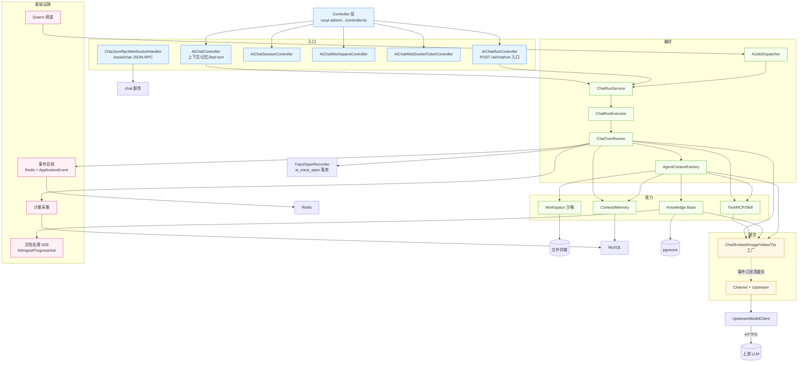

# 整体架构总览

> 首次阅读建议先看 [Agent 架构阅读地图](Agent架构阅读地图.md)：它按一次 Run 的真实执行链路串起本文与各模块文档，并提供排障入口。

> agent-java 是基于 RuoYi-Vue 3.9.2 + Spring AI 1.1.5 改造的「多 Agent / 工具调用 / 知识库 RAG」企业级 AI 后台。
> 本文是模块文档之上的**横向拉通**:先给一张系统鸟瞰图,再串起主数据流,最后沉淀跨模块的关键设计决策。
> 模块细节请翻 `docs/` 下对应的 `xxx模块.md`。

---

## 1. 一句话定位

> 把"配置好的智能体 × 渠道化的上游模型 × 工具/MCP/Skill × 知识库 × 工作空间"装进 RuoYi 的多租户管理后台,让业务用户能像建菜单一样拼装自己的 AI 应用,后端负责把每一次对话跑成可观测、可计量、可回放、可续跑的 Run。

---

## 2. 技术栈

| 维度 | 选型 | 备注 |
|------|------|------|
| 基础 | Spring Boot 3.5.14 / Java 17 | 见 `pom.xml:18-22` |
| AI 框架 | Spring AI 1.1.5(BOM 导入) | 不依赖 spring-ai-alibaba-starter;按 DB 渠道动态构造模型 |
| 主库 | MySQL 8 | 业务数据 / RuoYi 原生表 + `ai_*` 业务表 + `sys_*` 权限表 |
| 向量库 | PostgreSQL + pgvector | 知识库 `kb_*` 域,见 `sql/kb_pg.sql:5-7`;HNSW 上限 2000 维,3072 维只能全表扫 |
| 缓存/事件 | Redis | Run 事件总线(Pub/Sub)+ 渠道权重 + 缓存命中率探针 |
| 调度 | Quartz | 与 RuoYi `sys_job` 共享 Scheduler,Job 实现层完全分叉 |
| 鉴权 | Spring Security + JWT | RuoYi 原生,RuoyiPermission 注解 |
| ORM | MyBatis + Druid + PageHelper | MySQL 主 + PG 知识库双数据源 |
| 前端 | Vue 3 + Element Plus + Vite | 主管理端 `ruoyi-ui/`;浏览器插件 `extension/`(Chrome MV3 侧边栏,渠道工具宿主)与桌面端 `desktop/` 同栈;官网落地页 `website/`(React 19) |
| 文档 | Springdoc OpenAPI | `/swagger-ui` |

---

## 3. 系统鸟瞰图

```mermaid
flowchart LR
  subgraph 用户层
    U[浏览器<br/>Vue 3 + Element Plus]
    EXT[浏览器插件<br/>Chrome 侧边栏]
  end

  subgraph 接入层 [ruoyi-admin]
    direction TB
    REST["REST 控制器<br/>(AiChat/AiAgent/Kb/AiStat/...)"]
    WS["WebSocket<br/>(聊天实时通道)"]
    SSE["SSE 端点<br/>(文档处理进度)"]
  end

  subgraph 服务层 [ruoyi-system · AI 域]
    direction TB
    ChatSvc[聊天服务]
    RunEngine[Run 引擎<br/>状态机 + 事件总线]
    AgentFactory[Agent 装配工厂]
    ToolEcosystem[Tool/MCP/Skill 生态]
    KbSvc[知识库服务]
    JobSvc[AI 任务调度]
    StatSvc[计量统计]
  end

  subgraph 模型适配层
    direction TB
    ChatMF[ChatModelFactory]
    EmbMF[EmbeddingModelFactory]
    ImgMF[ImageModelFactory]
    VidMF[VideoModelFactory]
    TtsMF[TtsModelFactory]
    Upstream[UpstreamModelClient<br/>OpenAI / Anthropic / Gemini 协议适配<br/>(仅拉模型列表,chat 走 Spring AI ChatModel)]
  end

  subgraph 数据层
    direction TB
    MySQL[(MySQL 8<br/>业务 + ai_* + sys_*)]
    PG[(PostgreSQL<br/>pgvector<br/>kb_*)]
    Redis[(Redis<br/>事件总线 + 缓存)]
    FS[(工作空间<br/>./agent-java/ai)]
  end

  subgraph 外部
    direction TB
    LLM[上游 LLM<br/>OpenAI / DeepSeek / Claude / 自建中转]
    MCP[MCP Servers<br/>stdio / sse]
  end

  U -->|HTTP/WS/SSE| REST
  U -.->|WebSocket| WS
  U -.->|SSE| SSE
  EXT -.->|工具声明 / tool_call_request / 结果回传| WS

  REST --> ChatSvc
  REST --> KbSvc
  REST --> JobSvc
  REST --> StatSvc
  WS --> ChatSvc

  ChatSvc --> RunEngine
  RunEngine --> AgentFactory
  AgentFactory --> ChatMF
  ChatMF --> Upstream
  EmbMF --> Upstream
  ImgMF --> Upstream
  Upstream -->|HTTPS| LLM

  AgentFactory --> ToolEcosystem
  ToolEcosystem -.->|stdio/sse| MCP
  AgentFactory --> KbSvc
  KbSvc --> EmbMF
  KbSvc --> PG

  RunEngine -->|事件| Redis
  RunEngine -->|计量| StatSvc
  RunEngine -->|审计| MySQL
  ChatSvc -->|上下文| MySQL
  ChatSvc -->|文件| FS
  JobSvc --> RunEngine

  classDef external fill:#fff7e6,stroke:#d48806;
  class LLM,MCP external;
```

---

## 4. 模块依赖图(代码视角)

按"上游 → 下游"画。`A → B` 表示 A 依赖 B(在源码里 A 持有 B 的引用/调用 B 的服务)。



**强依赖环已规避的设计**:`Channel ↔ Model` 双向关系用 `AiChannelChangedEvent` 广播解耦(五个模型工厂各自 `@EventListener`),不互相注入;详见 `docs/模型渠道模块.md`。

---

## 5. 主数据流:从用户提问到 AI 回复

下面这张时序图展示一次"普通对话"(无工具、无 RAG)的完整链路,加 ★ 的步骤是工程上最容易踩坑的点。

```mermaid
sequenceDiagram
  autonumber
  participant U as 浏览器
  participant Ctrl as AiChatRunController
  participant Ws as WebSocket Handler
  participant Run as ChatRunService
  participant Exe as ChatRunExecutor
  participant Turn as ChatTurnRunner
  participant Agt as AgentContextFactory
  participant Mem as DbChatMemory
  participant Fac as ChatModelFactory
  participant Up as UpstreamModelClient
  participant Sink as ChatEventSink
  participant Stat as LlmCallCollector
  participant DB as MySQL

  U->>Ctrl: POST /ai/chat/run (sessionId, message, attachments)
  Ctrl->>Run: ChatRunService.create(ChatRunCreateCommand)
  Run->>DB: INSERT ai_chat_run (status=QUEUED) ★ 初始为 QUEUED,RUNNING 由 worker 抢锁后标
  Run-->>U: 立即返回 runId(异步执行)

  Note over Ctrl,U: 控制权已还,后续通过 WebSocket 订阅 run 事件推送

  Exe->>Turn: run(turnRequest)
  Turn->>Mem: DbChatMemory.get 读可见历史
  Turn->>Agt: buildForRun(operator, runId) ★ 装配是重操作,会查 ai_agent + 关联工具
  Agt-->>Turn: AgentContext(ChatModel + tools + systemPrompt)
  Turn->>Fac: getChatModel(modelId) ★ 传 modelId 而非 channelId+model;key 为 channelId:modelName
  Fac->>SACM: Spring AI ChatModel(动态构造) ★ 对话调用走框架 ChatModel,不经过 UpstreamModelClient
  SACM-->>Fac: Flux<ChatResponse>(流式)
  Fac-->>Turn: Flux<ChatResponse>

  loop 流式消费
    Turn->>Sink: emit(text/think/tool_call)
    Sink-->>Ws: 推消息
    Ws-->>U: WS 帧
  end

  Turn->>Mem: 追加 user + assistant
  Turn->>Stat: 收集 token 用量(差值记账 ★)
  Stat->>DB: INSERT ai_llm_call
  Turn->>DB: UPDATE ai_chat_run.status = SUCCEEDED
  Sink-->>U: terminal 事件(done/error)
```

**复杂变体**:
- **工具调用**:Turn 检测到 `tool_calls` → `AgentToolLoop` 调 `ToolCallingManager` / `RecordingToolCallback` → 工具结果回写 Memory → 下一轮再调 LLM(主/子智能体共用这一套循环,`internalToolExecutionEnabled=false`,带 `ToolBudgetRegistry` 兜底防爆)。
- **RAG 召回**:Agent 装配阶段挂 `KnowledgeSearchToolCallback`,LLM 主动 `searchKnowledge` → `KbSearchService` → pgvector。
- **子 Agent**:`SubAgentToolCallback` 把子 agent 包成工具,触发 `buildStateless` 递归(深度 ≤ 3),事件带 `owner` 标识嵌套。
- **续跑 / 断线重连**:Run 持久化在 `ai_chat_run`,客户端按 `afterSeq` 从 Redis 订阅回放,DB 快照兜底。

---

## 6. 模块文档索引

| # | 文档 | 业务职责 | 一句话总结 |
|---|------|----------|------------|
| 0 | **[整体架构总览.md](./整体架构总览.md)** | 横向拉通 | 本文 |
| 1 | [智能体核心模块.md](./智能体核心模块.md) | Agent 装配 | 把 `ai_agent` 一行配置变成可跑的 `AgentContext` |
| 2 | [聊天对话模块.md](./聊天对话模块.md) | 入口 / WebSocket | 用户提问的第一站,WS 实时通道 |
| 3 | [聊天执行引擎.md](./聊天执行引擎.md) | Run 状态机 | 一次对话从创建到完成的编排,Redis 事件总线 |
| 4 | [模型管理模块.md](./模型管理模块.md) | 模型工厂 | Chat/Embed/Image/Video/Tts 五个工厂 + 推荐 |
| 5 | [模型渠道模块.md](./模型渠道模块.md) | 渠道管理 | 上游 LLM 的中转抽象,事件驱动缓存失效 |
| 6 | [知识库模块.md](./知识库模块.md) | RAG | 文档摄入、向量化、检索、图谱 |
| 7 | [工具生态模块.md](./工具生态模块.md) | Tool/MCP/Skill | AI 的"手脚",三类工具的统一封装 |
| 8 | [定时任务模块.md](./定时任务模块.md) | AI 任务调度 | 用户态 Job,Dispatcher + Reconciler |
| 9 | [计量统计模块.md](./计量统计模块.md) | 用量埋点 | token 计费、缓存命中率、健康度 |
| 10 | [上下文与记忆模块.md](./上下文与记忆模块.md) | 上下文/记忆 | 长对话的"压缩+持久化"双层抽象 |
| 11 | [流式与事件模块.md](./流式与事件模块.md) | 事件出口 | Run 事件总线 + WebSocket 统一收口 |
| 12 | [工作空间模块.md](./工作空间模块.md) | 沙箱 | AI 写文件的物理隔离目录 |
| 13 | [会话身份与访问控制.md](./会话身份与访问控制.md) | 会话鉴权 | sessionId 产生、归属与订阅边界 |
| 14 | [个人文件模块.md](./个人文件模块.md) | 个人文件 | S3 兼容对象存储 + 配额,desktop 文件页与后台管理两套面 |
| 15 | [渠道工具与浏览器插件.md](./渠道工具与浏览器插件.md) | 渠道工具 | 执行体在客户端的工具:声明→装配→挂起转交→回传唤醒→断线补发 |

---

## 7. 跨模块关键设计决策

### 7.1 不依赖 spring-ai-alibaba-starter,按 DB 渠道动态构造模型

**问题**:Spring AI 原生 starter 强绑配置文件里的 `api-key`,无法支持多租户/多渠道热切换。
**做法**:`ChatModelFactory` / `EmbeddingModelFactory` / `ImageModelFactory` / `VideoModelFactory` / `TtsModelFactory` 全部**手写**,运行时从 `ai_channel` + `ai_model_channel` 权重表选渠道、解 key、构造客户端,结果按 `channelId:modelName` 缓存。`AiChannelChangedEvent` 触发精准失效(`channelId+":"` 前缀避免误清其他渠道)。生图 / 视频 / 语音平行,互不改对方缓存与协议。
**文件**:`docs/模型管理模块.md`、`docs/模型渠道模块.md`

### 7.2 ChatMemory 与 Context 拆成两层

**问题**:Spring AI `MessageWindowChatMemory.saveAll` 是**覆盖语义**,直接用会物理删掉审计消息。
**做法**:`DbChatMemory` **直接实现 `ChatMemory` 接口**而非 `Repository`,绕开框架的覆盖语义,保证 `ai_chat_message` 始终追加(审计优先)。`Context` 是轮内概念,由 `ContextCleaner` 按「assistant(tool_calls) + 全部 tool 结果」为单位裁剪(对标 Anthropic `clear_tool_uses_20250919`)。
**文件**:`docs/上下文与记忆模块.md`

### 7.3 Run 引擎用 Redis 事件总线,WebSocket 与模型生命周期解耦

**问题**:长对话可能跨节点(负载均衡),WebSocket 连接和模型执行不能绑在同一进程。
**做法**:`ChatRunEventBroker` 三投递:Stream 实时回放 + Redis Pub/Sub 跨实例广播 + 进程内 `ApplicationEvent`。任一节点完成一轮 LLM 推理,所有持有同 `runId` 的连接都能收到事件。WebSocket 只负责"在哪连就收哪条",不知道也不关心 LLM 跑在哪。
**文件**:`docs/聊天执行引擎.md`、`docs/流式与事件模块.md`

### 7.4 LLM 用量用「差值记账」,不用累计值

**问题**:Spring AI 的 `UsageCalculator` 在工具循环里给的是**累计 token**(`prompt_tokens` 是从第 1 轮到当前轮的总数),直接 `sum(prompt_tokens)` 入库会指数级虚高。
**做法**:`LlmCallCollector.flushPending` 用上一轮快照做差值。差值为负要区分 **reset**(累计链被 ChatClient 重置:本轮记原值、重置基准、继续差值)与 **flip**(prompt 涨而 completion 跌才认定非累计上游)。展示层缓存命中用 `min(cache_hit, prompt)` 归一,落库保留上游块量化原值。
**文件**:`docs/计量统计模块.md`

### 7.5 工具预算 + 工具确认,作为全局拦截器

**问题**:模型陷入工具循环把上下文撑爆(实测:25 轮 × 5 万字符,prompt 16 秒从 3,579 涨到 333,917)。
**做法**:`ToolBudgetRegistry` 在框架外做硬上限;`ToolConfirmBroker` 对危险工具(Shell / 文件删除)强制人工确认;`RecordingToolCallback` 把所有工具调用包一层,自动获得记账/事件/沙箱绑定。
**配置**:预算在 `application-ai.yml` 的 `ai.chat.tool.*`;并行执行与四级超时在 `ai.chat.run.*`。两段不要混用。
**文件**:`docs/工具生态模块.md`

### 7.6 知识库分维度建表,避开 pgvector HNSW 2000 维上限

**问题**:不同 embedding 模型维度差异极大(768/1024/1536/3072),pgvector HNSW 索引上限 2000 维。
**做法**:`kb_vector_{768,1024,1536,3072}` 物理分表;3072 维因超上限只能全表扫,但带 `kb_id` 过滤仍可控;`kb_index_policy_version` 不可变 + `active/previous/desired` 三指针,改一次模型不会静默触发全量重建。
**文件**:`docs/知识库模块.md`

### 7.7 渠道变更走事件广播,避免 Channel ↔ Factory 循环依赖

**问题**:Model 工厂要监听 Channel 变化清理缓存,Channel Service 又被 Model 工厂消费。
**做法**:不互相注入,`AiChannelChangedEvent` 走 Spring `ApplicationEventPublisher` 广播,Chat / Embed / Image / Video / Tts 五个工厂各自 `@EventListener`;`channelId+":"` 前缀精准失效。
**文件**:`docs/模型渠道模块.md`

### 7.8 Agent 静态 systemPrompt,工具往返进真实消息

**问题**:KV-cache 命中率依赖 system prompt 稳定;若把"当前可用工具列表 / 本轮工具摘要"拼进 system,每轮重算,前缀失效。
**做法**:`AgentContext.systemPrompt` 静态(只跟 agent 配置相关)。工具往返以 `assistant(tool_calls) + tool` 真实消息跨轮留在 `ai_chat_message`,**不再**注入 `toolSummary` UserMessage。`AgentContext` 也没有 `client` 字段,全链路不经 `ChatClient`。
**文件**:`docs/智能体核心模块.md`、`docs/上下文与记忆模块.md`

### 7.9 Run 控制权用 CAS 守门,并发提交返回 409

**问题**:同一会话用户多 Tab 同时发消息,可能重复创建 Run。
**做法**:`uk_ai_chat_run_active` 唯一索引 + `ActiveRun` CAS 抢占,`ActiveChatRunException` → Controller 转 409。
- **chat Run 僵死收敛**:`ChatRunExecutor.recoverStaleSafely` 每 **30s** 扫描一次心跳超时的 Run,作为聊天域的兜底。
- **ai_job 僵死收敛**:`AiJobReconciler` 每 **60s** 扫描一次,负责 ai_job 域的对账;两者独立,不要混用。
**文件**:`docs/聊天执行引擎.md`、`docs/定时任务模块.md`

### 7.10 工作空间物理隔离,沙箱目录与 RuoYi `/profile/**` 解耦

**问题**:RuoYi 默认 `ruoyi.profile` 被 `/profile/**` 静态映射且 GET 免鉴权,AI 写出的文件会变成匿名可下载。
**做法**:`workspace-root` 显式独立目录。普通会话使用 `{sessionId}` 独立目录；项目会话经 `WorkspaceScopeService` 映射到 `{project-{projectId}}`,同一项目下的会话共享文件工作区。消息、上下文、Run 和计量仍按真实 `sessionId` 隔离。`WorkspaceSandbox.resolveRoot` 失败降级不拖垮主流程。
**配置**:`application-ai.yml`(workspace-root 与 workspace-per-session 配置项;具体行号随重构变化,请以 yml 键名定位)
**文件**:`docs/工作空间模块.md`

### 7.11 跨会话长期记忆:全自动、零工具、两层隔离

**问题**:`ai_chat_message` 只是**会话内**消息流,agent 跨会话即"失忆"。
**做法**:系统侧全自动的长期记忆 —— agent **没有任何记忆工具**(无 save/search/update),记忆不是 agent 的能力,是平台的能力。
- **写侧**:`ContextCompactor` 压缩搭车提炼(同一次 LLM 调用顺带输出 `<facts>` 事实数组)+ `IdleSessionExtractScheduler` 空闲兜底扫描,落 `ai_memory` 台账 + PG `mem_vector_*` 向量表。
- **读侧**:`MemoryRetriever` 每轮按本轮 query 检索(1 次 embedding + 1 次向量查询,零 LLM),注入**发送版** user 消息前(落库仍存用户原话 —— 审计红线,注入不沉进历史)。
- **隔离**:`user_id` 永远强制;`agent_id=0` 为用户层、`>0` 为 agent 专属层。`MemoryTenant` 构造即校验非空,所有 store 方法租户键第一参数(编译期防串号,照抄知识库范式)。
- **只增不删**:覆盖走 supersede 保留审计;物理删除只留给合规清理(`deleteByUser` 遍历四维删向量)。
- **向量模型复用**:不单独配置,默认跟随 `sys_config` 的 `kb.default.embeddingModel`(30s TTL,可 `ai.memory.embedding-model-code` 覆盖)。
**文件**:`docs/上下文与记忆模块.md §7`

### 7.12 渠道工具:执行体在客户端,挂起转交 + 同 callId 补发

**问题**:读网页的 Agent 需要操作**用户正在用的浏览器**(用户看的标签页、登录态),服务端无头浏览器拿不到;工具执行体在客户端意味着客户端随时可能离线(侧边栏一关,连接就没了)。
**做法**:客户端把工具定义声明到会话行(`ai_chat_session.client_tools`,首轮捎在 run.create 上,新会话才有),服务端装配期对顶层 agent 追加 `ChannelToolCallback`(照常包 `RecordingToolCallback`);调用时 `ChannelToolBroker` 照抄 ToolConfirmBroker 的进程内挂起模式,经事件总线发 `tool_call_request`(不落投影 step)并挂起等回传,WS `chat.tool.result` / REST `/tool-result` 唤醒。断线有 `disconnect-grace-seconds` 宽限快速失败;重连订阅在 replay 之后**同 callId 补发**,客户端按 callId 幂等不重跑(写操作不可重跑)。图片只回传 fileId,服务端按 userId 从个人文件取回进下一轮。**服务端 require_confirm 对渠道工具不生效**,确认在客户端做。
**文件**:`docs/渠道工具与浏览器插件.md`

---

## 8. 数据落盘点速查

> 以下"表"指实际存在于 `sql/` 下的 CREATE TABLE 脚本;某些 sql 文件名只是 ALTER 增量(给已有表加列),与同名"表"概念并不等价。

| 表 / 目录 | 模块 | 说明 |
|-----------|------|------|
| `ai_agent` / `ai_agent_skill` | 智能体 | 智能体配置 + 技能绑定 |
| `ai_agent_appearance` (sql) | 智能体 | ALTER ai_agent 加 icon/theme 列(不是新表) |
| `ai_channel` / `ai_model_channel` | 模型渠道 | 渠道 + 渠道×模型多对多权重(`AiModelSupplyService` 是服务层用“supply”命名的概念,但**实际表名仍是 `ai_model_channel`**) |
| `ai_model` / `ai_chat_attachment` (sql) | 模型管理 / 聊天 | 模型元数据 + ai_model 加 `vision_enabled` 列(后者不是新表) |
| `ai_chat_session` / `ai_chat_session_kb` / `ai_chat_message` | 聊天 | 会话 + 会话级知识库多选 + 消息追加流;附件元数据存 `ai_chat_message.attachments(json)`;会话可归属项目(`project_id` 列);渠道工具声明快照存 `ai_chat_session.client_tools(json)` |
| `ai_project` | 项目管理 | 项目级共享工作空间及其会话容器(名称/描述/归属用户),仅桌面端个人工作区使用 |
| `ai_chat_run` / `ai_chat_run_step` | Run 引擎 | 运行事实源 + UI 步骤投影(大字段可外置 `output_data_path`,工具步骤带 `message_id`) |
| `ai_chat_special_event` | 流式/UI | 只给前端的产物(`kb.references` / `run.tokenUsage`),不进 LLM、不进 `run_step` |
| `ai_upstream_model` | 模型渠道 | 按渠道缓存的上游模型清单,导入与供应候选都查它 |
| `ai_llm_call` / `ai_llm_call_cache_tokens` (sql) | 计量 | 每次 LLM 调用的 token 用量;后者是给 ai_llm_call 加 `cache_hit_tokens` / `cache_miss_tokens` 列 |
| `ai_trace_span` | 链路追踪 | Run / turn / tool / 子 agent 的 span 落库,经 `TraceSpanRecorder` 写入(见 `com.ruoyi.system.ai.trace` 包) |
| `ai_job` / `ai_job_log` | 定时任务 | 用户态 Job + 执行日志 |
| `ai_skill` / `ai_mcp_server` / `ai_tool` | 工具生态 | Skill / MCP Server / 手工注册工具 |
| `ai_tool_policy` (sql) | 工具生态 | ALTER ai_tool 加 `max_calls_per_run` / `require_confirm` 列(不是新表) |
| `kb_knowledge` / `kb_document` / `kb_chunk` / `kb_vector_*` | 知识库 | 库 + 文档 + 分段 + 向量(分维度) |
| `kb_acl_member` / `kb_index_policy(_version)` / `kb_graph_*` | 知识库 | 成员 ACL + 索引策略版本 + 图谱(实际表名,`kb_index_policy_v1.sql` 是脚本名) |
| `ai_memory` / `ai_memory_extract_progress` | 长期记忆 | 跨会话记忆台账(MySQL) + 空闲兜底提炼位点 |
| `mem_vector_*` | 长期记忆 | 记忆向量分表(PG,同 KB 分维度范式,`sql/init/11_mem_pg.sql`) |
| `ai_user_file` | 个人文件 | 个人文件元数据 + 配额;文件本体在 S3 兼容对象存储(可选,默认关闭),见 `个人文件模块.md` |
| `sys_*` | RuoYi 原生 | 用户/角色/权限/部门/字典/任务 |
| `./agent-java/ai/workspace/{sessionId}/` 或 `project-{projectId}/` | 工作空间 | 普通会话按会话隔离；项目内会话共享项目工作区 |
| `./agent-java/ai/sessions/` | 上下文文件 | 上下文/外置大字段 |
| Redis | 多模块 | Run 事件总线、缓存命中率探针、渠道权重快照 |

---

## 9. 部署与扩展

### 9.1 必装依赖

- MySQL 8.x(主库)
- PostgreSQL 14+ + pgvector 扩展(`kb_*` 表)
- Redis 6+(事件总线)
- JDK 17 + Maven 3.9+
- LLM 上游:OpenAI 兼容协议即可(OpenAI / DeepSeek / 自建中转 / Anthropic 走适配层)

### 9.2 关键配置

- `application-ai.yml`:工具沙箱、上下文存储、工具预算、Run 线程池与超时。**没有** `spring.ai.*`
- `application-druid.yml`:MySQL 主 + PG 向量库双数据源
- `Jenkinsfile`:CI 流水线

### 9.3 横向扩展

- **Run 引擎无状态化**:`ChatRunRedisConfig` 把执行上下文搬进 Redis,WebSocket 节点可任意增减
- **生产环境必须**:`workspace-root` / `context-path` 用共享持久卷(NFS / OSS / S3 适配),否则多实例文件不共享
- **MCP Server 保活**:`mcp-keepalive-seconds: 30` 必须小于链路最短空闲超时(nginx 默认 60s),否则连接被悄悄掐掉

### 9.4 已知约束

- pgvector HNSW 索引上限 2000 维,3072 维 embedding 只能全表扫
- **本系统不依赖 Spring AI starter**:项目按 DB 渠道动态构造 `ChatModel` / `EmbeddingModel` / `ImageModel`,`application-ai.yml` 中**不包含**任何 `spring.ai.*` 配置;如未来新增 starter,需做 FQCN 排除避免与本系统自构造的模型 bean 冲突。
- `RuoYi Quartz Scheduler` 同时承载 `sys_job` 与 `ai_job`,**Job 实现层完全分叉**,不能混用 `AbstractQuartzJob` 与 `org.quartz.Job`
- `ai_chat_run.heartbeat_time` 由库 `current_timestamp` 写入,`create_time` / `started_time` / `finished_time` 走 Java `Date`;库若是 UTC、JVM 是 GMT+8,同行可能差 8 小时。stale 扫描对两列用了不同比较基准
- 并行工具的**单工具内联路径**(同轮只有 1 个 tool_call)没有 `orTimeout`,挂死靠 `ai.chat.run.max-duration-seconds` 兜底
- `POST /ai/chat/run` 创建会话无限流,框架 `@RateLimiter` 未挂到 AI 控制器

---

## 10. 进一步阅读路径

> 如果你刚接手这个项目,建议按下面顺序读:

1. **入口 → 装配 → 执行**:`聊天对话模块` → `智能体核心模块` → `聊天执行引擎`
2. **能力扩展**:`工具生态模块` → `知识库模块` → `工作空间模块`
3. **基础设施**:`模型渠道模块` → `模型管理模块` → `流式与事件模块` → `上下文与记忆模块` → `计量统计模块`
4. **后台运维**:`定时任务模块` → `计量统计模块`(Stat 控制器)

如果只想跑通一个"最小对话":
- 后端:按 `sql/init/README.md` 顺序建库(不要直接跑 `sql/` 根目录散落的 ALTER)
- 前端:`pnpm install && pnpm dev`,登录后进"智能体"→ "聊天"
- 配置:在"模型渠道"先建一个 DeepSeek 渠道 → "模型管理"导入 deepseek-v4-flash → "智能体"选这个模型
