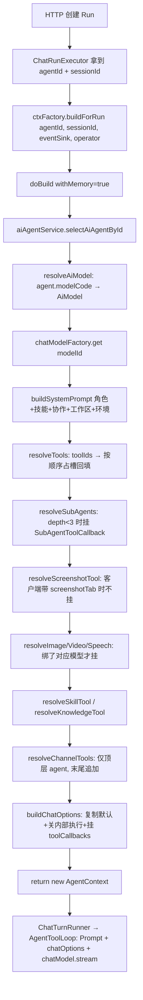
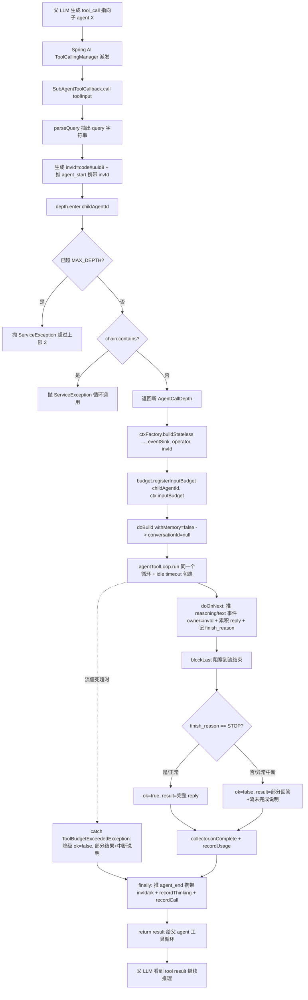
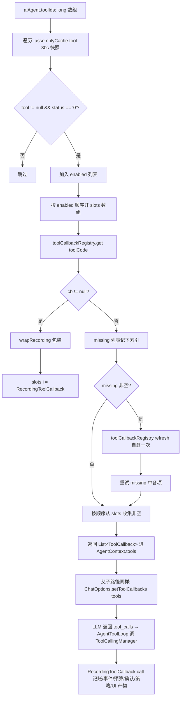
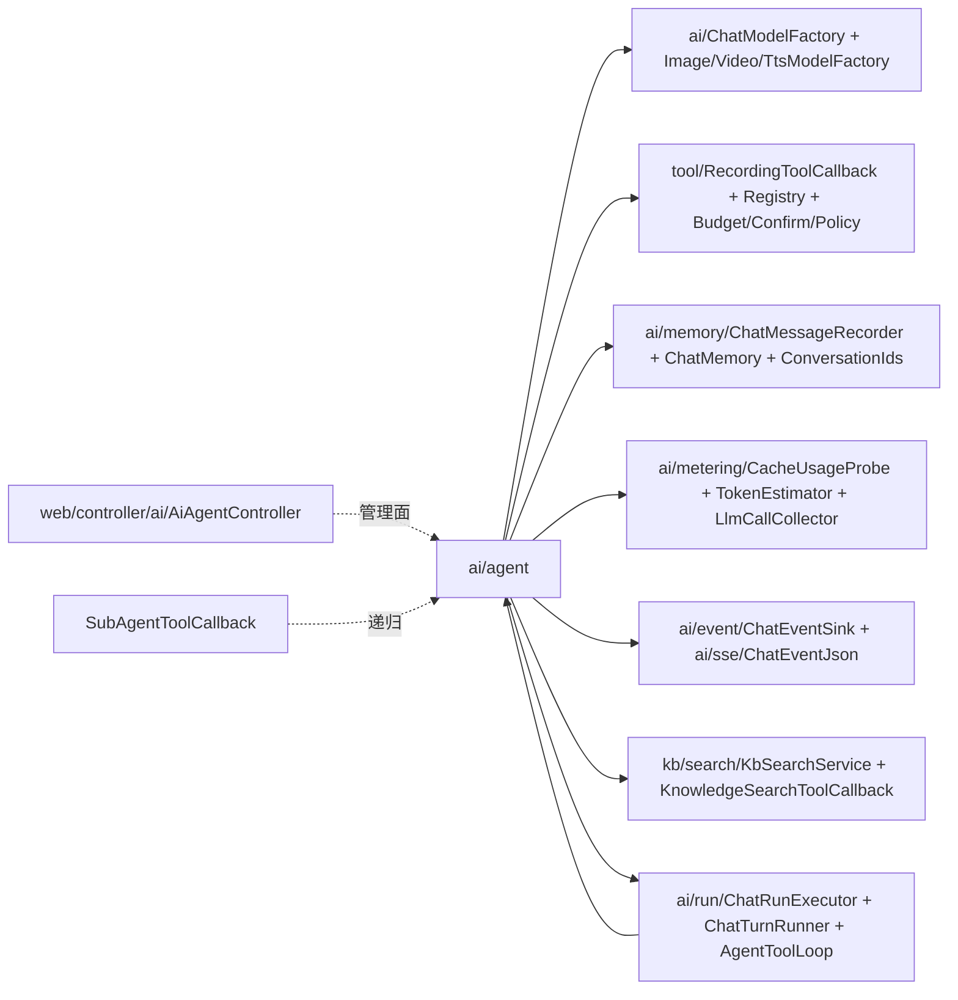

# Agent 智能体核心模块

> 源码范围:`ruoyi-system/src/main/java/com/ruoyi/system/ai/agent/` + `AiAgentController`
> 文档版本:基于 springboot3 分支(主干)源码梳理

## 1. 模块概述

`agent` 包解决一个核心问题:**把数据库里一行 `ai_agent` 配置,在请求到达时,装配成真正能跑的 `ChatModel + ChatOptions(含工具集)+ 系统提示词` 三件套**。

> 不经过 `ChatClient`,也不挂任何 Advisor。工具循环由本项目的 `AgentToolLoop` 驱动
> (`internalToolExecutionEnabled=false`),父 agent 与子 agent 共用同一个循环。

它不是大模型本身的封装,而是 **「per-agent 装配层」**——把多对多关系(agent ↔ 工具/技能/子 agent/模型)的运行时解析、跨线程上下文传递(操作者身份、事件出口、递归深度)、KV-cache 友好的提示词结构,集中在一处。其位置如下:

```
[HTTP 请求] → AiAgentController (CRUD)         ┐
                                                 │ 管理面
[ChatRpc/Controller chat 接口]                  ┘
        ↓
ChatTurnRunner / ChatRunExecutor   ←  装配消费者
        ↓
AgentContextFactory.buildForRun()  ──→  AgentContext (record)
        ↓                              ├─ chatModel / chatOptions
                                       ├─ tools (普通 + 子 agent + 动态)
                                       ├─ systemPrompt
                                       └─ conversationId / modelId / model / inputBudget
        ↓
[主路径:    ChatTurnRunner        → AgentToolLoop]
[子 agent:  SubAgentToolCallback  → buildStateless → 同一个 AgentToolLoop]
```

能力清单:

- **装配**:由 `agentId` 解析出 `AiModel`、普通工具、子 agent 工具,以及六类动态工具 —— 截图、生图、视频、语音、技能加载、会话知识库检索
- **递归保护**:`AgentCallDepth` 限制最多 3 层,并检测同 agent 自调用环路
- **跨线程透传**:`OperatorHolder` 在请求线程捕获,reactive 线程通过参数显式下传
- **KV-cache 友好**:`systemPrompt` 一次会话内静态,**逐会话变化的内容(sessionId、绝对路径、时间)一律不进**;工具定义顺序按 `toolIds` 占槽回填,不随 MCP 掉线漂移
- **子 agent 工具化**:把子 agent 包成 `ToolCallback` 挂到父 agent 的 `toolCallbacks` 上,模型通过原生 tool calling 决定何时调谁

## 2. 关键类与职责

### 2.1 `AgentContext`(record)

**作用**:`AgentContextFactory.doBuild()` 的不可变装配产物。一次请求一个实例,贯穿整个对话主路径与子 agent 路径。

**关键字段**(全在 `AgentContext.java:19-39`,共 10 个):

| 字段 | 类型 | 作用 |
| --- | --- | --- |
| `agentId` / `agentCode` | `Long` / `String` | 数据库 ID 与对外编码 |
| `chatModel` | `ChatModel` | `AgentToolLoop` 每轮 `chatModel.stream(prompt)` 用 |
| `chatOptions` | `OpenAiChatOptions` | 含 `toolCallbacks` + `internalToolExecutionEnabled=false`,整个 options 塞进 `Prompt` |
| `tools` | `List<ToolCallback>` | 普通工具 + 子 agent 工具 + 动态工具(截图/生图/视频/语音/技能/会话知识库) |
| `systemPrompt` | `String` | 角色 + 技能指引 + 协作说明 + 工作区工具 + 环境,一次会话内静态 |
| `conversationId` | `String` | 顶层 agent = `sessionId:agentId`;子 agent = `null`(`AgentContext.java:27`) |
| `modelId` / `model` | `Long` / `AiModel` | 计量归因 + 上下文预算(`context_window` / `max_output_tokens`) |
| `inputBudget` | `int` | 该 agent 自己模型的输入预算(token)= `contextWindow − maxOutputTokens`,由 `ContextBudget.inputBudget()` 在 `doBuild` 算出(`AgentContext.java:38`)。子智能体可用与父不同的模型,窗口上限天然 per-agent,`SubAgentToolCallback` 据此 `registerInputBudget` |

**没有 `client` 字段**(全链路不经 `ChatClient`),**也没有 `toolSummary`**:工具往返以 `assistant(tool_calls)` + `tool` 真实消息跨轮留在历史里,不再额外注入工具摘要。

派生方法四条,口径都是只有 `"1"` 为真:

- `reasoningEnabled()` / `reasoningEnabled(AiModel)`:是否把思考内容记库并推前端、请求是否带 `reasoning_effort`
- `inputModalities()` / `inputModalities(AiModel)`:模型能接收哪些输入模态,返回 `ModelInputModalities` 集合(image / file / video / audio)。**逐份判定**而非一刀切 —— 模型可能收图片却收不了文档。配置缺失、空串一律按纯文本处理,宁可不发,也不能让整轮被上游 400 打回。历史重建走 `ConversationVisionGate`,与这里同一口径。
  - 判定分两层:`supports()` 答「模型声称支持吗」,`accepts()` 还要问「这个 MIME 送得出去吗」—— 传输层比模型能力窄,视频即使模型支持也恒拒。
  - `visionEnabled()` / `visionEnabled(AiModel)` 仍在,但已 `@Deprecated`,语义收窄为「支持图片」。新代码一律用 `inputModalities()`。

### 2.2 `AgentContextFactory`

**作用**:`@Component`,per-agent 装配核心。源码:`AgentContextFactory.java:50`。

**关键字段**(`AgentContextFactory.java:54-78`):依赖装配所需 bean,涵盖 agent/skill/tool 配置服务、四个模型工厂(`ChatModelFactory`、`ImageModelFactory`、`VideoModelFactory`、`TtsModelFactory`)、知识库服务、工具注册表与录制器、操作者工具链(`ToolBudgetRegistry`、`ToolConfirmBroker`、`ToolPolicyService`)、上下文预算(`ContextBudget`)、装配行缓存(`AgentAssemblyCache`)、工具循环(`AgentToolLoop`,构造 `SubAgentToolCallback` 时传下去)。

> 注意这里**没有** `IAiModelService`:模型行统一经 `AgentAssemblyCache.modelByCode` 取,装配期
> (`resolveAiModel`)与执行期(drawImage / drawVideo / speak 三个动态工具)都吃同一份 30s 快照。

**装配行缓存**(`AgentAssemblyCache`):agent / tool / skill / model 四类 DB 行的 30s TTL 进程内快照。此前每轮装配 11+2N+2S+k+5 条点查且成对重复(`resolveTools` 与 `buildWorkspaceToolsSection` 各查一遍工具行、`buildSkillSection` 与 `collectBoundSkills` 各查一遍技能行),子 agent 每次调用全额重放;接入后稳态装配仅剩 `getSessionKbIds` 一条实查(会话级数据,用户运行中改会话 KB 即时生效)。

失效语义:经 Service 的增删改由 `AiConfigChangedEvent` 即时失效(四个 ServiceImpl 的 insert/update/delete 挂点,事件式避免与缓存循环依赖);直改库 ≤30s TTL。`MODEL` 一类是**整表清**而非按 id 删 —— `modelCode` 本身可能被改,按 id 失效会漏掉旧 code 的条目。

**消费方**:装配期的 `agent()` / `tool()` / `skill()` / `modelByCode()`,以及运行期的 `SkillLoadToolCallback`(resolver 注入)与三个媒体工具 `ImageGenerationToolCallback` / `VideoGenerationToolCallback` / `SpeechGenerationToolCallback`(同样 resolver 注入,`Function<String, AiModel>`)。

**边界**:ToolCallbackRegistry(MCP 掉线)仍实时解析,不经过缓存;`require_confirm` 由 ToolPolicyService 独立 30s 快照;缓存返回共享实例,消费方只读。

**核心方法**:

| 签名 | 行号 | 作用 |
| --- | --- | --- |
| `buildForRun(agentId, sessionId, eventSink, operator)` | `AgentContextFactory.java:83` | 顶层 agent 装配入口(写 conversationId);事件出口与操作者身份由 `ChatRunExecutor` 显式传入 |
| `buildStateless(agentId, sessionId, depth, eventSink, operator[, invId])` | `AgentContextFactory.java:91/104` | 子 agent 入口,conversationId 为 `null`,递归装配;`invId` 重载(`:104`)把本次调用实例 ID 作为子 agent 内部事件 owner 标签下传 |
| `doBuild(...)` | `AgentContextFactory.java:120/126` | 装配主流程(私有);`invId` 重载算 ownerCode 与 `inputBudget` |

**装配流水线**(`doBuild` 内部):

```
1. assemblyCache.agent(agentId)                       // 校验 agent 存在(30s 行缓存)
2. resolveAiModel(agent)                              // agent.modelCode -> AiModel(经行缓存)
3. chatModelFactory.get(modelId)                      // 拿 ChatModel 实例
4. buildSystemPrompt(agent)                           // 角色+技能+协作+工作区工具+环境
5. 算 ownerCode                                        // 顶层=null;子 agent=invId,缺省回退 agentCode
6. resolveTools / resolveSubAgents                    // 普通工具 / 子 agent 工具
   resolveScreenshotTool                              // 截图(客户端已带 screenshotTab 时不挂)
   resolveImageTool / resolveVideoTool / resolveSpeechTool  // 绑了对应模型才挂
   resolveSkillTool / resolveKnowledgeTool            // 技能加载 / 会话知识库
   resolveChannelTools                                // 渠道工具(仅顶层 agent,末尾追加)
7. buildChatOptions(chatModel, tools)                 // 复制默认 options,关掉内部工具执行
8. logPrefixFingerprint(...)                          // 可选,排查 KV-cache 失配
9. contextBudget.inputBudget(model)                   // per-agent 输入预算(子 agent 可异模型)
10. return new AgentContext(...)                      // 组装 record
```

第 6 步的挂载顺序即工具在请求里的顺序,**不可随意调换** —— 工具定义位于请求最前面,顺序一变上游 KV-cache 整体失配。

**私有方法要点**:

- `buildChatOptions(chatModel, tools)` (`AgentContextFactory.java:244`):从 `chatModel.getDefaultOptions()` 复制后,`setInternalToolExecutionEnabled(false)`。`false` 意味着模型遇 `tool_calls` 时直接返回,由 `AgentToolLoop` 在循环外调 `ToolCallingManager` 执行,中间才能插入 `ContextCleaner` / `ContextOverflowGuard`。
- `resolveTools(...)` (`AgentContextFactory.java:290`):按 `ai_tool.tool_code` 从 `ToolCallbackRegistry` 查 callback。**按 `toolIds` 顺序占槽回填**(`ToolCallback[] slots`,缺失留 null 最后压缩),而非「取到一个 append 一个」;有缺失时触发一次 `registry.refresh()` 自愈并重试,只刷一次。顺序恒定是为保护上游 KV-cache。
- `resolveSubAgents(...)` (`AgentContextFactory.java:404`):`AgentCallDepth.isMaxed()` 为真直接返回 `List.of()`,模型看不到就不会调(比抛异常友好);否则按 `sort` 升序为每个 child 构造 `SubAgentToolCallback`,并把 `aiToolProperties.getSubAgentIdleTimeoutSeconds()`(默认 300s)与 `agentToolLoop` 传入构造器。
- `wrapRecording(cb, ...)` (`AgentContextFactory.java:367`):把普通 callback 包成 `RecordingToolCallback`,获得记账/事件流/操作者身份/预算/确认/策略/UI 产物七个维度的能力叠加。`SubAgentToolCallback` **不走这里**,自己记账。
- `buildSystemPrompt(agent)` (`AgentContextFactory.java:515`):五段拼接(角色 / 技能指引 / 协作说明 / 工作区工具 / 环境),顺序与分隔符固定,计量侧拆段估算依赖此结构。
- `buildSkillSection(...)` (`AgentContextFactory.java:612`):**只放 `description` 不放 `promptTemplate`**(实测降幅 94%,5 个技能从 4336 token 降到 263),详细规则改由 `SkillLoadToolCallback` 按需取。生图/视频/TTS 的详细用法在技能管理对应技能里维护(默认正文见 `MediaGenSkills`),需手动挂到智能体。
- `buildEnvSection()` (`AgentContextFactory.java:557`):**只放对所有会话相同的内容**。这段在 system prompt 末尾,而 Spring AI 的 `ChatCompletionRequest` 字段序是 `messages → model → stream → tools` —— messages 排在 tools 前面,末尾分叉一个字符就让整个 tools 数组(约 4100 token)全部落空。曾在此放过 sessionId 与含 sessionId 的沙箱绝对路径,实测新会话首轮只命中 768 token、miss 4088。时间同理不放(每次请求都变),需要时用 `getCurrentTime` 工具。
- `logPrefixFingerprint(...)` (`AgentContextFactory.java:190`):按工具逐个打 `description` / `inputSchema` 的 SHA-8,开两个新会话对比日志、第一个对不上的工具就是 KV-cache 失配的元凶。由 `ruoyi.ai.tool.log-prefix-fingerprint` 开关控制(默认关)—— 不用日志级别控制,是因为 `logback.xml` 写死了 `<logger name="com.ruoyi" level="info"/>`,debug 日志根本出不来。

### 2.3 `AgentCallDepth`

**作用**:不可变的递归深度 + 环路保护。源码:`AgentCallDepth.java:16`。

```mermaid
stateDiagram-v2
    [*] --> root: AgentCallDepth.root()
    root --> depth1: enter(A)
    depth1 --> depth2: enter(B)
    depth2 --> depth3: enter(C)
    depth3 --> Maxed: enter(D) -- 抛 "超过上限(3)"
    depth1 --> LoopDetected: enter(A) -- 抛 "循环调用"
```

**关键字段**(`AgentCallDepth.java:18-20`):

- `MAX_DEPTH = 3`(`AgentCallDepth.java:18`)
- `chain: List<Long>` 当前调用链上的 agentId 序列,`unmodifiableList`

**核心方法**:

| 签名 | 行号 | 行为 |
| --- | --- | --- |
| `root()` | `AgentCallDepth.java:27` | 顶层入口,`chain = List.of()` |
| `enter(Long agentId)` | `AgentCallDepth.java:38` | 追加前检查 `size >= MAX_DEPTH` 与 `chain.contains(agentId)`,任一命中抛 `ServiceException`;返回新实例 |
| `isMaxed()` | `AgentCallDepth.java:51` | `chain.size() >= MAX_DEPTH`,`resolveSubAgents` 据此跳过挂载 |
| `chain()` | `AgentCallDepth.java:56` | 异常/日志用 |

### 2.4 `SubAgentToolCallback`

**作用**:把一个子智能体包装成 `ToolCallback`,挂到父 agent 的 `toolCallbacks` 上,父模型通过原生 tool calling 决定何时调谁。源码:`SubAgentToolCallback.java:60`。

**关键字段**(`SubAgentToolCallback.java:70-96`):

| 字段 | 作用 |
| --- | --- |
| `child: AiAgentChild` | 子 agent 配置(含 `childAgentId` / `childAgentCode` / `triggerDesc`) |
| `ctxFactory` | 用来 `buildStateless` 递归装配子 agent |
| `sessionId` / `depth` / `parentAgentId` | 调用上下文;`parentAgentId` 用于工具调用记录的成本归因 |
| `eventSink` | 父子共享同一运行事件流 |
| `ownerAgentCode` | 上一层 code,`agent_start`/`agent_end` 事件的 owner,前端据此嵌套 |
| `idleTimeoutSeconds` | 流空闲超时秒数(<=0 关闭),来自 `AiToolProperties.subAgentIdleTimeoutSeconds`(默认 300s),必须大于最长工具执行时长 |
| `llmCallMapper` / `tokenEstimator` / `budgetRegistry` | 计量与预算 |
| `operator: OperatorHolder` | 从父链路继承,供子 agent 内部工具做权限校验 |
| `agentToolLoop` | 父子共用的工具循环,由 `AgentContextFactory` 注入 |
| `invId`(doCall 局部) | 优先取上游 `tool_call_id`(经 `ToolCallIdMatcher`),取不到才回退 `code + "#" + uuid 前 8 位`(`:208`)。作为本次调用实例的身份:`agent_start`/`agent_end` 携带、子 agent 内部 reasoning/text 事件 owner、经 `buildStateless(..., invId)` 下传。同一轮同子 agent 多次调用时避免按 `agentCode` 串卡 —— 前端曾把第 2 次调用的全部步骤渲染进第 1 张卡片,第 2 张永远停在「思考中」 |

**固定 schema**(`SubAgentToolCallback.java:65-68`):只有一个 `query: string` 必填参数。

**核心方法**:

| 签名 | 行号 | 行为 |
| --- | --- | --- |
| `buildDefinition(AiAgentChild)` | `SubAgentToolCallback.java:158` | 静态,拼 `ToolDefinition`。`childAgentCode` 为空时兜底 `agent_{id}` 防冲突 |
| `getToolDefinition()` | `SubAgentToolCallback.java:176` | 返回上面那个 definition |
| `call(String toolInput)` | `SubAgentToolCallback.java:181/186` | 两条重载都走 `doCall` |
| `doCall(String toolInput)` | `SubAgentToolCallback.java:196` | 真正执行:invId 生成(`:208`)-> buildStateless 下传 invId(`:243`)-> `agentToolLoop.run`(`:278`)-> idle timeout(`:289`)+ finish_reason 检测(`:316`)-> 失败降级 catch(`:329`);见下方流程图 |
| `finishReasonOf(ChatResponse)` | `SubAgentToolCallback.java:367` | 静态,取末轮 `finish_reason`(与 `LlmCallCollector` 同口径,过滤 null/"null"/空)。`blockLast` 后据此判定子 agent 是否正常完成 |
| `parseQuery(String)` | `SubAgentToolCallback.java:382` | 兼容 JSON `{"query":"..."}` 与裸字符串 |
| `composeAssignedUser(query, runId)` | `SubAgentToolCallback.java:455` | 把「用户原始请求」与「上级交办」拼成子 agent 的 user 消息,并声明冲突时以用户原话为准 |
| `recordUsage` / `recordThinking` / `recordCall` | `SubAgentToolCallback.java:406/440/468` | **自己记账**,不走 `RecordingToolCallback`(否则 `source()` 走 `default="builtin"` 错成内置工具) |
| `capForParent(String)` | `SubAgentToolCallback.java:491` | 子 agent 回答交回父级前按普通工具同一上限截断。此前 agent-as-tool 是这条规则的唯一例外,导致「本轮所见 == 跨轮重建」这条不变量在它这儿是破的 |

> 抽思考的 `extractReasoning` **已不在本类**:统一到 `ChatTurnRunner.extractReasoning`,由 `AgentToolLoop.onResponse` 调用,父子路径共用。

**子 agent 无状态约束**:`buildStateless` 的 `conversationId = null`,消息只有 `[system] + [本轮 user]` 两条,不读任何历史,跨轮记忆没有意义。本轮 user 由 `composeAssignedUser` 拼成「用户原始请求 + 上级交办」:能从 `ai_chat_run.input_text` 取到原话时带上,并声明与原话冲突时以用户为准;取不到才只传父编的 query。子智能体仍然**没有** `askUser`,不能回问。装配后 `doCall` 立即 `budget.registerInputBudget(childAgentId, ctx.inputBudget())`,把子 agent 自己模型的输入预算注册到 session 级 `ToolBudget`,token 判定按 agent 取各自窗口。

> 落库时有个例外:`ai_chat_message.conversation_id` 是 NOT NULL,所以 `AgentToolLoop` 为子 agent 的中间 assistant 行兜底成 `sessionId:agentId`(与 TOOL/THINKING 行同口径)。这只是给行一个归属键,该 conversation 不参与任何 LLM 记忆装配。

**阻塞消费模式**:`flux.doOnNext(...).blockLast()` 而非 `toStream().forEach()`。后者另起线程订阅,子 agent 的 `Flux` 若在调用线程 `publish` 容易死锁;`blockLast` 只用 `CountDownLatch` 等完成信号,`doOnNext` 回调在发布线程跑,不依赖调用线程。

**三道流兜底**:`blockLast` 仅保证「流结束」,不保证「子 agent 正常完成」。围绕它加三道互补兜底:

| 兜底 | 位置 | 行为 |
| --- | --- | --- |
| **idle timeout** | `flux.timeout(...)`(`:289`) | 流僵死(无任何 chunk)超时切断,`fallback = Flux.error(ToolBudgetExceededException)`。值来自 `idleTimeoutSeconds`(默认 300s),必须大于最长工具执行时长(工具执行期间流本来就静默) |
| **finish_reason 检测** | `blockLast()` 后(`:316`) | `doOnNext` 记最后一个非 null `finish_reason`。`STOP` -> 正常 `ok=true` 返回完整 reply;`null`/`TOOL_CALLS`/`LENGTH` -> 流异常中断,`ok=false`,result = 部分回答 + `[子智能体「X」流未正常完成,…]`。原因:断流常被 Spring AI 吞成 `finish_reason=None` 的末包,`blockLast` 静默返回部分回答会让父误以为子还在工作(事故 run 3f4db051:父反复 runShell 干等产出两分钟) |
| **失败降级** | `catch (ToolBudgetExceededException e)`(`:329`) | 不再 rethrow。把「已累积的部分 reply + 中断说明」作为 tool result 正常返回给父 agent,`ok=false` 落库(`tool_success=0`)、`agent_end` 事件照发。父 run 不再因子 agent 上下文满/僵死而整体 FAILED(父的窗口往往还很空) |

> 三者互补:idle timeout 兜不住「有 chunk 但中途断」(流一直在产出,timeout 不触发);`ToolBudgetExceededException` 降级兜不住「没抛异常的静默断流」;finish_reason 检测专治后者。

### 2.5 动态工具回调(6 个类,约 1540 行)

`ai_tool` 表**只管静态工具**(MCP / builtin)。凡是从 agent 配置推导出来的能力,一律**装配期 `new` 一个 `ToolCallback`,不进表、不进 `ToolCallbackRegistry`、不走反射**,再由 `RecordingToolCallback` 包一层白拿记账 / 事件流 / 沙箱绑定。与 `SubAgentToolCallback` 同模式。

| 类 | 工具名 | 挂载条件 | 行数 |
| --- | --- | --- | --- |
| `ScreenshotToolCallback` | `captureScreenshot` | **无条件** | 419 |
| `ImageGenerationToolCallback` | `drawImage` | `agent.imageModelCode` 非空 | 320 |
| `VideoGenerationToolCallback` | `drawVideo` | `agent.videoModelCode` 非空 | 233 |
| `SpeechGenerationToolCallback` | `speak` | `agent.ttsModelCode` 非空 | 195 |
| `SkillLoadToolCallback` | `loadSkill` | `agent.skillIds` 有启用的技能 | 191 |
| `ChannelToolCallback` | 客户端声明的 N 个 | 会话行 `client_tools` 非空、顶层 agent、`ai.chat.tool.channel` 开关放行 | channel 包(5 类),见 `渠道工具与浏览器插件.md` |
| `MediaGenSkills` | —(常量类) | — | 182 |

**`SkillLoadToolCallback`** —— 渐进披露的落地件。系统提示词只留一句「什么时候用」,详细规则按需取回。两个细节:可取的技能名**直接写进 tool description**(`:75`),模型不必猜、省一次试错往返;**越权与拼错走同一条返回**(`:116`),不暴露「这技能存在但没挂给你」,否则任意 agent 能探测出全库技能名。

**`MediaGenSkills`** —— 生图/视频技能的默认正文种子(正式内容落 `ai_skill`,在技能管理里改)。它的注释里有一条通用纪律(`:24`):

> 工具描述只回答模型关心的三件事:做什么、何时调、用法去哪查。不要写「换模型时改哪条技能」这类维护说明 —— 那是给人看的,模型读了没用,却要占掉每一轮请求的前缀 token。

**`ScreenshotToolCallback`** —— 全包最硬的一个,**一次截图两个出口且给的不是同一张图**:

- 前端附件拿**原始 PNG**(用户要看高清),模型上下文拿 `shrinkForModel` 压出来的 **JPEG**(长边 ≤1568、体积 ≤1MB,质量按 `0.82 / 0.65 / 0.5` 递降)
- 原图直发会被上游网关按请求体大小拒掉:1440×4000 的 PNG 实测 3.6MB、base64 后约 5MB 直接 400(事故 run `eada2c77`);而且 4000px 高的图缩到长边 1568 后宽只剩 565px,配色与布局全糊,自检等于没做。`FULL_PAGE_HEIGHT` 因此从 4000 降到 2400
- `fullPage` 只决定「模型没显式给 `height` 时」的默认值。此前无条件 `Math.max(height, 4000)`,模型主动传 1200 也会被强拉到 4000,反而拿不到清晰的自检图
- JPEG 无 alpha,缩放前**先铺白底**,否则 PNG 透明区变黑块
- 三级兜底:压缩成功用压缩图 → 压缩链路不可用(ImageIO 缺编解码器)但原图够小就直发 → 压不了又太大**宁可不给模型看**,并在返回文本里明说「体积过大无法进入视觉上下文,请缩小尺寸重截」
- `capture` 里起了个 daemon 线程抽干进程输出(`:359`):chromium 往 stderr 打日志不少,`redirectErrorStream` 合并进管道后没人读,写满 64KB 缓冲区就阻塞在那儿,表现为白等 45 秒超时

它与 `AgentToolLoop.appendPromptMedia` 配套:vision 关闭时不挂 media,而是**直接否定工具返回里的原话** —— 工具照常报 "Image attached"(对前端是真的,附件确实送到了界面),只含糊说「已跳过」时模型面对两条冲突信息往往选择相信工具返回。

**`ImageGenerationToolCallback`** —— 两条路:参考图为空走 Spring AI 的 `ImageModel`(文生图);非空走自建 multipart `ImageEditClient`(图生图)。分岔原因是 `OpenAiImageRequest` 是字段固定的 record,塞不进参考图。出图**立即落盘沙箱**(生图 API 返回的多是有时效的临时 URL),三种返回形态都兜住:`editedBytes` / `url` 下载 / `b64Json` 解码。`VideoGenerationToolCallback` 与 `SpeechGenerationToolCallback` 是它的薄平行版。

三个媒体工具的模型行经 `Function<String, AiModel>` 注入(装配方传 `AgentAssemblyCache::modelByCode`),与 `SkillLoadToolCallback` 的 resolver 注入同模式,执行期同样吃 30s 行缓存。

### 2.6 `AiAgentController`

**作用**:**只负责管理面 CRUD**,不含 chat 调用。对话走 `POST /ai/chat/run`(`AiChatRunController`) + WebSocket JSON-RPC(`ChatJsonRpcWebSocketHandler`,`/ws/ai/chat`);前端 RPC 客户端是 `ruoyi-ui/src/api/ai/chatRpc.js`。源码:`AiAgentController.java:29`。

继承 `BaseController`(`com.ruoyi.common.core.controller.BaseController`),获得 `startPage()` / `getDataTable()` / `success()` / `toAjax()` 等基础设施。依赖 `IAiAgentService`(`AiAgentController.java:32`)。

## 3. 核心流程

### 3.1 顶层 Agent 装配流水线



### 3.2 子 Agent 递归调用与深度控制



### 3.3 工具回调激活链路(以 `resolveTools` 装配的普通工具为例)



## 4. 对外接口

`AiAgentController`(`@RequestMapping("/ai/agent")`)暴露 6 个 HTTP 端点,均为管理面 CRUD:

| 方法 | 路径 | 入参 | 返回 | 业务 |
| --- | --- | --- | --- | --- |
| `GET` | `/ai/agent/list` | `AiAgent` query(分页条件) | `TableDataInfo` | 分页查询 |
| `GET` | `/ai/agent/listAll` | 无 | `AjaxResult<List<AiAgent>>` | 仅 `status='0'` 的全部,供前端下拉 |
| `GET` | `/ai/agent/{agentId}` | `Long agentId` | `AjaxResult<AiAgent>` | 详情(含技能/工具/子智能体配置) |
| `POST` | `/ai/agent` | `@RequestBody AiAgent` | `AjaxResult`(行数) | 新增 |
| `PUT` | `/ai/agent` | `@RequestBody AiAgent` | `AjaxResult` | 修改 |
| `DELETE` | `/ai/agent/{agentIds}` | `Long[] agentIds` | `AjaxResult` | 批量删除 |

**前端调用**(`ruoyi-ui/src/api/ai/agent.js`):

| JS 函数 | HTTP | 行号 |
| --- | --- | --- |
| `listAgent(query)` | `GET /ai/agent/list` | `agent.js:4` |
| `listAllAgent()` | `GET /ai/agent/listAll` | `agent.js:13` |
| `getAgent(agentId)` | `GET /ai/agent/{id}` | `agent.js:21` |
| `addAgent(data)` | `POST /ai/agent` | `agent.js:29` |
| `updateAgent(data)` | `PUT /ai/agent` | `agent.js:38` |
| `delAgent(agentIds)` | `DELETE /ai/agent/{ids}` | `agent.js:47` |

**前端页面**:`ruoyi-ui/src/views/ai/agent/` 三个 Vue 组件,主入口是 `index.vue`(73 KB,智能体管理列表/编辑/详情一站式),`AgentTopology.vue` 画 agent 拓扑图,`CapabilityPicker.vue` 用于关联技能/工具/子 agent 的能力选择器。

**注意**:本 Controller 不处理任何 chat 流式调用。`ChatRpcController` / `ChatSseController` 已不存在。对话创建走 `AiChatRunController`,实时事件走 WebSocket;`AgentContextFactory.buildForRun()` 的真正调用方是 `ChatRunExecutor`。

## 5. 依赖关系

### 5.1 装配层依赖(`AgentContextFactory` 注入)

| 依赖 | 来源 | 作用 |
| --- | --- | --- |
| `IAiAgentService` / `IAiSkillService` / `IAiToolService` | `ruoyi-system` Service 层 | 配置表 CRUD(装配读路径已收敛到 `AgentAssemblyCache`) |
| `AgentAssemblyCache` | 同包 | agent/tool/skill/model 四类行的 30s TTL 快照 |
| `AgentToolLoop` | `ruoyi-system/ai/run/AgentToolLoop.java` | 父子共用的工具循环,构造 `SubAgentToolCallback` 时传下去 |
| `ChatModelFactory` | `ruoyi-system/ai/ChatModelFactory.java` | `modelId → ChatModel` |
| `ImageModelFactory` | `ruoyi-system/ai/ImageModelFactory.java` | 生图模型工厂(含图生图的 `ImageEditClient`) |
| `VideoModelFactory` | `ruoyi-system/ai/VideoModelFactory.java` | 视频模型工厂(与生图平行) |
| `TtsModelFactory` | `ruoyi-system/ai/TtsModelFactory.java` | 语音合成模型工厂 |
| `KbSearchService` / `KnowledgeSearchToolCallback` | `ruoyi-system/kb/search/` | 知识库向量检索 + 工具化 |
| `ToolCallbackRegistry` | `ruoyi-system/tool/ToolCallbackRegistry.java` | 工具回调注册表 |
| `ChatMessageRecorder` | `ruoyi-system/ai/memory/` | 消息持久化(记忆装配在 `ChatTurnRunner`,不在本包;跨会话长期记忆的读侧注入同样发生在 `ChatTurnRunner.buildInitialMessagesForRun`,见 `上下文与记忆模块.md §7`) |
| `IAiChatSessionService` | 同上 | 会话/参与者/Token 用量 |
| `AiLlmCallMapper` | `ruoyi-system/mapper/` | LLM 调用明细 |
| `TokenEstimator` / `CacheUsageProbe` | `ruoyi-system/ai/metering/` | 计量 |
| `RecordingToolCallback` | `ruoyi-system/tool/RecordingToolCallback.java` | 普通工具的记账/事件/预算/确认/策略装饰器 |
| `ToolBudgetRegistry` / `ToolConfirmBroker` / `ToolPolicyService` | `ruoyi-system/tool/` | 工具级预算/人工确认/策略 |
| `ChatEventSink` | `ruoyi-system/ai/event/` | 对话事件出口抽象 |
| `ScreenshotToolCallback` / `ImageGenerationToolCallback` / `VideoGenerationToolCallback` / `SpeechGenerationToolCallback` / `SkillLoadToolCallback` | 同包 | 动态工具,装配期 `new`,不进 `ai_tool` 表 |

### 5.2 装配消费者(谁调 `AgentContextFactory`)

```
ChatRunExecutor             — 持久化运行入口,调 buildForRun
ChatTurnRunner              — 单轮执行,消费 AgentContext 并驱动 AgentToolLoop
SubAgentToolCallback        — 递归装配子 agent(经 ctxFactory.buildStateless)
```

### 5.3 横向模块关系图



## 6. 典型使用场景

### 6.1 场景一:运营在管理后台新增一个「数据分析」智能体

1. 前端 `ruoyi-ui/src/views/ai/agent/index.vue` 打开新增弹窗,关联模型(下拉来自 `listAllModel`)、工具(`CapabilityPicker.vue` 多选 `ai_tool`)、子 agent(同样多选 `ai_agent_child`)
2. 表单提交 → `addAgent(data)` (`agent.js:29`) → `POST /ai/agent` → `AiAgentController.add` (`AiAgentController.java:71`) → `aiAgentService.insertAiAgent(aiAgent)`
3. 数据库写入 `ai_agent` + `ai_agent_child` 多对多,`agentCode` 由后端 `insertAiAgent` 缺省时经 `bizCodeGenerator.next("AGT")` 自动生成(`AiAgentServiceImpl.java:68`),新增表单不展示编码字段

### 6.2 场景二:用户在 chat 页选了一个有 5 个子 agent 的复杂 agent,执行一次多步工具调用

1. `chatRpc.js` 发请求,`ChatRunService.create` 落 `ai_chat_run` 并返回 runId,`ChatRunExecutor` 拿到 `agentId=1001`(含 5 个 child)
2. `ctxFactory.buildForRun(1001, sessionId, eventSink, operator)` 装配顶层:12 个普通工具 + 5 个 `SubAgentToolCallback` + 截图/生图/技能/知识库等动态工具 + 系统提示词(含「协作说明」段)
3. `ChatTurnRunner` 交给 `AgentToolLoop`,LLM 决定调 `subAgent_3(query="...")`(假设是「财务分析」子 agent)
4. `ToolCallingManager` 派发到 `SubAgentToolCallback.call`,`doCall` 生成 `invId` 并推 `agent_start(owner=null, invId)`,`depth.enter(3)` 成功,`buildStateless(3, sessionId, depth, eventSink, operator, invId)` 递归装配子 agent
5. 子 agent 内部又决定调 `drawImage(...)`,走的是**同一个** `AgentToolLoop`(不是 Spring AI 内部执行),`RecordingToolCallback.call` 记账,推 `tool_start/tool_end(owner=invId)`
6. 子 agent 流式回答完,`capForParent` 按工具上限截断后作为 tool result 交回,`agent_end(invId)` 推出去,父循环继续推理
7. 顶层 LLM 决定结束,整轮 token 由 `LlmCallCollector` 差值记账计入各自 agent,前端 `useTurnBuilder` 按 `agent_id == sub_agent_id` 把子 agent 步骤嵌进「财务分析」agent step 内部(非平铺);同一子 agent 一轮被调多次时靠 `invId` 区分卡片

### 6.3 场景三:A 智能体把任务转给 B,B 又想转回 A

1. A(agentId=1)被调到,`SubAgentToolCallback.call` 推 `agent_start(agent_code="B")`,`depth.enter(1)` 成功(depth=1)
2. B(agentId=2)被装配并执行,内部 LLM 又决定调 A
3. 第二次进入 `SubAgentToolCallback.call`,`depth.enter(1)`,`chain = [1]`,`chain.contains(1) == true` → `AgentCallDepth.java:43` 抛 `ServiceException("检测到智能体循环调用: [1] -> 1")`
4. 异常沿 `ToolCallingManager` 传回 A 的工具循环,A 看到 tool result 携带错误信息,可改走其它路径或直接告诉用户「无法处理循环任务」

—— 自此 3 层深度上限 + 环路检测两道防线同时生效,A → B → A 这种经典环路在装配期就被识别,**永远不会真的进入第二轮 LLM 调用**。
