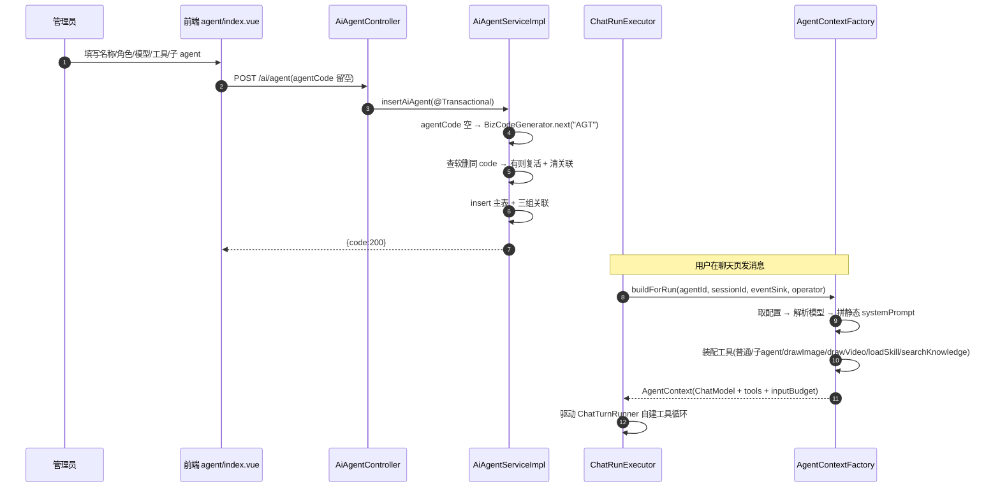
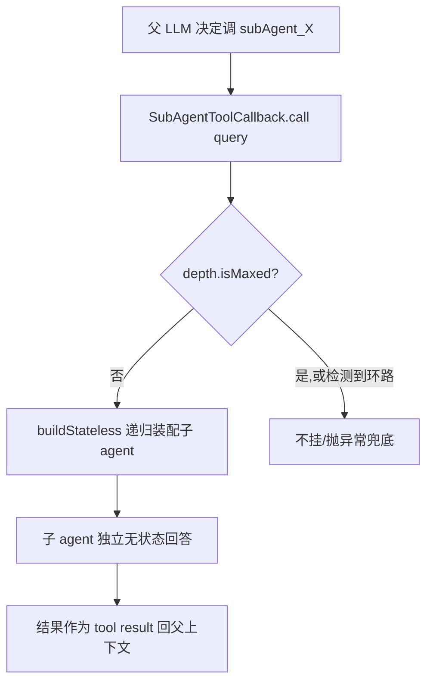

# 智能体模块 API 文档

> 适用版本:agent-java(RuoYi-Vue 改造版)
> 范围:智能体管理 REST 接口 + `IAiAgentService` 服务层 + `AgentContextFactory` 装配 SPI + 子智能体工具协议 + 前端调用对照。
> 配套阅读:`docs/智能体核心模块.md`(装配原理)、`docs/工具生态模块.md`(工具/MCP/Skill)、`docs/聊天执行引擎.md`(Run 如何消费装配产物)。

---

## 1. 模块定位

智能体(Agent)是系统的"对话人格":一行 `ai_agent` 配置 + 若干关联(技能/工具/子智能体),经 `AgentContextFactory` 在运行时装配成 `AgentContext`(`ChatModel` + `ChatOptions` + 工具集 + 系统提示词),由 `ChatTurnRunner` / `AgentToolLoop` 驱动。全链路不经 `ChatClient`。

模块内部分三层:

| 层 | 载体 | 说明 |
|---|---|---|
| 管理面 REST | `AiAgentController`(`/ai/agent`) | 智能体的增删改查,CRUD 式,前端管理页调用 |
| 服务层 | `IAiAgentService` / `AiAgentServiceImpl` | 主表 + 三张关联表的联合读写,含编码生成 / 软删复活 |
| 装配 SPI | `AgentContextFactory` | 把 agent 配置变成 `AgentContext`(ChatModel + 工具集 + 系统提示词),对话运行时调用 |

> 本文只覆盖**管理面 API 与装配 SPI**。对话发起(`POST /ai/chat/run`)与事件推送属于 Chat/Run 模块,见 `docs/聊天对话模块.md`、`docs/聊天执行引擎.md`。

---

## 2. REST API(管理面)

前缀:`/ai/agent`,实现 `ruoyi-admin/.../controller/ai/AiAgentController.java`。

### 2.1 接口总览

| 方法 | 路径 | 说明 | 鉴权/审计 |
|---|---|---|---|
| GET | `/ai/agent/list` | 智能体分页列表 | 登录即可 |
| GET | `/ai/agent/listAll` | 全部启用(`status=0`)的智能体,不分页(下拉用) | 登录即可 |
| GET | `/ai/agent/{agentId}` | 详情(含技能/工具/子智能体关联) | 登录即可 |
| POST | `/ai/agent` | 新增(含关联配置) | `@Log(INSERT)`,按钮 `ai:agent:add` |
| PUT | `/ai/agent` | 修改(先清关联再重建) | `@Log(UPDATE)`,按钮 `ai:agent:edit` |
| DELETE | `/ai/agent/{agentIds}` | 批量删除(逻辑删除 + 清理关联) | `@Log(DELETE)`,按钮 `ai:agent:remove` |

> **接口级权限**:Controller 未加 `@PreAuthorize` 注解,接口仅要求已登录(JWT);按钮级权限由前端 `v-hasPermi(['ai:agent:add'|'ai:agent:edit'|'ai:agent:remove'])` 控制(`views/ai/agent/index.vue:10,195`),与 RuoYi 菜单权限体系一致。
>
> 已下线:`GET /ai/agent/genCode`(编码预览)随"编码一律后端生成"移除,新增不再需要前端预填编码。

### 2.2 查询智能体列表 `GET /ai/agent/list`

- **入参**(query,均可选,叠加 AND):
  - `agentName` / `agentCode`:模糊匹配
  - `modelCode`:绑定的对话模型编码
  - `status`:0 正常 / 1 停用
  - 分页:`pageNum` / `pageSize`(RuoYi `startPage` 标准分页)
- **出参**:`TableDataInfo<AiAgent>`(`{ total, rows, code, msg }`),列表行不含关联明细,仅含 `skillCount` / `toolCount` / `childCount` 计数。
- **示例**:
  ```http
  GET /ai/agent/list?pageNum=1&pageSize=10&agentName=分析
  ```
  ```json
  {
    "total": 2,
    "rows": [
      { "agentId": 1001, "agentCode": "AGT20260727-0001", "agentName": "数据分析师",
        "modelCode": "deepseek-v4-flash", "status": "0", "skillCount": 2, "toolCount": 3, "childCount": 1 }
    ],
    "code": 200, "msg": "查询成功"
  }
  ```

### 2.3 查询全部启用智能体 `GET /ai/agent/listAll`

- **入参**:无
- **出参**:`AjaxResult<List<AiAgent>>`——固定 `status="0"` 过滤,不分页。用于其他模块的下拉选择(如聊天页选 agent、父 agent 选子 agent)。
- 列表元素带 `agentName + agentCode` 展示位,方便前端拼接 `"名称 (AGTxxxx)"` 标签(`views/ai/agent/index.vue:448`)。

### 2.4 查询详情 `GET /ai/agent/{agentId}`

- **入参**:路径参数 `agentId`
- **出参**:`AjaxResult<AiAgent>`,在基础字段之上**完整填充三组关联**(`AiAgentServiceImpl.selectAiAgentById`):
  - `skillIds: Long[]` — 绑定的技能 ID
  - `toolIds: Long[]` — 绑定的工具 ID
  - `childAgents: AiAgentChild[]` — 子智能体列表(含 `childAgentId` / `sort` / `triggerDesc` 与冗余的 `childAgentName` / `childAgentCode`)
- **示例**:
  ```http
  GET /ai/agent/1001
  ```
  ```json
  {
    "agentId": 1001, "agentCode": "AGT20260727-0001", "agentName": "数据分析师",
    "agentRole": "你是资深数据分析师……",
    "modelCode": "deepseek-v4-flash", "imageModelCode": "", "videoModelCode": "",
    "icon": "chart", "theme": 3, "sort": 1, "status": "0",
    "skillIds": [51, 52], "toolIds": [21, 22, 23],
    "childAgents": [{ "parentAgentId": 1001, "childAgentId": 1002, "sort": 1, "triggerDesc": "负责财务测算" }],
    "code": 200
  }
  ```

### 2.5 新增智能体 `POST /ai/agent`

- **请求体**:`AiAgent`(见 §3 字段表)。关键点:
  - `agentCode` **可为空**:为空时后端自动生成 `AGT + yyyyMMdd + 4位流水`(`AiAgentServiceImpl.java:68`);前端新增表单不展示编码字段。
  - `agentRole` 为空时,运行期系统提示词兜底为 `你是 {agentName}。`
  - `skillIds` / `toolIds` / `childAgents` 与主表同事务写入。
- **出参**:`AjaxResult`(`{ code: 200, msg: "操作成功" }`),`rows` 为受影响行数。
- **事务语义**(`AiAgentServiceImpl.insertAiAgent`,`@Transactional`):
  1. `agentCode` 空则 `BizCodeGenerator.next("AGT")`;
  2. 按 code 查含软删记录:命中软删行则**复活旧行**(`reactivateAiAgent`,保留 `create_by/create_time`)并先清关联再重建,避免撞唯一键 `uk_agent_code`;已存在非软删记录则抛 `ServiceException("智能体编码已存在")`;
  3. 正常插入主表后 `insertRelations`:技能/工具批量关联、子智能体批量关联(逐个回填 `parentAgentId`)。
- **示例**:
  ```http
  POST /ai/agent
  Content-Type: application/json

  {
    "agentName": "数据分析师",
    "agentRole": "你是资深数据分析师,擅长用 SQL 与图表回答业务问题。",
    "modelCode": "deepseek-v4-flash",
    "imageModelCode": "",
    "videoModelCode": "",
    "sort": 1, "status": "0", "icon": "chart", "theme": 3,
    "skillIds": [51, 52],
    "toolIds": [21, 22],
    "childAgents": [{ "childAgentId": 1002, "sort": 1, "triggerDesc": "负责财务测算" }]
  }
  ```

### 2.6 修改智能体 `PUT /ai/agent`

- **请求体**:`AiAgent`,必须含 `agentId`;`agentCode` 在编辑时由详情回填(只读),**不允许改编码**。
- **事务语义**(`updateAiAgent`):先删三组旧关联(`deleteAgentSkill/Tool/ChildByAgentId`),再 `insertRelations` 重建,最后更新主表。
- **模型清空**:REST PUT 是整单保存。`modelCode` / `imageModelCode` / `videoModelCode` / `ttsModelCode` 传 `null` 或省略视为取消绑定(Controller 收成空串再 UPDATE)。`AgentMetaTools.updateAgent` 仍是局部更新,不传则保持原值。
- **出参**:同新增。

### 2.7 删除智能体 `DELETE /ai/agent/{agentIds}`

- **入参**:路径参数 `agentIds`,逗号分隔多个 ID(`Long[]`)。
- **语义**:逻辑删除(`del_flag=2`)+ 清理三组关联(`AiAgentServiceImpl.deleteAiAgentByIds`)。删除后同 `agentCode` 可重新创建(走复活路径)。
- **出参**:`AjaxResult`。

---

## 3. 数据模型

### 3.1 `AiAgent`(主表 `ai_agent`)

| 字段 | 类型 | 说明 |
|---|---|---|
| `agentId` | Long | 主键 |
| `agentCode` | String | 对外编码,唯一(`uk_agent_code`),规则 `AGT + yyyyMMdd + 4位流水`,后端自动生成 |
| `agentName` | String | 展示名(必填) |
| `agentDesc` | String | 一句话描述 |
| `agentRole` | String | 系统提示词角色段(G1),对话时拼入 system prompt |
| `loadLocalDoc` | String | 本地文档引导(预留) |
| `modelCode` | String | 绑定的对话模型编码 → `ai_model.model_code`;为空则装配期报"请选择对话模型" |
| `imageModelCode` | String | 绑定的生图模型编码;非空时自动装配 `drawImage` 工具 |
| `videoModelCode` | String | 绑定的视频模型编码;非空时自动装配 `drawVideo` 工具 |
| `ttsModelCode` | String | 绑定的语音模型编码;非空时自动装配 `speak` 工具 |
| `icon` / `theme` | String / Integer | 前端展示:头像图标与 0-7 配色主题 |
| `sort` | Integer | 排序 |
| `status` | String | 0 正常 / 1 停用 |
| `delFlag` | String | 0 存在 / 2 软删 |
| `skillIds` / `toolIds` | Long[] | **非表字段**,详情时反查填充 |
| `childAgents` | List\<AiAgentChild\> | **非表字段**,详情时反查填充 |
| `skillCount` / `toolCount` / `childCount` | Integer | **非表字段**,列表计数 |

### 3.2 `AiAgentChild`(关联表 `ai_agent_child`)

| 字段 | 说明 |
|---|---|
| `parentAgentId` | 父智能体 ID |
| `childAgentId` | 子智能体 ID(须存在) |
| `sort` | 排序,装配时决定工具定义顺序 |
| `triggerDesc` | 触发说明(给父模型的协作提示) |
| `childAgentName` / `childAgentCode` | 冗余展示位(子智能体软删后仍可展示) |

### 3.3 关联关系

```
ai_agent ──1:N── ai_agent_skill(agent_id, skill_id)
ai_agent ──1:N── ai_agent_tool(agent_id, tool_id)
ai_agent ──1:N── ai_agent_child(parent_agent_id, child_agent_id)
```

> 知识库不再挂在智能体上(原 `ai_agent_kb` 已废弃删除),改由会话级选择:`ai_chat_session_kb(session_id, kb_id)`,详见 `docs/聊天对话模块.md` 与 `docs/知识库模块.md`。

新增/修改时全量重建(先删后插);删除时级联清理。

---

## 4. 服务层 API(`IAiAgentService`)

`ruoyi-system/.../service/IAiAgentService.java`:

| 方法 | 说明 |
|---|---|
| `selectAiAgentById(Long)` | 详情 + 三组关联反查 |
| `selectAiAgentList(AiAgent)` | 分页条件查询 |
| `insertAiAgent(AiAgent)` | 新增(编码生成 / 软删复活 / 关联写入 / KB 权限校验) |
| `updateAiAgent(AiAgent)` | 修改(关联全量重建) |
| `deleteAiAgentById(Long)` | 逻辑删除 + 清理关联 |
| `deleteAiAgentByIds(Long[])` | 批量删除 |

> 已下线:`genCode()`(编码预览)已随 REST `GET /ai/agent/genCode` 一并移除,编码统一由 `insertAiAgent` 兜底生成。

---

## 5. 装配 SPI(`AgentContextFactory`)

`ruoyi-system/.../ai/agent/AgentContextFactory.java`,`@Component`。对话运行时把 agent 配置装配成可执行产物,是"管理配置 → 运行能力"的桥梁。

### 5.1 入口方法

| 方法 | 行号 | 用途 |
|---|---|---|
| `buildForRun(agentId, sessionId, eventSink, operator)` | `:82` | **顶层 agent 装配**(挂记忆顾问);事件出口与操作者身份由 `ChatRunExecutor` 显式传入 |
| `buildStateless(agentId, sessionId, depth, eventSink, operator)` | `:90` | 子 agent 装配,**无状态**(不挂记忆顾问、`conversationId=null`) |
| `buildStateless(agentId, sessionId, depth, eventSink, operator, invId)` | `:103` | 同上 + `invId` 作为该调用实例内部事件的 owner 标签(同一子 agent 一轮被调多次时不串卡) |

> 已下线:`build(agentId, sessionId)` 与 `SseEmitterHolder` 抓取(随 SSE 短链路移除),装配入口统一收敛到 `buildForRun`。

### 5.2 装配产物 `AgentContext`(record)

`ruoyi-system/.../ai/agent/AgentContext.java`:

| 字段 | 说明 |
|---|---|
| `agentId` / `agentCode` | 身份 |
| `chatModel` / `chatOptions` | `AgentToolLoop` 每轮 `chatModel.stream(prompt)` 用;`chatOptions` 已关 `internalToolExecutionEnabled` 并挂 toolCallbacks。**没有 `client` 字段** |
| `tools` | 装配出的全部 `ToolCallback` 列表 |
| `systemPrompt` | 静态系统提示词(角色 + 技能指引 + 协作说明 + 工作区工具 + 环境) |
| `conversationId` | `sessionId:agentId`(顶层);子 agent 为 `null` |
| `modelId` / `model` | 计量归因与上下文预算用;派生 `inputModalities()` / `reasoningEnabled()`(`visionEnabled()` 已 `@Deprecated`) |
| `inputBudget` | 该 agent 自己模型的输入预算(token)= 窗口规则,per-agent 计算 |

工具往返以真实 `assistant(tool_calls)+tool` 消息跨轮保留,**没有 `toolSummary` 字段,也不再注入摘要 UserMessage**。

### 5.3 工具装配(`doBuild` 内顺序固定)

| 顺序 | 来源 | 说明 |
|---|---|---|
| 1 | `resolveTools`(`:232`) | `toolIds` → 按 `toolCode` 从 `ToolCallbackRegistry` 取回调;**按启用顺序占槽回填**(顺序一变会让上游工具定义 KV-cache 整体失配);缺失时自愈刷新一次再重试,仍缺失则跳过(降级少一个工具) |
| 2 | `resolveSubAgents`(`:344`) | 每个 `childAgent` 包成 `SubAgentToolCallback`,按 `sort` 排序;深度已达上限时不挂 |
| 3 | `resolveScreenshotTool` | 会话工作区截图工具(动态生成) |
| 4 | `resolveImageTool` | 绑定 `imageModelCode` 时动态生成 `drawImage`(不进 `ai_tool` 表) |
| 5 | `resolveVideoTool` | 绑定 `videoModelCode` 时动态生成 `drawVideo`(不进 `ai_tool` 表;与生图平行) |
| 6 | `resolveSpeechTool` | 绑定 `ttsModelCode` 时动态生成 `speak` |
| 7 | `resolveSkillTool` | 挂了技能时自动挂 `loadSkill`(与系统提示词"先用 loadSkill 取规则"配套) |
| 8 | `resolveKnowledgeTool` | 按 **sessionId** 查会话知识库(`ai_chat_session_kb`)装配 `searchKnowledge`(带出处的向量检索;会话未选知识库则不下发) |

静态工具与动态媒体工具(截图/生图/视频/语音/技能/知识库)统一包一层 `RecordingToolCallback`(`wrapRecording`);子 agent 由自身保证 `toolSource="agent"` 记账,避免外层包装导致 source 误判。截图**无条件**挂载。

### 5.4 系统提示词(静态,三段式)

`buildSystemPrompt`(`:423`):角色段(`agentRole`,空则兜底 `你是 {agentName}。`)+ 技能指引段(只放技能 description 不放 promptTemplate,渐进披露省 94% token)+ 协作说明段(有子智能体时提示"调用下属智能体必须把背景写进 query")。

### 5.5 深度与环路保护(`AgentCallDepth`)

- 递归深度上限 **3**(`AgentCallDepth.java`);达到上限时不再挂子 agent 工具(模型看不到自然不会调,比抛异常友好)。
- 环路检测:同链中出现重复 `agentId` 抛 `ServiceException("检测到智能体循环调用")`。

---

## 6. 子智能体工具协议(`SubAgentToolCallback`)

子智能体被包装成标准 `ToolCallback`,挂到父 agent 的工具列表:

| 项 | 值 |
|---|---|
| 工具名 | `subAgent_{childAgentId}` |
| inputSchema | 仅一个必填参数 `query`(String):"交给该智能体处理的任务描述,需包含必要背景"(`SubAgentToolCallback.java:59`) |
| 返回 | 子 agent 的最终回答文本(作为 tool result 回到父上下文) |
| 记账 | `toolSource="agent"` + `subAgentId`,由本类直接写记录(`:486-518`),**不包** `RecordingToolCallback` |
| 事件 | 推 `agent_start` / `agent_end`(带 `owner` / `invId`),前端按调用实例嵌套渲染 |

父 agent 通过原生 tool calling 决定"调谁、传什么";子 agent **无状态**(每次调用干净的,看不到父的对话历史),所以父必须把背景完整写进 `query`。

---

## 7. 前端调用对照

`ruoyi-ui/src/api/ai/agent.js`:

| JS 函数 | HTTP | 说明 |
|---|---|---|
| `listAgent(query)` | `GET /ai/agent/list` | 分页列表 |
| `listAllAgent()` | `GET /ai/agent/listAll` | 下拉用全量启用 |
| `getAgent(agentId)` | `GET /ai/agent/{id}` | 详情 |
| `addAgent(data)` | `POST /ai/agent` | 新增 |
| `updateAgent(data)` | `PUT /ai/agent` | 修改 |
| `delAgent(agentIds)` | `DELETE /ai/agent/{ids}` | 批量删除 |

页面:`ruoyi-ui/src/views/ai/agent/`(`index.vue` 列表/详情/编辑 + `CapabilityPicker.vue` 关联技能/工具/子 agent + `AgentTopology.vue` 拓扑图)。新增弹窗不展示编码字段(后端生成),编辑时编码只读回显。

---

## 8. 典型调用时序

### 8.1 新增智能体 → 首次对话装配



### 8.2 子智能体递归调用(深度控制)



---

## 9. 与相关模块的边界

| 模块 | 关系 |
|---|---|
| 聊天执行引擎 | `ChatRunExecutor` → `buildForRun` 装配顶层;`ChatTurnRunner` 消费 `AgentContext` |
| 模型管理/渠道 | `modelCode` → `AiModel`;`ChatModelFactory` 按渠道权重构造底层模型 |
| 知识库 | 会话级选择(`ai_chat_session_kb`)→ `resolveKnowledgeTool` 按 sessionId 装配 `searchKnowledge`;写会话知识库时校验 KB USE 权限 |
| 工具生态 | `toolIds` 绑定 → `ToolCallbackRegistry` 按 code 取回调;装配期包 `RecordingToolCallback` |
| 技能 | `skillIds` 绑定 → 装配 `loadSkill` + 提示词技能指引段 |
| 计量 | 每次 LLM 调用按 `agentId` 归因(`ai_llm_call`);`AgentContext.inputBudget` 供工具预算判定 |

---

## 附录:关键文件速查

| 关注点 | 路径 |
|---|---|
| REST 入口 | `ruoyi-admin/.../controller/ai/AiAgentController.java` |
| 服务层 | `ruoyi-system/.../service/IAiAgentService.java` + `impl/AiAgentServiceImpl.java` |
| 数据模型 | `ruoyi-system/.../domain/AiAgent.java`、`AiAgentChild.java` |
| 装配核心 | `ruoyi-system/.../ai/agent/AgentContextFactory.java` |
| 装配产物 | `ruoyi-system/.../ai/agent/AgentContext.java` |
| 子智能体工具 | `ruoyi-system/.../ai/agent/SubAgentToolCallback.java` |
| 深度/环路保护 | `ruoyi-system/.../ai/agent/AgentCallDepth.java` |
| 前端 API 封装 | `ruoyi-ui/src/api/ai/agent.js` |
| 前端页面 | `ruoyi-ui/src/views/ai/agent/` |
| 表结构 | `docs/AI业务表结构.md`(ai_agent / ai_agent_skill / ai_agent_tool / ai_agent_child) |
