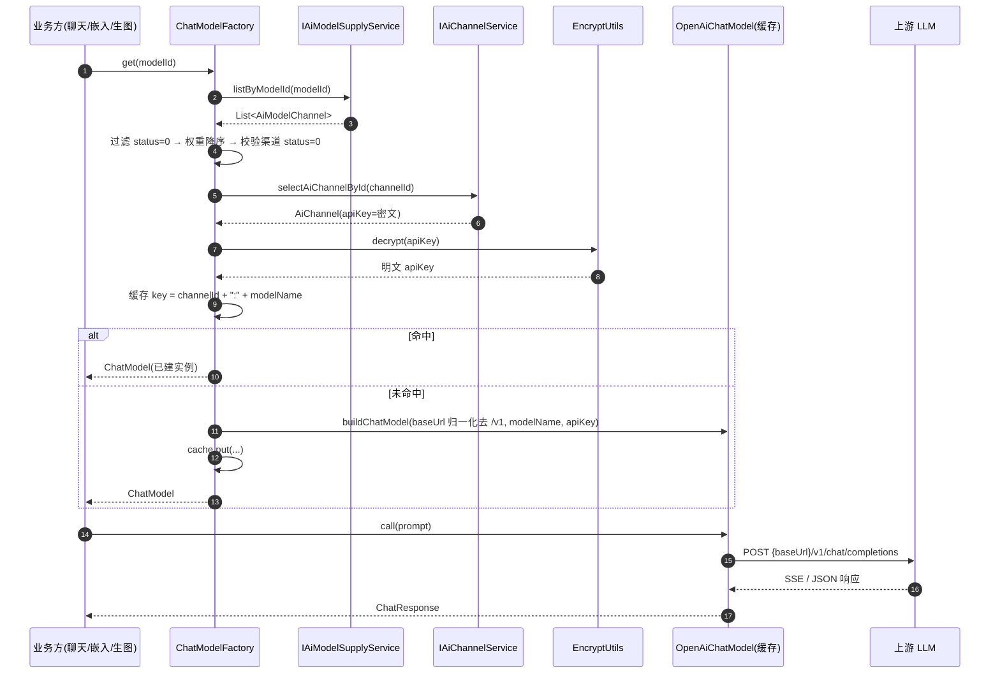
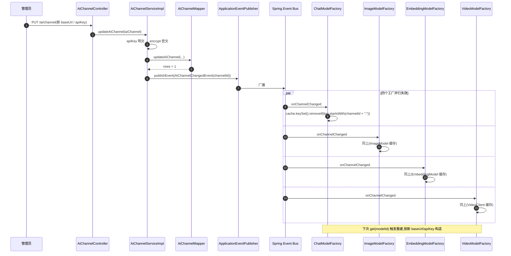
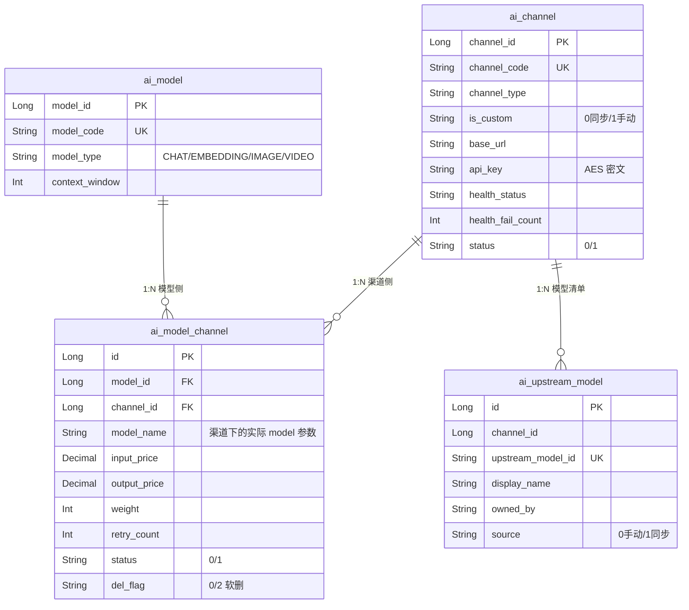

# 模型渠道模块(Channel & ModelChannel)设计文档

> 适用版本:agent-java(RuoYi-Vue 改造版)
> 范围:`ruoyi-system` 子模块 + `ruoyi-admin` 渠道管理接口 + 前端 `views/ai/channel` & `views/ai/modelChannel`

---

## 1. 模块概述

### 1.1 Channel(渠道)是什么

Channel 是系统对**上游 LLM 提供方**的抽象配置单元。一条 Channel 记录描述了"打哪个地址、用什么密钥、属于哪个协议族",典型字段见 `AiChannel.java:21-55`:

| 字段 | 说明 |
| --- | --- |
| `channelId` | 主键 |
| `channelName` | 业务展示名,如"主 OPENAI 池" |
| `channelCode` | 程序引用编码(全局唯一,`uk_channel_code`),生成规则 `CH + yyyyMMdd + 4 位流水`(`AiChannelServiceImpl.java:104-105`) |
| `channelType` | 协议族:`OPENAI` / `ANTHROPIC` / `GEMINI` / `OLLAMA`(等 OpenAI 兼容中转) |
| `isCustom` / `is_custom` | 是否自定义渠道(0 否 / 1 是);自定义渠道手动维护模型清单,非自定义渠道从上游同步 |
| `baseUrl` | API 根地址,**apiKey 经 AES 加密后入库**,展示走脱敏(只显 `sk-a****xyz`) |
| `healthCheckUri` | 探活路径,默认 `/models`(`AiChannelServiceImpl.java:256-258`) |
| `healthStatus` / `healthFailCount` | 健康状态机,连续 3 次失败置为异常(`AiChannelServiceImpl.java:37,222`) |
| `status` | 启停(0 正常 / 1 停用) |

> ⚠️ **已知问题(2026-08-29 确认,暂不修复)**:探活使用统一的 `GET baseUrl + healthCheckUri`(默认 `/models`)并把非 2xx 视为异常。部分 OpenAI 兼容上游(如火山方舟套餐 `.../api/plan/v3`)**不提供 `GET /models` 端点**,会导致健康检查误报,但运行时模型调用(按版本化 baseUrl 拼 `/chat/completions`)正常。判断渠道是否真的不可用,应以实际对话调用的失败为准,而非探活状态。

### 1.2 为什么需要这一层抽象

把"打哪家、用什么 key"从"模型本体"剥出来,核心动机有三点:

1. **同模型可多供应**:同一个语义模型(如 `gpt-4o`)可以同时挂在 OPENAI 官方、Azure、自建中转、第三方代理上,通过 `AiModelChannel` 的 `weight` 字段做权重路由,故障时还能通过 `retryCount` 重试(`AiModelChannel.java:32-42`)。
2. **密钥与协议集中管控**:不同渠道的 `apiKey` 加密策略统一,健康检查、启停、探活口径统一,不在每个 Model 工厂里重复造轮子。
3. **热更新友好**:`baseUrl` / `apiKey` 改完要立刻生效,但 Spring AI 的 `OpenAiApi` 实例在构造时就把这些字段烧进去了(`ChatModelFactory.java:31-33`),所以必须有"事件 → 缓存失效"通路(见 §2.2 / §3.2)。

### 1.3 Channel 与 Model 工厂的关系

```
                    ┌──────────────────────┐
                    │   AiModel(模型本体)  │  ← 语义/能力/价格档位
                    └──────────┬───────────┘
                               │ 1:N
                    ┌──────────▼───────────┐
                    │  AiModelChannel(供应)│  ← 权重/重试/本渠道 modelName
                    └──────────┬───────────┘
                               │ N:1
                    ┌──────────▼───────────┐
                    │    AiChannel(渠道)   │  ← 协议/baseUrl/apiKey
                    └──────────┬───────────┘
                               │
        ┌──────────────────────┼──────────────────────┐
        ▼                      ▼                      ▼
ChatModelFactory       ImageModelFactory      EmbeddingModelFactory      VideoModelFactory
(ruoyi-system/ai)      (ruoyi-system/ai)      (ruoyi-system/ai)           (ruoyi-system/ai)
   ChatModel              ImageModel             EmbeddingModel            OpenAiCompatibleVideoClient
```

工厂层只关心 `modelId`,由 `IAiModelSupplyService.listByModelId` 反查到 `AiModelChannel` 列表,按权重降序选一条、然后用其 `channelId` 拿 `AiChannel`、解密 `apiKey`、按协议类型构造 Spring AI 客户端。**工厂从不直接持久化任何东西**,全部依赖 `IAiChannelService` / `IAiModelChannelService` 读库。

---

## 2. 关键类与职责

### 2.1 UpstreamModelClient(`ruoyi-system/src/main/java/com/ruoyi/system/ai/UpstreamModelClient.java`)

**职责**:实时拉取上游渠道的可选模型清单,**仅服务于非自定义渠道的显式同步功能**;拉取成功后由 Service 写入 `ai_upstream_model`。

Spring AI 没有标准的"模型列表 API",该类用 `RestClient` + Jackson 按 `channelType` 适配三种协议:

| 协议 | 请求 | 鉴权头 | 解析器 |
| --- | --- | --- | --- |
| `OPENAI` / `OLLAMA` / 各类 OpenAI 兼容中转 | `GET {baseUrl}/models`(`UpstreamModelClient.java:99-104`) | `Authorization: Bearer` | `parseOpenAiShape`(`:134-158`) |
| `ANTHROPIC` | `GET {baseUrl}/models`(`:111-117`) | `x-api-key` + `anthropic-version: 2023-06-01` | `parseOpenAiShape`,`owned_by` 缺省回退为 `anthropic` |
| `GEMINI` | `GET {baseUrl}/models?key=xxx&pageSize=1000`(`:124-128`) | 走 query string | `parseGeminiShape`(`:163-186`),需剥离 `models/` 前缀 |

关键约束:

- 通用超时 5s 连接 / 15s 读(`:43-45`)
- 错误分三档封装为 `ServiceException`:`RestClientResponseException`(上游返回 4xx/5xx)、`RestClientException`(网络层)、其他(解析失败),文案区分明确(`:77-91`)
- 入参 `apiKey` 由 Service 层**先解密再传进来**,本类不直接接触加密
- 返回 `UpstreamModel(id, displayName, ownedBy)` 是不可变值对象,同步服务会去重后全量写入上游模型表

### 2.2 上游模型表(`ai_upstream_model`)

`ai_upstream_model` 是渠道维度的模型候选池,唯一键为 `(channel_id, upstream_model_id)`,保存模型标识、展示名、归属方和来源(`0` 手动、`1` 同步)。模型导入和供应候选只查这张表,不再为打开一个页面并发访问外部网络。

两类渠道行为严格分开:

- 自定义渠道(`is_custom=1`):适合没有可靠 `/models` 的私有部署,允许手动新增、编辑和删除,禁止同步。
- 非自定义渠道(`is_custom=0`):禁止手动新增、删除,由“同步模型”全量覆盖;允许编辑展示名、归属方和备注。

同步有三条不变量:

1. 先成功拉取并校验,再删除旧清单,避免上游超时把已有数据清空。
2. 上游返回空列表时拒绝覆盖,把异常空响应当失败处理。
3. Service 层校验渠道类型,不能只依赖前端隐藏按钮。

### 2.3 AiChannelChangedEvent(`ruoyi-system/src/main/java/com/ruoyi/system/ai/AiChannelChangedEvent.java`)

**职责**:`record` 形态的 Spring 应用事件,载荷只有 `Long channelId`,`null` 表示"所有渠道都要失效"(`AiChannelChangedEvent.java:6-12`)。

**为什么用事件而不是直连**:`AiChannelServiceImpl` 写事件,`ChatModelFactory` / `ImageModelFactory` / `EmbeddingModelFactory` / `VideoModelFactory` 监听事件。如果让 Service 直接 `@Autowired` 工厂,工厂本身又依赖 `IAiChannelService` 读库——形成循环依赖,Spring Boot 默认禁止,启动直接失败。事件是单向的,解耦得干干净净。

**发布点**(都在 `AiChannelServiceImpl.java`):

| 操作 | 行号 | 是否发事件 |
| --- | --- | --- |
| `updateAiChannel` | `:131-143` | 修改成功时发 |
| `deleteAiChannelById` | `:147-157` | 删除成功时发 |
| `deleteAiChannelByIds` | `:161-174` | 逐个发 |

`publishChannelChanged` 用 `try-catch` 吞掉广播异常(`:177-188`),防止缓存失效失败回滚掉真正的修改事务——典型旁路降级。

**订阅点**:
- `ChatModelFactory.onChannelChanged` → `evict(channelId)` + 清渠道行快照(channelRows)+ 清全部路由缓存(routes)
- `ImageModelFactory.onChannelChanged`(`:122-126`)→ `evict(channelId)`
- `EmbeddingModelFactory.onChannelChanged`(`:96-100`)→ `evict(channelId)`
- `VideoModelFactory.onChannelChanged` → `evict(channelId)`

四个工厂**各自管自己的缓存**,通过 `channelId + ":"` 前缀精确失效,不会误伤(`ChatModelFactory.java` 的注释特别强调:必须带冒号,否则渠道 1 的失效会顺手清掉渠道 10、100)。

**ChatModelFactory 的三层缓存**:①模型实例(channelId:modelName,原有);②路由(modelId → 选中的供应,30s TTL);③渠道行快照(channelId → AiChannel,30s TTL)。缓存命中路径零 SQL;apiKey 只在构造新实例时解密一次(此前每次调用都做一次 AES)。渠道启停/改配置经事件即时失效三层;**供应侧(权重/状态/modelName)变更没有事件,靠 30s TTL 兜底** —— 最坏情况是 30s 内仍按旧供应路由(两条都是有权的有效供应,语义可接受)。

### 2.4 AiChannelController(`ruoyi-admin/src/main/java/com/ruoyi/web/controller/ai/AiChannelController.java`)

`/ai/channel` 前缀,提供 6 个端点,见 §4 接口表。**安全策略**:列表/详情都走 `selectAiChannelListMasked` / `selectAiChannelVoById`,`apiKey` 经 `EncryptUtils.mask` 脱敏(`AiChannelServiceImpl.java:78-95`);新增/修改接收明文,Service 加密入库(`:107,135`)。

一个"非标准 CRUD"端点值得一提:
- `POST /{channelId}/check`(`AiChannelController.java:93-102`):手动触发健康检查,基于 `java.net.http.HttpClient`,5s 连接 / 10s 读超时,3xx 不算 200(`AiChannelServiceImpl.java:241-279`)

### 2.5 模型渠道绑定(供应):收敛到 AiModelController 的 `/supply` 子资源

独立的 `AiModelChannelController`(`/ai/modelChannel` 前缀)已移除,渠道×模型的绑定关系(内部称"供应")对外统一由 `AiModelController` 的 `/ai/model/{modelId}/supply` 子资源承接(`AiModelController.java:108-149`),服务层为 `IAiModelSupplyService`(`AiModelSupplyServiceImpl.java`)。

**关键差异**:`addSupply` 内部调用的是 `aiModelChannelService.saveBinding(entity, operator)` 而非直接 `insertAiModelChannel`(`AiModelSupplyServiceImpl.java:174`),因为 `saveBinding` 解决了"删了再添加撞唯一约束 `uk_model_channel`"的复活问题(`AiModelChannelServiceImpl.java:63-96`)——查到软删记录就直接 `reactivateAiModelChannel` 覆写,保留 `create_by` / `create_time`。`updateSupply` / `removeSupply` 分别走 `updateAiModelChannel` / `deleteAiModelChannelByIds`(`AiModelSupplyServiceImpl.java:176-210`)。

---

## 3. 核心流程

### 3.1 上游模型调用链(Channel → UpstreamClient → 真实 LLM)



要点:
- 工厂按 `OpenAiCompatibleEndpoint` 推导端点:`baseUrl` 末段已是 `vN` 版本段(命中 `/v1`、`/v3` 等)就保留 base、依赖路径 `/chat/completions` 不再拼 `/v1`,避免 `…/v3/v1/chat/completions` 双版本(火山方舟 `/api/plan/v3` 渠道 404 的根因);无版本段的 base(官方 OpenAI 风格)保留 Spring AI 默认 `/v1` 前缀
- 五个工厂(Chat / Embed / Image / Video / Tts)监听同一事件清缓存,Chat 多挂一个 `CacheUsageProbe`
- 同一 `channelId:modelName` 多次请求复用同一 `ChatModel` 实例

### 3.2 Channel 变更事件触发缓存刷新



删除渠道走另一条路:`deleteAiChannelById` / `deleteAiChannelByIds`(`AiChannelServiceImpl.java:147-174`)除了发事件,还会**先物理删 AiModelChannelMapper.deleteByChannelIds**,把悬空绑定清理掉,然后逐个广播。

### 3.3 Model 与 Channel 的多对多绑定



**绑定表的设计要点**(`AiModelChannel.java`):

- `modelName`:该渠道下的"实际 model 参数"。一般情况下等于 `modelCode`,但 **Azure 等场景同一逻辑模型在自家部署叫法不同**,这里独立列出来允许覆盖(`:30`)
- `inputPrice` / `outputPrice`:每条绑定独立计价,方便区分同模型不同渠道的成本
- `weight` + `retryCount`:权重降序选渠道、失败按 retryCount 重试下一权重
- 软删 `del_flag` + 唯一约束 `uk_model_channel` 组合下,`saveBinding` 走"复活"路径而不是直接 insert(`AiModelChannelServiceImpl.java:63-96`)

---

## 4. 对外接口

### 4.1 渠道管理 `/ai/channel`

| 方法 | 路径 | 鉴权/审计 | 入参 | 出参 | 说明 |
| --- | --- | --- | --- | --- | --- |
| GET | `/list` | - | `AiChannel` 查询条件 | `TableDataInfo<AiChannelVo>` | 列表,**apiKey 脱敏** |
| GET | `/{channelId}` | - | 路径:渠道 ID | `AjaxResult<AiChannelVo>` | 详情,脱敏 |
| POST | `/` | `@Log(INSERT)` | `AiChannel`(明文 apiKey) | `AjaxResult` | 新增,自动生成 channelCode,加密入库 |
| PUT | `/` | `@Log(UPDATE)` | `AiChannel` | `AjaxResult` | 修改,广播 `AiChannelChangedEvent` |
| DELETE | `/{channelIds}` | `@Log(DELETE)` | 路径:ID 数组 | `AjaxResult` | 物理删除 + 级联清绑定 + 广播事件 |
| POST | `/{channelId}/check` | `@Log(UPDATE)` | 路径:渠道 ID | `AjaxResult("渠道正常"/"渠道异常")` | 手动探活 |

### 4.2 模型渠道绑定(供应)`/ai/model/{modelId}/supply`

| 方法 | 路径 | 鉴权/审计 | 入参 | 出参 |
| --- | --- | --- | --- | --- |
| GET | `/{modelId}/supply` | - | 路径:模型 ID | `AjaxResult<List<AiModelChannel>>` 该模型的供应列表 |
| POST | `/{modelId}/supply` | `@Log(INSERT)` | `AiModelChannel` 绑定 | `AjaxResult`(`addSupply` → `saveBinding`,支持复活) |
| PUT | `/supply` | `@Log(UPDATE)` | `AiModelChannel` 绑定 | `AjaxResult`(`updateSupply`) |
| DELETE | `/supply/{ids}` | `@Log(DELETE)` | 路径:绑定 ID 数组 | `AjaxResult`(`removeSupply`) |

前端入口:`ruoyi-ui/src/views/ai/channel/index.vue`(渠道卡片+表单)与 `ruoyi-ui/src/views/ai/model/index.vue` + `views/ai/model/supply.vue`(模型供应维护)。

新增供应不再调用模型维度的候选接口。前端先读取启用渠道与 `ai_upstream_model` 清单,依次选择渠道和该渠道下的具体模型标识;该标识写入 `ai_model_channel.model_name`,因此可以与平台 `ai_model.model_code` 不同。Service 保存时会再次校验该渠道模型确实存在。

---

## 4.5 前后端交互

**前端页面**:`ruoyi-ui/src/views/ai/channel/index.vue`(渠道卡片 + 新增/编辑表单)+ `channel/upstreamModel.vue`(渠道模型清单,即上游模型管理)+ `views/ai/model/supply.vue`(模型供应绑定);**API 封装**:`channel.js` / `upstreamModel.js` / `model.js`。

| 前端操作 | API 函数 | HTTP | 后端端点 | 说明 |
| --- | --- | --- | --- | --- |
| 渠道列表 | `listChannel(query)` | GET | `/ai/channel/list` | apiKey 脱敏展示(`sk-a****xyz`) |
| 详情回填 | `getChannel(channelId)` | GET | `/ai/channel/{channelId}` | 编辑表单回显,apiKey 不回明文 |
| 新增渠道 | `addChannel(data)` | POST | `/ai/channel` | apiKey 明文提交,后端 AES 加密 |
| 修改渠道 | `updateChannel(data)` | PUT | `/ai/channel` | 广播 `AiChannelChangedEvent`,工厂缓存重建 |
| 删除渠道 | `delChannel(channelIds)` | DELETE | `/ai/channel/{channelIds}` | 级联清绑定 + 广播事件 |
| 手动探活 | `checkChannel(channelId)` | POST | `/ai/channel/{channelId}/check` | 「测试连接」按钮,同步返回"正常/异常" |
| 同步模型清单 | `syncUpstreamModel(channelId)` | POST | `/ai/upstreamModel/sync/{channelId}` | 渠道详情内从上游拉取模型清单 |
| 模型清单查询 | `listUpstreamModel(query)` | GET | `/ai/upstreamModel/list` | `upstreamModel.vue` 列表 |
| 供应绑定 | `addModelSupply` / `updateModelSupply` | POST/PUT | `/ai/model/{modelId}/supply` 等 | 见 `模型管理模块.md §4.5` |

**交互要点**:
- **apiKey 单向透明**:新增/修改时明文提交一次,此后列表与详情只返回脱敏串;前端无任何解密展示能力,避免密钥经前端回显。
- **探活是同步请求**:点「测试连接」→ `checkChannel` → 服务端按 `baseUrl + healthCheckUri` 发请求,2xx 返回"渠道正常",否则"渠道异常"。已知部分上游(火山方舟)不支持 `GET /models` 会误报(见 §1.1),实际可用性以对话调用为准。
- **渠道 → 模型工厂联动是无状态的**:前端改完渠道只是发起事件,`ChatModelFactory` 等异步重建缓存,前端无需轮询;下一次对话自动使用新配置。
- **新增供应走"选渠道 → 选渠道模型"两步**:前端先拿启用渠道 + `ai_upstream_model` 清单,用户选定后 `modelName` 直接写入绑定,服务端再校验该模型确实存在于该渠道。

---

## 5. 依赖关系

### 5.1 内部模块协作

```
┌─────────────────┐         ┌──────────────────────┐
│ AiChannelCtrl   │         │ AiModelCtrl(supply)  │
└────────┬────────┘         └──────────┬───────────┘
         │                             │
         ▼                             ▼
┌─────────────────┐         ┌──────────────────────┐
│ IAiChannelSvc   │◄────────│ IAiModelSupplySvc    │
└────────┬────────┘         └──────────┬───────────┘
         │ event                      │ 复用
         ▼                            ▼
┌─────────────────┐         ┌──────────────────────┐
│ AiChannelChanged│         │ IAiModelChannelSvc   │
│      Event      │         └──────────────────────┘
└────────┬────────┘
         │ @EventListener
   ┌─────┼──────┬─────────┐
   ▼     ▼      ▼         ▼
ChatF  ImageF  EmbedF   ...
   │     │      │
   └─────┴──────┴───► Spring AI
                          │
                          ▼
                    ┌──────────┐
                    │ 上游 LLM │
                    └──────────┘
```

- `AiChannelServiceImpl` 注入 `AiModelChannelMapper` 用于**级联清理**(`:52,153,167`),单向依赖,无环
- 五个工厂都注入供应/渠道服务,通过事件被动接收失效通知,而不是主动调 Service
- 横向依赖:`UpstreamModelClient` 只被 `AiUpstreamModelServiceImpl.syncFromUpstream` 调用;导入和供应候选通过 `AiUpstreamModelMapper` 查落库清单

### 5.2 事件如何被消费

事件载荷只有 `Long channelId`(`AiChannelChangedEvent.java:12`),所有 `@EventListener` 处理都是无状态、幂等的,广播失败被 `try-catch` 吞掉(`AiChannelServiceImpl.java:184-187`)。这意味着:**就算事件丢了,最坏情况是缓存里那个旧 `ChatModel` 一直用着,直到下次重启**——比改完配置却让事务回滚要友好得多。

### 5.3 与 Model 模块的协作

- `ai_model` 表由 `AiModelImportServiceImpl` 写入,`ai_model_channel`(供应)由 `AiModelSupplyServiceImpl.addSupply` → `saveBinding` 写入
- `ai_model_channel` 的 `modelName` 字段(对应"该渠道下的实际 model 参数")解决了同一逻辑模型在多渠道下标识不同的问题,如 Azure 部署的 `gpt-4o` 实际叫 `gpt-4o-2024-08-06`
- 模型工厂选渠道时只看 `modelId`,再从 `ai_model_channel` 反查 `channel_id`,因此**增加/删除供应不需要重启**

---

## 6. 典型使用场景

### 6.1 场景一:新接入一家 OPENAI 兼容中转

1. 管理员进"渠道管理",点"新增",编码由后端 `insertAiChannel` 自动生成(`CH + yyyyMMdd + 4 位流水`),新增表单不展示编码字段
2. 填名称、类型选 `OPENAI`、填 `https://api.example.com/v1`、填 apiKey,**前端展示的 apiKey 已经是 `sk-x****yz` 脱敏形态**
3. 提交 `POST /ai/channel`,`AiChannelServiceImpl.insertAiChannel` 加密入库,健康状态初始化为 "0 未知"
4. 在渠道卡片点“同步模型”,`AiUpstreamModelServiceImpl` 拉取 `/models` 并全量写入 `ai_upstream_model`
5. 进“模型管理 → 导入模型”,选择渠道后从已落库清单读取待选模型;若清单为空,页面引导返回渠道管理同步
6. 选择模型并提交,`AiModelImportServiceImpl.importModel` 事务内完成“建 `ai_model` + 建 `ai_model_channel` 绑定(含 weight / retryCount / price)”
7. 用户发起对话 → `ChatModelFactory.get(modelId)` → 缓存未命中 → `buildChatModel` 构造实例 → 缓存

### 6.2 场景二:中转地址变更,需要立刻生效

1. 运维在渠道列表编辑,把 `baseUrl` 从 `https://api.old.com/v1` 改成 `https://api.new.com/v1`
2. `PUT /ai/channel` → `updateAiChannel` 更新数据库 → `publishChannelChanged(channelId)`
3. 五个工厂**并行**收到 `AiChannelChangedEvent`,各自清掉 `channelId:` 前缀的缓存条目
4. 下一笔请求进来,`get(modelId)` 缓存未命中,按新 baseUrl + 新 apiKey 重建 `OpenAiChatModel`
5. 无需重启,无需手动清缓存

如果忘了发事件会怎样?`AiChannelServiceImpl.java:127-129` 的注释点明了:baseUrl/apiKey 在构造时就烧进 `OpenAiApi` 了,改库不会影响已建实例,只能等后端重启——这正是事件机制存在的核心价值。

### 6.3 场景三:同模型多渠道权重路由 + 故障降级

假设 `gpt-4o` 同时挂在:
- 渠道 A(OPENAI 官方,weight=80,retryCount=1)
- 渠道 B(自建中转,weight=20,retryCount=2)

1. 用户请求进来,`ChatModelFactory.get(modelId)`
2. `supplies.stream().sorted(compareWeightDesc)` 拿到降序的供应列表,先选 A
3. `isChannelActive` 校验 A 的 `status=0` 才用,否则降级到 B
4. A 调成功,正常返回
5. 若 A 调失败且 `retryCount=1` 还有一次机会,就**重试同一渠道**;若耗尽则回到排序列表选下一条(B)
6. `AiChannelServiceImpl.checkHealth` 配合定时/手动探活,连续 3 次失败把 A 置为 `health_status=2` 异常,后续即使权重高也会被 `isChannelActive` 过滤(注意:此处只校验 `channel.status=0`,不校验 `health_status`,故障降级靠 `retryCount` 路由 + 探活信号的综合作用)

### 6.4 场景四:删除渠道时的级联清理

1. 管理员删除渠道 ID=42
2. `DELETE /ai/channel/42` → `deleteAiChannelById(42)`
3. **先物理删 `ai_model_channel` 中 `channel_id=42` 的所有行**(`AiChannelServiceImpl.java:153`)——避免悬空绑定被工厂查到后报"渠道不存在"
4. 再发 `AiChannelChangedEvent(42)`,五个工厂清缓存
5. 之后任何按 `modelId` 查 ChatModel 的请求,若该模型只剩渠道 42 的绑定,会被工厂抛"该模型暂无可用渠道"

---

## 7. 关键设计取舍总结

| 决策 | 选择 | 理由 |
| --- | --- | --- |
| Channel 与 Model 关系 | **独立表 + 绑定表** | 支持同模型多渠道、权重路由、独立计费、热替换 |
| 缓存键 | `channelId + ":" + modelName` | 失效粒度精确,前缀匹配避免误清(渠道 1 vs 10 vs 100) |
| 缓存失效通路 | Spring `ApplicationEvent` | 解耦 Service 与 Factory,避免循环依赖 |
| apiKey 存储 | AES 加密 + 展示脱敏 | 库泄漏也拿不到明文,前端列表不可能泄露完整 key |
| 健康检查 | 5s 连接 / 10s 读 / 3 次失败阈值 | 防止探活把主流程拖死,平衡灵敏度与误报 |
| `baseUrl` 归一化 | 是否版本段在 base 里(末段 `vN`)决定依赖路径带不带 `/v1` | base 已带版本(`/v1` `/v3` `/v4`)不重拼,避免 `/v3/v1` 双版本;否则保留 `/v1` 默认 |
| 软删 + 唯一约束冲突 | 复活旧行(`reactivate*`) | 保留审计与外键历史,避免 `uk_channel_code` 撞键失败 |
| 事件广播失败 | 旁路 try-catch,不回滚 | 缓存陈旧只是次优,主事务回滚是用户可见的故障 |
| 协议适配 | `UpstreamModelClient` 三分支 | Spring AI 没提供 list API,自实现以支持三种主流协议 |
| 清单数据源 | `ai_upstream_model` 落库,导入/候选查表 | 页面不再等待或并发探测上游,新鲜度由显式同步负责 |
| 清单删除 | 物理删除 | 清单是可重建候选池,无需软删与复活语义 |
| 同步失败 | 保留旧清单 | 先拉后删且空列表拒绝覆盖,避免短暂故障破坏可用配置 |

---

> 配套阅读:`docs/模型管理模块.md`(模型本体)、`docs/聊天执行引擎.md`(工厂的下游消费者)、`docs/智能体核心模块.md`(Agent 如何选 modelId)。
