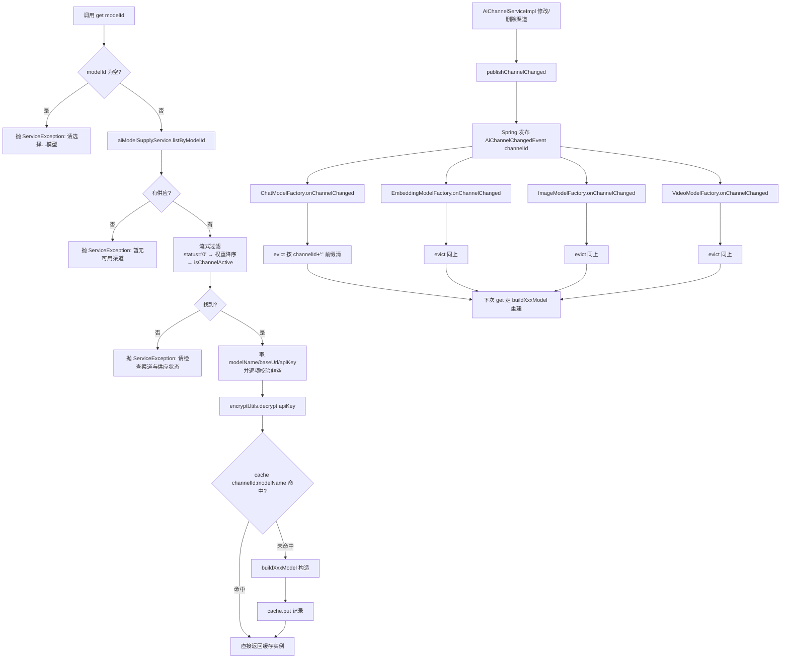
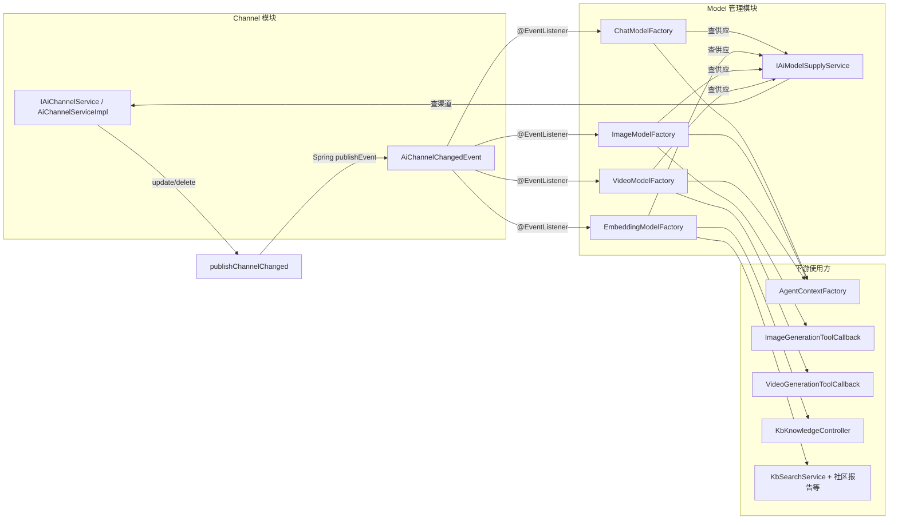

# 模型管理模块

> 适用源码版本:`agent-java` (基于 ruoyi + Spring AI)
> 范围:`ruoyi-system/ai/` 下 4 个 ModelFactory + 1 个 ModelRecommender,`ruoyi-admin/.../AiModelController` 与前端 `ruoyi-ui/src/views/ai/model/`

---

## 1. 模块概述

模型管理解决的是「**一个对外名字的模型,背后挂多个上游渠道,运行期按需路由**」的问题。系统在数据库里维护 `ai_model`(模型本体,如 DeepSeek V3)与 `ai_model_channel`(模型↔渠道供应,带权重/重试/价格/调用标识),并把 `ai_channel`(渠道,带 baseUrl / apiKey)抽成独立实体,任何渠道更新都会通过 Spring 事件广播给三个 ModelFactory,使其在**不重启**的情况下重建缓存。

四个工厂 `ChatModelFactory` / `EmbeddingModelFactory` / `ImageModelFactory` / `VideoModelFactory` 是**同构的**:
- 输入:`modelId`
- 中间步骤:查供应 → 过滤启用 → 按权重降序 → 校验渠道启用 → 拿 `modelName` + `apiKey` → 缓存
- 输出:Spring AI 的 `ChatModel` / `EmbeddingModel` / `ImageModel`,以及手写的 OpenAI 兼容视频客户端

它们都把上游 OpenAI 兼容协议的 baseUrl/apiKey 在**构造时烧进** `OpenAiApi`,因此必须监听 `AiChannelChangedEvent` 主动失效缓存,否则用户在页面上改完 baseUrl,请求仍会打到旧地址——这是非常隐蔽的 bug。

`ModelRecommender` 是导入辅助:`ai_upstream_model` 清单里的模型只有标识、展示名和归属方,类型/能力靠名称启发式推断(关键词匹配),结果作为「导入」弹窗的预填值,用户可改。

`AiModelController` 暴露标准 CRUD + 三个子流程接口(清单查询、模型导入、供应增删改),后端 Service 层通过 `IAiModelSupplyService` / `IAiChannelService` 协作。

---

## 2. 关键类与职责

### 2.1 ChatModelFactory — 对话模型工厂

`ruoyi-system/src/main/java/com/ruoyi/system/ai/ChatModelFactory.java:37`

- 职责:按 `modelId` 解析一条最优供应,构造 Spring AI 的 `OpenAiChatModel`,提供本地缓存与失效。
- 关键方法:
  - `get(Long modelId)`(L62-L104):核心入口。`null` 校验 → `aiModelSupplyService.listByModelId` 查供应 → 流式过滤(`status=0` → 权重降序 → 渠道启用) → 取 `modelName` 校验非空 → 取 `baseUrl` 校验非空 → `encryptUtils.decrypt(apiKey)` → cache 命中直接返回,否则 `buildChatModel` 构造。
  - `onChannelChanged(AiChannelChangedEvent)`(L113-L116):`@EventListener` 监听事件,转交 `evict`。
  - `evict(Long channelId)`(L124-L139):按 `channelId + ":"` 前缀清缓存(冒号防止渠道 1 顺手清掉渠道 10/100);`null` 清空整个缓存。
  - `buildChatModel(...)`(L144-L164):构造 `OpenAiApi` + `OpenAiChatOptions` + `OpenAiChatModel`。要点:
    - `webClientBuilder` 挂 `CacheUsageProbe`(L153):流式响应里 Spring AI 会丢 `nativeUsage`,必须从 SSE 原文截 `prompt_tokens_details.cached_tokens` 用于缓存命中率计费。
    - `streamUsage(true)`(L158):请求带 `stream_options.include_usage=true`,保证流末包返回真实 usage。
  - `OpenAiCompatibleEndpoint(String)`(`OpenAiCompatibleEndpoint.java`):渠道端点归一化。按 `baseUrl` 末段是否已是版本段(正则 `^[vV]\d[\w.-]*$`,命中 `/v1`、`/v3`、`/v4`、`/v1beta` 等)决定依赖路径带不带 `/v1` —— 版本已写死在 base 里则直接 `/chat/completions`,否则保留 Spring AI `OpenAiApi` 默认前缀 `/v1/chat/completions`。突破了旧「去尾 `/v1` 再叠默认 /v1」只在 `/v1` 结尾渠道上成立的局限:火山方舟等 `…/v3` 渠道会拼出 `/v3/v1/chat/completions` 双版本 404。
- 缓存:`ConcurrentMap<String, ChatModel>`,key = `channelId:modelName`(L54)。

### 2.2 EmbeddingModelFactory — 向量模型工厂

`ruoyi-system/src/main/java/com/ruoyi/system/ai/EmbeddingModelFactory.java:33`

- 职责:与 ChatModelFactory 同构,产出 `OpenAiEmbeddingModel`,供知识库向量化与检索使用。
- 差异点(`buildEmbeddingModel` L119-L130):
  - 用 `OpenAiEmbeddingOptions` 而非 ChatOption;
  - 构造 `new OpenAiEmbeddingModel(api, MetadataMode.EMBED, options)`,**没有**显式挂 `webClientBuilder`(向量调用是同步,不需要流式截 `cached_tokens`);
  - 不需要 `streamUsage`,Embedding 一次性返回即可。
- 其余结构(缓存 key、失效流程、权重排序、baseUrl 归一化)与 Chat 一字不差——这种「同构三件套」是项目里典型的「少写 if-else,多写一个类」取舍:三份重复,换清晰心智模型。

### 2.3 ImageModelFactory — 生图模型工厂

`ruoyi-system/src/main/java/com/ruoyi/system/ai/ImageModelFactory.java:39`

- 职责:同构三件套的第三份,产出 `OpenAiImageModel`,供 `ImageGenerationToolCallback` 在智能体工具链里调用。
- 差异点(都是生图独有):
  - **超时**(`buildImageModel` L153-L170):`HttpClient.newBuilder().connectTimeout(10s)` + `setReadTimeout(180s)`。RestClient 默认无读超时,中转站若接受连接后不响应会永久挂起(前端一直"执行中"),必须显式设。生图本身耗时,读超时留足到 3 分钟。
  - **重试策略**(`IMAGE_RETRY_TEMPLATE` L65-L66):`maxAttempts=1`,**不重试**。原因:单次出图本身就慢,渠道不通时重试只会成倍放大等待;失败交回给 LLM,让工具结果决定是否再试。另一个原因:用户取消运行会中断在途请求,抛 `ResourceAccessException`,默认重试策略会把它当网络抖动,取消后还会再发一次请求——非常糟糕的体验。
  - **构造方式**:`OpenAiImageModel` 没有 builder,只能用构造函数 `new OpenAiImageModel(api, options, IMAGE_RETRYTemplate)`。
- 缓存/失效/baseUrl 归一化与 Chat 完全一致。

### 2.3b VideoModelFactory — 视频模型工厂

`ruoyi-system/src/main/java/com/ruoyi/system/ai/VideoModelFactory.java`

- 与 `ImageModelFactory` **平行**,不共享缓存、不走 `/v1/images/generations`。
- 产出 `OpenAiCompatibleVideoClient`:提交任务(`POST /v1/videos/generations`,404 回退 `POST /v1/videos`)→ 轮询 → 下载。创建体只带 `image:{url}` 一张起始图,不带 `reference_image_urls`。
- 渠道变更同样监听 `AiChannelChangedEvent`,按 `channelId:` 前缀失效。

### 2.4 ModelRecommender — 模型推荐器

`ruoyi-system/src/main/java/com/ruoyi/system/ai/ModelRecommender.java:14`

- 纯静态工具类,无状态,只在导入流程中预填默认值。
- `recommendType(String modelId)`(L23-L52):按模型 ID 关键词分配类型,优先级:
  1. `moderation` / `guard` / `shield` → `MODERATION`
  2. `embedding` / `embed` / `bge-` / `gte-` / `text-embedding` → `EMBEDDING`
  3. `rerank` → `RERANK`
  4. `tts` / `speech` / `cosyvoice` → `TTS`
  5. `whisper` / `stt` / `asr` / `sensevoice` / `paraformer` → `STT`
  6. `video` / `sora` / `kling` / `veo` / `runway` / `luma` / `grok-imagine-video` → `VIDEO`(必须排在 IMAGE 之前,避免 `imagine`/`image` 误判)
  7. `image` / `dall` / `flux` / `sdxl` / `stable-diffusion` / `wanx` / `wan2` / `kolors` / `cogview` / `imagen` / `seedream` / `seededit` → `IMAGE`
  8. 默认 `CHAT`
- `recommendCapabilities(String modelId, String modelType)`(L57-L86):能力标签,**不入库**,仅前端展示:
  - CHAT 类默认 `text`,模型 ID 含 `vl` / `vision` / `4o` / `gemini` / `claude` / `glm-4v` / `pixtral` / `qvq` → 加 `vision`;含 `r1` / `o1` / `o3` / `o4` / `thinking` / `reasoner` / `qvq` → 加 `reasoning`。
  - IMAGE 类默认 `image`,ID 含 `edit` → 加 `edit`。
  - VIDEO 类默认 `video`。
  - 其他类 → 把 `modelType` 小写作为唯一能力。
- 使用方:仅 `AiModelImportServiceImpl:90-91` 在 `listUpstreamModels` 时,给每条上游模型计算 `recommendType` / `capabilities`,前端「导入」面板据此给每行显示彩色类型徽标与能力 pill。

### 2.5 AiModelController — HTTP 接口

`ruoyi-admin/src/main/java/com/ruoyi/web/controller/ai/AiModelController.java:34`

- `@RequestMapping("/ai/model")`,继承 `BaseController`(自动拿到 `getUsername` / `startPage` / `getDataTable` / `success` / `toAjax`)。
- 三个注入:`IAiModelService` / `IAiModelImportService` / `IAiModelSupplyService`,**不直接注入任何 ModelFactory**(工厂运行期按需拉,不参与 Controller 编排)。
- 写操作均带 `@Log(title, BusinessType)`,进入操作日志。
- 「模型只能通过『导入』创建,渠道供应收进模型管理的『供应』弹窗」——这句注释(L29)是该模块的设计精髓:模型本体只能从上游拉,不允许手写一个不存在的模型。

---

## 3. 核心流程

### 3.1 模型实例获取/缓存/失效(五个工厂同构:Chat / Embed / Image / Video / Tts)

关键点:
- 缓存以**渠道 + 模型名**为粒度,改一个渠道的 baseUrl 只会失效这一个渠道的所有模型,其他渠道不受影响。
- 失效走 Spring 事件而不是直接调 `factory.evict(channelId)`,**因为 ChannelService 已经依赖了 ModelFactory(查供应)**,反向直连构成循环依赖,Spring Boot 默认禁止(`AiChannelChangedEvent.java:6-8` 注释解释)。
- 事件广播是**尽力而为**:`AiChannelServiceImpl:177-188` 的 `publishChannelChanged` 用 try/catch 包住,失败只 warn 不抛——不能让渠道修改的事务回滚。

### 3.2 模型推荐(导入时预填)

```mermaid
flowchart LR
    A[前端读取模型清单<br/>GET /ai/model/import/upstream?channelId=] --> B[AiModelImportService.listUpstreamModels]
    B --> C[AiUpstreamModelMapper 查 ai_upstream_model<br/>拿回 id/ownedBy/displayName]
    C --> D[遍历每条上游模型]
    D --> E[ModelRecommender.recommendType id<br/>关键词匹配推断类型]
    E --> F[ModelRecommender.recommendCapabilities id, type<br/>推断能力标签]
    F --> G[去重,查本地是否已建模型<br/>计算 importStatus:<br/>NOT_IMPORTED / MODEL_EXISTS / CHANNEL_BOUND]
    G --> H[回包含 recommendType / capabilities / importStatus]
    H --> I[前端按行显示<br/>彩色类型徽标 + 能力 pill + 状态徽标]
    I --> J{用户操作}
    J -- 一键导入 --> K[POST /ai/model/import<br/>用推荐值,后端事务创建/接入]
    J -- 高级 --> L[行内表单<br/>用户改 modelType/上下文/价格等]
    L --> K
```

注意:推荐值只是导入时的「省事」,**用户始终是 source of truth**。这是关键词启发式推断,边角名字(`my-llm-v2-custom`)会落到默认 `CHAT`,需手动改。

### 3.3 工厂的统一抽象方式

项目**没有**抽公共父类或接口,而是写**三份高度同构**的代码(只复制粘贴,改类型)。这是刻意的:

- 五个工厂注入的依赖一致(`IAiModelSupplyService` / `IAiChannelService` / `EncryptUtils`),`ChatModelFactory` 多一个 `CacheUsageProbe`。
- `compareWeightDesc` / `isChannelActive` / `evict` / `onChannelChanged` 逐字相同;baseUrl 归一化交给**共享**的 `OpenAiCompatibleEndpoint`(版本段与否的判定只维护一处,不再三份复制)。
- 仅 `buildXxxModel` 与 `get` 的目标类型不同(ChatModel / EmbeddingModel / ImageModel)。
- 缓存字段类型不同(`ConcurrentMap<String, ChatModel>` …),无法提到泛型父类(Java 泛型擦除 + Spring 注入,提了也是脏抽象)。

**好处**:每个工厂自包含,看一个文件就懂一类模型的完整生命周期,排查 streamUsage / cached_tokens 这种细节时不会被别的类型干扰。**代价**:三份重复,改模型构造要改三处,需要纪律(注释里互相 `@link` 提醒);baseUrl 与版本段判定已抽到 `OpenAiCompatibleEndpoint` 共享,避免同类逻辑三处漂移。

---

## 4. 对外接口

| 方法 | 路径 | 用途 | 权限 / 备注 |
| --- | --- | --- | --- |
| GET | `/ai/model/list` | 分页查询模型列表(支持 `modelCode`/`displayName`/`modelType`/`status` 过滤) | `startPage` + `getDataTable` |
| GET | `/ai/model/{modelId}` | 获取模型详情 | — |
| POST | `/ai/model` | 新增模型(实际业务上很少手写,主要是导入走 `/import`) | `@Log INSERT` |
| PUT | `/ai/model` | 修改模型(展示名/类型/上下文/最大输出/推理/排序/状态/备注) | `@Log UPDATE` |
| DELETE | `/ai/model/{modelIds}` | 批量删除模型 | `@Log DELETE` |
| GET | `/ai/model/import/upstream?channelId=` | 读取渠道已维护的模型清单,带推荐类型/能力/导入状态 | 只查 `ai_upstream_model`;空清单返回空数组 |
| POST | `/ai/model/import` | 导入模型(不存在则创建,已存在则新增供应),事务内完成 | `@Log IMPORT` |
| GET | `/ai/model/{modelId}/supply` | 查询该模型已绑定的供应渠道列表 | — |
| POST | `/ai/model/{modelId}/supply` | 为模型添加一条供应(模型 ID 从路径注入 body) | `@Log INSERT` |
| PUT | `/ai/model/supply` | 修改供应(权重/重试/价格/调用标识/状态) | `@Log UPDATE` |
| DELETE | `/ai/model/supply/{ids}` | 删除供应(软删) | `@Log DELETE` |

前端消费(`ruoyi-ui/src/views/ai/model/`):
- `index.vue`:模型卡片列表,Sheet 含详情/编辑/导入 三个面板,`recommendType` / `capabilities` 直接渲染为彩色徽标与能力 pill。
- `supply.vue`:独立子组件,管理单个模型的供应渠道,嵌套编辑 Sheet(`v-model="supplyOpen"`)。

导入选择渠道后若清单为空,前端显示“该渠道尚未维护模型清单”并提供“去渠道管理同步”按钮。新增供应直接读取渠道模型清单,先选渠道再选渠道模型,不要求平台 `modelCode` 与上游标识相同;已有供应的调用标识不在清单时只显示“上游已下架”角标,不会自动删除或停用绑定。

---

## 5. 依赖关系

### 5.1 与 Channel 模块的协作(关键)

- `AiChannelServiceImpl:177-188` 在 update / delete 渠道后调 `publishChannelChanged`,广播 `AiChannelChangedEvent(channelId)`。
- 三个 ModelFactory 各自 `@EventListener` 监听,**互不感知**,各自失效自己的缓存(L113-L116 / L97-L100 / L123-L126)。
- `AiChannelServiceImpl:167` 删除渠道时还会顺带 `aiModelChannelMapper.deleteByChannelIds` 物理清掉供应绑定(避免悬挂外键)。

### 5.2 下游调用方

- `ruoyi-system/ai/agent/AgentContextFactory.java`:注入 `ChatModelFactory` + `ImageModelFactory` + `VideoModelFactory`,per-agent 装配。`AiAgent.modelCode` 解析为对话模型喂给 `ChatModelFactory.get`;`modelCode` 为空或查不到就 null,工厂抛「请选择对话模型」。
- `ImageGenerationToolCallback`:生图工具回调,运行时按 `imageModelCode` 调 `ImageModelFactory.get`。
- `VideoGenerationToolCallback`:视频工具回调,运行时按 `videoModelCode` 调 `VideoModelFactory.get`。
- `ruoyi-admin/.../KbKnowledgeController.java:91`:知识库 controller 直接注入 `EmbeddingModelFactory` 用于入库时向量化。
- 知识库检索侧多个模块(`KbSearchService`、`CommunityReportVectorStore`、`KbEntityExtractor` 等)用 `EmbeddingModelFactory` 把 query / 文档转成向量。

### 5.3 内部依赖

- `IAiModelSupplyService`(`ruoyi-system/.../service/IAiModelSupplyService.java`):供应 CRUD,工厂的高频查询入口。`listByModelId` 是工厂的「路由表」。
- `IAiChannelService` / `AiChannel`:查渠道详情、状态、baseUrl、apiKey。**apiKey 走 `EncryptUtils.decrypt`**(`ChatModelFactory.java:91`),数据库里存的是密文,工厂拿到的是明文,只活到当次 `buildChatModel`,之后烧进 `OpenAiApi` 不再回到 Java 堆。
- `EncryptUtils`(`ruoyi-common`):对称加密,与渠道入库时 `encrypt` 配对。
- `CacheUsageProbe`(`ruoyi-system/ai/metering/`):仅 ChatModelFactory 注入,流式截 SSE 中的 `cached_tokens`,用于缓存命中计费。
- `ModelRecommender`:无依赖,纯字符串匹配。

---

## 6. 典型使用场景

### 场景 1:Agent 跑一次对话

1. 用户在聊天页发消息 → `AiChatController` 接收 → `AgentContextFactory` 装配。
2. `AgentContextFactory` 把 `AiAgent.modelCode` 解析为 `AiModel`,调 `ChatModelFactory.get(aiModel.modelId)`(`AgentContextFactory.java:64`)。
3. 工厂查 `aiModelSupply` 选权重最高的启用供应 → 解密 apiKey → 缓存命中(二次请求)或构造 `OpenAiChatModel`。
4. `OpenAiChatModel` 调上游 `/v1/chat/completions`,`streamUsage=true` 让流末包带 usage;`webClientBuilder` 挂的 `CacheUsageProbe` 截 `cached_tokens`。
5. 渲染回复、计量落库。

### 场景 2:运维更换渠道 API Key(不改代码)

1. 管理员在「渠道管理」改 `apiKey` / `baseUrl` → `AiChannelServiceImpl.update` 落库后调 `publishChannelChanged(new AiChannelChangedEvent(channelId))`。
2. 五个工厂各自的 `onChannelChanged` 触发,`evict(channelId)` 把该渠道所有 `channelId:modelName` 缓存清掉。
3. 下一条对话请求进来,`ChatModelFactory.get` 走 `buildChatModel` 拿新配置重建实例——**无需重启**。
4. 改造前后用户无感;若没有事件广播,前端看配置已改、请求却仍打旧地址,极难排查(`ChatModelFactory.java:108-111` 注释明确点出)。

### 场景 3:从零接入一个新模型

1. 在「渠道管理」先建一条 OpenAI 兼容渠道(填 baseUrl、apiKey、channelType=OPENAI 等)。
2. 非自定义渠道先在“渠道管理”点“同步模型”;自定义渠道则手动新增清单项。
3. 在“模型管理”点“导入模型”→ 选刚才的渠道 → `GET /ai/model/import/upstream?channelId=X` 查询 `ai_upstream_model`。
4. `AiModelImportServiceImpl` 用 `ModelRecommender` 给每条 id 算 `recommendType` / `capabilities`,并对照本地 `ai_model` 标 `importStatus`。
5. 前端按行展示:未导入的显示「导入」按钮,已建模型显示「供应」按钮(只新增一条供应)。
6. 点「导入」→ `POST /ai/model/import` → 事务内创建 `ai_model` + 创建 `ai_model_channel` 供应,生成 `modelCode` 流水号。
7. 「供应」弹窗里再调权重/重试/价格/调用标识(`modelName`),完成后立即可被 agent 选用。

---

## 7. 速查表

| 问题 | 答 |
| --- | --- |
| 模型改了 baseUrl 要重启吗? | 不要,`AiChannelChangedEvent` 自动失效缓存。 |
| 五个工厂为什么不抽父类? | 同构但缓存类型不同,泛型+Spring 注入提不动;重复换独立可读性。 |
| 渠道 1 失效会清掉渠道 10 吗? | 不会,`evict` 按 `channelId + ":"` 前缀匹配,冒号是故意的(`ChatModelFactory.java:121-122`)。 |
| 取消生图后还会再发一次吗? | 不会,`maxAttempts=1` 避免把取消当抖动重试(`ImageModelFactory.java:60-64`)。 |
| 推荐类型怎么改? | 后端改 `ModelRecommender.recommendType` 关键词;用户始终可在导入表单覆盖。 |
| 模型如何被 agent 找到? | `AiAgent.modelCode` → `AiModel.modelId` → `ChatModelFactory.get` → 供应路由。 |
