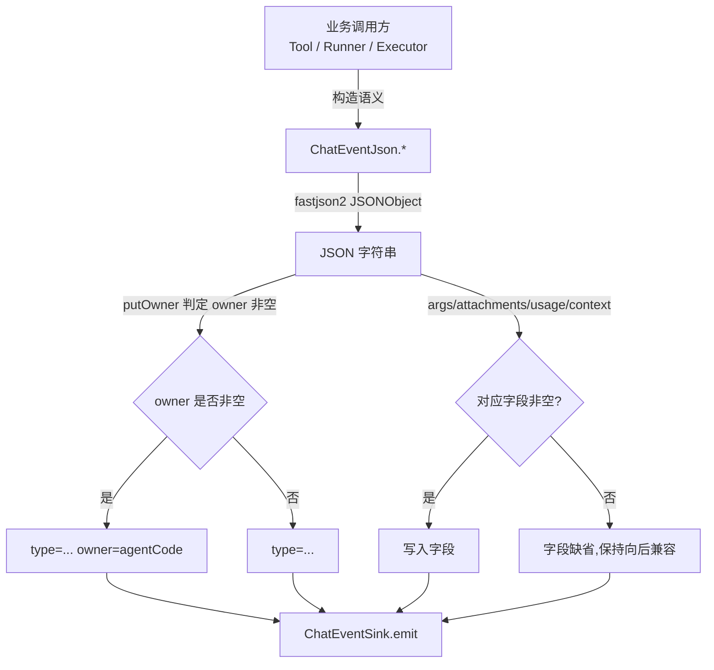

# 流式与事件模块设计文档

> 范围:`ruoyi-system/.../ai/event/`、`ai/sse/ChatEventJson.java` 与 `ai/run/ChatRunEventBroker.java`,以及与 Run 引擎的协作边界。
> 变更记录:SSE 短链路(`POST /ai/chat/stream` + `SseEmitterHolder`)已随 commit `411bf8b` 下线,对话事件现以 **Run 持久化事件总线 + WebSocket 收口** 为唯一通道。知识库文档处理仍保留独立的 SSE 进度(`KbIngestProgressHub`,见 `docs/知识库模块.md`)。

---

## 1. 模块概述

AI 对话是典型的"长耗时 + 多源事件"场景:一次回答可能要十几秒,期间会产出文本流、思考流、若干次工具调用、可能还有子智能体的递归调用。HTTP 一次性响应无法承载这种"长持续 + 多事件"语义,本模块就是为这件事而存在。

现在的唯一通道是 **Run 长链路**:`ChatRunExecutor` 启动的持久化运行,事件先经 `ChatRunEventBroker` 落到 Redis Stream(可回放)+ Redis Pub/Sub(跨实例广播)+ Spring 进程内事件(本机 WebSocket 订阅者),再由各自的后端转发。**浏览器断开不会让运行中断**,用户重新连上后能 `replay(afterSeq)` 补齐。

事件类型统一由中间层抽象收敛:

- `ChatEventSink` —— FunctionalInterface,只暴露 `void emit(String eventJson)`,Agent / 工具 / 执行引擎只看到"把一段 JSON 事件扔出去"。**不知道也不关心这条事件最终是经 Redis 广播、WebSocket 推送还是被丢弃**。
- `ChatEventJson` —— 事件 JSON 工厂,负责按协议约定产出 10+ 种 `type` 的字符串,字段顺序、嵌套语义、脱敏边界都在这里固化。
- `ChatRunEventBroker.sink(runId, sessionId)` —— 把"发布到 Run 事件总线"包装成 `ChatEventSink`,与业务解耦。

抽象角度:这层就是经典的事件发布-订阅(`Publisher → Sink → Subscriber`)加上**协议转换器**(`ChatEventJson`)。Agent 业务不耦合网络层,网络层不耦合 Agent 业务。

> 当前恢复协议以 `GET /ai/chat/run/{runId}/state` 返回的消息账本 + 步骤快照为基线，再回放 `snapshotSeq` 之后的事件。进行中由步骤快照保留流式状态，终态则以 `ai_chat_message` 不可变事实为主、`ai_chat_run_step` 补缺。以下旧章节中仅描述“从 Redis Stream 回放”的内容只代表实时增量层。
> 流式正文不会等到终态才进入快照：投影器按 128 个事件、64 KiB 或 1 秒周期性推进 `snapshotSeq`。若客户端仍检测到序号缺口，它保持 WebSocket 连接并退避刷新 Run State，快照游标前进后再补订阅，避免长回答恢复时反复重连。

---

## 2. 关键类与职责

### 2.1 `ChatEventJson` —— 事件 JSON 工厂

文件:`ruoyi-system/src/main/java/com/ruoyi/system/ai/sse/ChatEventJson.java`

只做一件事:把"语义事件"序列化成前端可直接 `JSON.parse` 的字符串。所有方法都是 `public static String`,返回 `o.toJSONString()`,private 构造保证不可实例化。

事件类型与字段约定(类头注释 13-22 行):

| `type` | 出处 | 关键字段 | 用途 |
|---|---|---|---|
| `text` | `text(text)` / `text(text, owner)` | `text`,可选 `owner` | 最终回答流式 chunk;带 `owner` 的是子智能体产物 |
| `reasoning` | `reasoning(text)` / `reasoning(text, owner)` | `text`,可选 `owner` | 思考流 chunk;同上前端嵌进对应 agent step |
| `tool_start` | `toolStart(name, source[, owner, args])` | `name`,`source`,`args`(脱敏),`owner` | 工具开始;**args 必须带,否则前端 ToolStep 不渲染** |
| `tool_end` | `toolEnd(name, source, args, result, ok, ms[, owner, attachments])` | 同上 + `result`,`ok`,`ms`,`attachments` | 工具结束;`attachments` 非空时附带富媒体附件 |
| `tool_confirm_required` | `toolConfirmRequired(confirmId, name, source, args, owner)` | `confirmId` 等 | 危险工具等待用户确认 |
| `tool_call_request` | `toolCallRequest(callId, name, args, owner, stepId)`(`:131-142`) | `callId`,`name`,`args`(脱敏),`owner`,`stepId` | 渠道工具请求,推给浏览器插件执行、服务端挂起等回传;**不落任何投影 step**(所以 `snapshot_seq` 游标会越过它,断线恢复靠订阅时的同 callId 补发,见 `渠道工具与浏览器插件.md` §3.4)。v1 标准事件对应 `ai.run.tool.call.requested` |
| `context_cleaned` | `contextCleaned(tokensBefore, tokensAfter, pairsCleared)` | 三个 token 数 | 轮内上下文清理完成 |
| `agent_start` | `agentStart(name, agentCode[, owner, invId])` | `name`,`agentCode`,可选 `owner`、`invId` | 子智能体进入 |
| `agent_end` | `agentEnd(name, result, ok, ms[, owner, invId])` | 同上 + 结果与耗时,可选 `invId` | 子智能体退出 |
| `done` | `done([usage, context])` | 可选 `usage`,`context` | 本轮结束,可选带用量与上下文占用 |
| `error` | `error(message)` | `message` | 出错 |
| `ui` | `ChatEventJson.ui(...)` 仅由 `UiArtifactEmitter` 调用 | `name`,`eventId`,`payload`,`messageId` | 只给前端的 UI 产物,不进 LLM 历史、**不**写 `ai_chat_run_step`。已登记:`kb.references`(会话落库,schema v2)、`run.tokenUsage`(过程量,不落库,500ms 节流) |

所有会产生或更新 UI 步骤的事件都应携带稳定的 `stepId`；嵌套事件同时携带 `parentStepId`。`owner/invId` 暂时保留为展示协议字段，但前端恢复和幂等更新以 `stepId/parentStepId` 为准。新增工具或子智能体事件如果没有稳定 ID，不得进入并行执行路径。

几个**会咬人**的细节(都来自源码注释,不是规范):

1. **`owner` / `invId` 字段的写入策略**(文件:`putOwner` 226-232、`putInvId` 235-241):两者都"非空才写",顶层事件不带;前端用"字段缺省"判定"这条事件属于顶层还是某个子 agent step"。`putOwner` / `putInvId` 是统一收口,所有支持嵌套的事件都走它们;`invId` 缺省时前端回退到按 `agentCode` / `name` 匹配(兼容旧事件)。

   三者语义区分(同一轮里同一子 agent 被父调多次时,`agentCode` 必然撞车,前端会把第 2 次调用的步骤全渲染进第 1 张卡片、第 2 张永远停在"思考中"):
   - `agentCode` = agent 的**身份**(稳定,同一 agent 多次调用不变);
   - `invId` = 本次**调用实例**的身份(`code + "#" + uuid前8位`,每次调用不同),`agentStart` / `agentEnd` 带上它,子 agent 内部 reasoning/text/tool 事件的 `owner` 也带它,前端优先按 `invId` 归位到对应调用实例的卡片;
   - `owner` = 包裹该事件的**上一层调用实例**(嵌套归属,A→B→C 多层递归),非空时这个 step 本身也要嵌进 owner。

   调用方:`SubAgentToolCallback.doCall` 开头生成 `invId`(`SubAgentToolCallback.java:183`),传给 `agentStart` / `agentEnd`,并经 `buildStateless` 的 `invId` 参数下传(`AgentContextFactory.java:150-155`),作为子 agent 内部事件的 `owner`。
2. **`args` 必须 `tool_start` 就带上,不能等 `tool_end`**(文件:69-78):前端 `ToolStep` 的入参/返回两个区块都是 `v-if`,args 空时整个 body 不渲染,长耗时工具用户看不到"在跑什么"。`tool_start` 里的 args 和 `tool_end` 里的 args 必须**同为脱敏后**,否则前端会在结束瞬间看到入参跳变(显式写的,不靠约定)。
3. **`attachments` 同样"非空才写"**(文件:152-155):缺省字段保持向后兼容,前端用字段缺省判定富媒体存在性。
4. **`done` 的 usage / context 是可选项**(文件:254-267):非空才写,前端刻度条直接吃这两个字段,省一次 `GET /ai/chat/session/{sessionId}/context` 往返。
5. **JSON 序列化用 fastjson2**(`com.alibaba.fastjson2.JSONObject`)。项目里没有自定义 filter,序列化策略与全局保持一致。

### 2.2 `ChatEventSink` —— 事件出口抽象

文件:`ruoyi-system/src/main/java/com/ruoyi/system/ai/event/ChatEventSink.java`

```java
// ruoyi-system/.../event/ChatEventSink.java:10
@FunctionalInterface
public interface ChatEventSink {
    ChatEventSink NOOP = eventJson -> { };
    void emit(String eventJson);
    static ChatEventSink noop() { return NOOP; }
}
```

它只有 3 个成员,故意保持极小:

- `void emit(String)` —— 唯一的抽象方法,所有"事件出口"语义都收敛在这一行。
- `static noop()` —— 显式空实现,用于"我们知道这条流不需要出口"的位置,例如 `ChatTurnRunner.run` 的入参兜底(文件:`ChatTurnRunner.java:121`)和 `RecordingToolCallback` 的字段兜底(文件:`RecordingToolCallback.java:96`)。
- 常量 `NOOP` —— 共享的无操作实现,lambda 单例。

> 类头注释(文件:4-8)点明:Agent 与工具只依赖这个接口,不再感知浏览器连接类型;持久化运行(Run)适配 Redis Stream + WebSocket 广播。SSE 时代的 `forSse(SseEmitter)` 工厂已随短链路一并移除。

调用方式:

```java
// 长链路(ChatRunExecutor.java:206)
ChatEventSink sink = eventJson -> {
    if (!active.isTerminal()) {
        eventBroker.publish(command.runId(), command.sessionId(), eventJson);
    }
};

// broker 工厂(ChatRunEventBroker.java:57)
ChatEventSink sink = eventBroker.sink(runId, sessionId);

// 兜底(ChatTurnRunner.java:121)
ChatEventSink eventSink = sink != null ? sink : ChatEventSink.noop();
```

### 2.3 `ChatRunEventBroker` —— Run 事件总线

文件:`ruoyi-system/src/main/java/com/ruoyi/system/ai/run/ChatRunEventBroker.java`

一次 `publish` 写三处(`ChatRunEventBroker.java:62-83`):Redis Stream(留痕 24h / 上限 5000 条,断线回放用)+ 本机进程内事件(直接给本实例的 WebSocket 订阅者)+ Redis Pub/Sub `ai:chat:events`(给其他实例)。Redis 故障时 `publishLocally` 仍要成功,这是"观察者故障不能反向打断模型执行"的兜底(文件:165-179)。

- `acceptRemote` 忽略自己发出去的副本,靠 `originInstanceId` 判定(文件:121-136),避免同一事件在本实例被双投递。
- 序号生成 `nextSequence`(文件:138-162)以 Redis `INCR` 为主,Redis 故障时降级到本机 `AtomicLong`,恢复后用 `accumulateAndGet(seq, Math::max)` 把 Redis 追到同一高水位,避免序号回退。
- `replay(runId, afterSeq)`(文件:86-118)从 Stream 拉出 `seq > afterSeq` 的事件,按 seq 升序返回,供"用户刷新页面后从断点继续"。
- 终态事件(`done` / `error` / `cancelled` / `interrupted`)会**强制**刷一次高水位(文件:213-230),下次启动能精确知道从哪条之后回放。

---

## 3. 核心流程

### 3.1 Run 引擎事件链路:持久化运行 → 多端转发

```mermaid
flowchart LR
    A[ChatRunExecutor.execute] -->|lambda| S[ChatEventSink sink]
    S -->|publish runId/sessionId/eventJson| B[ChatRunEventBroker]
    B -->|StreamRecords.add + trim 5000 / expire 24h| RS[(Redis Stream<br/>ai:chat:run:{runId}:events)]
    B -->|高水位 1/20/终态| DB[(ai_chat_run.lastEventSeq)]
    B -->|INCR sequenceKey| SEQ[(Redis sequenceKey)]
    B -->|publishEvent envelope| LOCAL[Spring ApplicationEventPublisher]
    B -->|convertAndSend CHANNEL| PS[(Redis Pub/Sub<br/>ai:chat:events)]
    PS -->|跨实例 envelope| OTHER[其他实例 ChatRunEventBroker.acceptRemote]
    OTHER --> LOCAL
    LOCAL -->|@EventListener| WS[WebSocket 订阅者]
    LOCAL -->|@EventListener| RR[回放/审计监听器]
    B -.->|replay afterSeq| RPL[断线重连后补齐]
```

- 终态事件由执行器统一发布:成功路径在 `ChatRunExecutor` 收尾时构造 `ChatEventJson.done(usage, context)` 并追加 `status=SUCCEEDED` 与完整 `text`(正文校准,文件:308-313);失败/取消路径走 `terminalize(..., eventType)` 发布 `{type: error|cancelled|interrupted, status, code?, message?}`(`ChatRunExecutor.java:325-348`)。
- 前端只订阅 `ai:chat:events` 对应 run 的 WebSocket 通道,不关心模型跑在哪个节点。

### 3.2 事件 JSON 序列化与字段约定



约定(全部来自源码注释,没有外部规范):

- `type` 必填,其余字段按"非空才写"原则,前端用 `typeof event.x === 'undefined'` 判定而不是"空字符串/false"。
- `owner` 缺省 → 顶层事件;`owner` 非空 → 嵌进 `agentCode == owner` 的 agent step。
- `args` 必须**全程脱敏**:`tool_start` / `tool_end` 用同一份 `PiiRedactor.forStorage(args)`(`RecordingToolCallback.java:136, 145, 186, 218`)。
- `done` 的 `usage` / `context` 是"前端能省一次请求"的可选项,非空才写(`ChatEventJson.java:225-238`)。
- 终态事件(`done` / `error` / `cancelled` / `interrupted`)一律携带 `status` 字段,前端据此判断是否"正常结束"。

---

## 4. 对外接口

`ChatEventSink` 的完整方法签名(`ruoyi-system/.../event/ChatEventSink.java`):

| 方法 | 签名 | 用途 |
|---|---|---|
| 实例方法 | `void emit(String eventJson)` | 唯一抽象,所有"事件出口"语义都收敛于此 |
| 静态工厂 | `static ChatEventSink noop()` | 显式空实现,用于"这条流不需要出口"的场景 |
| 常量 | `ChatEventSink NOOP` | 共享的无操作实现,lambda 单例 |

`ChatRunEventBroker` 的关键方法(`ruoyi-system/.../run/ChatRunEventBroker.java`):

| 方法 | 签名 | 用途 |
|---|---|---|
| `sink(runId, sessionId)` | `ChatEventSink` | 把"发布到 Run 事件总线"包装成 Sink(`:57`) |
| `publish(runId, sessionId, eventJson)` | `ChatRunEventEnvelope` | 三投递:Stream + 进程内 + Pub/Sub(`:62`) |
| `replay(runId, afterSeq)` | `List<ChatRunEventEnvelope>` | 断线重连后按 seq 补齐(`:86`) |
| `acceptRemote(payload)` | `void` | 接收其他实例的广播副本,按 `originInstanceId` 去重(`:121`) |

业务侧只调 `sink.emit(ChatEventJson.xxx(...))`,**永远不需要自己关心网络层**。

---

## 5. 依赖关系

```
        ┌───────────────────────┐
        │  ChatRunExecutor      │   长链路(持久化 Run)
        │  broker.sink()        │──┐
        └───────────────────────┘  │
                                  ▼
        ┌───────────────────────┐  ┌──────────────────────┐
        │  AgentContextFactory  │─►│  ChatEventSink       │
        │  Tool(Recording/Sub)  │  │  (FunctionalInterface)│
        └───────────────────────┘  └──────────┬───────────┘
                                              │ emit(json)
                          ┌───────────────────┼────────────────┐
                          ▼                   ▼                ▼
                ┌──────────────────┐  ┌──────────────────┐  ┌──────────────────┐
                │ broker.sink()    │  │  executor lambda │  │      noop()      │
                │ (Run 事件总线)   │  │ (终态/回放监听)  │  │  (后台/批处理)   │
                └────────┬─────────┘  └──────────────────┘  └──────────────────┘
                         ▼
            ┌──────────────────────┐
            │ ChatRunEventBroker   │
            │  ├ Redis Stream(回放)│
            │  ├ Pub/Sub(跨实例)   │
            │  └ 本机 Event(WS)    │
            └──────────────────────┘
```

边界澄清:

- **事件通道唯一化**:对话事件只走 Run 事件总线(Redis Stream + Pub/Sub + 进程内事件),WebSocket 是观察者(`ai:chat:events` 订阅),"用户关页面、连接断开,流就结束"的短链路模型已随 SSE 下线。
- **`ChatEventSink` 是边界,`ChatEventJson` 是协议**:业务只看到 `emit(json)`,不知道出口;`ChatEventJson` 只生成 JSON,不调任何 Sink;`ChatEventSink` 只接收 JSON,不解析语义。**新增事件类型只改 `ChatEventJson`;新增传输通道只改 Sink 工厂,不改 `ChatEventJson`**。
- **`type=ui` 是封闭信封,不是开放口袋**:`name` 必须在 `UiArtifactNames` 登记(含 schemaVersion / maxPayloadChars / mergePolicy / persistence / scope / minIntervalMs)。发射权在 `UiArtifactEmitter`,与工具解绑:`RecordingToolCallback` 在 `tool_end` 之后把 `UiArtifactAware.lastArtifacts()` 交给它,`LlmCallCollector` 也能发 `run.tokenUsage`。超限、未登记或发送失败只打日志,不回灌工具结果、不打断主循环。`ChatRunProjectionService` 遇到 `type=ui` **直接 return**,载荷按 Spec 写入 `ai_chat_special_event`(或 `Persistence.NONE` 只推实时)。`Scope.GLOBAL` 发射时拒绝。前端按 `messageId` + `name` 归位,按需 `GET /ai/chat/session/{id}/special-events` 拉全文。旧会话无特殊事件时仍可扒 `searchKnowledge` 文本(`parseKbHits`)。图片继续走 `AttachmentAware` / `tool_end.attachments`。

### 2.4 UI 产物的约束(扩展 / 性能 / 并发)

| 维度 | 约束 |
|---|---|
| 扩展 | 新产物只加 `UiArtifactNames` 一行 + 前端 `UI_ARTIFACT_SPECS` 一行 + 一个 apply 分支。禁止开放 `name`。`schemaVersion` 低于登记 `minSchemaVersion` 的事件直接丢弃 |
| 归并 | `kb.references` 用 `MergePolicy.MERGE`:同一 `messageId` 归成一行,乐观锁 `version` 防并行 `searchKnowledge` 丢更新。徽标数字来自 payload 的 `fileCount`,前端不再 `aggregateCitationFiles` |
| 性能 | 引用 payload 超 `maxPayloadChars`(16KiB)时截断 chunks 仍保留真实 `fileCount`/`chunkCount`,避免整包静默消失。实时 token 500ms 节流,不落库 |
| 并发 | 工具产物仍经 ThreadLocal `lastArtifacts()` take-and-clear。落库用 `eventId = messageId + ":" + name` 幂等 |
| 隔离 | 永不进 `DbChatMemory`。观察者故障不能打断执行 |
| 兼容 | 无特殊事件的旧 run 仍 `parseKbHits`。图片不走这条协议 |
- **与 Run 模块的协作**:`ChatRunEventBroker.sink(runId, sessionId)` 返回的 lambda 直接作为 `ChatTurnRunner` 的入参,`ChatRunExecutor` 无需改动业务调用方的一行代码。

---

## 6. 典型使用场景

### 场景一:子智能体嵌套步骤

主智能体决定调一个"调研子智能体",前端要看到"一个嵌套在主流程里的独立 step":

1. `SubAgentToolCallback.doCall` 推 `ChatEventJson.agentStart(childName, code, ownerAgentCode, invId)`(`SubAgentToolCallback.java:194`)。`ownerAgentCode` 非空 → 前端把这条 step 嵌进上一层;`invId` 标识本次调用实例(同一子 agent 一轮被调多次时按它区分,见 2.1)。
2. 子智能体内部回答时,推 `ChatEventJson.reasoning(reasoning, invId)` / `ChatEventJson.text(text, invId)`(`SubAgentToolCallback.java:270, 277`),`owner=invId`(而非 `code`)让前端把 chunk 投到对应调用实例的 agent step,而不是顶层或同名卡片。
3. 退出时 `ChatEventJson.agentEnd(childName, result, ok, ms, ownerAgentCode, invId)`(`SubAgentToolCallback.java:321-323`),`owner` / `invId` 与 start 一致,前端按 `invId` 定位同一次调用实例。
4. 整条链路共用同一个 `ChatEventSink`,在 `AgentContextFactory` 里通过 `invId`(调用实例标签)向下传(`AgentContextFactory.java:150-155`),作为子 agent 内部事件的 `owner`。**业务层不知道也没必要知道嵌套了几层**,前端用 `owner` 字段缺省即判定顶层,用 `invId` 区分同一 agent 的多次调用。

### 场景二:持久化运行,用户刷新页面后补齐

用户在 Run 模式下发了任务,过程中刷新了页面,后端模型并未中断,只是 WebSocket 断了;重连后要从断点继续:

1. `ChatRunExecutor.execute` 启动时构造 sink `eventJson -> { if (!active.isTerminal()) eventBroker.publish(...) }`(`ChatRunExecutor.java:206-211`),所有事件经 broker。
2. `broker.publish` 一次落三处:Redis Stream(留 24h / 上限 5000 条)、本机 `ApplicationEventPublisher`(直接给本实例 WS 订阅者)、Redis Pub/Sub `ai:chat:events`(其他实例)。
3. 用户断线期间,事件正常落 Stream,模型继续执行,WS 不再投递。
4. 用户重新连上,前端带 `lastSeq` 调回放接口,broker `replay(runId, afterSeq)` 拉出 `seq > afterSeq` 的事件按升序返回(`ChatRunEventBroker.java:86-118`)。
5. 投影检查点走 `ChatRunProjectionService` → `advanceSnapshotSeq`(同时抬 `last_event_seq` 与 `snapshot_seq`)。已无 `persistHighWatermark`。客户端按 `snapshotSeq` 订阅增量,不再靠单独的高水位刷盘方法。
6. 序号生成在 Redis 故障时降级到本机 `AtomicLong`,恢复后用 `accumulateAndGet(seq, Math::max)` 把 Redis 追到高水位,避免序号回退导致重复回放。

---

## 附录:关键文件速查

| 关注点 | 路径 |
|---|---|
| 事件 JSON 工厂 | `ruoyi-system/src/main/java/com/ruoyi/system/ai/sse/ChatEventJson.java` |
| 事件出口抽象 | `ruoyi-system/src/main/java/com/ruoyi/system/ai/event/ChatEventSink.java` |
| Run 事件总线 | `ruoyi-system/src/main/java/com/ruoyi/system/ai/run/ChatRunEventBroker.java` |
| Run 事件信封 | `ruoyi-system/src/main/java/com/ruoyi/system/ai/run/ChatRunEventEnvelope.java` |
| 对话入口(REST,无流) | `ruoyi-admin/src/main/java/com/ruoyi/web/controller/ai/AiChatController.java` |
| Run 创建入口 | `ruoyi-admin/src/main/java/com/ruoyi/web/controller/ai/AiChatRunController.java` |
| Sink 装配 | `ruoyi-system/src/main/java/com/ruoyi/system/ai/agent/AgentContextFactory.java` |
| 工具回调发事件 | `ruoyi-system/src/main/java/com/ruoyi/system/tool/RecordingToolCallback.java` |
| 子智能体发事件 | `ruoyi-system/src/main/java/com/ruoyi/system/ai/agent/SubAgentToolCallback.java` |
| 执行引擎用 Sink | `ruoyi-system/src/main/java/com/ruoyi/system/ai/run/ChatTurnRunner.java` |
| 持久化执行器 | `ruoyi-system/src/main/java/com/ruoyi/system/ai/run/ChatRunExecutor.java` |
| 知识库文档处理进度(独立 SSE,保留) | `ruoyi-system/src/main/java/com/ruoyi/system/kb/ingest/KbIngestProgressHub.java` |
