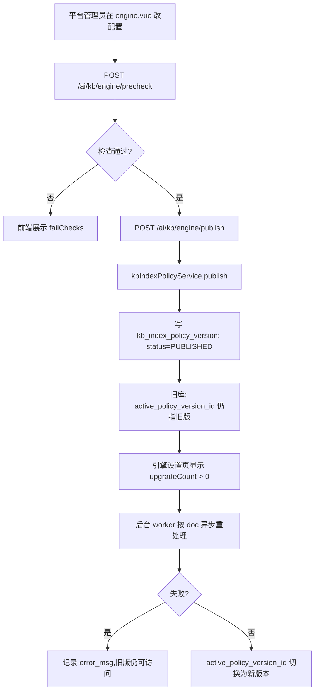
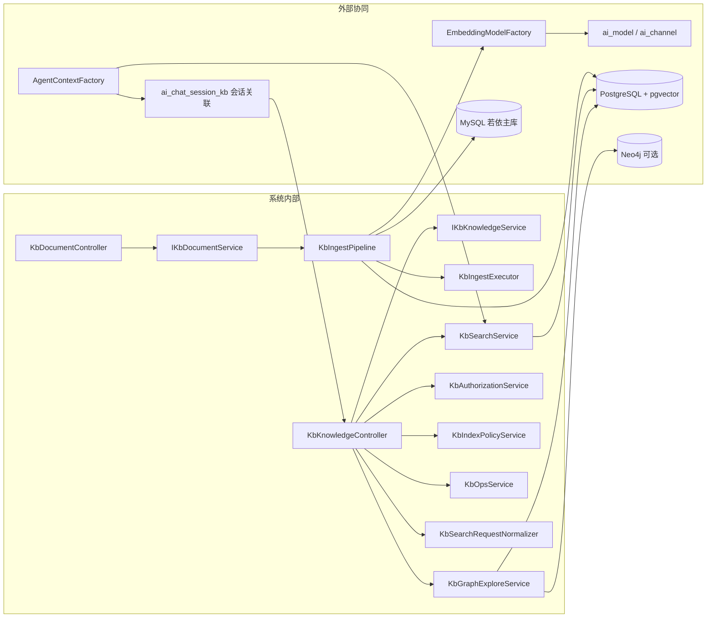

# KB 知识库模块设计文档

> 适用版本:`agent-java` 主干
> 代码基线:`ruoyi-admin` / `ruoyi-system` / `ruoyi-ui`
> 文档定位:面向 Java 工程师的模块架构与关键链路说明

---

## 1. 模块概述

### 1.1 解决什么问题

知识库(Knowledge Base,简称 KB)模块承载 **RAG(检索增强生成)** 的"私有资料"侧,核心目标是把企业内部的 PDF、Word、Excel、PPT 等文档,转成可被语义检索的证据片段,作为大模型对话的事实依据,缓解幻觉与知识陈旧问题。

具体职责:

- **资料治理**:知识库、文档、切片(Chunk)三类资源的全生命周期管理(创建/上传/解析/检索/删除)。
- **检索能力**:提供向量召回、图谱召回、社区召回等多种检索模式(`basic/local/hybrid/global/drift/auto`),由 `KbSearchService` 统一调度。
- **权限与协作**:知识库负责人、成员 ACL(`kb_acl_member`)、可见范围(PRIVATE/DEPT/ORG)。
- **质量保障**:解析质量校验、版本化索引策略(可升级、可回滚)、检索指标观测。
- **与 Agent 集成**:把 `searchKnowledge` 工具动态注入到绑定该知识库的智能体,使其能在对话中调出证据(见 `AgentContextFactory#resolveKnowledgeTool`)。

### 1.2 RAG 怎么嵌入到对话里

RAG 在本项目里的链路非常直接:

1. **资源侧**:文档上传后由 `KbIngestPipeline` 异步处理(解析 → 分块 → 嵌入 → 落向量表),详见 §3。
2. **工具侧**:`AgentContextFactory#resolveKnowledgeTool` 按 **sessionId** 读取 `ai_chat_session_kb` 的 `kbIds`(会话级多选,替代原 `ai_agent_kb` 智能体绑定),动态构造 `KnowledgeSearchToolCallback`(`ruoyi-system/.../kb/search/KnowledgeSearchToolCallback.java`)。
3. **对话侧**:智能体在收到用户问题后,LLM 决定是否调用 `searchKnowledge` 工具,工具内部走 `kbSearchService.search(kbIds, query, topK, minScore, mode)` 返回带出处的 `KbSearchHit`,再由模型基于证据生成回答。

一句话概括:**知识库 = Agent 工具表里的一个"动态工具",Agent 不知道向量、不关心切片,只看到 `searchKnowledge(query, topK, mode)` 的接口契约。**

---

## 2. 关键类与职责

### 2.1 KbKnowledgeController

文件:`ruoyi-admin/src/main/java/com/ruoyi/web/controller/ai/KbKnowledgeController.java`
路由前缀:`/ai/kb`

知识库"库"级别的所有 HTTP 入口,职责涵盖 6 个子域。

> 注:本章行号引用取自当前 `KbKnowledgeController.java`(640 行),仅作为位置提示,后续重构请勿机械对齐。

| 子域 | 代表方法 | 说明 |
|------|---------|------|
| 知识库 CRUD | `list` / `workbench` / `add` / `edit` / `remove` | 增删改查 + 工作台数据(替代旧 overview) |
| 影响预览 / capability / 使用 | `deleteImpact` / `access` / `usage` | 删除前评估、当前用户 capability、成员摘要 |
| 成员 ACL(私有/部门/所有人) | `memberCandidates` / `upsertMember` / `removeMember` / `transferOwner` | 私有库成员管理与负责人转移 |
| 检索测试与指标 | `search` | 检索测试,非 MANAGE 强制 `mode=auto`、`debug=false`,剥离 `debugTrace` |
| 平台知识引擎 | `getEngine` / `saveEngine` / `enginePrecheck` / `enginePublish` / `engineOps` | 策略版本发布与平台运行观测 |
| 知识图谱 | `graphExplore` / `graphEntityDetail` / `graphRelationDetail` / `graphDocs` | 受控子图探索,禁止全库加载 |

要点:

- 平台级操作(`/engine/*`)均要求 `isAdmin() == true`,通过私有 `requirePlatformAdmin()` 兜底(KbKnowledgeController 内)。
- 检索接口对非 MANAGE 用户做了**降权**:强制 `mode=auto`、`debug=false`,并剥离 `debugTrace`,参数归一化抽到 `KbSearchRequestNormalizer`。
- **单库策略升级 / 回滚无独立端点**:从平台发布新版本(`POST /ai/kb/engine/publish`)后,旧库 `active_policy_version_id` 仍指旧版;具体库的升级执行由后台任务引擎驱动,详情见 §3.3 重写后的策略版本化流程。
- **重建/诊断/嵌入探测端点已下线**:`POST /ai/kb/embed/probe`、`/{kbId}/rebuild`/`/{kbId}/rebuild/preview`、`/{kbId}/diagnostics`、`/{kbId}/chunk/list` 等早期暴露的管理员端点均已删除,运维通过平台 `engineOps` 与文档自带的健康态聚合观测。

### 2.2 KbDocumentController

文件:`ruoyi-admin/src/main/java/com/ruoyi/web/controller/ai/KbDocumentController.java`
路由前缀:`/ai/kb/{kbId}/document`

知识库"文档"级别的 HTTP 入口,职责:

| `list(kbId, ...)` | 文档列表(分页),带 `productStatus` 状态计算与路径脱敏(`sanitizeForUser`) |
| `upload` | 上传文件,落盘 + 写 `kb_document` + 异步摄入;`onDuplicate` 支持 `skip`/`force`(`force` 会替换旧文档) |
| `reprocess` / `batchReprocess` | 重新处理单/批文档 |
| `remove` | 软删 + 清 chunk/索引/IR/原文件 |
| `download` | 受控下载,先 READ 校验再校验路径位于当前库目录 |
| `getInfo` / `preview` | 详情/产品预览(HTML、目录、质量摘要) |

要点:

- 所有写操作先 `kbAuthorizationService.requireDocInKb(kbId, docId, WRITE)` 校验,**防止跨库删除/下载**。
- `preview` 面向产品层(不暴露堆栈),管理员错误信息在 `getInfo` 路径做产品化处理(`isPlatformAdmin()` 区分)。
- 摄入进度由 `KbIngestProgressHub`(`ruoyi-system/.../kb/ingest/KbIngestProgressHub.java`)在 pipeline 中发布;前端改用列表轮询,所以不再暴露 SSE 端点。前端组件位于 `ruoyi-ui/src/views/ai/kb/components/`(DocCard / DocDetailDrawer / DocPanel / GraphExplore / GraphViewerSheet / KbCard / SearchPanel / UsagePanel 等)。

### 2.3 数据库表结构

以下表分属不同时期 / 主题,SQL 文件位于 `sql/` 目录。

| 表 | 关键字段 | 所属 SQL | 用途 |
|----|---------|---------|------|
| `kb_knowledge` | `kb_id / owner_user_id / visibility / embedding_model_code / chunk_strategy / chunk_size / chunk_overlap / active_policy_version_id / index_state` | `kb_knowledge.sql` + `kb_pg.sql` + `kb_phase1.sql` + `kb_acl_v2.sql` + `kb_index_policy_v1.sql` | 知识库主表;包含策略版本绑定 |
| `kb_document` | `doc_id / kb_id / file_path / content_hash / ir_path / parse_status / parse_step / progress / chunk_count / parser_version / error_type / error_stage / error_msg` | `kb_document.sql` + `kb_phase1.sql` + `kb_pg.sql` | 文档元数据 + 处理状态机 |
| `kb_chunk` | `chunk_id / doc_id / chunk_index / content / heading_path / block_type / token_count / chunker_strategy / chunk_params_hash / embedding_model / source_page_from..to / chunk_level / parent_chunk_id` | `kb_phase1.sql` + `kb_chunk_v2.sql` + `kb_pg.sql` | 切片;**不存向量**;支持 LEAF/PARENT/SUMMARY 三级 |
| `kb_vector_{768,1024,1536,3072}` | `chunk_id / kb_id / embedding vector(N)` | `kb_pg.sql` | **按维度预建**的 pgvector 表,配 HNSW 索引(3072 因超 pgvector 上限只能全表扫) |
| `kb_acl_member` | `kb_id / user_id / role(VIEWER/EDITOR/QUALITY/OWNER)` | `kb_acl_v2.sql` | 成员 ACL |
| `ai_chat_session_kb` | `session_id / kb_id / sort` | `sql/init/03_ai_chat.sql` | 会话-知识库关联(会话级多选,`AgentContextFactory` 按 sessionId 装配 Tool;原 `ai_agent_kb` 已废弃删除) |
| `kb_doc_graph` | `doc_id / graph_status / progress / entity_count / relation_count / active_run_id / generation / graph_version` | `kb_graph.sql` + `kb_graph_v2.sql` | 单文档图谱抽取状态 |
| `kb_graph_run` | `run_id / generation / parser_version / chunk_params_hash / extractor_version / prompt_version / model_code / status` | `kb_graph_v2.sql` | 图抽取运行记录(血统) |
| `kb_graph_text_unit` | `text_unit_id / doc_id / ordinal / content / graph_unit_version / unit_params_hash / run_id` | `kb_graph_text_unit.sql` | 图谱独立 TextUnit(与检索 LEAF 解耦) |
| `kb_graph_index` | `kb_id / graph_version / previous_graph_version / status / community_count / level_count / extractor_version` | `kb_graph_community.sql` + `kb_graph_index_previous.sql` | 图索引任务状态(支持 previous 回滚) |
| `kb_graph_community` / `kb_graph_entity_community` | `(kb_id, graph_version, level, community_id)` | `kb_graph_community.sql` | Leiden 层级社区 |
| `kb_graph_community_report` / `kb_graph_community_report_source` | `report_id / level / community_id / summary / full_content / source_count` | `kb_graph_community.sql` | 社区报告(KB-GR-09) |
| `kb_community_vector_{768,1024,1536,3072}` | `report_id / kb_id / embedding vector(N)` | `kb_graph_community.sql` + `kb_pg.sql` | 社区报告独立向量 |
| `kb_index_policy_version` | `version_no / version_label / status / payload_json / fingerprint / check_report / published_by` | `kb_index_policy_v1.sql` | 不可变策略版本 |
| `kb_index_policy` | `id=1 / draft_payload_json / published_version_id / max_concurrent_jobs` | `kb_index_policy_v1.sql` | 平台当前策略指针(单行) |
| `kb_index_job` | `job_id / kb_id / job_type(INITIAL/UPGRADE/REBUILD/ROLLBACK) / from_version_id / to_version_id / status / progress / doc_total / doc_done / error_msg` | `kb_index_policy_v1.sql` | 索引任务 |
| `kb_llm_cache` | `cache_key / cache_type / response / model_code / hit_count` | `kb_graph.sql` + `kb_pg.sql` | LLM 抽取/摘要缓存(省钱) |
| `sys_config` (`kb.default.*` 6 个键) | `embeddingModel / extractModel / chunkStrategy / chunkSize / chunkOverlap / graphEnabled` | `kb_settings.sql` | 平台默认策略;**新建知识库时固化到 `kb_knowledge` 列上**,改这里不影响已有库;**跨会话长期记忆也复用 `kb.default.embeddingModel` 作为向量模型**(记忆无建库动作,直接读全局值,不固化;可 `ai.memory.embedding-model-code` 覆盖,见 `上下文与记忆模块.md §7.5`) |

设计上的两个关键取舍:

- **向量不存 `kb_chunk.embedding`**:大字段(3072 维 float32 ≈ 12KB)单行会拖慢分页查询,改用 `kb_vector_{dim}` 分表 + pgvector,`kb_chunk` 只放元数据与原文。
- **策略版本化(`kb_index_policy_version`)**:发布新版本不直接改 `kb_knowledge`,而是写不可变行;`active_policy_version_id` 绑定具体库,**避免一次策略变更让存量向量全部作废、静默触发全量重建**。

---

## 3. 核心流程

### 3.1 文档摄入:上传 → 解析 → 切片 → 向量化 → 入库

主代码:`ruoyi-system/src/main/java/com/ruoyi/system/kb/ingest/KbIngestPipeline.java`

```mermaid
flowchart TD
    A[POST /ai/kb/{kbId}/document 上传] --> B[kbDocumentService.uploadDocument]
    B --> B1[落盘到 uploadPath/kb/]
    B --> B2[写 kb_document: parse_status=PENDING]
    B --> C[KbIngestExecutor.submit]
    C --> D[KbIngestPipeline.process]

    D --> D0[切数据源到 SLAVE/PG]
    D --> D1[读 kb_knowledge 取 embeddingModelCode]
    D1 --> D2[短切 MASTER 查 AiModel]
    D2 --> D3[回 SLAVE]

    D3 --> E1[parserRegistry.parse: PARSING 5%]
    E1 --> E2{IrQualityValidator 接受?}
    E2 -->|否 + 有兜底| E3[parserRegistry.parseFallback Tika]
    E3 --> E2
    E2 -->|否| E_fail[fail 写 error_type 退出]

    E2 -->|是| F1[irFileStore.save 写 IR 产物]
    F1 --> F2[chunkerRegistry.chunk: CHUNKING 50%]
    F2 --> F3[ParentChunkBuilder.buildParents 父子切片]
    F3 --> G1[短切 MASTER 拿 EmbeddingModel]
    G1 --> G2[清旧 chunk + 向量]
    G2 --> G3[批嵌 LEAF 切片: EMBEDDING 50~99%]
    G3 --> G4[batchInsert kb_chunk + upsert kb_vector_{dim}]
    G4 --> H1[kb_document 标记 COMPLETED 100%]
    H1 --> H2{SSE: progressHub.publish}
    H1 --> I1{kb.graph_enabled=1?}
    I1 -->|是| I2[kbGraphExecutor.submit 异步入队]
    I1 -->|否| End[结束]
    I2 --> End
```

关键点:

- **数据源切换**:`process` 整体跑在 SLAVE(PG,存 chunk/向量),`AiModel`/`EmbeddingModelFactory` 配置在 MySQL,临时切到 MASTER 取完即回(`117`–`123`、`199`–`204`)—— 因为若依的 `@DataSource` AOP finally 只 clear 不恢复,**显式 set 更安全**。
- **质量兜底**:专用解析器(PDF/Word/Excel 各自的 `KbParserRegistry`)质量未通过时,自动回退到 Apache Tika(`144`–`166`)。
- **LEAF/PARENT 拆分**:`PARENT` 不参与嵌入(`embedding_dim=0`,不入 `kb_vector_*`),`chunk_count` 只计 `LEAF`(`186`)。
- **解耦图谱**:向量摄入失败不影响图谱,反之亦然;图谱由 `KbGraphExecutor` 异步入队(`321`)。
- **进度推送**:每次 `updateProgress` 都通过 `progressHub.publish` 推一条 SSE 事件,前端 `DocPanel` 即可看到处理中→完成的实时变化。

### 3.2 检索召回:从 query 到带出处的命中片段

```mermaid
flowchart LR
    Q[用户 query] --> R[EmbeddingModel.embed query]
    R --> V[pgvector HNSW 召回<br/>kb_vector_{dim} topK*N]
    V --> S[KbSearchService.search]
    S --> S1{KbSearchMode}
    S1 -->|basic/vector| S2[仅向量召回 + RRF]
    S1 -->|local/hybrid| S3[向量 + 图实体扩展<br/>ChunkContextExpander]
    S1 -->|global| S4[社区向量召回<br/>kb_community_vector_*]
    S1 -->|drift| S5[受限追问预算<br/>DriftSearchService]
    S1 -->|auto| S6[QueryRouter 规则路由]

    S2 --> F[ReciprocalRankFusion 融合排序]
    S3 --> F
    S4 --> F
    S5 --> F
    S6 --> F
    F --> H[List KbSearchHit<br/>含 heading_path / docName / score]
    H --> LLM[LLM 引用证据回答]
```

关键点:

- `KbSearchService.search(kbIds, query, topK, minScore, mode, keepDebugTrace)`(`KbSearchService.java:107`)是统一入口,**所有检索模式共享同一签名**,模式差异在内部路由。
- **灰度降级**:`modePolicy` 控制每种模式是否启用;未开放模式自动降到 `defaultMode`,记入 `degraded` 指标(`120`–`132`)。
- **并发限流**:`Semaphore searchSemaphore` 用 `modePolicy.maxConcurrent` 控制并发检索数,避免向量库被打爆(`84`–`90`)。
- **Tool 适配**:`KnowledgeSearchToolCallback.call` 解析 LLM 给的 `{query, topK, mode}`,调用 `search` 后用 `formatForModel` 拼成带 `[1][2]` 引用编号的提示文本(让 LLM 能引用出处)。命中片段同时经 `UiArtifactAware` 声明 `kb.references`,由 `RecordingToolCallback` 发 `type=ui` 给前端引用卡片,与模型文本解耦。

### 3.3 策略版本化:平台发布 → 单库选择升级



**说明(以现行实现为准):**

- 平台管理员在 `engine.vue` 修改草稿策略后,经 `/engine/precheck` 校验通过,再调 `/engine/publish` 写入不可变的 `kb_index_policy_version`(`status=PUBLISHED`)。
- `publish` **不会改动任何 `kb_knowledge.active_policy_version_id`**;旧库继续指旧版,前端引擎页展示 `upgradeCount > 0`,提示"有库可升级"。
- 单库的向量重建由后台任务引擎驱动(`kb_index_job`,`job_type=UPGRADE`),无独立 `POST /{id}/upgrade` HTTP 端点。
- `POST /policy/rollback` 在旧版本图里存在,本期已收敛:**回滚通过 worker 重新执行历史 `kb_index_job` 的反向产物实现,无外部 HTTP 入口**;具体接口如有暴露,通过 `engineOps` 的 `recentJobs` 列表查询任务详情。
- `KbIndexPolicyService` 当前公开方法:`status / listVersions / publish / prePublishCheck / kbPolicyStatus / recentJobs / getJob / bindPublishedOnCreate / loadWorkingDraftFromConfig`,**没有** `startUpgrade` / `rollback`。

设计意图:**绝不静默重建**。`kb_index_policy_version` 是不可变行,`active/previous/desired` 三指针让"取消升级"成为 O(1) 操作;只有显式发布新版本 + 库管理员主动等待 worker 重处理时,才会真的跑重建任务。

---

## 4. 对外接口

主要 HTTP 接口(全在 `/ai/kb` 命名空间下)。完整列表见 `KbKnowledgeController` / `KbDocumentController`。

### 4.1 知识库管理

| 方法 | 路径 | 权限 | 说明 |
|------|------|------|------|
| GET | `/ai/kb/list` | 登录 | 知识库分页列表(分页参数走 `startPage()`) |
| GET | `/ai/kb/workbench` | 登录 | 工作台聚合(行 + 摘要 + `isPlatformAdmin`) |
| POST | `/ai/kb` | `ai:kb:add` | 新建;`@Valid` 名称;返回 `kbId/kbName` |
| PUT | `/ai/kb` | 登录 | 修改(名称长度≤100) |
| DELETE | `/ai/kb/{kbIds}` | 登录 | 批量软删;PG 侧清图/切片/向量(可选步骤用保存点,避免 25P02);会话关联 `ai_chat_session_kb` 走独立 MySQL 事务(`AiChatSessionKbCleanup`) |
| GET | `/ai/kb/{kbId}/access` | READ | 当前用户在该库的 capability |
| GET | `/ai/kb/{kbId}/usage` | READ | 可见范围 / 成员摘要 |
| GET | `/ai/kb/{kbId}/delete-impact` | MANAGE | 删除前影响预览 |
| GET | `/ai/kb/{kbId}/member-candidates` | MANAGE | 成员候选搜索(分页;`keyword` 空=默认候选、非空按姓名/用户名模糊过滤) |
| POST | `/ai/kb/{kbId}/members` | MANAGE | 增/改成员(`{userId, role}`) |
| DELETE | `/ai/kb/{kbId}/members/{userId}` | MANAGE | 移除成员 |
| POST | `/ai/kb/{kbId}/transfer-owner` | MANAGE | 转移负责人 |

### 4.2 文档管理

| 方法 | 路径 | 权限 | 说明 |
|------|------|------|------|
| GET | `/ai/kb/{kbId}/document/list` | READ | 文档列表(带 `productStatus`) |
| POST | `/ai/kb/{kbId}/document` | WRITE | 上传(`onDuplicate=skip/force`);`force` 会替换旧文档并返回 `duplicate` 标志 |
| POST | `/ai/kb/{kbId}/document/{docId}/reprocess` | WRITE | 重处理 |
| POST | `/ai/kb/{kbId}/document/batch-reprocess` | WRITE | 批量重处理 |
| DELETE | `/ai/kb/{kbId}/document/{docIds}` | WRITE | 批量软删 |
| GET | `/ai/kb/{kbId}/document/{docId}/download` | READ | 受控下载 |
| GET | `/ai/kb/{kbId}/document/{docId}` | READ | 详情(管理员看到产品级错误信息) |
| GET | `/ai/kb/{kbId}/document/{docId}/preview` | READ | 产品预览(HTML/目录/质量摘要) |

> 原 `/{docId}/diagnostics` 与 `/{docId}/chunk/list` 两个管理员端点已下线;解析器指纹、IR 质量、切片列表现统一通过 `getInfo` + `preview` 聚合展示,不再单独暴露堆栈。

### 4.3 检索 / 图谱 / 策略

| 方法 | 路径 | 权限 | 说明 |
|------|------|------|------|
| POST | `/ai/kb/{kbId}/search` | USE | 检索测试(非 MANAGE 强制 `mode=auto`) |
| POST | `/ai/kb/{kbId}/graph/explore` | READ | 受控子图探索(节点/边上限) |
| GET | `/ai/kb/{kbId}/graph/entity` | READ | 实体详情 + 来源证据 + 关系 |
| GET | `/ai/kb/{kbId}/graph/relation` | READ | 关系详情 + 来源证据 |
| GET | `/ai/kb/{kbId}/graph/docs` | READ | 文档图谱抽取状态列表 |
| GET | `/ai/kb/engine` | `admin` | 平台知识引擎策略(运行态) |
| PUT | `/ai/kb/engine` | `admin` | 保存草稿策略别名 |
| POST | `/ai/kb/engine/precheck` | `admin` | 发布前检查 |
| POST | `/ai/kb/engine/publish` | `admin` | 发布不可变版本 |
| GET | `/ai/kb/engine/ops` | `admin` | 平台运行观测(版本状态聚合于该端点返回的 `versionStatus`,无独立 `/engine/versions`、`/engine/jobs`) |

> **已下线端点(说明删除原因):**
> - `POST /ai/kb/embed/probe` —— 嵌入连通性探测并入 `engineOps`,不单独暴露;
> - `GET/POST /ai/kb/{kbId}/rebuild[/preview]` —— 单库重建由后台任务引擎驱动,无外部 HTTP 入口;
> - `POST /ai/kb/{kbId}/upgrade`、`/policy/rollback`、`/policy` —— 策略升级回滚由 worker 驱动(`kb_index_job`),管理员通过 `engineOps` 的 `recentJobs` 观察进度;
> - `GET/PUT /ai/kb/settings` —— `saveSettings` 是 `KbKnowledgeController` 私有方法,无独立 HTTP 入口(被 `PUT /ai/kb/engine` 与 `POST /ai/kb/engine/publish` 共用)。

---

## 4.5 前后端交互

**前端页面**:`ruoyi-ui/src/views/ai/kb/index.vue`(知识库列表/工作台)+ `detail.vue`(单库详情:文档/检索/图谱)+ `engine.vue`(平台知识引擎策略,管理端)+ `components/`(`DocPanel` / `SearchPanel` / `GraphExplore` 等);**API 封装**:`ruoyi-ui/src/api/ai/kb.js`。

| 前端操作 | API 函数 | HTTP | 后端端点 |
| --- | --- | --- | --- |
| 工作台列表 | `listKbWorkbench(query)` | GET | `/ai/kb/workbench` |
| 建库/改名/删除 | `addKb` / `updateKb` / `delKb` | POST/PUT/DELETE | `/ai/kb...` |
| 删除影响评估 | `deleteKbImpact(kbId)` | GET | `/ai/kb/{kbId}/delete-impact` |
| 用量/访问/成员 | `getKbUsage` / `getKbAccess` / `listKbMemberCandidates` / `upsertKbMember` / `removeKbMember` / `transferKbOwner` | GET/POST/DELETE | `/ai/kb/{kbId}/usage|access|member...` |
| 文档列表/上传/重处理/删除 | `listKbDoc` / `uploadKbDoc` / `reprocessKbDoc` / `batchReprocessKbDoc` / `delKbDoc` | GET/POST/DELETE | `/ai/kb/{kbId}/document...` |
| 文档详情/预览/下载 | `getKbDocument` / `getKbDocPreview` / `downloadKbDocument` | GET | `/ai/kb/{kbId}/document/{docId}...` |
| 检索测试 | `searchKb(kbId, data)` | POST | `/ai/kb/{kbId}/search` |
| 图谱探索 | `graphExplore` / `graphEntityDetail` / `graphRelationDetail` / `graphDocs` | POST/GET | `/ai/kb/{kbId}/graph/...` |
| 平台引擎 | `getKbEngine` / `saveKbEngine` / `precheckEngine` / `publishEngine` / `getEngineOps` | GET/PUT/POST | `/ai/kb/engine...` |

**交互要点**:
- **上传是"提交即返回" + SSE 进度**:`uploadKbDoc` 提交文件后立刻返回(去重策略 `onDuplicate=skip|force` 走 `multipart/form-data`),文档解析/切片/向量化由后台任务执行,前端通过 `KbIngestProgressHub` 的 SSE 进度流(`/ai/kb/.../progress` 之类)或列表轮询 `productStatus` 观察状态 —— 这是知识库模块唯一的流式通道(与 Chat 的 WebSocket 不同)。
- **角色化权限(角色在 4.x 权限模型)**:前端按钮按当前用户对库的角色(`MANAGE` / `WRITE` / `READ` / `USE`)渲染,检索/上传/管理分别门控;`searchKb` 在非 `MANAGE` 角色下强制 `mode=auto`,前端传参也改变不了召回策略。
- **图谱是受控探索**:`graphExplore` 有节点/边上限,前端 `GraphExplore.vue` 按返回的子图增量渲染,不支持全量拉取。
- **检索测试页与对话内检索共用同一端点**:`detail.vue` 的 `SearchPanel` 调 `searchKb` 看到的命中结构,与对话中 `searchKnowledge` 工具返回的引用(schema v2)同源同构,便于联调。

---

## 5. 依赖关系



### 5.1 与 `EmbeddingModelFactory` 协作

文件:`ruoyi-system/src/main/java/com/ruoyi/system/ai/EmbeddingModelFactory.java`

- 角色:**动态渠道路由 + 缓存**。给定 `modelId`,按 `ai_model_channel` 的 `weight` 倒序选一条 `status='0'` 的渠道,解密 `apiKey`,构造 OpenAI 兼容的 `OpenAiEmbeddingModel`。
- 缓存:`channelId:modelName` 为 key;`AiChannelChangedEvent` 触发按 `channelId` 失效(`96`–`117`)。
- `KbIngestPipeline` 临时切到 MASTER(`MySQL`)调 `embeddingModelFactory.get(modelId)`,然后切回 SLAVE(`PostgreSQL`)。
- 嵌入连通性探测已并入 `engineOps` 聚合视图(检索指标 + 上游模型可用性),无独立端点。

### 5.2 与 Agent Run 引擎的协作

文件:`ruoyi-system/src/main/java/com/ruoyi/system/ai/agent/AgentContextFactory.java`

- 在会话上下文构造阶段,`resolveKnowledgeTool` 按 **sessionId** 查 `ai_chat_session_kb` 的 `kbIds`(会话级多选,替代原 `ai_agent_kb` 智能体绑定),空则不下发检索工具;非空则实例化 `KnowledgeSearchToolCallback(kbIds, kbSearchService)` 作为 `ToolCallback`(见 `AgentContextFactory` 内 `resolveKnowledgeTool` 方法)。子智能体复用同一 sessionId,自然继承会话知识库。
- 对话时,Agent 把工具描述交给 LLM,LLM 决定调用 `searchKnowledge`,回调走 `KbSearchService.search`,结果被 `formatForModel` 拼成带 `[1][2]` 引用编号的文本回到对话上下文;前端引用卡片走并行的 `ui` / `kb.references` 事件,不再扒工具返回文本。卡片按来源文件聚合,点开后看命中片段,并可走 `GET /ai/kb/{kbId}/document/{docId}/preview|download` 预览/下载原文。
- **关键不变量**:Tool 不进 `ai_tool` 工具表(装配期动态生成,与 `drawImage` 同模式),`mode` 默认 `basic` 以保证图谱未就绪时行为不变。

### 5.3 与图谱的可选依赖

- `Neo4jConfig` / `Neo4jKbGraphStore` / `NoOpKbGraphStore` 三态:`ai.kb.neo4j.enabled=true` 才启用真实写入,否则走 `NoOp`(`isAvailable()` 恒 `false`)。
- 业务代码(如 `graphExplore` / `graphEntityDetail` / `graphRelationDetail` / `graphDocs`)在调用图谱服务前先 `kbGraphStore.isAvailable()` 判可用,失败回退到空数据 / 受控子图探索。
- `KbGraphExploreService` 是图谱 HTTP 入口(`/graph/explore` 等 4 个端点)的后端实现,负责节点/边上限校验,避免一次探索拉全库。

### 5.4 知识图谱构建链路

> 本节对应 `ruoyi-system/src/main/java/com/ruoyi/system/kb/graph/` 子包,5 个子目录、40+ 个类。

```mermaid
flowchart LR
    DOC[文档摄入完成] --> TU[textunit<br/>GraphTextUnitBuilder<br/>生成图谱独立切片]
    TU --> EXT[extract<br/>KbEntityExtractor<br/>LLM 抽实体 / 关系 / 概念]
    EXT --> MER[merge<br/>KbGraphMerger<br/>跨文档实体对齐与冲突合并]
    MER --> PROV[provenance<br/>记录实体 / 关系来源证据]
    PROV --> COM[community<br/>Leiden 层级聚类<br/>连通分量检测]
    COM --> REP[community<br/>社区报告 LLM 生成<br/>CommunityReportLlmGenerator]
    REP --> IDX[kb_graph_index<br/>版本化图索引状态]
    IDX --> SEA[搜索端<br/>global 模式 / global community 检索]
```



- **文本单元**(`textunit/`)独立于检索 LEAF 切片存在,目的是把"用于抽图"的最小文本块固定下来(配合 `unit_params_hash`),避免检索侧切片变化导致图谱血统失效。
- **抽取**(`extract/`)是 LLM 调用密集区,统一通过 `LlmCallCollector` 走计量与缓存(`kb_llm_cache`);同一篇文档/同一参数组合只付一次 LLM 成本。
- **合并**(`merge/`)做实体去重、关系聚合;冲突解决默认按"较新版本优先 + 来源数优先"组合判断,合并过程全部写 `provenance/` 留下证据。
- **社区**(`community/`)采用 Leiden 聚类算法 + 兜底连通分量检测;每层生成结构化报告(`kb_graph_community_report`),并通过独立的 `kb_community_vector_{dim}` 表给 `global` 检索模式做向量召回。
- **版本化**:每次图谱重建会写到 `kb_graph_index(graph_version)`,旧版本留在 `previous_graph_version`,管理员可一键回到上一版本(`kb_graph_index_previous.sql`)。

---

## 6. 典型使用场景

### 场景 1:平台管理员开箱 & 切 embedding 模型

1. 首次部署,`/ai/kb` 列表为空,平台管理员点「全局设置」(`engine.vue`)。
2. 选 `embeddingModel`(列表只展示 `modelType=EMBEDDING` 且 `status=0` 的模型)、`extractModel`、`chunkStrategy=P`、`chunkSize=800`、`chunkOverlap=100`。
3. 点「生效」→ 前端先 `precheckEngine`,后 `publishEngine`,后端写 `sys_config` + 写 `kb_index_policy_version` 不可变行(`enginePublish`/`855`)。
4. 已有库页面显示「N 个已有库可升级」(`upgradeCount`),**不自动重建**;业务人员按需单库升级。

### 场景 2:业务用户新建知识库并上传资料

1. `/ai/kb` 列表点「新建」→ 抽屉输入名称、说明、选可见范围,提交后跳到 `/ai/kb-detail/{kbId}`。
2. 「文件」Tab 用 `DocPanel` 拖拽上传,后端:
   - 落盘 `/profile/upload/kb/{kbId}/...`
   - 写 `kb_document(parse_status=PENDING)`
   - `KbIngestExecutor.submit(docId)` 异步执行
3. 摄入进度由 pipeline 写入 `kb_document.parse_status`,前端轮询 `/ai/kb/{kbId}/document/list` 跟踪 `PENDING → PARSING → CHUNKING → EMBEDDING → COMPLETED`。
4. 「测试」Tab 跑几次 query,看 `mode=auto` 命中的 `KbSearchHit` 与出处;不满足可手动切 `local/hybrid/global`。
5. 满意度足够后,在对话页的输入区把该库加入会话知识库多选(`ai_chat_session_kb`,选自己可访问的库),该会话即可获得 RAG 检索能力(按 sessionId 装配 `searchKnowledge`)。

### 场景 3:索引失败后做诊断与重处理

1. 某文档显示「失败」徽标,详情页 `error_type=extraction_quality_failed / chunk / embed` 给出阶段与全文错误(`KbDocumentController.getInfo`)。
2. 管理员点 `preview` 看到解析器版本(`parser_version`)、`IR 质量`,定位是 PDF 解析器还是嵌入模型超时报错;管理员级堆栈已下线,如需详情需走 `engineOps` 聚合观测。
3. 解决后:`POST /ai/kb/{kbId}/document/{docId}/reprocess` 单条重跑;或 `POST /batch-reprocess` 批量。
4. 若是配置侧问题(比如换 chunk 参数),先在平台端 `POST /ai/kb/engine/publish` 发布新策略版本,系统写 `kb_index_job: UPGRADE`,后台 worker 按 doc 异步重建(无独立 `POST /{kbId}/upgrade` HTTP 入口)。

---

## 附:代码地图速查

- Controller:`ruoyi-admin/src/main/java/com/ruoyi/web/controller/ai/Kb{Knowledge,Document}Controller.java`
- Service 接口:`ruoyi-system/src/main/java/com/ruoyi/system/service/IKb{Knowledge,Document,DocGraph}Service.java`(`IKbChunkService` 早期存在,现合并到 `IKbDocumentService`,无独立接口)
- 摄入流水线:`ruoyi-system/src/main/java/com/ruoyi/system/kb/ingest/{KbIngestPipeline,KbIngestExecutor,KbIngestProgressHub}.java`
- 检索:`ruoyi-system/src/main/java/com/ruoyi/system/kb/search/{KbSearchService,KnowledgeSearchToolCallback,QueryRouter,...}.java`
- 切片:`ruoyi-system/src/main/java/com/ruoyi/system/kb/chunker/*`
- 向量:`ruoyi-system/src/main/java/com/ruoyi/system/kb/vector/*`
- 图谱:`ruoyi-system/src/main/java/com/ruoyi/system/kb/graph/**`
- 策略:`ruoyi-system/src/main/java/com/ruoyi/system/kb/policy/KbIndexPolicyService.java`
- 权限:`ruoyi-system/src/main/java/com/ruoyi/system/kb/access/KbAuthorizationService.java`
- Embedding 工厂:`ruoyi-system/src/main/java/com/ruoyi/system/ai/EmbeddingModelFactory.java`
- Agent 装配:`ruoyi-system/src/main/java/com/ruoyi/system/ai/agent/AgentContextFactory.java#buildKnowledgeSearchCallbacks`
- 前端:`ruoyi-ui/src/views/ai/kb/{index,detail,engine}.vue` + `components/*.vue`
- SQL:`sql/kb_*.sql`(本模块的演进按 phase1 → acl_v2 → pg → graph_v2 → index_policy_v1 顺序)
