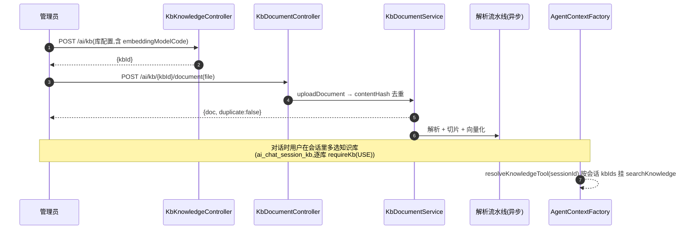
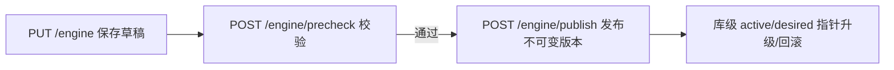

# 知识库模块 API 文档

> 适用版本:agent-java(RuoYi-Vue 改造版)
> 范围:`KbKnowledgeController`(`/ai/kb`,知识库本体 + 成员 + 检索 + 图谱 + 平台引擎)+ `KbDocumentController`(`/ai/kb/{kbId}/document`,文档管理)。
> 配套阅读:`docs/知识库模块.md`(摄入/向量化/检索原理)、`docs/聊天API文档.md`(会话级知识库选择与检索)。
> 已下线:知识库质量评测(`/ai/kb/{kbId}/eval/*` 与 `kb_eval_*` 表)已随 commit `a372849` 移除。

---

## 1. 模块定位与权限模型

### 1.1 两个 Controller 的分工

| Controller | 前缀 | 职责 |
|---|---|---|
| `KbKnowledgeController` | `/ai/kb` | 知识库本体 CRUD、可见范围与成员 ACL、检索测试、知识图谱、平台知识引擎 |
| `KbDocumentController` | `/ai/kb/{kbId}/document` | 文档上传 / 解析进度 / 重新处理 / 下载 / 预览 / 删除 |

### 1.2 访问控制(`KbAuthorizationService`)

所有 `{kbId}` 子接口进入前都执行 `requireKb(kbId, action)`,动作等级:

| 动作 | 说明 | 典型接口 |
|---|---|---|
| `READ` | 可读(库列表/详情/文档列表) | `GET /{kbId}/usage` |
| `USE` | 可被会话选择检索使用(选库/搜索) | `PUT /ai/chat/session/{sessionId}/knowledge-bases`、`POST /{kbId}/search` |
| `WRITE` | 可写入(上传文档/改库) | `POST /{kbId}/document` |
| `MANAGE` | 可管理(成员/转移) | `POST /{kbId}/members`、`POST /{kbId}/transfer-owner` |
| `DELETE` | 可删除(库或文档) | `DELETE /{kbIds}`、`DELETE /{kbId}/document/{docIds}` |

可见范围:`PRIVATE`(仅 owner+成员)/ `DEPT`(本部门)/ `ORG`(全组织)。`requirePlatformAdmin()` 只放行平台管理员,用于 `/engine/*` 平台级操作。

---

## 2. 知识库本体 `/ai/kb`(`KbKnowledgeController`)

### 2.1 接口总览

| 方法 | 路径 | 动作 | 说明 |
|---|---|---|---|
| GET | `/list` | READ(可见范围) | 分页列表 |
| GET | `/workbench` | - | 工作台聚合(库健康度/文档统计) |
| GET | `/{kbId}/delete-impact` | READ | 删除影响面(将清理的文档数/向量) |
| GET | `/{kbId}/access` | READ | 当前操作者的访问信息(canManage 等) |
| GET | `/{kbId}/usage` | READ | 库用量(成员/范围/文档) |
| GET | `/{kbId}/member-candidates` | MANAGE | 可添加成员候选(分页;`keyword` 空=默认候选、非空=姓名/用户名模糊过滤) |
| POST | `/{kbId}/members` | MANAGE | 新增/更新成员(ACL) |
| DELETE | `/{kbId}/members/{userId}` | MANAGE | 移除成员 |
| POST | `/{kbId}/transfer-owner` | MANAGE | 转移 owner |
| POST | `/` | - | 新建知识库(`@Valid`) |
| PUT | `/` | MANAGE | 修改知识库 |
| DELETE | `/{kbIds}` | MANAGE | 批量软删;会话关联走独立 MySQL 事务,避免 PG 事务 25P02 |
| POST | `/{kbId}/search` | USE | 检索测试 |
| POST | `/{kbId}/graph/explore` | READ | 受控子图探索 |
| GET | `/{kbId}/graph/entity` | READ | 实体详情 |
| GET | `/{kbId}/graph/relation` | READ | 关系详情 |
| GET | `/{kbId}/graph/docs` | READ | 图谱覆盖的文档列表 |
| GET | `/engine` | admin | 平台知识引擎当前策略 |
| PUT | `/engine` | admin | 保存引擎策略草稿 |
| POST | `/engine/precheck` | admin | 发布前检查 |
| POST | `/engine/publish` | admin | 发布不可变策略版本 |
| GET | `/engine/ops` | admin | 平台运行观测 |

### 2.2 数据模型 `KbKnowledge`(`kb_knowledge`,PostgreSQL)

| 字段 | 说明 |
|---|---|
| `kbId` | 主键 |
| `kbName` / `description` | 库名 / 描述 |
| `embeddingModelCode` | 向量化模型编码(决定向量维度分表) |
| `graphEnabled` | 图谱开关 |
| `extractModelCode` | 图谱抽取模型编码 |
| `chunkStrategy` / `chunkSize` / `chunkOverlap` | 切片策略与参数 |
| `visibility` | 可见范围:`PRIVATE` / `DEPT` / `ORG` |
| `createUserId` / `ownerUserId` / `deptId` | 创建者 / 负责人 / 部门 |
| `activePolicyVersionId` / `desiredPolicyVersionId` / `previousPolicyVersionId` | 索引策略三指针(active/desired/previous) |
| `indexState` | 索引任务状态 |
| `status` / `delFlag` | 启停 / 软删 |

### 2.3 检索测试 `POST /{kbId}/search`

- **请求体**:
  ```json
  {
    "query": "季度营收是多少",       // 必填
    "mode": "hybrid",                // 可选:basic/local/hybrid/global/drift/auto;非 MANAGE 强制 auto
    "topK": 5,                       // 可选,默认按策略
    "minScore": 0.5,                 // 可选,相似度阈值
    "debug": false                   // 可选;仅 MANAGE 能看到 debugTrace
  }
  ```
- **出参**:`{ hits: KbSearchHit[], took, total, mode, debug, enabledModes?, defaultMode? }`。
- 非 MANAGE 用户:`mode` 强制 `auto`、`debugTrace` 被剥离(`KbKnowledgeController.java:321-328`)。

### 2.4 平台知识引擎 `/engine/*`(全部要求平台管理员)

| 接口 | 说明 |
|---|---|
| `GET /engine` | 读取当前策略草稿/已发布版本 |
| `PUT /engine` | 保存草稿(写入 `sys_config` 的 `kb.default.*`) |
| `POST /engine/precheck` | 发布前校验(模型连通性/切片参数/门禁),body 缺省取当前草稿 |
| `POST /engine/publish` | 发布不可变策略版本;body 带 `embeddingModel` 时先校验并写 `sys_config` 再发布(`KbKnowledgeController.java:436-450`) |
| `GET /engine/ops` | 运行观测:检索指标、门禁、策略任务、依赖 |

---

## 3. 文档管理 `/ai/kb/{kbId}/document`(`KbDocumentController`)

### 3.1 接口总览

| 方法 | 路径 | 动作 | 说明 |
|---|---|---|---|
| GET | `/list` | READ | 文档分页列表 |
| POST | `/` | WRITE | 上传文档(multipart) |
| POST | `/{docId}/reprocess` | WRITE | 单文档重新解析 |
| POST | `/batch-reprocess` | WRITE | 批量重新解析 |
| DELETE | `/{docIds}` | WRITE | 批量删除(级联清理切片/向量) |
| GET | `/{docId}/download` | READ | 下载原始文件 |
| GET | `/{docId}` | READ | 文档详情(含解析状态/错误) |
| GET | `/{docId}/preview` | READ | 产品预览(HTML/目录/质量摘要) |

### 3.2 上传文档 `POST /`

- **入参**(multipart/form-data):
  - `file`(必填):原始文件
  - `onDuplicate`(可选,默认 `skip`):`skip` 跳过重复 / **`force` 覆盖重解析**;`replace` 本期拒绝(`KbDocumentController.java:80` 注释明确拒绝,返回 HTTP 400)
- **出参**:`{ doc, duplicate, productStatus }`——`duplicate=true` 表示内容哈希命中已有文档(`contentHash`)。
- 上传后异步进入解析流水线:解析(`parseStatus`)+ 切片 + 向量化(按 `embeddingModelCode` 写入对应维度表)。

### 3.3 文档状态机(`KbDocument`)

| 字段 | 说明 |
|---|---|
| `docName` / `filePath` / `fileSize` / `fileType` | 源文件信息 |
| `contentHash` | 内容哈希,去重依据 |
| `irPath` | 中间产物路径 |
| `parseStatus` / `parseStep` / `progress` | 解析状态 / 当前步骤 / 进度 0-100 |
| `chunkCount` | 切片数 |
| `errorType` / `errorStage` / `errorMsg` | 解析失败信息 |
| `parserVersion` | 解析器版本 |
| `productStatus` | 产品级状态(由 `parseStatus` 派生,前端徽标用) |

---

## 4. 前端调用对照

`ruoyi-ui/src/api/ai/kb.js`(32 个函数,与上表一一对应):

| 分组 | 函数 |
|---|---|
| 知识库 | `listKb` / `listKbWorkbench` / `addKb` / `updateKb` / `delKb` / `getKbAccess` / `getKbUsage` / `deleteKbImpact` |
| 成员/归属 | `listKbMemberCandidates` / `upsertKbMember` / `removeKbMember` / `transferKbOwner` |
| 文档 | `listKbDoc` / `uploadKbDoc`(FormData + 上传进度)/ `getKbDocument` / `downloadKbDocument` / `delKbDoc` / `reprocessKbDoc` / `batchReprocessKbDoc` / `getKbDocPreview` |
| 检索/图谱 | `searchKb` / `graphExplore` / `graphEntityDetail` / `graphRelationDetail` / `graphDocs` |
| 平台引擎 | `getKbEngine` / `saveKbEngine` / `precheckEngine` / `publishEngine` / `getEngineOps` |

页面:`ruoyi-ui/src/views/ai/kb/`(`index.vue` 库列表、`detail.vue` 文档管理、`engine.vue` 平台引擎、`components/` 下 SearchPanel / GraphExplore / DocPanel / UsagePanel 等)。

---

## 5. 典型调用时序

### 5.1 建库 → 传文档 → 会话选择 → 对话检索



### 5.2 平台引擎发布新策略



---

## 附录:关键文件速查

| 关注点 | 路径 |
|---|---|
| 知识库 REST | `ruoyi-admin/.../controller/ai/KbKnowledgeController.java` |
| 文档 REST | `ruoyi-admin/.../controller/ai/KbDocumentController.java` |
| 访问控制 | `ruoyi-system/.../kb/access/KbAuthorizationService.java`、`KbAccessAction.java` |
| 检索服务 | `ruoyi-system/.../kb/search/KbSearchService.java` |
| 文档服务 | `ruoyi-system/.../kb/parser/`(解析)+ `service/KbDocumentService` |
| 索引策略 | `ruoyi-system/.../kb/`(KbIndexPolicyService) |
| 前端 API | `ruoyi-ui/src/api/ai/kb.js` |
| 表结构 | `docs/AI业务表结构.md`(kb_knowledge / kb_document / kb_chunk / kb_vector_* / kb_acl_*) |
