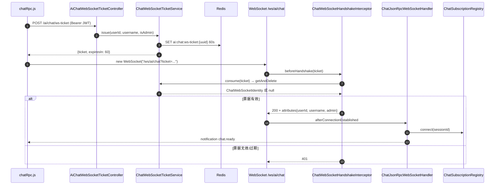
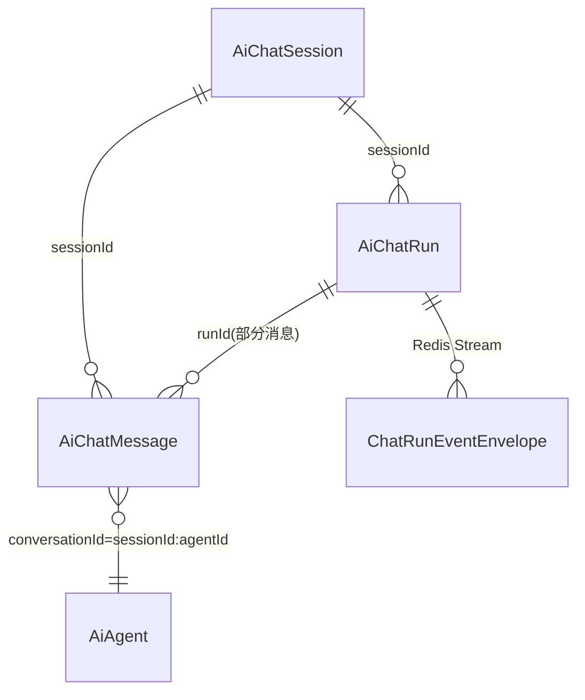
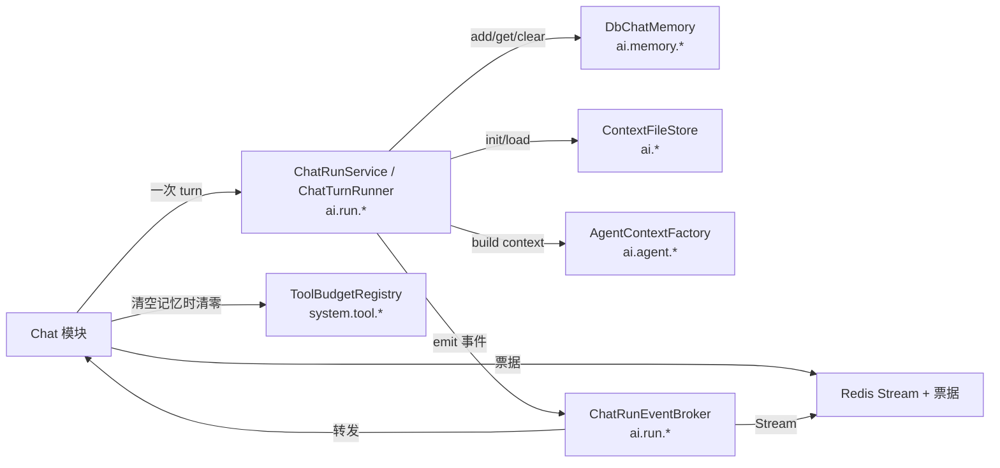

# Chat 聊天对话模块设计文档

> 范围:`ruoyi-admin` 下 `controller/ai` 五个 controller(AiChat/AiChatSession/AiChatRun/AiChatWebSocketTicket/AiChatWorkspace)、`websocket/chat/` 全部 7 个文件、`ruoyi-system/.../ai/AiChatMemoryConfig.java`,以及 `ruoyi-ui/src/api/ai/chat*.js`、`session.js` 与 `views/ai/chat/index.vue` 入口。
> 旁路:与对话强耦合的 `ChatTurnRunner` / `ChatRunService` 等执行层在本文「依赖关系」一节中点出,不展开。

---

## 1. 模块概述

Chat 模块是平台的"用户入口"层:把前端一次"发送消息"拆成 **WebSocket 实时事件 + REST 会话/消息管理** 两条通道,共同围绕一个核心实体 **`sessionId` + `agentId`** 展开。对话执行本身由持久化 Run(`ChatRunService`)驱动,SSE 流式通道已下线(commit `411bf8b`)。

- **必须绑定会话与智能体**:对话创建统一走"会话 + 智能体"路径(`POST /ai/chat/run`),曾经的"通用对话(直接选 modelId 跟模型聊)"旁路与 SSE `/stream` 入口均已下线,`AiChatController` 现在只承担会话级辅助操作(上下文用量 / 清空记忆 / 回滚最后一轮)。
- **两层通道分工**:
  - **WebSocket(`/ws/ai/chat`,JSON-RPC 2.0)**:多端同步 + 长生命周期(run 取消/工具确认/会话级广播);入口 `ChatJsonRpcWebSocketHandler.java:28`。对话执行事件经 Redis 事件总线推给订阅者(见 `docs/聊天执行引擎.md`)。
  - **REST**:会话列表/时间线/清空/回滚/上下文用量/工具结果拉取/一次性 WS 票据,纯读写,无流。SSE(`/ai/chat/stream`)已随 commit `411bf8b` 下线。
- **在 AI 系统中位置**:UI → Chat 模块 → `ChatTurnRunner` / `ChatRunService` → `AgentContextFactory` 装配系统提示词/工具/记忆键 → LLM。Chat 不直接调模型,只负责传输、权限、会话持久化。

---

## 2. 关键类与职责

### 2.1 `AiChatController` — 对话主入口

`ruoyi-admin/.../controller/ai/AiChatController.java`,前缀 `/ai/chat`。

| 关键字段 | 作用 |
|---|---|
| `aiChatSessionService` | 会话 CRUD、`ensureAgentJoined` |
| `contextFileStore` | 上下文文件(人读快照),首轮 `initContext` 写入 system prompt |
| `toolBudgetRegistry` | 会话级工具调用累计(清空记忆时一并清零) |
| `aiLlmCallMapper` / `aiChatRunMapper` / `aiChatMessageMapper` / `aiChatSessionMapper` | 回滚/清空时直查直写 |

> 注:`AiChatController.java` 文件已收敛到 197 行,本表仅保留关键字段名;具体行号请按符号名定位。

| HTTP 方法 | 路径 | 行为 |
|---|---|---|
| `GET`  | `/session/{sessionId}/context?agentId=` | 调 `chatTurnRunner.buildContextUsage` 驱动前端刻度条 |
| `DELETE` | `/session/{sessionId}/memory` (`@Transactional`) | 删 `ai_chat_message`、`ai_llm_call.message_id` 解绑、解绑 `ai_chat_run.message_id`、清上下文文件、清工具预算 |
| `DELETE` | `/session/{sessionId}/last-turn?agentId=` (`@Transactional`) | 取最后一条 USER 之后的 id,先解绑 llm_call 再删消息;**token 真实消耗故不解绑明细** |

**权限辅助**(全部私有方法,被 3 个端点复用):
- `requireOwnedSession` / `requireOwnedSessionForUpdate`:非管理员只能操作 `userId == 自己` 的会话。
- `requireNoActiveRun`:写操作前防"会话正在跑"的并发。
- 会话的创建/补标题/`ensureAgentJoined(...,"supervisor")` **不在本控制器**——该职责归属 `ChatRunService.ensureOwnedSession`(会话创建 + `truncateTitle(message, 20)` 取前 20 字作标题)与 `ChatRunService.upsertAgentJoined`(关联表写入);会话知识库选择也在 `create()` 里随 `kbIds`(**非 null** 时)整组写入 `ai_chat_session_kb`(`saveSessionKbs`,逐库 `requireKb(USE)` 校验,只允许选自己可访问的库);`ChatRunExecutor.ensureSessionArtifacts` 只做 `ensureAgentJoined` 复核 + 工作区目录 + 上下文审计文件,**并不建会话**。

### 2.2 `AiChatSessionController` — 会话元数据

`ruoyi-admin/.../controller/ai/AiChatSessionController.java`,前缀 `/ai/chat/session`。

| HTTP 方法 | 路径 | 关键行 | 行为 |
|---|---|---|---|
| `GET` | `/list` | `:78` | `startPage` + `TableDataInfo`;**非管理员强制 `setUserId(getUserId())`**,防止 query 参数越权读他人会话 |
| `DELETE` | `/{sessionIds}` (`@Transactional`,`@Log(BusinessType.DELETE)`) | `:95` | 批量逻辑删除;逐个 `requireOwnedSessionForUpdate` + `requireNoActiveRun` |
| `GET` | `/{sessionId}/timeline` | 游标分页(参数 `limit`、`beforeMessageId`),直接 `aiChatMessageMapper.selectTimelinePage` 返回**单页**消息;TOOL 消息预览字段会按 `ai.chat.timeline.tool-result-preview` / `tool-args-preview` 配置截断;返回 `AjaxResult { data: 消息数组, hasMore, runs }`(`runs` = 本页涉及的 `runId -> {status, errorMessage}`,补上失败/取消轮缺失的终态,见下文「历史轮终态对账」);**首条 USER 完整轮次**为边界保证 |
| `GET` | `/{sessionId}/message/{messageId}/tool-result` | 按需拉取某条 TOOL 消息的完整工具结果(优先读外置文件 `tool_result_path`,回退到内联 `tool_result`);前端 `getToolResult`,`session.js:57` |
| `GET` | `/{sessionId}/user-messages` | 会话内全部用户消息(前端音轨全量导航) |
| `GET` | `/{sessionId}/traces[/{runId}]` | 会话链路追踪聚合 / 单轮调用树,数据源为 `ai_trace_span` 表;前端 `TracePanel.vue` |
| `PUT` | `/{sessionId}/knowledge-bases` (`@Log(BusinessType.UPDATE)`) | 保存会话知识库多选(body=`Long[]`,整组替换/空数组清空);`requireOwnedSession` + `requireNoActiveRun` 后调 `AiChatSessionService.saveSessionKbs`(逐库 `requireKb(USE)` 校验) |

注释明确"消息时间线不走 service"——该 mapper 方法已现成,不再加壳。

### 2.3 `AiChatWebSocketTicketController` — 一次性票据签发

`ruoyi-admin/.../controller/ai/AiChatWebSocketTicketController.java`,前缀 `/ai/chat/ws-ticket`。

仅一个端点 `POST /ai/chat/ws-ticket`(`:24`),调 `ChatWebSocketTicketService.issue(userId, username, isAdmin)`,返回 `{ticket, expiresIn: 60}`。原生 WebSocket 不能设 `Authorization` 请求头,故用 REST 先换短时票据再握手。

### 2.4 `AiChatRunController` — 运行维度端点(辅助)

不在必读清单,但 `chat.js` 全部 `*ChatRun` 都打这里。`/ai/chat/run` 前缀,六端点:`create`、`get/{runId}`、`active?sessionId=`、`latest?sessionId=`、`cancel/{runId}`、`tool-confirm/{runId}`(危险工具人工确认/拒绝)。

### 2.5 WebSocket 目录(7 文件,`ruoyi-admin/.../websocket/chat/`)

| 类 | 行 | 职责 |
|---|---|---|
| `ChatWebSocketConfig` | 12 | 注册 `registry.addHandler(handler, "/ws/ai/chat")`;`setAllowedOriginPatterns` 显式放行(避免 80→8080 代理时 Origin 端口不同被 Spring 默认拦截,`ChatWebSocketConfig.java:31-33`) |
| `ChatWebSocketHandshakeInterceptor` | 15 | 协议升级前消费 `?ticket=`,把 `userId/username/admin` 写入 `WebSocketSession.attributes`,常量 `USER_ID/USERNAME/ADMIN` 后续被 `ChatJsonRpcWebSocketHandler.dispatch` 读出(`.113-115`) |
| `ChatWebSocketIdentity` | 4 | 票据载荷 POJO:userId、username、admin、`expiresAt` |
| `ChatWebSocketTicketService` | 15 | Redis 60s TTL,`UUID.randomUUID()` 去横线 32 字符;`issue` `opsForValue().set(...Duration.ofSeconds(60))`;**`consume` 用 `getAndDelete` 原子消费**(`:54`),避免同一票据被多端握手 |
| `ChatWebSocketExecutionConfig` | 11 | `chatWebSocketSendExecutor` 线程池(core=2/max=8/queue=1000,`AbortPolicy`),**有界隔离慢客户端**——不与 Agent worker 抢 |
| `ChatJsonRpcWebSocketHandler` | 28 | JSON-RPC 2.0 派发(见 2.6) |
| `ChatSubscriptionRegistry` | 32 | 订阅/广播(见 2.7) |

### 2.6 `ChatJsonRpcWebSocketHandler` — JSON-RPC 派发

10 个方法(`ChatJsonRpcWebSocketHandler.java:125-134`):

| method | 行为 |
|---|---|
| `chat.ping` | 回 `{pong:true, serverTime}` |
| `chat.run.create` | 校验 `attachments` 数组,转 `ChatRunCreateCommand` 调 `runService.create`;params 可带 `clientType / capabilitiesVersion / clientTools`(渠道工具首轮声明) |
| `chat.run.get` / `chat.run.cancel` | 直转 `runService` |
| `chat.run.subscribe` | 准入校验 → `registry.subscribe` → `eventBroker.replay(afterSeq)` 回放 → **replay 之后补发挂起中的渠道工具请求** → 返回 `{run, replayed, redelivered, lastSeq}`;**`result.run` 用 DB 快照兜底 Redis Stream 不可用**(`:169` 注释) |
| `chat.run.unsubscribe` | 清订阅,返回 `{subscribed:false}` |
| `chat.session.subscribe` / `unsubscribe` | 监听整个会话的生命周期(白名单 `LIFECYCLE_TYPES` 见 2.7),多标签页同步用 |
| `chat.session.client.declare` | 浏览器插件等客户端的渠道工具声明落库(`capabilitiesVersion` 相同幂等跳过),见 `渠道工具与浏览器插件.md` |
| `chat.tool.result` | 渠道工具结果回传,唤醒 `ChannelToolBroker` 挂起调用 |

错误码:`-32700` parse、`-32600` invalid request、`-32601` method not found、`-32602` invalid params、`-32603` internal error、`-32000` service、`-32009` ActiveChatRunException(返回 `data.activeRun` 让前端能展示)(`:95-99`)。

### 2.7 `ChatSubscriptionRegistry` — 内存注册表

三类映射(`ChatSubscriptionRegistry.java:46-51`):
- `connections: socketId → Connection`
- `subscriptionsByRun: runId → socketId → Subscription`
- `watchersBySession: sessionId → socketId → Connection`(会话级广播)

**`Subscription`**(`:212`):维护 `lastSentSeq`、回放期间用 `TreeMap<seq, event>` 收 `pending`,`completeReplay` 后再切换到直发模式,严格按 seq 去重保序。

**`Connection`**(`:290`):包装 `ConcurrentWebSocketSessionDecorator`(10s 发送时限/1MB 缓冲),单连接**始终只有 1 个 drain 任务**(`:335` 注释)保证 replay/实时事件/RPC 响应顺序;`queuedBytes > 1MB` 直接 fail 关闭(`:310-315`)。

**会话级广播白名单**(`:42-43`):只转发 `run_status / done / error / cancelled / interrupted` 五种生命周期事件,token 级正文让订阅方走 `chat.run.subscribe` 单独拉,避免重复放大流量。

### 2.8 `AiChatMemoryConfig` — 记忆 Bean 注册

`ruoyi-system/.../ai/AiChatMemoryConfig.java`。**只注册一个 Bean** `chatMemory(DbChatMemory)`(`:27-31`),把 `DbChatMemory` 直接当 `org.springframework.ai.chat.memory.ChatMemory` 用。

为什么不实现 `ChatMemoryRepository`?配置类注释明确给出(`:11-15`):`MessageWindowChatMemory.saveAll` 是**覆盖语义**,会物理删除超出窗口的旧消息,审计和时间线就都没了;直接实现 `ChatMemory`,`add` 就是真追加,一张 `ai_chat_message` 表够用。

---

## 3. 核心流程

### 3.1 用户发消息 → 创建持久化 Run(对话执行入口)

```mermaid
sequenceDiagram
    autonumber
    participant U as 用户
    participant FE as 前端 index.vue + chat.js
    participant RC as AiChatRunController
    participant RS as ChatRunService
    participant EX as ChatRunExecutor
    participant CTR as ChatTurnRunner
    participant DBS as DbChatMemory
    participant LLM as 大模型

    U->>FE: 输入消息 + 选 agent
    FE->>RC: POST /ai/chat/run {sessionId, agentId, message, attachments, kbIds?, clientRequestId}
    RC->>RS: ChatRunService.create(ChatRunCreateCommand)
    Note over RS: INSERT ai_chat_run(status=QUEUED)<br/>★ 初始为 QUEUED;RUNNING 由 ChatRunExecutor worker 抢锁后 markRunning<br/>ActiveRun CAS 守门,并发提交返回 409
    RS-->>FE: 立即返回 runId(异步执行)
    RS->>EX: execute(run) (异步调度)
    EX->>RS: ensureOwnedSession(建会话 / truncateTitle(message, 20))
    RS->>RS: saveSessionKbs(kbIds 非 null 时;整组替换,逐库 requireKb(USE))
    EX->>RS: upsertAgentJoined
    EX->>EX: ensureSessionArtifacts(工作区目录 + 上下文审计文件)
    EX->>CTR: run(turnRequest, sink, callbacks)
    CTR->>DBS: add(ConversationIds.of(s, a), USER)
    CTR->>LLM: chat() 走 AgentContextFactory
    LLM-->>CTR: 流式 chunk
    CTR-->>EX: sink.emit(...) → ChatRunEventBroker 三投递
    EX-->>FE: 事件经 WebSocket 推送(run 订阅,按 seq 回放)
    LLM-->>CTR: 流结束
    CTR->>DBS: add(ASSISTANT + TOOL)
    CTR-->>EX: callbacks.onSucceeded(reply, usage, contextMap)
    EX-->>FE: run_status=SUCCEEDED 事件(usage + context)
```

要点:Chat 层只负责"创建 Run + 把事件投进 Redis 事件总线",执行在 `ChatRunExecutor` → `ChatTurnRunner`,事件消费在 WebSocket 订阅端。**所有工具/MCP/记忆装配都在 `ChatTurnRunner` 内部**。

### 3.2 WebSocket 连接建立与 ticket 校验



票据长度强制 32 字符快速过滤(`ChatWebSocketTicketService.java:48`),`getAndDelete` 保证**同一票据不可能被两个 socket 消费**。

### 3.3 会话(Session)、消息(Message)、运行(Run)三者关系

- `AiChatSession`(`ai_chat_session`):业务会话,**1 个用户/1 个会话/可能多个 agent 接入**(`supervisor` 角色);记录 `title/totalTokens/contextLength/status`。
- `AiChatMessage`(`ai_chat_message`):消息级持久化,**真实数据源**。`conversationId = sessionId:agentId`(`ConversationIds.of`,`AiChatMemoryConfig` 等位置组装);每条消息按 `messageType` 区分 USER/ASSISTANT/TOOL/SUMMARY/THINKING,按 `message_id` 升序渲染。
- `AiChatRun`(`ai_chat_run`):一次"运行"实例,可被多个标签页订阅;`eventBroker` 用 Redis Stream 存带 seq 的事件,断线重连按 `afterSeq` 回放。

**关系示意**:



切换历史会话时,前端调 `GET /ai/chat/session/{id}/timeline` 拿全量消息还原(`AiChatSessionController.java:122`);长生命周期通过 `chat.session.subscribe` 收新 runId,再 `chat.run.subscribe` 补完整事件。

**历史轮终态对账**:上图里 `AiChatRun ||--o{ AiChatMessage` 是**部分**关系 —— 失败 / 取消 / 节点中断的一轮只留下 USER 行,没有 `ASSISTANT_FINAL`。所以「这一轮结束没有」不能从消息账本推,只能看 `ai_chat_run.status`。timeline 因此随消息一并返回 `runs`(`runId -> {status, errorMessage}`),前端 `useTurnBuilder.applyRunStates` 据此把这些轮次收成终态并显示失败原因;查不到 run 状态的老数据(`run_id` 为空 / run 行已清理)退回结构性判据:`uk_ai_chat_run_active` 保证一个会话同时只有一个活动 run,所以**后面还有轮次就说明前面那轮必然已结束**。

漏了这层对账的后果是失败轮永远显示「正在输入」的三个点。注意只对账最新一轮(`/ai/chat/run/latest` → `useChatRun.reconcileRun`)不够:那只能救最后一轮,更早的失败轮不会再有人纠正。

---

## 4. 对外接口

### 4.1 HTTP 端点

| 方法 | 路径 | Controller:行 | 前端调用 |
|---|---|---|---|
| GET  | `/ai/chat/session/{sessionId}/context?agentId=` | `AiChatController.java:83` | `getContextUsage()` `chat.js:12` |
| DELETE | `/ai/chat/session/{sessionId}/memory` | `AiChatController.java:94` | `clearSession()` `chat.js:4` |
| DELETE | `/ai/chat/session/{sessionId}/last-turn?agentId=` | `AiChatController.java:124` | `rollbackLastTurn()` `chat.js:21` |
| GET  | `/ai/chat/session/list` | `AiChatSessionController.java:78` | `listSession()` `session.js:4` |
| DELETE | `/ai/chat/session/{sessionIds}` | `AiChatSessionController.java:95` | `delSession()` `session.js:13` |
| GET  | `/ai/chat/session/{sessionId}/timeline` | `AiChatSessionController.java:122` | `getSessionTimeline()` `session.js:22` |
| GET  | `/ai/chat/session/{sessionId}/message/{messageId}/tool-result` | `AiChatSessionController.java:180` | `getToolResult()` `session.js:57` |
| GET  | `/ai/chat/session/{sessionId}/user-messages` | `AiChatSessionController.java:252` | `getSessionUserMessages()` `session.js:48` |
| GET  | `/ai/chat/session/{sessionId}/traces[/{runId}]` | `AiChatSessionController.java:273/286` | `getSessionTraces()`/`getRunTrace()` `session.js:31/40` |
| POST | `/ai/chat/ws-ticket` | `AiChatWebSocketTicketController.java:24` | `createChatWebSocketTicket()` `chat.js:81` |
| POST | `/ai/chat/run` | `AiChatRunController.java:35` | `createChatRun()` `chat.js:30` |
| GET  | `/ai/chat/run/{runId}` | `:52` | `getChatRun()` `chat.js:39` |
| GET  | `/ai/chat/run/active?sessionId=` | `:58` | `getActiveChatRun()` `chat.js:46` |
| GET  | `/ai/chat/run/latest?sessionId=` | `:64` | `getLatestChatRun()` `chat.js:54` |
| POST | `/ai/chat/run/{runId}/cancel` | `:70` | `cancelChatRun()` `chat.js:62` |
| POST | `/ai/chat/run/{runId}/tool-confirm` | `:79` | `confirmChatTool()` `chat.js:71` |

### 4.2 WebSocket 端点

- **URL**:`/ws/ai/chat?ticket=<一次性票据>`(`ChatWebSocketConfig.java:34`)
- **协议**:JSON-RPC 2.0,方法清单见 §2.6
- **前端**:`ruoyi-ui/src/api/ai/chatRpc.js` 的 `ChatRpcClient` 单例,`retain()/release()` 引用计数(`chatRpc.js:35-46`),自动重连 + 指数退避(`:325-336`),25s 心跳(`:338-350`)

### 4.3 前端入口

- 视图:`ruoyi-ui/src/views/ai/chat/index.vue`(28KB),`SessionSidebar` + `ChatMessage` 列表 + 顶部连接指示灯(`chat-conn` class)
- API 模块:见上表

---

## 5. 依赖关系



- **Run 层**:`ChatTurnRunner.run(...)` 是 chat **Turn 维度的唯一执行入口**,被 `ChatRunExecutor.executeInternal` 调用;Chat 控制器(`AiChatController`)不再触发 turn,只承担会话级辅助(上下文用量 / 清空记忆 / 回滚最后一轮)。`ChatRunService` 负责 run 维度的 CRUD 与取消。
- **Memory**:`DbChatMemory` 是 LLM 真实上下文来源,**读写 `ai_chat_message` 表**(`AiChatMemoryConfig.java` 注释),由 Spring AI 的 `ChatMemory` 接口消费。
- **Context**:`ContextFileStore` 是**人读快照**,不参与 LLM 上下文拼接(已降级);回滚时**不回滚**它,作为"重试痕迹"留底(见 `rollbackLastTurn` 方法 javadoc)。
- **Model**:Chat 层不直接感知模型;模型由 agent 的 `modelCode` 经 `ChatModelFactory` 装配。
- **Auth**:所有 controller 继承 `BaseController`,从 `SecurityUtils` 拿 `getUserId/getUsername/isAdmin`;非管理员**只能动自己 `userId` 的会话**(归属校验实现见 `requireOwnedSession` / `requireOwnedSessionForUpdate` 私有方法)。
- **WebSocket ↔ Run**:`ChatRunEventBroker` 把 `ChatRunEventEnvelope` 发到 Redis Stream,`ChatSubscriptionRegistry.@EventListener onRunEvent`(`:160-172`) 收到后扇出给订阅方;会话级只广播 `LIFECYCLE_TYPES`,run 级全量。

---

## 6. 典型使用场景

### 场景一:用户首次新建会话发第一条消息

1. 前端发 `POST /ai/chat/run`,`sessionId` 由前端生成(尚未入库),携带 `clientRequestId` 幂等键(`createChatRun`,`chat.js:30`);用户若选了知识库,`kbIds` 一并带上。
2. `ChatRunService.create` 落库 `ai_chat_run(status=QUEUED)`,ActiveRun CAS 守门;随后 `ChatRunService.ensureOwnedSession` 走"不存在则新建"分支,`truncateTitle(message)` 取前 20 字作标题;`kbIds` 非 null 时 `saveSessionKbs` 整组写入 `ai_chat_session_kb`(逐库 `requireKb(USE)` 校验);`ensureSessionArtifacts` 仅负责 `ensureAgentJoined` 复核 + 工作区目录 + 上下文审计文件。若请求带 `projectId`(桌面端选中项目时新建对话),`SessionAccessGuard.requireOrCreate` 在**新建**会话行上写 `project_id`(存量 insert ignore 不覆盖),会话即归属该项目。
3. `sessionService.ensureAgentJoined(sessionId, agentId, "supervisor")` 在 `ai_chat_session_agent` 写入关联(`ChatRunService.java:266`)。
4. `AgentContextFactory.buildForRun` 装配顶层 agent;`contextFileStore` 首轮写入 system prompt 快照。
5. `chatTurnRunner.run(turnRequest, sink, callbacks)` 驱动 LLM,事件经 `ChatRunEventBroker` 三投递;`callbacks.onSucceeded` 发 `type=done` 携带 usage + context 快照(执行器侧追加 `status=SUCCEEDED` 与完整 `text`)。

### 场景二:用户多标签页/多浏览器打开同一会话

1. 每个标签页的 `ChatRpcClient` 独立,但都先 `POST /ai/chat/ws-ticket` 拿 60s 票据握 `/ws/ai/chat`(`chatRpc.js:155-191`)。
2. 进入会话后 `subscribeSession(sessionId, onSessionEvent, onActiveRun)` 调 `chat.session.subscribe`,服务端 `registry.watchSession(socketId, sessionId)`(`ChatSubscriptionRegistry.java:82-92`)。
3. 另一标签页发消息触发新 run,`ChatRunEventBroker` 发 `run_status` 事件 → `notifySessionWatchers` 广播 `chat.session.event` 通知(白名单 5 种生命周期),所有 watcher 收到 → 前端拿到 `runId` 调 `chat.run.subscribe` 拉完整事件流。
4. 断线重连时 `onopen` 钩子按 `afterSeq` 自动补订阅(`chatRpc.js:185-190`),`Subscription.completeReplay` 把回放期间到达的 live 事件按 seq 排序补发。

### 场景三:用户对最后一条回答点"重新生成"

1. 前端 `DELETE /ai/chat/session/{sessionId}/last-turn?agentId=`(`rollbackLastTurn`,`chat.js:22`)。
2. `AiChatController.rollbackLastTurn`:
   - `requireOwnedSessionForUpdate` 锁会话;`requireNoActiveRun` 防并发。
   - `ConversationIds.of(sessionId, agentId)` 拼 conversationId。
   - `aiChatMessageMapper.selectLatestUser` 找最后一条 USER;`selectIdsFrom` 取该 USER 及其之后所有消息 id。
   - **先** `aiLlmCallMapper.unbindMessageIds(doomedIds)` 解绑明细(顺序敏感,删完查不到了);
   - **再** `aiChatMessageMapper.deleteFromMessageId` 物理删除。
   - 上下文文件**不回滚**(已在 `ContextFileStore` 设计中标注为"重试痕迹"留底),token 已真实消耗的 `ai_llm_call` 明细行**保留**,统计不丢。
3. 前端拿到 200 后,用原文重新 `POST /ai/chat/run`(`createChatRun`,`chat.js:30`),走"已存在会话 + agent 已接入"分支,创建新 Run 执行。

---

## 附:文档内引用文件速查

| 文件 | 关键行 |
|---|---|
| `ruoyi-admin/.../controller/ai/AiChatController.java` | 上下文用量端点;清记忆;回滚;`requireNoActiveRun` |
| `ruoyi-admin/.../controller/ai/AiChatSessionController.java` | list;批量删;timeline;tool-result;traces |
| `ruoyi-admin/.../controller/ai/AiChatWorkspaceController.java` | 工作区树/文件/上传/下载/清空(6 个端点;详见 `docs/工作空间模块.md`) |
| `ruoyi-admin/.../controller/ai/AiChatWebSocketTicketController.java` | `POST /ai/chat/ws-ticket` |
| `ruoyi-admin/.../controller/ai/AiChatRunController.java` | `/ai/chat/run/*` 六个端点 |
| `ruoyi-admin/.../websocket/chat/ChatWebSocketConfig.java` | `:34` `/ws/ai/chat` 注册 |
| `ruoyi-admin/.../websocket/chat/ChatWebSocketHandshakeInterceptor.java` | `:32-43` ticket 校验 + attributes 写入 |
| `ruoyi-admin/.../websocket/chat/ChatWebSocketTicketService.java` | `:54` `getAndDelete` 原子消费 |
| `ruoyi-admin/.../websocket/chat/ChatJsonRpcWebSocketHandler.java` | `:118-129` 8 个 JSON-RPC 方法;`:160-172` 错误码分支 |
| `ruoyi-admin/.../websocket/chat/ChatSubscriptionRegistry.java` | `:46-51` 三类映射;`:160-172` 事件监听;`:212-288` Subscription 回放+seq |
| `ruoyi-system/.../ai/AiChatMemoryConfig.java` | `:27-31` `chatMemory` Bean;`:11-15` 为什么实现 ChatMemory 而非 Repository |
| `ruoyi-ui/src/api/ai/chat.js` | `:4-27` 会话辅助(清记忆/上下文/回滚);`:30-79` run 端点;`:81` ws-ticket |
| `ruoyi-ui/src/api/ai/chatRpc.js` | `:35-46` `retain/release`;`:148-227` `connect`;`:325-336` 指数退避重连 |
