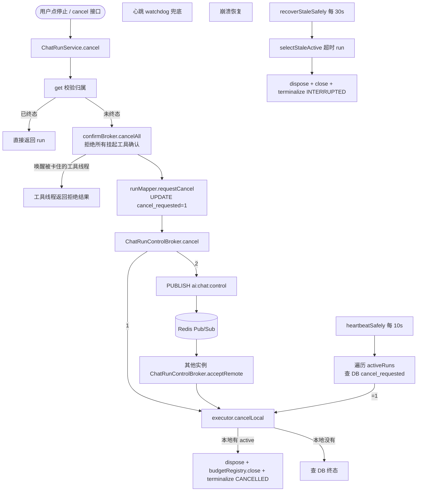

# Run 聊天执行引擎设计文档

> 源码范围:`ruoyi-system/src/main/java/com/ruoyi/system/ai/run/` 全部 24 个文件(含 `AgentToolLoop`、`ParallelToolCallingManager`) + `ruoyi-admin/.../controller/ai/AiChatRunController.java` + `ruoyi-ui/src/api/ai/chat.js`、`composables/useChatRun.js`
>
> 旁路:`ChatTurnRunner` / `ChatRunService` 与 Chat 模块共用,本模块对其做了 Run 化封装;Agent 装配层(`AgentContextFactory`)、`ChatEventJson` 事件类型在「依赖关系」一节点出。链路追踪子系统在「com.ruoyi.system.ai.trace」包中,本节点出但不展开。
>
> 文档版本:基于 springboot3 分支(主干)源码梳理

---

## 1. 模块概述

`ai.run` 包解决一个核心问题:**把「浏览器连接」从「模型执行」里彻底解耦**,让后端 Agent 的生命周期不再受 WebSocket 抖动、SSE 关闭、Tab 切走、刷新页面的影响。

### 1.1 核心问题与动机

旧版 Chat 模块(`AiChatController.stream`)的 SSE 流式对话把"模型在跑"这件事跟"浏览器连着"绑死了(该模式已随 commit `411bf8b` 下线,此处作为动机回顾):

- 用户刷新页面 → SSE 断开 → `flux.subscribe` 被 cancel → Reactor 流终止 → 当前轮的 `ai_chat_message` 写到一半、token 用量没汇总、`ai_chat_session.total_tokens` 永远是 0
- 用户切走 Tab → 同上,模型继续跑也没人收到
- 后端 worker 因为 OOM/重启死掉 → DB 里 `ai_chat_run` 永远卡 `RUNNING` → 后续会话被 `requireNoActiveRun` 拒绝

Run 引擎引入**两层抽象**彻底切断这层耦合:

```
旧: HTTP 请求 → SSE 持有 → ChatTurnRunner → 模型 (谁断谁死)
新: HTTP 请求 → ChatRunService 持久化 runId → ChatRunExecutor 丢进独立线程池
                → ChatTurnRunner 跑模型,事件经 ChatRunEventBroker → Redis Stream/Pub-Sub
                → 任意 WebSocket 订阅者按 seq 实时/回放消费
```

### 1.2 关键定义

| 概念 | 含义 | 生命周期归属 | 关键类 |
| --- | --- | --- | --- |
| **ChatRun** | 一次"用户发起对话"的完整生命周期,带 `runId` 持久化到 `ai_chat_run` 表 | 跨页面、跨进程、跨重启 | `AiChatRun`、`ChatRunInstance` |
| **ChatTurn** | 同一 `ChatRun` 内部的一轮用户请求(内含 `AgentToolLoop` 多轮 LLM↔工具) | 等同 ChatRun | `ChatTurnRequest`、`ChatTurnRunner`、`AgentToolLoop` |
| **Run Worker** | 真正跑一轮对话的独立线程(`chat-run-*` 命名) | 占用 `chatRunTaskExecutor` 一个槽位,直到终态 | `ChatRunExecutor` |
| **Event Broker** | 三层事件投递(进程内 ApplicationEvent + Redis Pub/Sub + Redis Stream 回放) | 跨实例同步、断线重连补齐 | `ChatRunEventBroker` |
| **Control Broker** | 跨实例控制命令(`cancel` / `pause`) | 写到 Redis Channel `ai:chat:control` | `ChatRunControlBroker` |

### 1.3 与 Chat 模块的关系

Chat 模块(`docs/聊天对话模块.md`)负责**会话/消息的 CRUD、WebSocket 通道**,Run 引擎**接管**了"驱动一轮对话"这件事;两者通过 `ChatTurnRunner` 共用,但入口分离:

| 入口 | 调用方 | 传输 | 鉴权 | 状态机 |
| --- | --- | --- | --- | --- |
| `AiChatRunController.create` | REST `POST /ai/chat/run` | 实时事件走 WebSocket(JSON-RPC `chat.run.subscribe`) | 持久化 `ai_chat_run`,含幂等键 | 浏览器断 ≠ 后端停,完全独立 |

简单说:**Chat 是「连着就给你推」,Run 是「落库 + 广播 + 订阅,谁连都无关」**。前端 `useChatRun.js` 的核心职责就是包装 Run 引擎的语义(挂载/恢复/对账/取消)。

### 1.4 能力清单

- **持久化运行**:`ai_chat_run` 表是运行生命周期的事实源,`status` 字段 7 态机 + 终态集
- **独立工作池**:`chatRunTaskExecutor`(`core=4/max=16/queue=200`,`ChatRunExecutionConfig.java:14`)有界隔离,Agent 跑满不会饿死其他异步任务
- **跨实例广播**:Redis Pub/Sub 频道 `ai:chat:events`(进程内事件)+ `ai:chat:control`(控制命令)
- **断线重放**:Redis Stream `ai:chat:run:{runId}:events`(`MAX_STREAM_LENGTH=5000`,`RETENTION=24h`)按 `seq` 升序回放
- **节点崩溃恢复**:心跳 watchdog + stale watchdog 兜底(`ChatRunExecutor.java:117-121`)
- **运行级工具预算**:`ToolBudgetRegistry` 按 `sessionId` 打开,`ChatRunExecutor` 与 worker 同步开关
- **危险工具人工确认**:`ToolConfirmBroker` 是**纯内存**实现(`ConcurrentHashMap` + `CompletableFuture`,默认 120s 超时,配置 `ai.chat.tool.confirm-timeout-seconds`),挂起当前工具调用,`POST /ai/chat/run/{runId}/tool-confirm` 唤醒;**不使用 Redis**(不要误以为有 TTL)。
- **渠道工具挂起与补发**:`ChannelToolBroker` 照抄 ToolConfirmBroker 的"进程内挂起 + future 唤醒"模式,把工具调用经事件总线(`tool_call_request`,不落投影 step)推给浏览器插件执行并挂起等待;客户端断线超过 `ai.chat.tool.channel.disconnect-grace-seconds` 快速失败,重连订阅(replay 之后)对未回传请求**同 callId 补发**,插件按 callId 幂等不重跑。详见 `渠道工具与浏览器插件.md` §3.3-3.4。
- **幂等创建**:同 `clientRequestId` 同 `userId` 重放时校验输入完全一致才返回原 `run`,否则拒绝
- **活跃运行冲突**:同一 `sessionId` 已有非终态 run 时,后到请求返回 `HTTP 409` + 当前 run(`ActiveChatRunException`)
- **并行工具调用**:同一轮 LLM 返回**多个** `tool_calls` 时,由 `ParallelToolCallingManager` 调度到 `parallelToolTaskExecutor`(与 chat-run 池隔离,默认 core=4/max=16/queue=64,`CallerRunsPolicy`)。配置键是扁平的:`ai.chat.run.parallel-tools`(布尔,默认生产 yml 为 true)、`max-parallel-tools`(5)、`tool-execution-timeout-ms`(30000)。**同轮只有 1 个 tool_call 走内联路径,没有 `orTimeout`**,挂死靠 `max-duration-seconds` 兜底。
- **链路追踪**:`TraceSpanRecorder`(在 `com.ruoyi.system.ai.trace` 包)为每个 Run 创建 turn 根 span、为每轮 LLM 创建 llm span、为每次工具批次创建 tool_batch span、为并行工具创建 tool span、为子 agent 创建 subagent span;`ai_trace_span` 表记录结构化字段(run_id/span_type/parent_span_id/duration_ms/各 token 等),会话侧 `GET /ai/chat/session/{sessionId}/traces[/{runId}]` 直接查询该表。

### 1.5 可恢复状态协议（Run State v2）

页面恢复统一采用“数据库快照 + 快照后的事件增量”，不再从消息角色、`visible_to_llm`、工具名或 `seq=0` 重建运行链：

1. `ai_chat_message` 是对话事实，`run_id/message_kind/step_id/parent_step_id` 明确一行属于哪次运行、承担什么语义。最终答案只认 `message_kind=ASSISTANT_FINAL`。
2. `ai_chat_run_step` 是 UI 执行步骤投影，按 `(run_id, step_id)` 唯一，保存 reasoning/tool/agent/content 的当前状态和嵌套关系。超长 `output_data` 外置到 `output_data_path`。工具步骤的 `message_id` **不是投影器写的**：`ChatMessageRecorder` 在 TOOL 行 insert 后 `bindMessageId`，供运行中刷新后「查看完整结果」。`type=ui` 不进本表。
3. `GET /ai/chat/run/{runId}/state` 同时返回该 Run 的 `messages` 事实账本与 `steps` 投影。进行中以投影恢复 checkpoint/确认状态；终态以消息账本重建工具链，再用投影补缺，避免任一投影故障造成重进后步骤消失。
4. `ai_chat_run.snapshot_seq` 表示步骤快照已完整覆盖到的事件序号；客户端请求 State 后，只订阅 `seq > snapshotSeq`。流式正文按 128 个事件、64 KiB 或 1 秒中任一阈值形成检查点，离散事件和终态强制检查点，保证运行中重进的增量回放始终有界。
5. Redis Stream 是 24 小时短期增量日志，不承担长期 UI 事实源。Stream 过期后仍可由消息和步骤表恢复。
6. 文本与推理 chunk 在 `ChatRunProjectionService` 内存聚合；遇到工具、状态、终态等离散事件时批量刷入步骤表并推进 `snapshot_seq`，避免逐 token 写库。事务只包住真正落库的路径(离散事件或到检查点阈值),未到阈值的 chunk 纯内存聚合、不借 JDBC 连接。

稳定 ID 约束：

| 步骤 | `stepId` | `parentStepId` |
| --- | --- | --- |
| 顶层最终正文 | `answer` | `null` |
| 主智能体推理 | `reasoning:{iteration}` | `null` |
| 普通工具 | 上游 `toolCallId`；缺失时生成 UUID | 当前子智能体调用 ID 或 `null` |
| 子智能体 | 上游 `toolCallId`；缺失时生成调用 UUID | 外层子智能体调用 ID 或 `null` |
| 子智能体推理 | `reasoning:{invId}` | `invId` |

同名工具、同一子智能体并发或重复调用时，前后端都只能按 `stepId` 更新，禁止回退到“最后一个同名 streaming 步骤”。事件发布也必须在单个 Run 内按 seq 串行；客户端发现序号缺口时保持原高水位，先按退避节奏刷新 Run State 检查点，只有快照游标前进后才替换订阅，禁止在同一旧游标上即时重订阅形成恢复风暴。

`request_message_id/response_message_id` 在消息插入时直接取得主键并绑定，不再查询“最新 USER/ASSISTANT”。这保证同会话并发收尾、工具中间 ASSISTANT 与最终 ASSISTANT 并存时不会绑错。

---

## 2. 关键类与职责

### 2.1 核心实体

#### 2.1.1 `ChatRunInstance`(`ChatRunInstance.java:10`)

**作用**:当前 JVM 实例在 Run 引擎中的唯一标识。注入 `@Value("${spring.application.name:ruoyi}")` + `HOSTNAME` 环境变量 + 8 位 UUID,前缀 88 字符截断(`ChatRunInstance.java:18-22`)。

**职责**:

- `ChatRunExecutor.markRunning(runId, instance.id)` 写入 `ai_chat_run.worker_id`,**作为行锁语义**——多个实例抢同一 `runId` 的 `RUNNING` 状态时,只有 `UPDATE ... WHERE status='QUEUED' AND worker_id IS NULL` 命中的会赢(`AiChatRunMapper.markRunning`)
- `ChatRunEventBroker` 在事件信封上盖 `originInstanceId` 戳,本实例发出的事件在 Pub/Sub 回来时丢弃(`ChatRunEventBroker.java:126-128`),避免双投
- `ChatRunControlBroker` 控制命令同样盖章,本实例已本地处理过的 cancel 不再回放处理(`ChatRunControlBroker.java:52`)

#### 2.1.2 `ChatRunStatus`(`ChatRunStatus.java:6`)

7 态机 + 4 终态集:

```
QUEUED → RUNNING → FINALIZING → SUCCEEDED
                       ↓
              FAILED / CANCELLED / INTERRUPTED
```

终态判定 `isTerminal`(`ChatRunStatus.java:20`)仅基于状态字符串。`FINALIZING` 不算终态,因为收尾期间仍可能被打断。代码里所有"避免重复收尾"的并发控制都靠这个集合与 `ActiveRun.beginTerminal` 的 CAS 组合。

#### 2.1.3 `AiChatRun`(`AiChatRun.java:11`)

`ai_chat_run` 表的 POJO,持久化字段全在这。核心字段:

| 字段 | 用途 |
| --- | --- |
| `runId` UUID | 跨表外键 + WebSocket 订阅键 |
| `sessionId` / `agentId` | 复用 `ConversationIds.of(sessionId, agentId)` 作对话主键 |
| `clientRequestId` | 幂等键(同 user 内全局唯一) |
| `userId` | 会话归属校验主键 |
| `inputText` / `attachments` | 用户原始输入(attachments 为 JSON,前端可选) |
| `status` | 7 态机(QUEUED/RUNNING/FINALIZING/SUCCEEDED/FAILED/CANCELLED/INTERRUPTED) |
| `workerId` | 抢到 RUNNING 状态的实例 ID(`ChatRunInstance.id`) |
| `startedTime` / `heartbeatTime` / `finishedTime` | 时间序列,用于僵死检测与 watchdog |
| `createTime` / `updateTime` | RuoYi 通用审计字段 |
| `activeKey` | 活跃运行冲突检查键,目前 = `sessionId`,业务上"一个会话同时只跑一轮" |
| `status` | 7 态机当前值 |
| `lastEventSeq` | Redis Pub/Sub 短暂故障时本机降级序号,持久化兜底(`ChatRunEventBroker.java:181`) |
| `cancelRequested` | `0/1` 标记,worker 通过心跳轮询感知取消信号(`ChatRunExecutor.java:509-512`) |
| `workerId` | 当前持有该 run 的 JVM 实例 id |
| `errorCode` / `errorMessage` | 终态时的错误归因,最多 2000 字符截断(`ChatRunExecutor.java:633`) |
| `requestMessageId` / `responseMessageId` | 终态时回填,前端时间线能定位本轮消息 |

### 2.2 命令与配置

#### 2.2.1 `ChatRunCreateCommand`(`ChatRunCreateCommand.java:6`)

**作用**:API 层 → `ChatRunService` 的 DTO。包含 `clientRequestId`、`attachments` 列表(`List.of()` 默认空)、`kbIds`(会话级知识库多选;`null`=不改已有选择,空数组=清空)、渠道工具首轮声明三元组 `clientType / capabilitiesVersion / clientToolsJson`(新会话把客户端工具清单捎在 create 上,装配前写入会话行,见 `渠道工具与浏览器插件.md` §3.1)、操作者三元组 `userId/username/admin`(`ChatRunCreateCommand.java:12-23`)。

#### 2.2.2 `ChatRunCommand`(`ChatRunCommand.java:6`)

**作用**:`ChatRunService` → `ChatRunExecutor` 的内部 record。**比 CreateCommand 多了 `runId`**——因为 `runId` 是在 `create()` 里 `UUID.randomUUID()` 之后才确定(`ChatRunService.java:82`),校验和落库后才能组装。

#### 2.2.3 `ChatRunExecutionConfig`(`ChatRunExecutionConfig.java:12`)

**作用**:声明独立的 `chatRunTaskExecutor` 线程池。`@Value` 三个参数可外部覆盖:

| 参数 | 默认 | 来源 |
| --- | --- | --- |
| `ai.chat.run.core-pool-size` | 4 | `ChatRunExecutionConfig.java:16` |
| `ai.chat.run.max-pool-size` | 16 | `ChatRunExecutionConfig.java:17` |
| `ai.chat.run.queue-capacity` | 200 | `ChatRunExecutionConfig.java:18` |

`RejectedExecutionHandler = AbortPolicy`:队列满直接抛,被 `ChatRunExecutor.start` 的 try-catch 捕获,转成 `ChatRunStatus.FAILED` + `QUEUE_REJECTED` 错误码落库推事件(`ChatRunExecutor.java:130-135`)。

> ⚠ `waitForTasksToCompleteOnShutdown=false`(`ChatRunExecutionConfig.java:25`):容器关闭时不阻塞等待 worker,避免 Spring Boot graceful shutdown 卡住。

> 💡 同一 `@Configuration` 还声明了**第二个**独立线程池 `parallelToolTaskExecutor`(用于 §7.1 并行工具调用),核心数 = CPU 核数、队列 = 1000、`AbortPolicy`,带明确注释避免主对话线程与并行工具线程相互死锁。

### 2.3 执行器

#### 2.3.1 `ChatRunService`(`ChatRunService.java:26`)

**作用**:`@Service`,Run 引擎的"事务边界"层。所有 HTTP 接口(`AiChatRunController`)、WebSocket RPC(`chat.run.create` / `chat.run.get` / `chat.run.cancel`)都过它。

**核心方法**:

| 方法 | 行号 | 行为 |
| --- | --- | --- |
| `create(ChatRunCreateCommand)` | `:60` | 校验 → 幂等检查 → 智能体启用检查 → 会话归属检查 → 插入 `ai_chat_run(status=QUEUED)` → `afterCommit` 投递 QUEUED 事件 + `executor.start(command)` |
| `get / activeBySession / latestBySession` | `:127/:138/:176` | 单一对象查询,均带 `requireOwner` |
| `watchableActiveRun` | `:160` | 比 `activeBySession` 宽松——**允许未落库的新会话**(新 Tab 首轮发送前 `sessionId` 还没入库) |
| `cancel(runId, userId, admin)` | `:190` | 先 `confirmBroker.cancelAll(sessionId)` 唤醒所有挂起的工具确认线程,再 `runMapper.requestCancel(runId)` 写 `cancel_requested=1`,最后 `controlBroker.cancel` 广播跨实例取消 |
| `confirmTool(runId, confirmId, approved, userId, admin)` | 实际 5 参;跨线程完成 `ToolConfirmBroker` 的 `CompletableFuture`(内存实现,默认 120s 超时,配置 `ai.chat.tool.confirm-timeout-seconds`);方法内部先做归属校验与终态短路;`resolve` 返回 `false` 表示 confirmId 已过期或不存在 |

**幂等与冲突**(`ChatRunService.java:67-108`):

- 优先按 `(userId, clientRequestId)` 查重——命中则校验 `sessionId/agentId/inputText/attachments` 全部相同,否则抛 `clientRequestId 已用于其他对话请求`
- 插入冲突兜底(极小概率),二次查重失败时按 `activeKey` 取活动 run 抛 `ActiveChatRunException` → Controller 转 HTTP 409
- `afterCommit` 用 `TransactionSynchronization` 注册回调,**只有 DB 真正落库后才推事件 + 启动 worker**(`ChatRunService.java:369`),避免回滚后还发事件

#### 2.3.2 `ChatRunExecutor`(`ChatRunExecutor.java:52`)

**作用**:`@Component`,Run 引擎的"运行时大脑"。

**关键字段**(`ChatRunExecutor.java:56-76`):

- `taskExecutor`(`chatRunTaskExecutor`):运行工作池
- `scheduler`(`scheduledExecutorService`):两个 watchdog
- `staleTimeoutMs`(`ai.chat.run.stale-timeout-ms=120000`):心跳超时阈值
- `maxDurationSeconds`(`ai.chat.run.max-duration-seconds=1800`):Run 总时长兜底阈值
- `activeRuns:ConcurrentHashMap<String, ActiveRun>`:本实例持有的运行
- `heartbeatTask` / `staleTask`:`@PostConstruct` 启动的两条调度任务

**核心方法**:

| 方法 | 行号 | 行为 |
| --- | --- | --- |
| `start(ChatRunCommand)` | `:113` | `taskExecutor.execute(() -> execute(command))`,队列满 catch AbortPolicy 转 FAILED |
| `executeInternal(ChatRunCommand)` | `:159` | 终态/cancel 短路 → `markRunning` 抢锁 → 构造 `ActiveRun` + 打开 `budgetRegistry` → 装配 `OperatorHolder` + 事件 sink → 调 `chatTurnRunner.run(...)` 拿 `Disposable` → `active.awaitTerminal()` 阻塞 worker |
| `succeed(active, command, reply, usage, ctx)` | `:266` | CAS 抢终态权 → `markFinalizing` 抢 DB 收尾权 → `completeRun(SUCCEEDED)` → 推 `type=done` 终态事件(带完整 `text` 校准答案) |
| `fail(active, command, error)` | `:325` | CAS 抢终态权 → `terminalize(FAILED, MODEL_EXECUTION_FAILED, safeMessage(error))` |
| `cancelLocal(runId)` | | 本地有则 `dispose` 模型订阅 + 关 budget + `terminalize(CANCELLED)`;**跨实例通过 `ChatRunControlBroker` 广播**到正确实例 |
| `pauseLocal(runId)` | | 只立暂停闸门,不 cancel。见 Control Broker |
| `terminalize(...)` | `:403` | 统一终态写入器,`completeRun` 后发对应 `type=error/cancelled/interrupted` 事件 |
| `heartbeatSafely` / `enforceMaxDuration` / `recoverStaleSafely` | `:465/:504/:536` | 心跳任务开头先做总时长兜底(超期 Run 强制 INTERRUPTED),再每 10s 写心跳;stale 扫描每 30s 回收心跳过期 run |
| `shutdown` | `:567` | `@PreDestroy`,把所有 active run 标 INTERRUPTED 让其他实例/前端知道 |

**`ActiveRun` 内部类**(`ChatRunExecutor.java:639-672`):

```java
AtomicBoolean terminal;          // CAS 抢终态权
CountDownLatch terminalSignal;   // worker await,回调 signal
volatile Disposable disposable;  // Reactor 订阅句柄,cancel/收尾时 dispose
volatile long startedAtMs;       // 本地起始时间,总时长兜底判定用
```

**关键并发不变量**:

- `beginTerminal()` CAS 成功者是终态权持有者,失败者直接 return 避免重复收尾(`ChatRunExecutor.java:269-272`)
- 收尾顺序固定:`beginTerminal` → `markFinalizing` → DB 写终态 → `eventBroker.publish` 终态事件 → `signalTerminal` 唤醒 worker → worker `finally` 块 `confirmBroker.cancelAll` + `budgetRegistry.close`
- worker 线程被 `InterruptedException` 中断时,`interruptWorker`(`:364`)仍能走完收尾——保证 INTERRUPTED 终态事件被发出

**`heartbeatSafely` + `recoverStaleSafely` 双 watchdog**:

- `heartbeat`(10s):开头先跑 `enforceMaxDurationSafely`(总时长兜底,见 §3.3),然后遍历 `activeRuns`,写 `worker_id` 心跳;同时查 DB,如发现 `cancel_requested=1` → 本地 `cancelLocal` 兜底
- `recoverStale`(30s):`selectStaleActive(staleSeconds)` 找出心跳过期的 run,**强制 dispose + 标 INTERRUPTED**——用于崩溃实例留下的孤儿 run

**`ensureSessionArtifacts`**(`ChatRunExecutor.java:453-481`):

执行前把会话依赖物(主智能体关联、工作区沙盒根目录、上下文审计文件)补齐。注意 `WorkspaceSandbox.resolveRoot` 与 `ContextFileStore.initContext` 都包了 try-catch 单独降级——审计/工作区建不出来不能拖垮主流程。

**`resolveInputBudget(agentId)`**(`ChatRunExecutor.java:572-596`):

按 `AiAgent.modelCode → AiModel.contextWindow/maxOutputTokens → contextBudget.inputBudget(...)` 算出本次运行的输入 token 预算,作为 `ToolBudgetRegistry.open(sessionId, inputBudget)` 的入参。模型未配置时返回 0,`ToolBudget` 会跳过 token 判定仅保留轮次/字符上限。

#### 2.3.3 `ChatTurnRunner`(`ChatTurnRunner.java:74`)

**作用**:**本模块与 Chat 模块共用的"单轮 LLM 主干"**。Run 引擎通过 `ChatTurnCallbacks`(`ChatTurnCallbacks.java:10`)和 `Disposable` 把它的结果重新接进 Run 状态机。

**职责拆分**:Runner 做装配、记账、落盘;真正的 LLM↔工具循环在 `AgentToolLoop`(主路径订阅、子路径 `blockLast`)。`runToolLoop` 已不在本类。

**核心方法**:

| 方法 | 行为 |
| --- | --- |
| `run(ChatTurnRequest, sink, callbacks)` | 装配 AgentContext → 视觉门控拼附件 → 压缩 → `buildInitialMessagesForRun` → `agentToolLoop.run(spec)` → 终态回调 |
| `buildInitialMessagesForRun` | 顺序:`[system] + [记忆历史] + [本轮 user]`,**没有工具摘要**;**发送版/落库版拆分**——跨会话长期记忆(`MemoryRetriever.composeMemoryInjectedText`)只拼进发送给模型的 `sendText`,落库 `messageRecorder.insert` 存用户原话,不污染 `ai_chat_message` 审计流(见 `上下文与记忆模块.md §7.1`) |
| `finalizeTurn` | 落 `LlmCallCollector`、回填消息归因(只绑最后一条 ASSISTANT)、持久化附件、写会话汇总 |
| `flushThinking` | 思考链按"轮"攒成一段,落一条 THINKING 行而非每 chunk 一行 |
| `buildContextUsage` | 上下文用量快照,给 `GET /session/{id}/context` 与 done 事件共用 |

循环本身:`AgentToolLoop` 用 `MessageAggregator` 透传 chunk → `hasToolCalls()` → `ToolCallingManager`/`ParallelToolCallingManager` → `ContextCleaner` / `OverflowGuard` → 再 stream。**`MAX_TOOL_LOOP_ITERATIONS=100`** 在 Loop 里,不是 Runner。

**对 Run 引擎的关键**:`chatTurnRunner.run(...)` 返回 `Disposable`,**`ChatRunExecutor` 把 `ActiveRun.setDisposable(disposable)` 持有**,这是 cancel/收尾能 dispose 模型流的唯一句柄。每个 chunk 检查 `callbacks.shouldContinue()`,cancel 路径下静默丢弃后续 chunk。

**`finalizeQuietly` 三态兜底记账**(`ChatTurnRunner.java:213-230`):解决 `ai_llm_call` 有行但 `ai_chat_session.total_tokens` 为 0 的口径不一致问题(原代码注释见 `:158-161`)——完成/错误/取消三条路径都保证本轮汇总被记录。

### 2.4 事件与控制

#### 2.4.1 `ChatRunEventEnvelope`(`ChatRunEventEnvelope.java:6`)

Redis Stream 与进程内事件共用的"信封"。字段:`originInstanceId` / `runId` / `sessionId` / `seq` / `eventJson` / `timestamp`。`Serializable` 是为了 Stream 持久化的兼容性(虽然实际用 JSON 字符串存,字段也保留为可序列化对象)。

#### 2.4.2 `ChatRunEventBroker`(`ChatRunEventBroker.java:31`)

**作用**:**事件总线的核心**。三投递策略:

```
publish(runId, sessionId, eventJson)
  ↓
┌─ Redis Stream (持久化,24h,5000 条上限,按 runId 隔离)
├─ Redis Pub/Sub 频道 "ai:chat:events" (跨实例广播,fire-and-forget)
└─ 本实例 ApplicationEventPublisher (本机 WebSocket 订阅者)
```

**序号生成**:优先 `INCR ai:chat:run:{runId}:seq`;Redis 故障降级为本实例 `AtomicLong`,带 `Math.max(redisSeq, localSeq)` 高水位补偿——故障恢复后不会重复使用小 seq。

**Redis 往返(pipeline 化)**:INCR 的返回值编在 XADD/PUBLISH 的 payload 里,必须先行;其余 5 步(`EXPIRE(seq)`、`XADD`、`XTRIM 5000`、`EXPIRE(stream)`、`PUBLISH`)互不依赖返回值,合并为一次 `executePipelined(SessionCallback)`。每事件往返 **6 → 2 次**,线上格式与消费方零变化。pipeline 失败 warn 后本机投递继续,与原 persistForReplay/convertAndSend 各自 catch 的降级语义一致。

**线程模型**:`chatModel.stream` 的信号在 WebClient 共享的 `reactor-http-nio` 事件循环上;`AgentToolLoop` 在 `doOnNext` 之前 `publishOn(Schedulers.boundedElastic())`,chunk 消费(emit → 本类的 Redis/JDBC → 投影 → collector 轮界 flush)整体离开事件循环,慢 Redis 不再拖累全实例所有流式连接。boundedElastic 的串行 worker 保序;**事件 seq 单调性的最终保证仍是本类的 per-run `synchronized` 临界区**(chunk/工具/上下文事件来自 ≥3 个线程池),与线程归属无关。

**回放**(`ChatRunEventBroker.java:86-118`):`replay(runId, afterSeq)` 全量 range Redis Stream,过滤 `seq > afterSeq`,按 seq 升序返回。WebSocket 重连后用这个补齐断线期间的事件。

**acceptRemote**(`ChatRunEventBroker.java:121-136`):Redis Pub/Sub 收到其他实例事件,反序列化为 envelope → 丢弃自己发出的(`originInstanceId == instance.id()`)→ `publishLocally` 投到本机 ApplicationEvent。WebSocket 订阅者最终从 ApplicationEvent 拿到。

**快照水位**:`ChatRunProjectionService` 在检查点调用 `advanceSnapshotSeq`,同时抬 `last_event_seq` 与 `snapshot_seq`。Broker 里已无 `persistHighWatermark`;Mapper 仍留着 `updateLastEventSeq`,生产路径不再单独调它。

#### 2.4.3 `ChatRunControlBroker`(`ChatRunControlBroker.java:12`)

**作用**:跨实例控制命令通道,支持 `cancel` 与 `pause`。

**协议**:发送 JSON `{"action":"cancel|pause","runId":"...","originInstanceId":"..."}` 到 Redis 频道 `ai:chat:control`。

**接收**:`acceptRemote` 解析 → 跳过自己(`originInstanceId == instance.id()`)→ `cancel` 走 `executor.cancelLocal`,`pause` 走 `executor.pauseLocal`。Redis 不可用时只 warn 不抛——发起方本实例已立即处理,广播失败不致命。

**pause 不是用户取消**:`pauseLocal` 只在 `ActiveRun` 上立 `pauseRequested` 闸门(QUEUED 时先记在 pending map)。`shouldContinue()` = `!terminal && !pauseRequested`。当前工具批次会跑完,循环在下一批次 / 每个 chunk 收尾,再由 `pauseByUser` 把 run 落成 `CANCELLED` + `errorCode=PAUSED_BY_USER`(不是 `CANCELLED_BY_USER`)。**不** dispose,也没有独立的 `PAUSED` 运行态。

**主动方也立刻处理**:`cancel`/`pause` 都先走本机路径再广播。

#### 2.4.4 `ChatRunRedisConfig` + `ChatRunRedisSubscriber`(`ChatRunRedisConfig.java:11` / `ChatRunRedisSubscriber.java:8`)

**作用**:Spring Data Redis `RedisMessageListenerContainer` 注册两个频道订阅:

| 频道 | 监听器 | 行为 |
| --- | --- | --- |
| `ai:chat:events` | `ChatRunRedisSubscriber` → `eventBroker.acceptRemote` | 跨实例事件分发 |
| `ai:chat:control` | 内联 lambda → `controlBroker.acceptRemote` | 跨实例控制命令 |

注意订阅器用字符串反序列化(`RedisSerializer.string()`)拿到 JSON payload,反序列化与 `originInstanceId` 过滤在 broker 内完成。

### 2.5 回调与附件

#### 2.5.1 `ChatTurnRequest`(`ChatTurnRequest.java:15`)

**作用**:**本模块与 Chat 模块共用的统一入参**。A 轨(`AiChatController`)与持久化轨(`ChatRunExecutor`)各自转换成它后交给 `ChatTurnRunner.run`。

| 字段 | 用途 |
| --- | --- |
| `sessionId` / `agentId` | 对话键 |
| `message` | 用户原文 |
| `attachments` | `List<ChatTurnAttachment>`,null 转 `List.of()`(`:25`) |
| `operator` | `AgentContextFactory.OperatorHolder`,**A 轨传 null(请求线程捕获),持久化轨显式传**(`ChatTurnRequest.java:13` 注释) |

#### 2.5.2 `ChatTurnCallbacks`(`ChatTurnCallbacks.java:10`)

**作用**:`ChatTurnRunner` 暴露给入口的"介入时机"接口,只 3 个方法:

| 方法 | 用途 |
| --- | --- |
| `shouldContinue()` | 每个 chunk / 下一批工具前检查;`!terminal && !pauseRequested`(cancel 走终态,pause 只立闸门) |
| `onSucceeded(reply, usage, contextUsage)` | 成功收尾,`usage` 落库失败可能为 null |
| `onFailed(error)` | 失败,任何阶段 throw 都会触发 |

**`ChatRunExecutor` 的实现**:`shouldContinue` 返回 `!active.isTerminal() && !active.isPauseRequested()`,`onSucceeded` → `succeed(...)`,`onFailed` → `fail(...)`。暂停只立闸门,不走 cancel 终态。

> 注释明确说终态语义(emitter.complete + run 状态机)与 ChatTurnRunner 不同,所以**不塞进 ChatTurnRunner**(`:7-9`)。

#### 2.5.3 `ChatRunAttachment` vs `ChatTurnAttachment`

| 类 | 用途 | 序列化要求 |
| --- | --- | --- |
| `ChatRunAttachment`(`ChatRunAttachment.java:6`) | 持久化轨 DTO,`ai_chat_run.attachments` JSON 字段;`Controller.convertAttachments` 从 `ChatAttachment` 转换 | `Serializable`(为兼容性) |
| `ChatTurnAttachment`(`ChatTurnAttachment.java:10`) | `ChatTurnRunner` 入参,故意独立以避免 `ruoyi-system` 依赖 `ruoyi-admin`(`ChatTurnAttachment.java:7-9` 注释) | `Serializable` |

字段完全一致(`name/path/mime/size` + `isImage()`),`ChatRunExecutor.toTurnAttachments`(`:483-499`)做无开销转换。

### 2.6 异常

#### 2.6.1 `ActiveChatRunException`(`ActiveChatRunException.java:6`)

**作用**:`@ControllerAdvice` 不需要的轻量级异常,`AiChatRun` 携带在异常对象上。

**链路**(`ChatRunService.java:104-105` → `AiChatRunController.java:46-49`):

```
ChatRunService.create() 抛 ActiveChatRunException(active)
  ↓
Controller catch → new AjaxResult(409, e.getMessage(), e.getActiveRun())
  ↓
前端 useChatRun.send() catch 409 → getActiveChatRun 二次确认 → resume(active)
```

前端可以拿 `e.getActiveRun()` 直接进入"恢复订阅"流程,而不是当成错误处理。

---

## 3. 核心流程

### 3.1 ChatRun 完整生命周期

```mermaid
sequenceDiagram
    autonumber
    participant FE as 前端 (useChatRun)
    participant Ctrl as AiChatRunController
    participant Svc as ChatRunService
    participant DB as MySQL
    participant Exe as ChatRunExecutor
    participant Pool as chatRunTaskExecutor
    participant Tr as ChatTurnRunner
    participant EB as ChatRunEventBroker
    participant Redis as Redis
    participant WS as WebSocket 订阅者

    FE->>Ctrl: POST /ai/chat/run (clientRequestId, message, kbIds?, ...)
    Ctrl->>Svc: create(ChatRunCreateCommand)
    Svc->>DB: selectByClientRequest(userId, clientRequestId)
    alt 命中幂等
        Svc-->>Ctrl: 原 AiChatRun
    else 新建
        Svc->>DB: ensureOwnedSession (insert/select for update)
        Svc->>DB: saveSessionKbs (kbIds != null 时;逐库 requireKb(USE))
        Svc->>DB: insertAiChatRun (status=QUEUED)
        Svc-->>Ctrl: 新 AiChatRun
        Svc->>Svc: afterCommit { eventBroker.publish(QUEUED) + executor.start(command) }
    end
    Ctrl-->>FE: 200 { runId, status, ... } or 409 + activeRun

    Exe->>Pool: taskExecutor.execute(execute)
    Pool->>Exe: execute(command)
    Exe->>DB: selectAiChatRunById (终态/cancel 短路)
    Exe->>DB: markRunning(runId, instance.id) [CAS 抢锁]
    Exe->>Exe: activeRuns.put(runId, ActiveRun)
    Exe->>Exe: budgetRegistry.open(sessionId, inputBudget)
    Exe->>EB: publish(RUNNING) → 本机 + Redis Pub/Sub + Redis Stream
    Exe->>Tr: run(ChatTurnRequest, sink, callbacks) → Disposable
    Exe->>Exe: active.setDisposable(disposable)
    Exe->>Exe: active.awaitTerminal() [worker 阻塞]

    Note over Tr: 自建工具循环<br/>流式 chunk → onResponse → sink.emit<br/>tool_calls → executeToolCalls → applyContextClean → 递归

    Tr-->>Exe: onSucceeded(reply, usage, ctx)
    Exe->>Exe: active.beginTerminal() [CAS 抢终态]
    Exe->>DB: markFinalizing(runId, instance.id)
    Exe->>DB: completeRun(SUCCEEDED, requestMessageId, responseMessageId)
    Exe->>EB: publish({type:"done", text, usage, ctx, status:SUCCEEDED})
    Exe->>Exe: activeRuns.remove + active.signalTerminal()
    Exe->>Exe: finally { confirmBroker.cancelAll; budgetRegistry.close }

    EB-->>Redis: XADD ai:chat:run:{runId}:events
    EB-->>Redis: PUBLISH ai:chat:events {envelope}
    Redis-->>WS: chat.event 通知 (跨实例)
    WS-->>FE: useChatRun.handleRunEvent → 渲染 done
```

### 3.2 跨实例事件分发(Redis Pub/Sub + Stream)

```mermaid
flowchart LR
    subgraph InstanceA[实例 A 持有 run worker]
        Executor[ChatRunExecutor]
        BrokerA[ChatRunEventBroker]
        SpringA[ApplicationEventPublisher]
        WSA[WebSocket 订阅者 #1]
    end
    subgraph InstanceB[实例 B 只有 WebSocket 订阅者]
        Sub[ChatRunRedisSubscriber]
        BrokerB[ChatRunEventBroker]
        SpringB[ApplicationEventPublisher]
        WSB[WebSocket 订阅者 #2]
    end
    RedisStream[(Redis Stream<br/>ai:chat:run:{runId}:events<br/>+ ai:chat:run:{runId}:seq)]
    RedisPubSub[(Redis Pub/Sub<br/>ai:chat:events)]

    Executor -->|publish| BrokerA
    BrokerA -->|XADD + 序号 INCR| RedisStream
    BrokerA -->|publishEvent| SpringA
    BrokerA -->|convertAndSend| RedisPubSub
    SpringA -->|onApplicationEvent| WSA

    RedisPubSub -->|onMessage| Sub
    Sub -->|acceptRemote| BrokerB
    BrokerB -->|publishLocally| SpringB
    SpringB -->|onApplicationEvent| WSB

    Note1[断线重连 → replay afterSeq]
    RedisStream -.-> Note1
    Note1 -.-> BrokerA
    Note1 -.-> BrokerB
```

**关键不变量**:

- 进程内直接走 `ApplicationEventPublisher` 不绕 Redis(`ChatRunEventBroker.java:73`),降低本机延迟
- 跨实例通过 `originInstanceId` 去重,避免同一条事件被本机投递两次(`ChatRunEventBroker.java:126-128`)
- 重连时用 `replay(runId, afterSeq)` 从 Stream 补齐断线期间事件,Stream 不可用时降级为数据库快照(`ChatJsonRpcWebSocketHandler.subscribe` 注释,见 `docs/聊天对话模块.md`)

### 3.3 Run 控制(取消/超时)



**`active.beginTerminal()` CAS 是核心互斥**——cancel、succeed、fail、interrupt、stale 五个路径都靠它保证只有一条路径真正落到 `terminalize`(`ChatRunExecutor.java:269-272` 等)。其他路径 CAS 失败时直接 return,不重复发终态事件。

**心跳 + 取消响应链**:`cancelRequested` 写在 DB,worker 通过 `heartbeatSafely` 每 10s 轮询感知。这是有意为之——避免 cancel 路径必须在 Redis 频道存活时才工作,Redis 故障时取消延迟最多 10s。

**取消必须唤醒卡在「同步前奏」里的 worker**(`ActiveRun#wakeBlockedWorker`)。`chatTurnRunner.run()` 返回 Flux 之前那一段——装配 `AgentContextFactory.buildForRun` → `ContextCompactor.compactIfNeeded` → `buildInitialMessagesForRun`(内含长期记忆检索 embedding)——是**同步跑在 worker 线程上**的,`active.setDisposable` 与 `awaitTerminal()` 都还没轮到。卡在这一段时:`dispose()` 面对的 `disposable` 还是 null,断不掉任何东西;`signalTerminal()` 是冲着一个还没人在等的 latch 打的;而 `cancelLocal` 已经把它移出 `activeRuns`,连下面那道总时长兜底也扫不到它(兜底还要求 `beginTerminal()` 成功,取消已经把终态权拿走了)。结果就是**库里 CANCELLED、界面解锁,worker 却永久占着核心线程**。`core-pool-size=4` 且队列没满不扩容 ⇒ 实际并发就是 4,同一句话取消重发四次就把整个实例的对话能力漏光,之后任何会话发任何消息都只停在 QUEUED,重启前不会好(线上实测)。

现在 `cancelLocal` / `enforceMaxDuration` / `recoverStale` / `shutdown` 四条**外部线程**路径在 `dispose()` 之后补一次 `wakeBlockedWorker()`:中断是唯一能穿透退避 `sleep` 与 JDK HttpClient 阻塞读的手段。两条不发的规则——已进入 `awaitTerminal`(那时 signal 就够)、调用者就是 worker 自己(不能自断);唤醒用的中断打标记,`executeInternal` 的 `finally` 里清掉,不带着中断位回线程池毒害下一个 run。**这是第二道闸不是替代品**:传统 `Socket` 读不响应中断,第一道闸永远是各层调用超时(见下表与 `ai.embedding.*`)。回归锁在 `ChatRunExecutorCancelWakeupTest`。

**四级超时收敛(防「永久 RUNNING」)**

心跳/stale 只覆盖「进程死亡」:worker 线程活着但阻塞时心跳照常更新,stale 永不触发,Run 无限期占住 `chatRunTaskExecutor` 槽位与 `uk_ai_chat_run_active` 会话活动锁。四层超时各自独立配置(`<=0` 关闭),任何一层生效都让 Run 在有界时间内进入终态:

| 层 | 配置(默认) | 位置 | 语义 |
| --- | --- | --- | --- |
| ① LLM 流空闲 | `ai.chat.run.llm-idle-timeout-seconds`(300) | `AgentToolLoop` 流式段 | 单段流超时无任何 chunk 判定上游半开连接,切断本轮 |
| ② 串行工具批次 | `ai.chat.run.tool-batch-timeout-seconds`(600) | `AgentToolLoop.executeSerialToolCallsBounded` | 超时为本批所有 toolCall 合成错误 ToolResponse,循环继续、worker 线程立即释放 |
| ③ 压缩调用 | `ai.chat.context.compact.timeout-seconds`(120) | `ContextCompactor.callWithTimeout` | 压缩发生在首 token 之前,超时安静跳过本轮 |
| ④ Run 总时长 | `ai.chat.run.max-duration-seconds`(1800) | `ChatRunExecutor.enforceMaxDuration`(心跳任务开头) | 最后防线,兜住一切未知阻塞(DB 挂/Redis 挂/无超时新工具) |

设计要点:

- **①只罩流式段**(在 `concatWith` 之前):工具执行期间流段已 complete,不被计时;这与 `SubAgentToolCallback` 的整流超时(300s,含工具静默)是两个口径。超时抛 `ToolBudgetExceededException`,子 agent 路径经既有 catch 自动降级为部分结果,主路径走 FAILED 终态。
- **②超时不硬杀**:错误 ToolResponse 回填后模型看到失败自行收尾,Run 优雅结束;被放弃的执行线程自然结束,其后续事件被 `active.isTerminal()` 闸门丢弃。上下文复制与 `PromptMediaBuffer` 媒体回收照抄 `ParallelToolCallingManager`。已知保留:并行管理器的单工具内联路径无超时(生产 `tool-execution-timeout-ms: 30000` 对子 agent 也偏短),由④兜底,待单独调参。
- **③压缩是尽力而为**:超时返回 null 走「空摘要跳过」分支,与压缩失败的既有语义一致;执行池 CallerRuns 饱和时退化为内联执行,等同旧行为。
- **④本地判定、不动表结构**:按 `ActiveRun.startedAtMs` 本地起始时间判定,进程死亡场景心跳自然停止仍由 stale 扫描覆盖。超期走 INTERRUPTED/`RUN_DURATION_EXCEEDED`,与 stale 同款「可重新发起」语义。
- **约束链**:② > 子 agent 合法总时长 > ① > 串行工具静默期(shell 30s / MCP 60s);④ > ①+②+③ 的典型组合。调整任一默认值时必须检查这条链。

---

## 4. 对外接口

### 4.1 REST 端点(`AiChatRunController.java`)

`@RequestMapping("/ai/chat/run")`,7 端点:

| HTTP | 路径 | 关键行 | 行为 | 异常响应 |
| --- | --- | --- | --- | --- |
| `POST` | `/` | `:36` | `runService.create(ChatRunCreateCommand)`;body 可带渠道工具首轮声明三元组 | `409 + activeRun`(同会话已有活动 run) |
| `GET` | `/{runId}` | `:53` | `runService.get(runId, userId, admin)` | `ServiceException` 不存在/无权限 |
| `GET` | `/active?sessionId=` | `:59` | `runService.activeBySession(...)` | 无活动 run 时返回 `null`,由前端决定 |
| `GET` | `/latest?sessionId=` | `:65` | `runService.latestBySession(...)` | 同上 |
| `POST` | `/{runId}/cancel` | `:71` | `runService.cancel(...)` | 终态 run 直接返回 |
| `POST` | `/{runId}/tool-confirm` | `runService.confirmTool(runId, confirmId, approved, userId, admin)`(5 参) | confirmId 过期/不存在 → `error("确认已过期或不存在")` |
| `POST` | `/{runId}/tool-result` | `runService.completeChannelTool(runId, ...)` | 渠道工具结果回传(`{callId[≤100 必填], ok[必填], result, error, workspacePath, mediaFileId?}`),与 tool-confirm 对称;callId 不在挂起表返回 `matched=false` |

所有端点统一 `BaseController` 取 `userId/username`,`isAdmin()` 调 `SecurityUtils.isAdmin`(`AiChatRunController.java:91`)。

`create` 端点的 `ActiveChatRunException` catch(`:46-49`)返回 `AjaxResult(409, message, activeRun)`,前端 `useChatRun.send` 收到后调 `getActiveChatRun` 二次确认并 `resume`(`useChatRun.js:78-89`)。

### 4.2 WebSocket JSON-RPC 方法(`ChatJsonRpcWebSocketHandler`,见 `docs/聊天对话模块.md`)

| method | 行为 |
| --- | --- |
| `chat.run.create` | 调 `runService.create`,转 409 → `-32009` + `data.activeRun`;params 可带 `clientType / capabilitiesVersion / clientTools`(渠道工具首轮声明) |
| `chat.run.get` / `chat.run.cancel` | 直转 `runService` |
| `chat.run.subscribe` | 准入校验 → `ChatSubscriptionRegistry.subscribe` → `eventBroker.replay(afterSeq)` 回放 → **replay 之后 `redeliverChannelTools` 补发挂起中的渠道工具请求** → 返回 `{run, replayed, redelivered, lastSeq}` |
| `chat.run.unsubscribe` | 清订阅 |
| `chat.session.subscribe` | 监听整个会话生命周期(白名单 `LIFECYCLE_TYPES`),多 Tab 同步用 |
| `chat.session.client.declare` | 客户端工具声明落库(会话已存在时),`capabilitiesVersion` 相同幂等跳过 |
| `chat.tool.result` | 渠道工具结果回传 → `completeChannelTool` 唤醒挂起调用;见 `渠道工具与浏览器插件.md` |

### 4.3 前端封装(`ruoyi-ui/src/api/ai/chat.js`)

```javascript
createChatRun(data)            // POST /ai/chat/run
getChatRun(runId)              // GET  /ai/chat/run/{runId}
getActiveChatRun(sessionId)    // GET  /ai/chat/run/active
getLatestChatRun(sessionId)    // GET  /ai/chat/run/latest
cancelChatRun(runId)           // POST /ai/chat/run/{runId}/cancel
confirmChatTool(runId, id, approved)  // POST /ai/chat/run/{runId}/tool-confirm
```

`useChatRun.js`(`ruoyi-ui/src/views/ai/chat/composables/useChatRun.js`)是真正的 Run 引擎语义封装层:乐观更新、`handledRunIds` 去重(避免 run 通道与会话通道双发触发整表重建)、`viewGeneration` 切会话保护(`:22/:75-77`)、`reconcileTimer` 5s 对账(`:255-269`)、`watchSession` 跨 Tab 同步(`:161-174`)。`abort()` 调 `cancelChatRun`,`detach()` 仅退订不取消(`:407-417`)——`detach` 是"切走",`abort` 是"停"。

---

## 5. 依赖关系

```
            ┌─────────────── HTTP ───────────────┐
            │                                    │
            ▼                                    ▼
  AiChatRunController              AiChatController (SSE, Chat 模块)
            │                                    │
            │ create / get / cancel              │ stream
            ▼                                    ▼
   ┌─── ChatRunService ───┐               ┌── ChatTurnRunner.run() ──┐
   │  @Transactional      │               │   (共用)                  │
   │  幂等 + 鉴权 + 落库  │               │                          │
   └──────────┬───────────┘               └──────────┬───────────────┘
              │ ChatRunCommand                        │ ChatTurnRequest
              ▼                                       ▼
   ┌─── ChatRunExecutor ──────────┐  ┌──── ChatTurnRunner ─────────┐
   │  - 心跳 + stale watchdog      │  │  - 自建工具循环              │
   │  - ActiveRun CAS 终态权       │──│  - LlmCallCollector         │
   │  - worker 阻塞到终态          │  │  - ContextCleaner 轮内清理  │
   │  - budget / confirm 兜底      │  │  - buildContextUsage 复用   │
   └──────────┬────────────────────┘  └──────────┬─────────────────┘
              │  publish                           │  emit
              ▼                                    ▼
   ┌──────── ChatRunEventBroker ─────────────────────────────────────┐
   │  - Redis Stream(回放)+ Pub/Sub(广播)+ 本机 ApplicationEvent    │
   └────────┬───────────────────────────────────────────────────────┘
            │
            ├─→ Redis (ai:chat:run:{id}:events / :seq / ai:chat:events)
            └─→ ApplicationEventPublisher → ChatSubscriptionRegistry → WebSocket

   横向依赖:
   ├── AgentContextFactory   (装配 ChatModel + tools + system prompt + 算子)
   ├── ToolBudgetRegistry    (按 sessionId 共享的轮次/token/字符预算)
   ├── ToolConfirmBroker     (危险工具人工确认,CountDownLatch 跨线程)
   ├── WorkspaceSandbox      (会话工作区根目录)
   ├── ContextFileStore      (上下文审计 Markdown 文件)
   ├── ChatEventJson         (text/reasoning/tool_*/agent_*/done/error/cancelled 事件类型)
   ├── ChatMessageRecorder   (USER/ASSISTANT/TOOL/THINKING/SUMMARY 落库)
   ├── LlmCallCollector      (token 用量、缓存命中、调用次数归因)
   ├── ChatMemory (DbChatMemory) (顶层 agent 持久化记忆)
   ├── MemoryRetriever (跨会话长期记忆,每轮检索注入发送版 user;见上下文与记忆模块 §7)
   ├── ContextBudget         (按模型 contextWindow/maxOutputTokens 算 input budget)
   └── AiChatRunMapper       (CAS 状态机:markRunning/markFinalizing/completeRun/...)
```

**关键交互点**:

- `ChatRunExecutor.executeInternal`(`:202-216`)装配 `ChatEventSink = eventJson -> eventBroker.publish(...)` 作为 `chatTurnRunner.run` 的入参——把 `ChatTurnRunner` 自身的流式输出接进 Run 事件总线
- `ToolConfirmBroker.cancelAll` 在 cancel/收尾/finally 三处调用,保证不会让 worker 永远卡在工具确认上
- `ChatEventJson.done/reasoning/text/toolStart/...` 事件类型全在 `ruoyi-system/ai/sse/ChatEventJson.java:30-240` 定义,前端 `EVENT_TYPES` 常量(`useChatRun.js:7`)对应消费

---

## 6. 典型使用场景

### 场景 1:用户首轮发送 → 中途刷新页面 → 恢复订阅

1. 用户在 Tab A 输入消息,前端 `useChatRun.send` 调 `createChatRun` → `runId=R1, status=QUEUED`
2. 后端 `ChatRunService.create` 落库 → `ChatRunExecutor.start` 把 R1 丢进 worker
3. Worker `markRunning` → `chatTurnRunner.run` 开始流式 → 事件经 `ChatRunEventBroker` 投递到本机 WebSocket(`WSA`)与 Redis Pub/Sub
4. **用户在 30% 处按 F5 刷新 Tab A**
5. SSE 不存在,WebSocket 断开,前端 `chatRpc.retainCount=0` 触发自动关闭
6. **后端毫无影响**:R1 worker 继续在 `chat-run-1` 线程上跑,事件继续写入 Redis Stream `ai:chat:run:R1:events`
7. 用户回到页面,前端 `useChatRun.recoverSession(sessionId)` 调 `getActiveChatRun` → 拿到 R1 快照
8. `resume(R1)` 调 `chatRpc.subscribe(R1, 0, ...)` → 服务端 `eventBroker.replay(R1, 0)` 从 Stream 拉出全量事件 → 前端拿到完整 30%+ 后续流式拼接,无白闪
9. R1 终态 `done` 事件到来 → `handleRunEvent` 触发 `completeActive` → `onDone` → UI 收尾

### 场景 2:多 Tab 同步 + 跨实例取消

1. 用户在 Tab A 看到 R1 在跑,worker 跑在 `instance-A`
2. 同一用户在 Tab B 打开同一会话,前端 `useChatRun.watchSession(sessionId)` 调 `chatRpc.subscribeSession`
3. Tab A 用户点"停止" → `cancelChatRun(R1)` → `ChatRunService.cancel` → `confirmBroker.cancelAll(sessionId)` + `requestCancel(R1)` + `ChatRunControlBroker.cancel`
4. `ChatRunControlBroker.cancel` 先 `executor.cancelLocal` 在 instance-A 走 `dispose` + `terminalize(CANCELLED)` → 事件推到 Redis Pub/Sub
5. Tab B 收到 `chat.event {type:'cancelled'}` → `handleRunEvent` 看到本会话同 runId → 触发 `completeActive(cancelled)`
6. 若点停止的是 Tab B 所在 `instance-B`:本机 `cancelLocal` 无 active → 查 DB 仍是 RUNNING → 走 `terminalize(CANCELLED)` → 同样发 `ai:chat:control` → instance-A 收到后 `cancelLocal` 在本地 dispose Reactor + 发终态事件

### 场景 3:危险工具确认(删除文件) + worker 崩溃恢复

1. 模型调用 `deleteFile`,工具回调里 `ToolConfirmBroker.await(confirmId)` 阻塞当前工具线程
2. 工具回调发 `type=tool_confirm_required` 事件,前端 `useChatRun.applyEvent` 收到 → `promptToolConfirm` 弹 Element Plus 确认框
3. 用户点"允许" → `confirmChatTool(R1, confirmId, true)` → `ChatRunService.confirmTool(runId, confirmId, approved, userId, admin)` → `ToolConfirmBroker.resolve(confirmId, true)` 唤醒工具线程
4. 工具继续执行返回结果,模型收到 tool_result 后继续
5. **若用户不点直接关页面**:`ChatRunExecutor.executeInternal.finally`(`:255-263`)在任意路径都会 `confirmBroker.cancelAll(sessionId)`,被阻塞的工具线程被拒绝唤醒,避免 worker 永远卡死
6. **若 JVM 在工具确认期间 OOM 崩溃**:`heartbeat` 停止,`recoverStaleSafely` 30s 后从其他实例(或重启后)发现 `last_heartbeat` 过期 → `dispose` + `terminalize(INTERRUPTED, WORKER_STALE)`,前端对账轮询(5s)拿到 INTERRUPTED 快照 → `onError("执行节点中断,可重新发起")`,用户可重新发送

### 场景 4:同会话并发提交(409 冲突)

1. Tab A 用户点发送 → R1 落库 `status=QUEUED`,worker 抢到 `markRunning` 开始执行
2. Tab B 用户在另一端点发送 → `ChatRunService.create` 进入事务
3. `selectByClientRequest` 查不到(不同 clientRequestId) → `insertAiChatRun` 失败(同 `activeKey=sessionId` 已有非终态 run) → 兜底 `selectActiveBySession` 拿到 R1 → `requireOwner` 校验通过 → 抛 `ActiveChatRunException(R1)`
4. 抛到 `AiChatRunController` → 返回 `AjaxResult(409, message, R1)`
5. 前端 useChatRun 收到 409 → `getActiveChatRun` 二次确认 → `resume(R1)` 把 Tab B 挂到 R1 订阅上,跟 Tab A 看到完全一致的事件流
6. 用户实际体感:Tab B 没有"再发一次",而是"切到当前正在跑的那一轮"

---

## 7. 高级子系统

> 本节描述 Chat Run 引擎在主线 Run 编排之外、面向"横向能力"的两个独立子系统;它们由 `ChatTurnRunner` 在 LLM 响应处理路径上调用,自身不修改 Run 状态机,但产生结构化数据写入 `ai_trace_span` / 调用并行线程池。
>
> 实现位置:`ruoyi-system/src/main/java/com/ruoyi/system/ai/run/ParallelToolCallingManager.java`、`ruoyi-system/src/main/java/com/ruoyi/system/ai/trace/`(共 6 文件)。

### 7.1 并行工具调用(`ParallelToolCallingManager`)

位于 `ai/run/ParallelToolCallingManager.java`。当一轮 LLM 一次返回多个 `tool_calls`(同一个 prompt response 中含 N 个并行工具调用)时,启用并发执行。

**配置开关**(均位于 `application-ai.yml`,键名稳定):

| 配置键 | 默认(yml) | 含义 |
| --- | --- | --- |
| `ai.chat.run.parallel-tools` | `true` | 总开关;false 时退回串行(按 LLM 返回顺序逐个执行) |
| `ai.chat.run.max-parallel-tools` | `5` | Semaphore 限流,同时执行的工具数上限 |
| `ai.chat.run.tool-execution-timeout-ms` | `30000` | **并行路径**单工具超时;超时填错误 ToolResponse,其余继续 |
| `ai.chat.run.parallel-core-pool-size` / `max` / `queue-capacity` | 4 / 16 / 64 | `parallelToolTaskExecutor`;拒绝策略 `CallerRunsPolicy` |

**线程池**:`ChatRunExecutionConfig.parallelToolTaskExecutor`,线程名前缀 `parallel-tool-`。必须与 `chatRunTaskExecutor` 隔离,否则父线程占槽等子任务、子任务排队等槽,会死锁。

**入口**:实现 Spring AI `ToolCallingManager.executeToolCalls(Prompt, ChatResponse)`。

- 同轮 **1 个** tool_call:内联执行,与官方 `DefaultToolCallingManager` 一致,**没有** `orTimeout`(挂死靠 Run 总时长兜底)
- 同轮 **多个**:`CompletableFuture.runAsync` + `future.orTimeout(tool-execution-timeout-ms)`;子线程复制 `ToolCallReactiveContextHolder`,并把 `PromptMediaBuffer` 产出的截图收回调用线程,否则 `captureScreenshot` 对模型等于没做

- 结果按 toolCall 原始顺序归位(模型按 toolCallId 匹配,顺序不能乱)
- 任意一个工具抛异常时,**只把该工具的结果标 `ToolResultStatus.FAILED`**,不影响其他并行工具
- 超时控制:用 `CompletableFuture.orTimeout(timeoutSeconds, TimeUnit.SECONDS)`(JDK 9+),超时的 future 单独 `completeExceptionally(new TimeoutException(...))`
- 取消联动:`CancellationToken` 与 Run 的 `cancelRequested` 联动;cancel 时通过 `future.cancel(true)` 中断阻塞 IO

**结果归位**:

并行执行完后,在主对话线程(`ChatTurnRunner.processToolCalls`)做一次结果归位:
1. 把 `List<ParallelToolResult>` 按 LLM 返回顺序 `sort` 回原顺序(LLM 期望的 `tool_use_id ↔ tool_result` 对应关系不能乱)
2. 装入 `ToolExecutionResult`,进 LLM 的下一轮 tool_result 注入
3. 写 `ai_trace_span`(`span_type='tool'`,见 §7.2),记录每个并行工具的 `start/duration/status/tokens`(若有)

**与 Run 状态机的关系**:
- **不修改 Run 状态机**——并行工具失败只影响本轮 turn 的最终回复文本,**不会让 Run 进入 FAILED**
- 不发 `cancelled` 事件;cancel 链路靠 `CancellationToken` + 终态时 `cancelAll`
- 不影响 `ai_llm_call` 归因——每个并行工具的 token 计费仍按主对话轮汇总一次(在 `LlmCallCollector.flush` 里)

**为什么需要独立线程池**:`chatRunTaskExecutor` 核心数默认只有 4(见 §2.2.3),且承担 RUNNING 状态的 Run 调度;并行工具若复用会**反向阻塞 Run 调度**;两个池完全解耦是设计底线。

### 7.2 链路追踪(`com.ruoyi.system.ai.trace`)

位于 `ruoyi-system/src/main/java/com/ruoyi/system/ai/trace/`,共 6 个文件:`TraceSpanRecorder`(主入口)、`TraceSpanWriter`(异步批量写库)、`SpanContext`(上下文传递)、`ToolSpanHelper`、`SubAgentSpanHelper`、`TraceSpanEnums`。

**核心能力**:
- **Run 内调用树可视化**:为每个 Run 创建 `turn` 根 span、`llm` 子 span、`tool_batch` 子 span、`tool` 子 span、`subagent` 子 span
- **结构化字段**:`prompt_tokens` / `completion_tokens` / `cache_hit_tokens` / `cache_miss_tokens` / `duration_ms` / `tool_call_id` / `parent_span_id` / `call_seq`
- **存储**:MySQL `ai_trace_span` 表(见 `docs/AI业务表结构.md` §2.1,行 16);按 `run_id` 索引查整树,按 `(session_id, started_at)` 索引查会话级时间线
- **API**:`GET /ai/chat/session/{sessionId}/traces[/{runId}]`(会话聚合 / 单轮调用树),前端 `TracePanel.vue` 消费
- **写入策略**:`TraceSpanWriter` 用 `LinkedBlockingQueue<TraceSpan>`(默认 4096)+ 单线程 `traceSpanFlushExecutor`(`core=1/max=1/queue=4096`),批量 `INSERT ... VALUES (...) ON DUPLICATE KEY UPDATE` 入库(默认 200ms flush / 200 条 batch);`JVM shutdown hook` 兜底 flush

**5 种 `span_type`**(枚举 `TraceSpanEnums.SpanType`):

| 类型 | span_type 字符串 | 上层 span | 触发点 | 关闭点 |
| --- | --- | --- | --- | --- |
| `turn` | `TURN` | (root) | `ChatRunExecutor.executeInternal` 起 | turn 内全部子 span 关闭后 |
| `llm` | `LLM` | `turn` | `ChatTurnRunner.invokeLlm` 起 | LLM 流结束 + token 归因完成 |
| `tool_batch` | `TOOL_BATCH` | `turn` | `ChatTurnRunner.processToolCalls` 起 | 该批次全部 tool span 关闭后 |
| `tool` | `TOOL` | `tool_batch` / `turn` | `ParallelToolCallingManager.submit`(串行时走 `ToolCallback` 包装) | 工具回调返回 / 超时 / 异常 |
| `subagent` | `SUBAGENT` | `turn` | 主 agent 委派给子 agent 时(`subAgent.run`) | 子 agent 终态 |

**数据字段(对应 `ai_trace_span` 表列)**:

| 列 | 来源 | 说明 |
| --- | --- | --- |
| `span_id` | `UUID.randomUUID()` | 主键;客户端 `parent_span_id` 引用此值 |
| `run_id` | 上下文的 `runId` | Run 内调用树切片主索引 |
| `session_id` | 上下文的 `sessionId` | 会话级聚合时排序 |
| `parent_span_id` | `SpanContext.current()` | 嵌套关系;根 span 为 NULL |
| `span_type` | 上述枚举 | 决定前端图标 |
| `agent_id` / `sub_agent_id` | agent 上下文 | 仅 subagent span 有 sub_agent_id |
| `model_id` / `model_name` | model 上下文 | LLM span 时填 |
| `tool_name` / `tool_call_id` | 工具回调 | tool/tool_batch span 填 |
| `call_seq` | 单调递增计数器 | 同 parent 下并发工具排序 |
| `depth` | `parent_span.depth + 1` | 列表渲染缩进用 |
| `status` | `OK` / `FAILED` / `CANCELLED` / `TIMEOUT` | 终态 |
| `prompt_tokens` / `completion_tokens` / `total_tokens` | LLM `ChatResponse` usage | LLM span 填 |
| `cache_hit_tokens` / `cache_miss_tokens` | Spring AI `usage.cacheReadInputTokens` | LLM span 填 |
| `usage_source` | `DIRECT` / `METERED` / `INHERITED` | 三选一:直读 / 计量补 / 父 span 继承 |
| `duration_ms` | `System.currentTimeMillis()` 差 | span 关闭时落 |
| `started_at` / `finished_at` | 时间戳 | 树渲染主轴 |
| `create_time` | RuoYi 通用字段 | 入库时间 |

**SpanContext 上下文传递**(避免每次调用传 6+ 参):

```java
SpanContext ctx = SpanContext.push(turnSpan);     // ChatTurnRunner.invokeLlm 前
// ... LLM 调用 ...
ctx.addChild(llmSpan);                            // invokeLlm 内
try (var scope = ctx.openScope()) {              // tool 块
    return callback.apply();                      // tool 工具回调
}
// scope.close 时自动 addChild(toolSpan) 并调整 parent_span_id
```

`SpanContext` 内部用 `ThreadLocal<SpanNode>`;**当并行工具切换线程时**(走 `parallelToolTaskExecutor`),通过 `SpanContext.fork()` 显式复制父引用,避免 `ThreadLocal` 丢失导致 `parent_span_id` 全为 NULL。这是 §7.1 与 §7.2 的唯一交叉点。

**写入失败的兜底**:

`TraceSpanWriter` 写库异常时**不阻塞 Run 推进**——失败 span 进 `LinkedBlockingQueue` 的"死信"队列,周期性 5min 兜底重试 1 次,仍失败则丢弃并打 ERROR 日志(带 `run_id + span_type + error_message`,便于事后人工对账)。

### 7.3 子系统间协同

**主对话循环** vs **§7.1 / §7.2**:

```
ChatRunExecutor.executeInternal
 ├─ 起 turn span                                ← §7.2
 ├─ for each turn:
 │   ├─ ChatTurnRunner.invokeLlm  → 起 llm span     ← §7.2
 │   ├─ if 多个 tool_calls && §7.1 enabled:
 │   │   └─ ParallelToolCallingManager.executeInParallel
 │   │       ├─ for each tool: tool span(N 个)     ← §7.2
 │   │       └─ sort 回原顺序
 │   └─ 拼下一轮 prompt
 └─ 关闭 turn span                              ← §7.2
```

**关键不变量**:
- §7.1 **不**写 Run 状态(只写运行日志 + trace span)
- §7.2 **不**影响 LLM 调用时延(异步 flush)
- §7.1 与 §7.2 **只通过 `SpanContext.fork()` 协作一次**(并行切线程时传递父 span)
- 任意子系统故障**不影响** Run 主流程落终态

---
