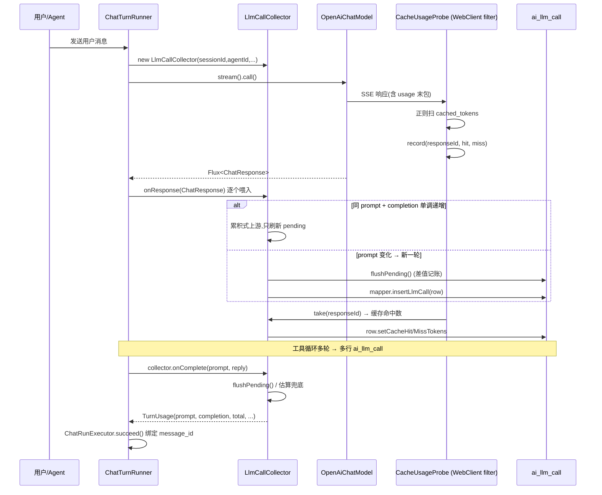
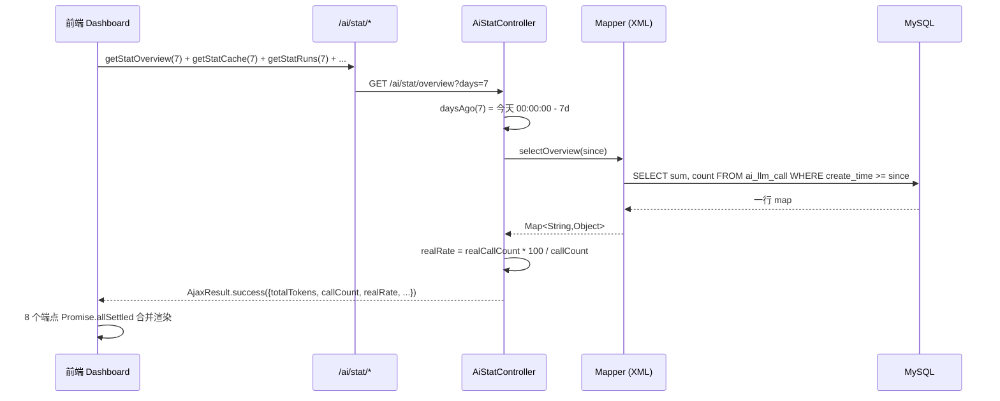

# 计量统计模块（ai/metering + ai/stat）

> 范围:`ruoyi-system/src/main/java/com/ruoyi/system/ai/metering/`、`ruoyi-admin/.../controller/ai/AiStatController.java`、`ruoyi-system/mapper/AiLlmCallMapper[.java/.xml]`、关联表 `ai_llm_call / ai_chat_message / ai_chat_run`、前端入口 `ruoyi-ui/src/api/ai/stat.js` + `ruoyi-ui/src/views/index.vue`(运营总览,没有独立 `views/ai/index.vue`)。

## 1. 模块概述

AI 对话与普通 Web 业务的「请求-响应」不同,**一次完整对话往往会触发多次上游模型调用**(工具循环、续轮、ReAct),且上游按 token 计费、按 cache 命中打折。系统如果只记「一次 HTTP 200」,会带来三件无法回溯的事:

- **无法计费**:不知道这一次前端对话实际消耗了多少 `prompt_tokens / completion_tokens / cache_hit_tokens`,无法按用量做内部成本分摊或外部计费。
- **无法优化**:不知道哪个模型、哪个智能体是 token 大户;不知道 prompt cache 命中率几何,也就没法做 prefix 优化、上下文压缩、模型降级。
- **无法排障**:工具循环多轮递增的累计 usage 如果不取差值,会被「乘以轮数」虚高数倍,面板一度出现 146% 上下文占用的假象(`AiLlmCallMapper.java:53-L57` 注释里的真实事故)。

本模块的解决方式:**埋点只在「一次真实模型 API 调用」粒度**记一行 `ai_llm_call`,粒度比 Web 请求更细(一个 Run 多行),所有统计(概览/Top/趋势/缓存/健康度)都是 SQL `GROUP BY + sum/count` 跑出来的——**没有离线汇总表、没有定时 ETL、没有预聚合**,查到的总是当下真实值。

之所以需要单独写 `ai/metering` 而不是塞在 `ChatTurnRunner` 里:Spring AI 框架层把 `Usage` 嵌在流式 `ChatResponse` 里,且工具循环下 `UsageCalculator` 会用三参 `new DefaultUsage(p,c,t)` 重建 `Usage` 并丢弃 `nativeUsage`,从第 2 轮起 `usage.getNativeUsage()` 恒为 `null`(`CacheUsageProbe.java:20-L24`)。这意味着**不能从框架层拿到工具续轮的 `cached_tokens`**,必须回到 HTTP 层在 SSE 原文里截 —— 这是 `CacheUsageProbe` 存在的根本原因。

## 2. 关键类与职责

### 2.1 `LlmCallCollector` — 流式落库器

`ruoyi-system/.../ai/metering/LlmCallCollector.java`

一个 collector 实例 = **一个 Turn(一轮对话)的整个生命周期**。在 `ChatTurnRunner` 进入流订阅时 `new` 出来(`ChatTurnRunner.java:143-L146`),在 `onComplete` 或 `finalizeTurn` 时结束。

**核心字段**(`LlmCallCollector.java:44-L77`):

| 字段 | 用途 |
|---|---|
| `sessionId / agentId / conversationId / modelId / depth` | 显式传入,**不依赖 ThreadLocal**;collector 可被多线程共享也能正确归因 |
| `pending: PendingCall` | 当前正在累积的那一行;下一个 usage chunk 来时若判定为新轮,先 `flushPending()` |
| `prevCumPrompt / prevCumCompletion / prevCumTotal` | 上一轮落库时的累计基准,用于**差值记账** |
| `cumulativeUpstream: boolean` | 是否认定上游是「累计式」;**reset 与 flip 区分**(见 `flushPending`):prompt 负差或 total 非正判为累计链 **reset**(本轮记原值、重置 `prevCum*` 基准、**保持 `true` 继续差值**);只有「prompt 涨而 completion 跌」才 flip 为 `false` 永久关差值 |
| `cacheUsageProbe: CacheUsageProbe` | 可选注入,flush 时按 `responseId` 取缓存命中数 |
| `traceRecorder: TraceSpanRecorder` | 可选注入(`com.ruoyi.system.ai.trace.TraceSpanRecorder`);**同一轮 LLM 调用同时落 `ai_llm_call`(计量)和 `ai_trace_span`(span_type='llm')**,详见 `docs/聊天执行引擎.md` §7.2 |
| `budgetRegistry: ToolBudgetRegistry` | 可选注入,在识别新 LLM 调用时推进预算轮次 |

**三种上游模式自动适配**(`LlmCallCollector.java:25-L30` + `LlmCallCollector.java:157-L202`):

- **标准 OpenAI 流**:每轮末包带 usage,`finish_reason=stop`,**每个非空 usage 记一行**;
- **累积式中转**:每 chunk 带递增的 `completion_tokens`,`prompt` 不变 + `completion` 单调递增 → 判定为同一轮,只保留最后值(`LlmCallCollector.java:161-L181`);
- **全程无 usage**:用 `TokenEstimator` 估算,`usage_source='1'`,给真实率指标留下可观察的「坏数据」。

**差值记账是核心技巧**(`LlmCallCollector.java:470-L518`):Spring AI 的 `UsageCalculator` 在工具续轮里给的是「从本轮开始的累计 usage」,如果直接落库,`sum(prompt_tokens)` 会随轮数指数级虚高。落库记 `delta = pending.x - prevCum.x`,并用差值变负这一信号自纠正「其实上游不是累计式」的情况。**注意 reset 与 flip 不能混**(见 `flushPending` 注释 `LlmCallCollector.java:478-L484`):流内累计链可能被 ChatClient **重置**(raw 突降),`deltaPrompt<0` 或 `deltaTotal<=0` 应判为 **reset** —— 本轮记原值、重置 `prevCum*` 基准、**保持 `cumulativeUpstream=true` 继续差值**;只有 `deltaPrompt>=0` 且 `deltaCompletion<0`(prompt 涨而 completion 跌)才是真·非累计上游,本轮记原值并 flip 为 `false`。原来「差值为负就翻转」会把 reset 误判成 flip-off,后续累计 raw 原样落库,把实际 32K 的上下文算成 203K 的幻影。

**缓存数据获取有三档优先级**(`LlmCallCollector.java:447-L461`):

1. `CacheUsageProbe.take(responseId)` —— HTTP 探针,**覆盖工具续轮**(这是主路径,因为框架层拿不到);
2. 框架层 `usage.getNativeUsage().promptTokensDetails().cachedTokens()` —— 兜底,工具循环里恒 `null`;
3. 都没有则留 0(但此时 `usage_source` 也是 0,SQL 侧会照常计入缓存分母)。

**schema 不匹配的 ERROR 单独**(`LlmCallCollector.java:472-L483`):如果异常 message 含 `Unknown column`,打 ERROR 并明确提示「计量已停止写入」;普通写库失败打 WARN。这是把「部署事故」和「偶发抖动」在日志层面分开的实操。

### 2.2 `CacheUsageProbe` — SSE 缓存字段截获器

`ruoyi-system/.../ai/metering/CacheUsageProbe.java`

`@Component` 单例,通过 `decorate(WebClient.Builder)` 把自己挂到 `OpenAiApi.Builder#webClientBuilder` 上(`ChatModelFactory.java:153`)。所有经过的流式响应会被 `sseCacheFilter()` 拦截。

**存储**:`ConcurrentMap<String, int[]> pending` + `ConcurrentLinkedQueue<String> order`,key = 上游 `response_id`,value = `[hit, miss]`,上限 1000 条防泄漏(`CacheUsageProbe.java:53-L55` + `CacheUsageProbe.java:63-L77`)。**先入队先淘汰**,但同一 id 重复下发 usage 时只入队一次,否则 `order` 无界增长。

**解析流程**(`CacheUsageProbe.java:115-L150`):

1. `response.mutate().body(flux -> flux.doOnNext(db -> ...))` —— **必须 mutate 不能先 `bodyToFlux`**,否则会触发「client response body can only be consumed once」;
2. 把每个 `DataBuffer` 当 ASCII 文本追加到行缓冲(只为扫字段名/数字,不做通用 JSON 解析);
3. 遇到 `\n` 切行,SSE `data: ` 前缀剥掉,空行/`[DONE]` 跳过;
4. 每个 chunk 都尝试抓 `id`(用 `lastId[0]` 记流上最近一次,供 usage 末包省略 id 时回落);
5. 只在同时含 `cached_tokens` 和 `prompt_tokens` 的行做正则匹配,提取两个整数;
6. `miss = max(0, prompt - hit)`,按 `responseId` 投到 `pending` 容器。

**为什么走 HTTP 层而不是 Spring AI 的 `Usage`**:`LlmCallCollector.java:20-L24` 已经说明 —— 工具循环下 `UsageCalculator` 会重建 `Usage` 丢 `nativeUsage`,只有 HTTP 层看到的是「每次真实请求的原始响应」,不受框架层包装影响。

**已知边界**(`CacheUsageProbe.java:32-L33` + `L82-L84`):`response_id` 不保证唯一(中转偶发复用),极少数行缓存可能张冠李戴;`take()` 必须用「全长 id」,落库时 `truncate(64)` 是另一件事,顺序不能换。

### 2.2.1 `CacheTokens` — 展示层归一

上游按 128 token 块报 `cached_tokens`,落库保留原值;prompt 列是工具循环差值,于是单行 `cache_hit_tokens` 可能大于 `prompt_tokens`。`CacheTokens.effectiveHit(hit, prompt)` 与会话 SQL `least(cache_hit, prompt)` 给展示/环图用。

**残留**:首页 `AiLlmCallMapper.selectCacheStats` 仍 `sum(cache_hit_tokens)` **未 clamp**,该路径命中率仍可能 >100%。

`LlmCallCollector` 还会经 `UiArtifactEmitter` 推 `run.tokenUsage`(500ms 节流,不落库),终态再强制刷一次。

### 2.3 `AiStatController` — 聚合查询出口

`ruoyi-admin/.../controller/ai/AiStatController.java`,`@RequestMapping("/ai/stat")`。

只读 controller,**不写任何状态**。8 个 GET 端点全部基于 SQL 实时聚合,前端通过 `ruoyi-ui/src/api/ai/stat.js` 一一对应调用。`daysAgo(days)` 把参数夹到 `[1, 365]`(`AiStatController.java:219-229`),时间窗归零到当天 00:00:00,避免「过去 7 天」横跨 8 天的歧义。

**健康度指标跨表**:`runs / channels-health / mcp-health` 查的不是 `ai_llm_call`,而是 `ai_chat_run / ai_channel / ai_mcp_server` 的状态字段。Run 健康度的成功率分母用 `SUCCEEDED + FAILED + INTERRUPTED`(`AiStatController.java:146`),**不计入 CANCELLED**(用户主动取消不算失败);渠道健康度分母用 `enabled`,**不计入停用**(停用不是「出问题」,只是没启用)。

### 2.4 `AiLlmCallMapper` — 数据访问层

`ruoyi-system/.../mapper/AiLlmCallMapper.java` + `AiLlmCallMapper.xml`。

写入:`insertLlmCall`(回填自增 `call_id`);`bindMessageIdByIds` 在 **`ChatTurnRunner.finalizeTurn`** 把本轮 call 绑到最终 ASSISTANT,不是 Executor。删除会话/模型时 `deleteBySessionId` / `deleteByModelIds` **物理删明细**。

回滚最后一轮(`AiChatController.rollbackLastTurn`):`ai_llm_call` **保留行、只 unbind `message_id`**(token 已真实消耗);并按 `tool_result_path` 删溢出文件。

时间戳:`ai_llm_call.create_time` 与 Run 的 insert/start/finish 走 Java `Date`;`heartbeat_time` 仍 `current_timestamp`。stale 扫描对两列用不同基准,禁止把 GMT+8 的 `create_time` 拿去比 UTC 的 `NOW()`。

前端入口是 `ruoyi-ui/src/views/index.vue`(没有 `views/ai/index.vue`)。运行中「查看完整结果」靠 `ai_chat_run_step.message_id`(TOOL 落库时 `ChatMessageRecorder.bindStepMessage`),与 llm_call 的 message 绑定不是同一件事。

聚合 SQL 全部是 `sum / count / count(distinct)`,**没有 JOIN 关联大表**(`AiLlmCallMapper.xml:95-L164`),时间窗走 `create_time >= #{since}` 索引(`ai_llm_call.sql:49` 的 `idx_create_time`)。`selectByAgent` 是唯一带 `LEFT JOIN ai_agent` 的,作用是补 `agent_name`,被删的智能体用 `concat('agent#', id)` 兜底显示。

## 3. 核心流程

### 3.1 一次 LLM 调用被采集入库的链路



关键点:**一次用户消息可能产生 N 行 `ai_llm_call`**(N = 工具循环轮数 + 1),每行都带 `call_seq` 与 `depth` 区分。`finishTurn` 返回的 `TurnUsage` 是本轮累加,真正用于前端 SSE done 事件的是 `lastUsage()`(`LlmCallCollector.java:339-L363`),它会跳过估算行找最后一条真实。

### 3.2 缓存命中率采集链路

```mermaid
flowchart LR
    A[ChatModelFactory.buildChatModel] -->|webClientBuilder| B[probe.decorate]
    B -->|sseCacheFilter| C[WebClient 请求]
    C -->|SSE chunk| D[逐行正则扫描]
    D -->|match cached_tokens| E[record responseId, hit, miss]
    E --> F[(pending Map)]
    G[LlmCallCollector.onResponse] -->|识别新一轮| H[flushPending]
    H -->|take responseId| F
    F -->|hit, miss| I[ai_llm_call.cache_hit/miss_tokens]
    J[AiStatController.cache] -->|selectCacheStats| K[sum cache_hit / sum cache_miss]
    K -->|hitRate = hit/(hit+miss)| L[前端缓存健康度卡片]
```

注意中间两个断层:
- **`extractCachedTokens` 兜底分支**(`LlmCallCollector.java:264-L284`):框架层 `getNativeUsage()` 拿到就拿,拿不到就返回 -1,记 0 入库;
- **`selectCacheStats` 过滤**(`AiLlmCallMapper.xml:156-L164`):聚合时**只算 `usage_source='0'` 的行**,估算行无 cache 字段,混入会污染命中率。

### 3.3 统计查询链路



前端用 `Promise.allSettled` 而非 `Promise.all`(`ruoyi-ui/src/views/index.vue`),任一端点失败不阻塞其他卡片 —— 监控场景的常见取舍。

## 4. 对外接口

全部基于 `ruoyi-ui/src/api/ai/stat.js`:

| 方法 | URL | 默认参数 | 含义 |
|---|---|---|---|
| `overview` | `GET /ai/stat/overview` | `days=7` | token 合计 / 调用次数 / 会话数 / 真实率 |
| `byModel` | `GET /ai/stat/by-model` | `days=7, limit=5` | 按模型 TopN,按 `totalTokens desc` |
| `byAgent` | `GET /ai/stat/by-agent` | `days=7, limit=5` | 按智能体 TopN,带 `LEFT JOIN ai_agent` 取名 |
| `trend` | `GET /ai/stat/trend` | `days=30` | 按天聚合,前端折线图 |
| `cache` | `GET /ai/stat/cache` | `days=7` | 缓存命中/未命中 token 合计 + 命中率 |
| `runs` | `GET /ai/stat/runs` | `days=7` | 任务成功率 + 状态分布 + 平均耗时 |
| `channelsHealth` | `GET /ai/stat/channels-health` | — | 渠道配置态/运行时态聚合 |
| `mcpHealth` | `GET /ai/stat/mcp-health` | — | MCP 服务器健康度 |

**前端使用方**:`ruoyi-ui/src/views/index.vue`,8 个接口在挂载时并发拉取。**没有独立的 stat 菜单页**,所有 stat 都汇到运营总览卡片。

## 5. 依赖关系

```
   ┌───────────────────────┐
   │ ChatModelFactory      │ 注入 CacheUsageProbe,挂到 OpenAiApi.webClientBuilder
   └──────────┬────────────┘
              │ 流式响应
              ▼
   ┌───────────────────────┐
   │ CacheUsageProbe       │ 单例,按 responseId 暂存 cache_hit/cache_miss
   └──────────┬────────────┘
              │ take(responseId)
              ▼
   ┌───────────────────────┐         ┌──────────────────┐
   │ LlmCallCollector      │◀────────│ ChatTurnRunner   │ new + onResponse 喂入
   │  (Turn 生命周期)       │         │ (Run 引擎)       │
   └──────────┬────────────┘         └──────────────────┘
              │ onComplete → TurnUsage
              ▼
   ┌───────────────────────┐         ┌──────────────────┐
   │ ChatRunExecutor.succeed│────────▶│ AiLlmCallMapper  │ insertLlmCall / bindMessageIdByIds
   └──────────┬────────────┘         └────────┬─────────┘
              │ messageId 绑定                 │
              ▼                                ▼
   ┌───────────────────────┐         ┌──────────────────┐
   │ ai_chat_message        │         │ ai_llm_call      │ 事实表
   │ (单消息 token 归因)    │         │ (每次调用一行)    │
   └───────────────────────┘         └────────┬─────────┘
                                               │ sum / count
                                               ▼
                                    ┌──────────────────┐
                                    │ AiStatController │ 8 个 GET 端点
                                    └────────┬─────────┘
                                             │ JSON
                                             ▼
                                    ┌──────────────────┐
                                    │ 前端 Dashboard   │
                                    └──────────────────┘
```

**与 Model / Channel / Run 引擎的协作点**:

- **Model 工厂协作**:`ChatModelFactory` 注入 `CacheUsageProbe`(`ChatModelFactory.java:51`),在 `buildChatModel` 时 `cacheUsageProbe.decorate(WebClient.builder())` 挂到 `OpenAiApi`(`ChatModelFactory.java:153`)。Embedding 与 Image 工厂**不挂探针**,因为它们的响应是一次性 JSON,没有 SSE 流式缓存字段。
- **Channel 协作**:`AiChannelMapper.selectChannelHealth` 来自 `ai_channel` 表(配置态 `status` + 运行时态 `health_status`),由 `AiChannelController.POST /ai/channel/{channelId}/check` 手动触发 `AiChannelServiceImpl.checkHealth`(`checkHealth` 内部用 JDK `HttpClient` 同步探测 `healthCheckUri`,失败 3 次置为异常,恢复成功自动回正)写回,**没有定时自动 ping**——本模块只读统计结果。
- **Run 引擎协作**:`ChatRunExecutor.succeed`(`ChatRunExecutor.java:266-L597`)在收到 collector 产出的 `TurnUsage` 后,把 `promptTokens/completionTokens/totalTokens` 序列化为 JSON 塞进 `ai_chat_run` 的扩展字段(通过 `toUsageJson` 完成,`ChatRunExecutor.java:598-L601`)。前端 SSE done 事件中的 `usage` 字段即来源于此。
- **子智能体协作**:`SubAgentToolCallback` 走 `depth>=1` 的 collector(由 `AgentContextFactory` 装配时传入 depth),落库时 `depth` 字段区分顶层与子智能体调用,`selectByAgent` 聚合时只对 `agent_id is not null` 生效(`AiLlmCallMapper.xml:133`)。
- **预算协作**:`LlmCallCollector` 识别新 LLM 轮次时三件事一并做(`LlmCallCollector.java:188-L206`):`notifyToolBudgetBeginRound` 推进 `budget.beginRound(agentId)`(`L283-L301`)、`notifyToolBudgetPromptTokens` 喂 `currentRealPrompt(prompt)`(`L181` / `L203-L204`)、`checkStreamHealth(realPrompt)` 做流内闸口(`L206` + `L219-L250`)。**是同一份数据的双消费者**,落库给统计、prompt 给预算。喂预算的值经 `currentRealPrompt` **去累计化**(`L266-L277`):累计式上游且差值为正时返回 `raw - prevCumPrompt`(当次真实上下文),否则原值 —— 否则子 agent 实际窗口只用 9%、累计值却顶到 187086/191808 误报 98%。流内闸口补两道原本只在 `acquire()` 才做的检查(纯生成轮/幻影轮无工具调用 evade 全部限制):`isCorruptPrompt` 判 usage 流损坏、`hardRoundsExceeded` 判轮次过硬顶。per-agent 计数与 `agentId` 透传见第 7 节。

## 6. 典型使用场景

### 场景一:用量报表 / 成本分摊

**诉求**:月底要给业务方出「各智能体本月的 token 成本」,需要按 `agent_id` 聚合 `prompt_tokens + completion_tokens`,按模型单价折算人民币。

**走法**:`GET /ai/stat/by-agent?days=30&limit=100` 返回 token 合计,接口**不乘** `ai_model.input_price` / `output_price`,也不按租户过滤。要人民币需调用方自己拿单价折算。`prompt_tokens` / `completion_tokens` 已是差值增量,可直接乘。**`usage_source='1'` 的估算行同样计入** —— 估算本身也是真金白银,缺它会让总量偏低。

### 场景二:缓存优化决策

**诉求**:最近一周 prompt cache 命中率只有 18%,想知道是不是 prefix 没对齐导致命中率低,要不要改 KB 检索的 chunk 拼接策略。

**走法**:`GET /ai/stat/cache?days=7`,返回 `{hitTokens, missTokens, promptTokens, hitRate}`。但只看命中率不够,需要进一层:按模型看 (`by-model` 同时含 `totalTokens`)—— 命中率低且 `promptTokens` 大头的模型,是 prefix 优化收益最大的目标。**为什么不能用「总 token = prompt + completion」作分母**:命中只发生在 prompt 端,用总 token 当分母会让命中率虚低一倍(`AiLlmCallMapper.xml:150-L154` 注释)。

更细粒度:`AiLlmCallMapper.sumCacheTokensBySession(sessionId)` 给出单会话的命中/未命中(`AiLlmCallMapper.xml:86-L93`),可定位到具体会话:同一个 session 多次对话,prefix 稳定,命中率应该单调上升;如果某会话命中率波动大,大概率是用户消息引入了新文档。

### 场景三:工具循环 token 虚高事故复盘

**诉求**:某次工具调用密集的对话,前端显示「上下文占用 175%」,但用户没感觉对话特别长。

**根因**:`LlmCallCollector.java:33-L34` 注释里写得很清楚 —— Spring AI `UsageCalculator` 在工具续轮里给的是累计 usage,如果直接落库,`sum(prompt_tokens)` 会等于 `Σ(2^i * 14K)`,指数级虚高。修复就在 `flushPending()` 的差值记账(`LlmCallCollector.java:470-L518`):落库前减掉 `prevCum*`,并以差值变负为信号自纠正非累计式上游。该差值逻辑本身又踩过两个坑、对应两次真实事故的修复:

- **reset 误判**(修复②):原实现「差值变负就翻转 `cumulativeUpstream=false`」不区分 **reset** 与 **flip**。流内累计链被 ChatClient 重置时 raw 突降(实测从 85928 掉回 21732 后继续累计),`deltaPrompt<0` 是 reset 信号,本应重置基准、保持差值;误判成 flip-off 后,后续累计 raw 被原样落库并喂给预算,把实际 32K 的上下文算成 203K 的幻影。现按 `deltaPrompt<0 || deltaTotal<=0` 判 reset、`deltaPrompt>=0 && deltaCompletion<0` 才 flip(`LlmCallCollector.java:490-L518`)。
- **脏数据 livelock**(修复②):所有预算闸口原本只在工具调用 `acquire()` 检查,纯生成轮/上游流损坏后的幻影轮不调工具,evade 全部限制,子 agent 流进入重复发射后空转 30+ 轮、累计出 106 万假 token,run 活活锁死。新增流内闸口 `checkStreamHealth`(`LlmCallCollector.java:219-L250`):`isCorruptPrompt`(单轮读数 > 2×inputBudget,真实请求到不了这量级、上游会先 400)与 `hardRoundsExceeded` 两个检查下沉到流内,抛 `ToolBudgetExceededException` 中止。

**面板侧**:`AiLlmCallMapper.selectLatestPromptTokens` 故意用「最近一次」而不是「求和」，**只取 `order by call_id desc limit 1`**，避免被计费累计误导。但它是「上一次请求」的观测，不是新消息落库后的当前记忆；`ChatTurnRunner.buildContextUsage` 会将它与当前可重建记忆估算对账，明显不一致时退回记忆重算并标记 `≈`。`selectPeakPromptTokens` 只用于「主智能体曾经最挤」，与含子智能体的会话累计消耗分开。

这种「前端 175%」的事故表明:计量模块的难点从来不是「记下来」,而是「**别记错**」—— 任何一次重复累计、错位绑定,都会被放大成用户能感知的 bug。

## 7. ToolBudget per-agent 计数

`ruoyi-system/.../tool/ToolBudget.java` 是 session 级共享单例(`ToolBudgetRegistry` 按 `sessionId` 取),但**子智能体是独立无状态会话** —— 它的窗口和轮次都不该占父的配额。两项原本「单一共享」的计数改为 **per-agent**,会话级总闸(`session.rounds` / `maxSessionRounds`)仍跨 run + 父子累加共享不变。

| 维度 | 字段 / 方法 | 缺省回退 | 用在哪 |
|---|---|---|---|
| per-agent input budget | `inputBudgetByAgent`(`ToolBudget.java:118`)+ `registerInputBudget`(`L214`)+ `inputBudgetFor`(`L234`) | session 级 `inputBudget`(建模时父 agent 窗口) | `acquire` 第 2/5 步 token 判定(`L274-L284` / `L314-L322`)、`describeExhausted`(`L417`)、`isCorruptPrompt`(`L392-L396`) |
| per-agent rounds | `roundsByAgent`(`ToolBudget.java:94`)+ `roundsOf`(`L204`)+ `beginRound(Long)`(`L172`)/`rounds(Long)`(`L372`)/`hardRoundsExceeded(Long)`(`L383`) | null -> -1 兜底槽位(与 `promptOf` 同口径) | `acquire` 第 1/6 步(`L267-L272` / `L325`)、`describeExhausted`(`L446`)、`checkStreamHealth`(`LlmCallCollector.java:244`) |

**为什么 input budget 按 agent 分**:`inputBudget` 来自建模时**父 agent 模型**的 `contextWindow - maxOutputTokens`,而子智能体可以用完全不同的模型 —— 窗口比父小,共用父的预算会保护不到(真满了都没触发);窗口比父大,又会误伤。用量(`promptByAgent`)和上限都是 per-agent 的,配对才有意义。

**为什么 rounds 按 agent 分**:原来父子共用一个 rounds 计数器,子 30 轮 + 父 20 轮 = 50 顶到 `max-rounds`,父被子的往返拖垮。改 per-agent 后,子的往返只占自己的 `maxRounds`/`hardMaxRounds` 配额;**会话级 `session.rounds` 仍共享**,作跨 run + 父子累加总闸(`maxSessionRounds`)不变。

**LlmCallCollector 怎么传 agentId**:`notifyToolBudgetBeginRound` 调 `budget.beginRound(agentId)`(collector 的 `agentId` 字段,`LlmCallCollector.java:294`);`checkStreamHealth` 调 `budget.hardRoundsExceeded(agentId)`(`L244`)与 `budget.rounds(agentId)`(`L247`)。旧的无参重载(`beginRound()` / `rounds()` / `hardRoundsExceeded()`)委托 `null`,记到 -1 兜底槽位,兼容老调用方。
